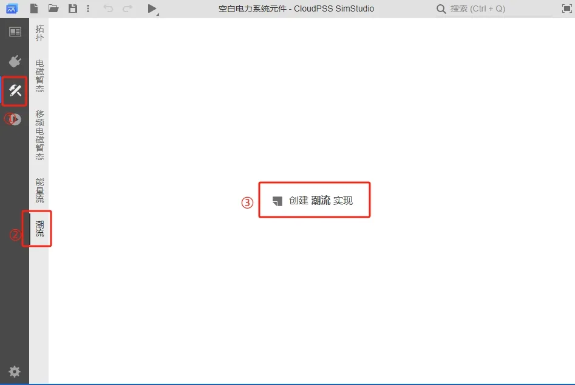
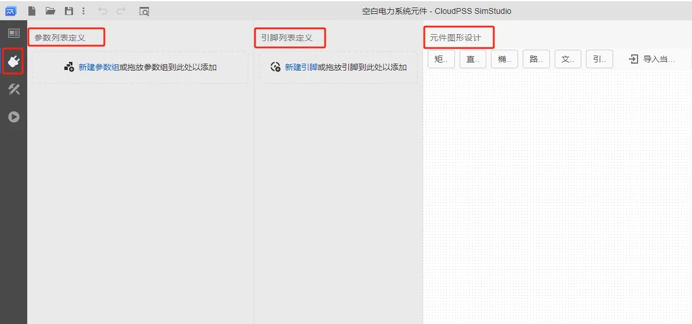
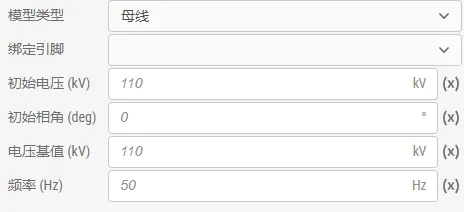
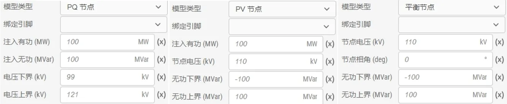
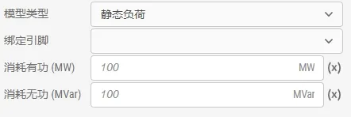
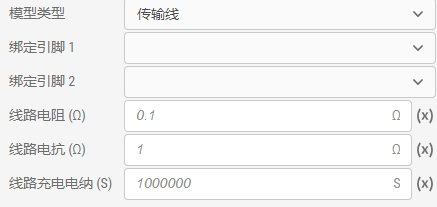
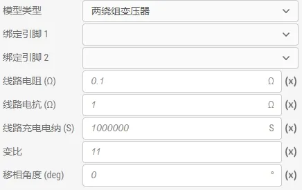
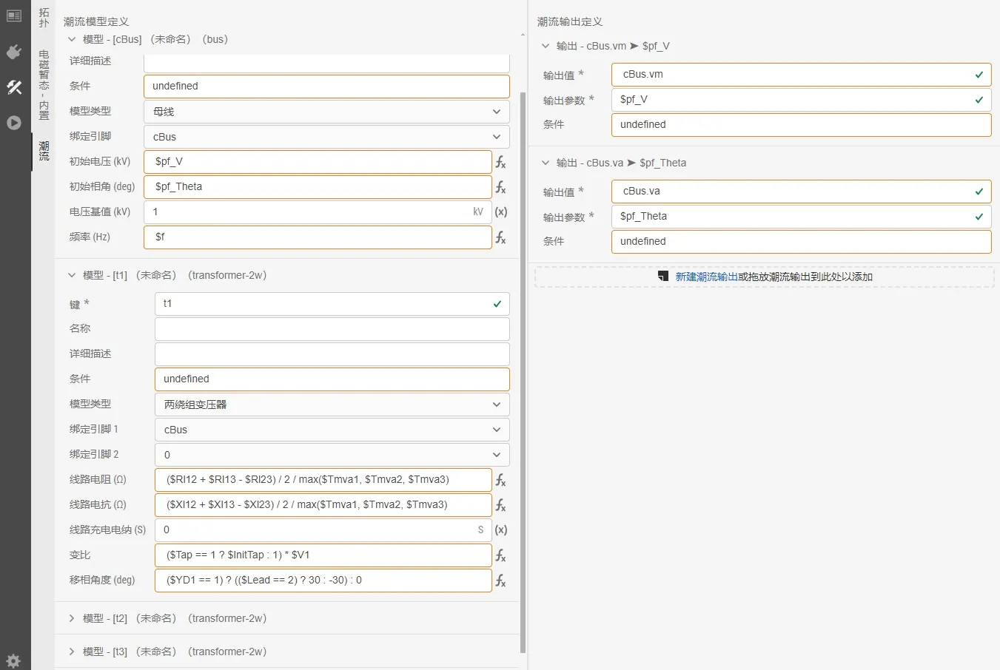
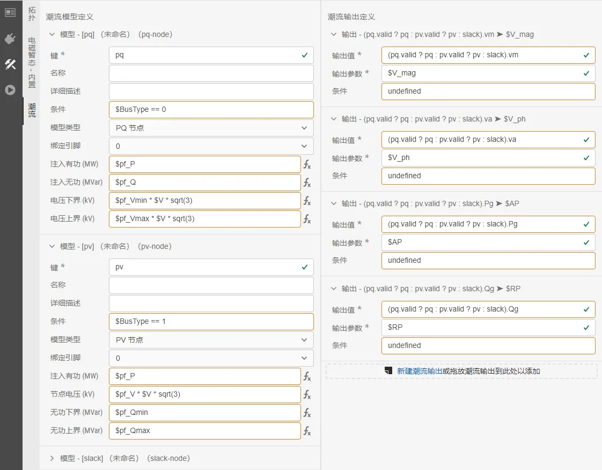
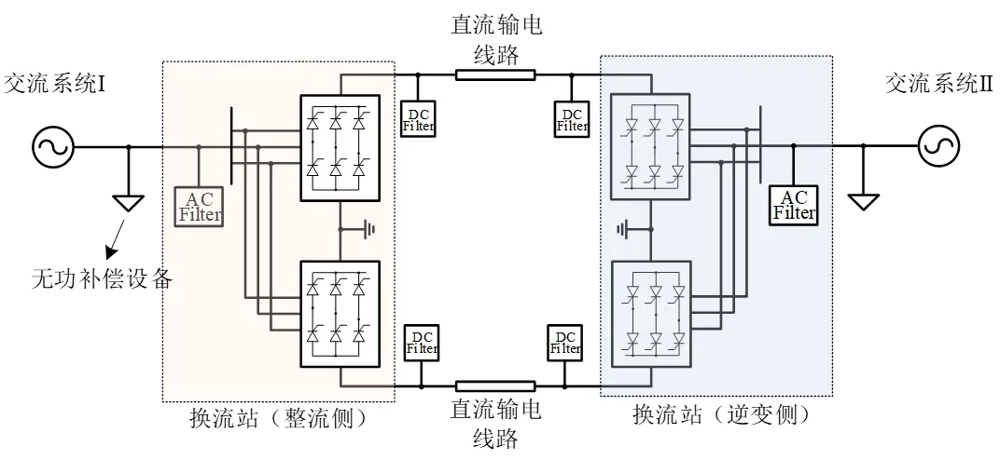

本文档介绍自定义潮流元件的实现方法，并用 EMTLab 的官方元件为案例，详细介绍自定义潮流元件的构建过程。

## 功能定义
EMTLab 提供的自定义潮流元件功能。

## 功能说明
用户可通过元件中的潮流实现功能，为拓扑实现、Octave 代码实现、C++ 代码实现的电磁暂态元件提供相应的潮流模型。新建**空白电力系统元件**或在原元件的项目实现页面，点击**实现标签页**，选择**潮流**实现，点击**创建潮流实现**按钮，即可为相应元件创建对应的潮流模型。

元件的潮流实现分为两部分，**潮流模型定义**和**潮流输出定义**，前者将元件映射到潮流计算过程中的各类阻抗和负荷模型，后者则用于生成元件的潮流回写数据，将需要的潮流结果写回元件参数，用于电磁暂态仿真初始化等功能。

### 元件基础配置
潮流元件**接口标签页**的参数列表、引脚列表和元件图形等基础配置可参考 [模块封装](../../40-simstudio/30-modeling/40-module-packaging/index.md) 帮助文档，本节不在赘述。

### 潮流模型定义
**创建潮流实现**后，在潮流实现页面左侧可对潮流模型定义进行编辑。点击**新建潮流模型**创建新的空白潮流模型定义，也可以使用拖放和复制粘贴功能复用已有的模型定义。

潮流模型的前 4 个字段均相同，各字段的说明如下：

| 参数名 | 说明 |
| :--- | :--- | 
| 键 | 潮流模型的唯一标识符，在该元件的所有潮流模型中要求唯一。要求为合法的标识符（以字母开头，仅包含字母、数字或下划线）。用于标识潮流模型，在潮流输出定义中进行引用获取相应的潮流结果 |
| 名称 | 潮流模型的名称，用于区分同一元件中的多个模型，在输出潮流结果时也会显示 |
| 详细描述 | 模型的详细描述，支持 `MarkDown` 输入 |
| 条件 | 决定模型是否生效的条件表达式 |

EMTLab 的潮流计算应用现提供以下的潮流模型，用于定义此元件潮流模型的类型，以及潮流数据的来源。

<Tabs>
<TabItem value="model1" label="母线">
**母线**潮流模型用于抽象潮流计算中的节点，所有其他潮流模型都必须直接或通过短路线连接到**母线**上。官方元件三相交流母线即使用了此模型，该模型的参数说明如下：

| 参数名称 | 说明                                                           |
| -------- | -------------------------------------------------------------- |
| 绑定引脚 | 该模型绑定的元件引脚                                           |
| 初始电压 | 母线初始电压，用于设定潮流计算的迭代初值                       |
| 初始相角 | 母线初始相角，用于设定潮流计算的迭代初值                       |
| 电压基值 | 母线电压基值，用于在潮流计算过程中将参与计算的数据转换为标幺值 |
| 频率     | 母线工作频率，一般为 50Hz，相连的母线必须采用相同频率          |
</TabItem>

<TabItem value="model2" label="节点">
**PV 节点**、**PQ 节点**和**平衡节点**潮流模型用于抽象潮流计算中的 PV、PQ、平衡节点。潮流计算中一条母线上至多仅能连接一个节点，没有连接任何节点的母线将被视作注入有功和无功均为 0 的 PQ 节点。官方元件三相交流电压源、同步发电机都使用了节点模型。节点模型的参数说明如下：

| 参数名称 | 说明                                                                |
| -------- | ------------------------------------------------------------------- |
| 绑定引脚 | 该模型绑定的元件引脚                                                |
| 注入有功 | 节点注入有功功率                                                    |
| 注入无功 | 节点注入无功功率                                                    |
| 节点电压 | 节点给定电压约束                                                    |
| 节点相角 | 节点给定相角约束                                                    |
| 无功下界 | PV 节点和平衡节点的注入无功下界，越界后该节点由电压约束转为无功约束 |
| 无功上界 | PV 节点和平衡节点的注入无功上界，越界后该节点由电压约束转为无功约束 |
| 电压下界 | PQ 节点电压下界，越界后该节点由无功约束转为电压约束                 |
| 电压上界 | PQ 节点电压上界，越界后该节点由无功约束转为电压约束                 |
</TabItem>

<TabItem value="model3" label="静态负荷">
**静态负荷**潮流模型用于抽象恒功率负荷模型，其消耗有功和无功不受节点电压影响。官方元件静态负载即使用了此模型。该模型的参数说明如下：

| 参数名称 | 说明                           |
| -------- | ------------------------------ |
| 绑定引脚 | 该模型绑定的元件引脚           |
| 消耗有功 | 节点消耗有功功率               |
| 消耗无功 | 节点消耗无功功率，感性负荷为正 |
</TabItem>

<TabItem value="model4" label="对地导纳">
**对地导纳**潮流模型用于抽象恒阻抗负荷模型，其消耗有功和无功与节点电压的平方成正比。官方元件并联电容/电抗器即使用了此模型。该模型的参数说明如下：

| 参数名称 | 说明                               |
| -------- | ---------------------------------- |
| 绑定引脚 | 该模型绑定的元件引脚               |
| 对地电导 | 节点消耗有功功率系数               |
| 对地电纳 | 节点消耗无功功率系数，感性负荷为正 |
</TabItem>

<TabItem value="model5" label="短路线">
**短路线**潮流模型用于抽象在潮流计算中无实际影响的连接模型，在潮流计算中，短路线两侧节点将被合并。官方元件电流表即使用了此模型。该模型的参数说明如下：

| 参数名称   | 说明                 |
| ---------- | -------------------- |
| 绑定引脚 1 | 该模型绑定的元件引脚 |
| 绑定引脚 2 | 该模型绑定的元件引脚 |

</TabItem>

<TabItem value="model6" label="传输线">
**传输线**潮流模型用于抽象传输线 Π 形集总电路模型。官方元件三相传输线即使用了此模型。该模型的参数说明如下：

| 参数名称     | 说明                         |
| ------------ | ---------------------------- |
| 绑定引脚 1   | 该模型绑定的元件引脚         |
| 绑定引脚 2   | 该模型绑定的元件引脚         |
| 线路电阻     | 传输线总电阻 R               |
| 线路电抗     | 传输线总电抗 X               |
| 线路充电电纳 | 传输线总对地电纳 B，容性为正 |

</TabItem>

<TabItem value="model7" label="两绕组变压器">
**两绕组变压器**潮流模型用于抽象变压器 Π 形电路模型。官方元件三相双绕组变压器、三相三绕组变压器即使用了此模型。该模型的参数说明如下：

| 参数名称     | 说明                         |
| ------------ | ---------------------------- |
| 绑定引脚 1   | 该模型绑定的元件引脚         |
| 绑定引脚 2   | 该模型绑定的元件引脚         |
| 线路电阻     | 变压器总电阻 R               |
| 线路电抗     | 变压器总电抗 X               |
| 线路充电电纳 | 变压器总对地电纳 B，容性为正 |
| 变比         | 引脚 2 对引脚 1 的有名值变比 |
| 移相角度     | 引脚 2 对引脚 1 的移相角度   |
</TabItem>

</Tabs>

### 潮流输出定义
**创建潮流实现**后，在潮流实现页面右侧可对潮流输出定义进行编辑。点击**新建潮流输出**创建新的空白潮流输出，也可以使用拖放和复制粘贴功能复用已有的潮流输出定义。

潮流输出定义用于定义潮流结果的返回值以及相关的处理，以下为潮流输出各字段的说明：

| 参数名称 | 说明                                                           |
| -------- | -------------------------------------------------------------- |
| 输出值   | 该输出写入的值                                                 |
| 输出参数 | 使用 `$` 前缀 + 元件**接口标签页**定义的参数键引用写入目标的参数名称 |
| 条件     | 该输出定义生效的条件表达式                                     |

在潮流模型定义中，**条件**使用表达式进行书写。在潮流模型定义中可使用 `$` 前缀 + 元件参数来引用元件**接口标签页**中定义的参数，例如如定义了键为 `P` 的参数即可在此处使用 `$P` 进行引用。

在潮流输出定义中，除了元件参数外，还可使用潮流模型定义的键引用相应的潮流结果，以下分别介绍**节点类模型**（只有一个绑定引脚的潮流模型）和**支路类模型**（有两个绑定引脚的潮流模型）的潮流变量字段 。

<Tabs>
<TabItem value="value1" label=" 节点类模型变量">
节点类模型（只有一个绑定引脚的模型）具有以下字段：

| 字段名称  | 说明                                       |
| --------- | ------------------------------------------ |
| valid     | 该模型是否生效                             |
| Sbase     | 功率基值（MW）                             |
| F         | 工作频率（Hz）                             |
| Vbase     | 电压基值（kV）                             |
| Ibase     | 电流基值（kA）                             |
| Zbase     | 阻抗基值（Ω）                              |
| Ybase     | 导纳基值（S）                              |
| vm / Vm   | 节点电压（标幺值 / 有名值 kV）             |
| va / Va   | 节点相角（deg）                            |
| pg / Pg   | 节点有功注入（标幺值 / 有名值 MW）         |
| qg / Qg   | 节点无功注入（标幺值 / 有名值 Mvar）       |
| pl / Pl   | 节点恒功率有功负荷（标幺值 / 有名值 MW）   |
| ql / Ql   | 节点恒功率无功负荷（标幺值 / 有名值 Mvar） |
| ps / Ps   | 节点恒阻抗有功负荷（标幺值 / 有名值 MW）   |
| qs / Qs   | 节点恒阻抗无功负荷（标幺值 / 有名值 Mvar） |
| pbr / Pbr | 支路有功净流出（标幺值 / 有名值 MW）       |
| qbr / Qbr | 支路无功净流出（标幺值 / 有名值 Mvar）     |

例如定义了键为 `pq` 的潮流模型键，可在表达式中使用 `pq.valid` 进行引用。

</TabItem>

<TabItem value="value2" label="支路类模型变量">
支路类模型（有两个绑定引脚的模型）具有以下字段：

| 字段名称                  | 说明                                                                                                      |
| ------------------------- | --------------------------------------------------------------------------------------------------------- |
| valid                     | 该模型是否生效                                                                                            |
| Sbase                     | 功率基值（MW）                                                                                            |
| F                         | 工作频率（Hz）                                                                                            |
| bus1                      | 母线 1 模型，其子字段参考 节点类模型变量                                                |
| bus2                      | 母线 2 模型，其子字段参考 节点类模型变量                                               |
| pl1 / Pl1 / ql1 / Ql1     | 母线 1 一侧对地支路损耗（有功标幺值 / 有功有名值 MW / 无功标幺值 / 无功有名值 Mvar）                      |
| pl2 / Pl2 / ql2 / Ql2     | 母线 2 一侧对地支路损耗（有功标幺值 / 有功有名值 MW / 无功标幺值 / 无功有名值 Mvar）                      |
| pl12 / Pl12 / ql12 / Ql12 | 串联阻抗上的损耗（有功标幺值 / 有功有名值 MW / 无功标幺值 / 无功有名值 Mvar）                             |
| pl / Pl / ql / Ql         | 总损耗（有功标幺值 / 有功有名值 MW / 无功标幺值 / 无功有名值 Mvar）                                       |
| p12 / P12 / q12 / Q12     | 包含对地支路在内，母线 1 到母线 2 的传输功率（有功标幺值 / 有功有名值 MW / 无功标幺值 / 无功有名值 Mvar） |
| p21 / P21 / q21 / Q21     | 包含对地支路在内，母线 2 到母线 1 的传输功率（有功标幺值 / 有功有名值 MW / 无功标幺值 / 无功有名值 Mvar） |

例如定义了键为 `puCorrected` 的潮流模型键，可在表达式中使用 `puCorrected.p12` 进行引用。

</TabItem>

</Tabs>

## 案例
下面以部分 EMTLab 官方元件为例，介绍自定义潮流元件的构建。

import Tabs from '@theme/Tabs';
import TabItem from '@theme/TabItem';

<Tabs>
<TabItem value="case1" label="静态负载">
静态负载的潮流模型如下图所示。该模型包含一个潮流模型定义和一个潮流输出定义。

潮流模型定义 `load` 是该元件唯一的潮流模型，因此不设置名称。该模型绑定在该元件的唯一一个引脚上，消耗的有功和无功可使用该元件参数计算得出。

潮流输出定义中，该元件将潮流计算结果中的电压标幺值写入 `Initial Voltage` 参数中，注意静态负载元件使用的电压基值与潮流模型中母线电压基值不一定一致，需要使用有名值进行计算。

</TabItem>
<TabItem value="case2" label="三相传输线">
三相传输线的潮流模型如下图所示。该模型包含 4 个潮流模型定义。

该元件的 4 个潮流模型分别适用于有名值输入、标幺值输入及是否应用长导线校正的参数组合。在条件输入中，这 4 个模型设置了互斥的生效条件，每个生效的模型都将为该元件唯一潮流模型，故都不设置名称。

</TabItem>
<TabItem value="case3" label="三相三绕组变压器">
三相三绕组变压器的潮流模型如下图所示。

该元件将三绕组变压器等值为 3 个双绕组变压器。设置了等值的中心节点 `cBus`，并将等效的 3 个双绕组变压器模型都连接至该节点。由于一般不将三绕组变压器的多个绕组连接至同一母线，可以通过连接的母线区分 3 个等值双绕组变压器模型，故不为等值模型设置名称。

</TabItem>

<TabItem value="case4" label="同步发电机">
同步发电机的潮流模型如下图所示。

该元件通过 `BusType` 设置节点生效条件， 每个生效的模型都将为该元件唯一潮流模型，故都不设置名称。潮流输出定义中，通过条件判断将该元件潮流计算结果中的电压标幺值、电压相位、有功功率、无功功率写入 `Initial Voltage` 参数中。

</TabItem>
</Tabs>

## 常见问题
EMTLab 是如何处理交直流混联系统的潮流计算？

:
    对于如下图所示的交直流混联系统，直流输电系统的换流站分为整流侧与逆变侧。EMTLab 将整流侧与逆变侧作为电力系统节点，开放了**初始潮流数据**，**整流侧潮流设置数据**，**逆变侧潮流设置数据**参数组用于潮流计算（详细信息可参考 DCLine 元件文档），对直流系统的潮流计算原理和潮流写回过程与交流系统一致。

    

