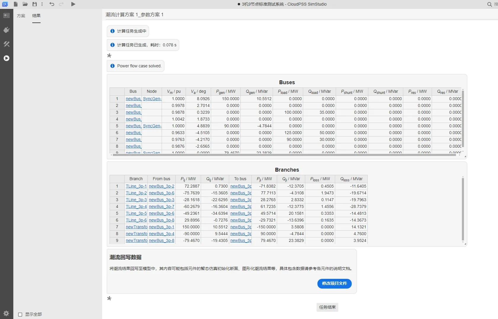
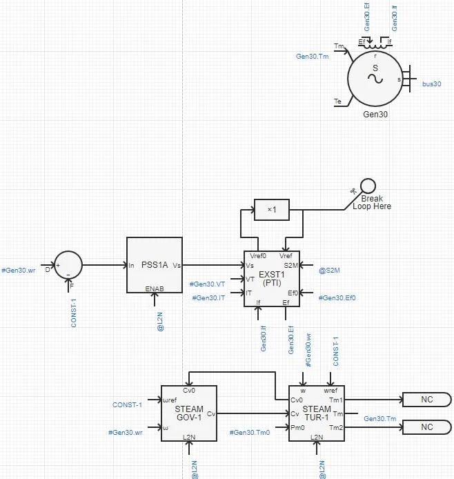
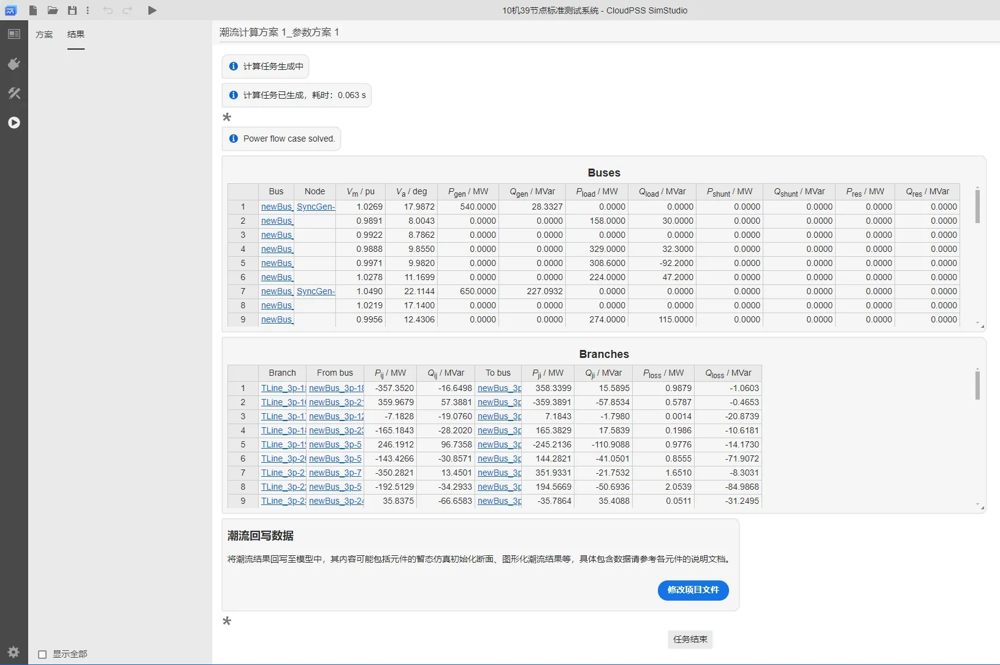
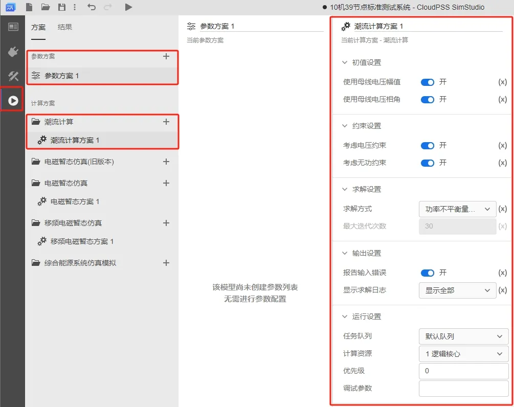
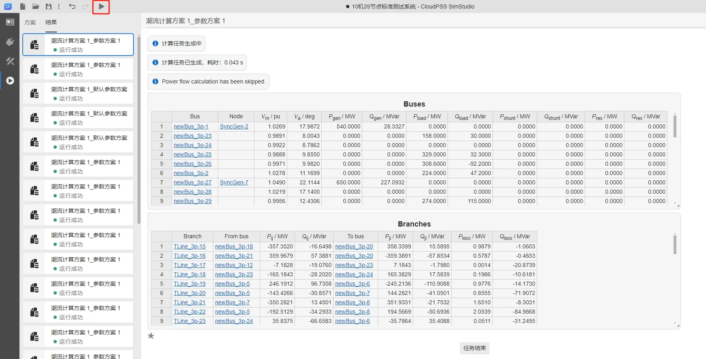

import Tabs from '@theme/Tabs';
import TabItem from '@theme/TabItem';

<Tabs>
<TabItem value="case1" label="3 机 9 节点系统潮流计算">
本案例使用 IEEE 9 节点模板算例，演示潮流计算的基本使用方法。

- 在 SimStudio 工作台，点击新建电力系统仿真项目。  

- 点击左上角的新建图标，选中 IEEE 标准系统，选择 3 机 9 节点标准测试系统，最后点击新建。

- 模板中已经对元件的潮流相关初始值参数进行了设置，比如同步发电机的 `Power Flow Data` 参数配置如下：

|  | Bus Type | Injected Active Power [MW] | Bus Voltage Magnitude [p.u.] | Bus Voltage Angle [Deg] |
| :--- | :-: | --: | ----: | -: |
| Gen1 | Slack Bus | - | 1 | 0  |
| Gen2 | PV Bus | 150 | 1 | -  |
| Gen3 | PV Bus | 90 | 1 | -  |

- 点击运行标签页，新建潮流仿真计算方案，选中并开始设置仿真方案：将**初值设置**与**约束设置**的开关均开启，**求解方式**选择潮流计算，**最大迭代次数**为 30；**输出设置**中开启报告输入错误，并选择显示全部求解日志；**运行设置**使用默认队列，1虚拟核心的计算资源，优先级为 0，调试参数为空。

- 点击左上角的运行按钮，在结果页面会显示潮流计算结果相关的表格。

- 点击**潮流回写数据**选项框下的**修改项目文件**按钮，弹出的确认框中点击**应用**，将潮流计算得到的结果回写到支持潮流计算的元件参数组中。

</TabItem>

<TabItem value="case2" label="10 机 39 节点系统潮流计算">
本案例使用 IEEE 39 节点模板算例，说明 IEEE 39 节点模板的特性，并演示潮流计算的基本使用方法。

IEEE 39 节点标准系统，是美国新英格兰地区的一个电力网络。该系统包括 10 台发电机，39 个母线，12 台变压器。所有电机均采用了励磁、调速以及电力系统稳定器 PSS 进行调控。
作为测试，在实例算例中，于 bus-16 母线处添加了时长 0.1s 的三相接地短路故障，用户可根据需要自行修改、删除或添加。该算例可用于传统暂态稳定分析，励磁、调速控制器设计，系统调频等特性分析等。

- 点击左上角的新建图标，选中 IEEE 标准系统，再选择 10 机 39 节点标准测试系统，最后点击新建。

- IEEE39 节点标准系统中，对电机采用了子系统功能进行封装。每个子系统内部的拓扑如下图所示（以 30 号电机为例），每台电机包含励磁器、调速器、原动机、电力系统稳定器四种控制器模型。

- 算例中所有同步电机参数、传输线参数、变压器参数来源于文献[^IEEE-PES]，算例中采用 IEEE 标准的 **EXST1(PTI)** 型励磁调节器、**STEAM_GOV_1** 型调速器和 **STEAM_TUR_1** 型原动机，具体信息见文献[^IEEE-Std]。

- 对于潮流计算，模板中已经对元件的潮流相关初始值参数进行了设置，比如同步发电机的 `Power Flow Data` 参数配置如下：

|  | Bus Type | Injected Active Power [MW] | Bus Voltage Magnitude [p.u.] | Bus Voltage Angle [Deg] |
| :--- | :-: | --: | ----: | -: |
| Gen30 | PV | 250 | 1.047 | -  |
| Gen31 | PV | 660 | 0.982 | -  |
| Gen32 | PV | 650 | 0.983 | -  |
| Gen33 | PV | 632 | 0.997 | -  |
| Gen34 | PV | 508 | 1.012 | -  |
| Gen35 | PV | 650 | 1.049 | -  |
| Gen36 | PV | 560 | 1.063 | -  |
| Gen37 | PV | 540 | 1.027 | -  |
| Gen38 | PV | 830 | 1.026 | -  |
| Gen39 | Slack | - | 1.03 | 0  |

- 在**运行标签页**，新建潮流仿真计算方案，选中并开始设置仿真方案：将**初值设置**与**约束设置**的开关均开启，**求解方式**选择潮流计算，**最大迭代次数**为 30；**输出设置**中开启报告输入错误，并选择显示全部求解日志；**运行设置**使用默认队列，1 逻辑核心的计算资源，优先级为 0，调试参数为空。

- 点击左上角的运行按钮，在结果页面会显示潮流计算结果相关的表格。

- 点击**潮流回写数据**选项框下的**修改项目文件**按钮，弹出的确认框中点击**应用**，将潮流计算得到的结果回写到支持潮流计算的元件参数组中。

</TabItem>

<TabItem value="case3" label="10 机 39 节点系统功率不平衡量计算">
本案例使用 IEEE 39 节点模板算例，说明功率不平衡量计算的使用方法。

按照案例 **10 机 39 节点系统潮流计算**进行操作后，该算例中的潮流数据已写回算例的元件参数组中，这时可以使用**功率不平衡量计算**求解当前母线电压下，系统的功率不平衡量。

- 点击运行标签页，新建潮流仿真计算方案，选中并开始设置仿真方案：将**初值设置**与**约束设置**的开关均开启，**求解方式**选择功率不平衡量，**输出设置**中开启报告输入错误，并选择显示全部求解日志；**运行设置**使用默认队列，1 逻辑核心的计算资源，优先级为 0，调试参数为空。

- 点击左上角的运行按钮，在结果页面会显示功率不平衡量计算的结果表格。

:::tip 功率不平衡量计算适用场景
功率不平衡量计算主要针对于 PSASP 或 BPA 转换的算例（[PSASP-CloudPSS 算例转换工具](../../../../software-tools/10-conversion-tools/20-psasp-to-cloudpss/index.md)），由于原算例已有潮流数据，可根据功率不平衡量计算的结果表格检查潮流是否收敛。对于计算收敛的潮流解，`Buses` 表格的 $P_{res}$，$Q_{res}$ 均为接近 0 的值。（若潮流不收敛。排查方法可见 [潮流不收敛该如何排查](../10-fundamentals/index.md#常见问题)）。
:::

</TabItem>
</Tabs>

[^IEEE-PES]:Luc Gérin-Lajoie. IEEE PES Task Force on Benchmark Systems for Stability Controls[R]. EMTP-RV 39-bus system, Version 1.5 - Mars 04, 2015
[^IEEE-Std]:IEEE Std 421.5™-2005. IEEE Recommended Practice for Excitation System Models for Power System Stability Studies. New York, IEEE, 2005