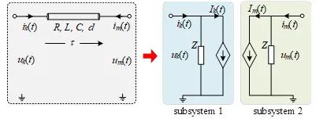

本文档介绍 EMTLab 的大规模电力系统并行仿真技术基本原理，包括基于 Bergeron 模型的分网并行加速技术与 CPU Turbo 加速技术。

## 功能定义
EMTLab 的并行仿真加速技术基本原理。

## 原理说明

### 基于 Bergeron 模型的分网接口

**传输线解耦法**是最经典的接口解耦方法之一。在电磁暂态仿真中，如果电气信号在传输线中的传播延时 $τ$ 大于一个仿真步长 $ΔT$ ，则传输线两边的子网可以被划分为相对独立的子系统。传输线的等效方法如图所示，传输线的每一端口都被等效为阻抗和受控电流源并联的形式。

上图中，$L$ 和 $C$ 分别为传输线单位长度的电感及电容，$R$ 为传输线总电阻，$d$ 为传输线总长度。传输线的传播延时 $τ$ 及等效波阻抗 $Z$ 为：

$$
\begin{aligned}
& \tau=d \sqrt{L C} \\
& Z=\sqrt{L C}+\frac{R}{4}
\end{aligned}
$$ 

在 $t$ 时刻两端口处受控源的表达式 $Ik_{(t)}$ 和 $Im_{(t)}$ 分别为：

$$
\begin{aligned}
& I_k(t)=-\frac{1+h}{2}\left(\frac{u_m\left(t_1\right)}{Z}+h i_m\left(t_1\right)\right)-\frac{1-h}{2}\left(\frac{u_k\left(t_1\right)}{Z}+h i_k\left(t_1\right)\right) \\
& I_m(t)=-\frac{1+h}{2}\left(\frac{u_k\left(t_1\right)}{Z}+h i_k\left(t_1\right)\right)-\frac{1-h}{2}\left(\frac{u_m\left(t_1\right)}{Z}+h i_m\left(t_1\right)\right)
\end{aligned}
$$

此时：

$$
\begin{aligned}
&t_1=t-\tau\\
\end{aligned}
$$

$$
\begin{aligned}
&h=\left(\sqrt{\frac{L}{C}-\frac{R}{4}}\right) /\left(\sqrt{\frac{L}{C}+\frac{R}{4}}\right)\\
\end{aligned}
$$

式中：$uk_{(t1)}$ 和 $um_{(t1)}$ 分别为 $t1$ 时刻端口 $k$ 和 $m$ 的端电压，$ik_{(t1)}$ 和 $im_{(t1)}$ 分别为 $t1$ 时刻端口 $k$ 和 $m$ 的端电流。从表达式 $Ik_{(t)}$ 和 $Im_{(t)}$ 可以看出，受控电流源在 $t$ 时刻的值与 $t1$ 时刻的端电压和端电流有关。该特性是实现系统分网的关键，即传输线两端的子系统可以独立地进行计算，并将本时步得到的端电压、端电流传递给对侧端口，用于后续时刻的受控源的计算。

### CPU Turbo

### Super Turbo

## 常见问题
是所有传输线都能用于分网并行接口吗？
:  由于传输线解耦需要电气信号在传输线中的传播延时 $τ$ 大于一个仿真步长 $ΔT$ ，因此需要传输线有足够的长度。
