import Tabs from '@theme/Tabs';
import TabItem from '@theme/TabItem';

本文档介绍电磁暂态仿真并行计算高级参数设置与适用范围，并以 IEEE-39 节点标准测试系统算例进行演示。目前并行计算功能仅在私有服务器上可用，公网暂未开放使用。

## 功能定义

EMTLab 提供的并行计算高级参数设置功能。

## 功能说明

### 计算选项与适用范围

针对用户不同仿真场景的使用需求，EMTLab 提供了**常规**、 **分网并行**、 **CPU Turbo** 与 **CPU Super Turbo** 等 4 种计算选项。对于新能源单机模型、三机九节点算例等**小规模算例**，推荐选择常规计算选项进行仿真；对于**含长传输线的大规模系统**（如省级电网模型），推荐选择分网并行、 CPU Turbo 与 CPU Super Turbo 等三种采用计算选项进行仿真加速；对于**不具备分网条件的大规模系统**（如仅包含较短集电线的新能源场站模型），推荐选择 [CPU Turbo](#CPU Turbo计算选项配置) 或 [CPU Super Turbo](#CPU Super Turbo计算选项配置) 等 2 种计算选项进行仿真加速。

<table>
<tr><th><b>计算选项</b></th><th><b>功能说明</b></th><th><b>适用场景</b></th><th><b>算例要求</b></th><th><b>（3 机 9 节点标准算例）10s 物理过程仿真耗时</b></th><th><b>（某省级电网）10s 物理过程仿真耗时</b></th><th><b>（某详细风电场模型）10s 物理过程仿真耗时</b></th></tr>
<tr><td><b>常规</b></td><td>利用单核 CPU 完成所有计算</td><td>小规模算例</td><td>无</td><td>单核：2.15s</td><td>单核：2020.58s</td><td>单核：385.22s</td></tr>
<tr><td><b>分网并行</b></td><td>每个电网分区在一个 CPU 核心中完成计算，利用多核 CPU 加速仿真</td><td>含长传输线的大规模电网（如省级电网）</td><td>需要长传输线进行解耦</td><td>/</td><td>**分网：114.80s**</td><td>/</td></tr>
<tr><td rowspan="2"><b>CPU Turbo</b></td><td rowspan="2">多核间执行自动负载均衡策略</td><td rowspan="2">含控制节点较多的大规模系统（如新能源场站）</td><td>无</td><td>不分网：1.74s</td><td>不分网：303.23s</td><td>**不分网：62.56s**</td></tr>
<tr><td>需要长传输线进行解耦</td><td>/</td><td>**分网：102.17s**</td><td>/</td></tr>
<tr><td rowspan="2"><b>CPU Super Turbo</b></td><td rowspan="2">在 CPU Turbo 的基础上优化计算流程，进一步提升计算效率</td><td rowspan="2">含控制节点较多的大规模系统（如新能源场站）</td><td>无</td><td>不分网：1.73s</td><td>不分网：300.63s</td><td>**不分网：57.86s**</td></tr>
<tr><td valign="top">需要长传输线进行解耦</td><td>/</td><td>**分网：100.68s**</td><td>/</td></tr>
</table>

 

### 常规计算选项配置

常规计算选项适用于新能源单机模型、三机九节点算例等**小规模算例**。对于常规计算选项配置，用户只需选择**电磁暂态仿真**计算方案并配置**基本设置**即可。

<Tabs>
<TabItem value="para1" label="基本设置"> 

在**运行标签页**新建**电磁暂态仿真**计算方案，选中新建的计算方案进行配置。

电磁暂态仿真基本设置的参数如下图所示，通常仿真仅需配置**结束时间**、**积分步长**与**输出通道**三个参数即可。积分步长通常选择 50us 即可，但如果需要仿真电力电子开关模型，则需要配置更小的仿真步长。

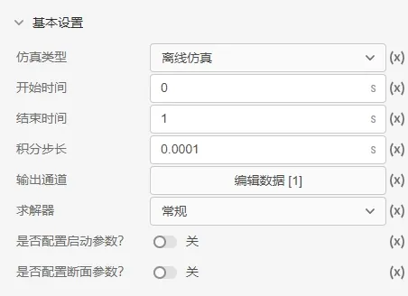
  
更多详细的参数配置如下表所示，详细内容可查看 [电磁暂态仿真计算方案配置](../../50-emts/20-job-config/index.md) 帮助文档。
  
| 参数名 | 含义 | 说明 |
| :--- | :--- | :--- | 
| 仿真类型 | 电磁暂态仿真的仿真类型 | 可选择**离线仿真**、**实时仿真**或**组网仿真**，默认选择**离线仿真**, 实时仿真相关内容可查看 [电磁暂态实时仿真](../../80-emts-rt/index.md) 帮助文档。**组网仿真**功能在公网平台暂不支持。 | 
| 开始时间 | 电磁暂态仿真的开始时间 | 一般为 0，仅在进行断面启动功能时该参数需要与断面参数进行配合选取。 |
| 结束时间 | 电磁暂态仿真的结束时间 | 当仿真时间达到该值时仿真停止。 |
| 积分步长 | 仿真运算的步长 | 积分步长越小仿真越精确，但仿真耗时越大，需结合实际情况进行选取。 |
| 输出通道 | 电磁暂态仿真的输出曲线配置 | 配置在结果页面显示的输出曲线，包括配置显示频率、显示方法、通道选择等内容。更多详细内容可查看 [量测及输出系统](../../50-emts/30-meters-and-outputs/index.md) 帮助文档。 |
| 求解器设置 | 求解器设置选项 | 可选择**常规**和**开关/离散事件处理增强**，默认选择**常规**。对于包含由分立开关元件构成的电力电子拓扑，可选择**开关/离散事件处理增强**，准确判断单一步长内的同步开关事件。 |
| 是否配置启动参数 | 启动参数的开关 | 开启后，电磁暂态仿真可以从给定潮流断面启动。更多启动参数说明可查看 [潮流结果写回及初始化](../../60-power-flow/30-initializing-from-power-flow-results/index.md) 帮助文档。 |
| 是否配置断面参数 | 配置断面参数的开关 | 开启后，电磁暂态仿真可以从给定断面开始仿真，详细说明可查看 [断面参数设置](../../50-emts/40-snapshot/index.md) 帮助文档。 |

</TabItem>
<TabItem value="para2" label="高级设置">
 
配置好**基本设置**后，在**高级设置**中选择**常规**计算选项，点击**启动**按钮即可进行常规电磁暂态仿真。

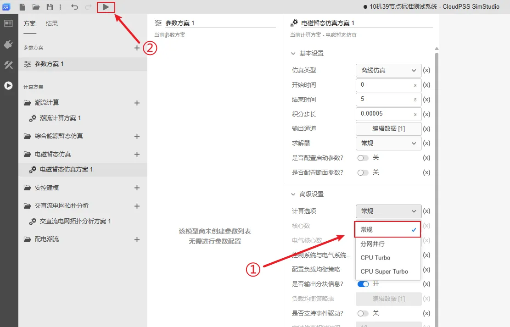

</TabItem>
</Tabs>

 

### 分网并行计算选项配置

分网并行计算选项适用于含长传输线的大规模系统（如省级电网模型）。对于分网并行计算选项配置，用户需要配置**基本设置**、**队列及逻辑核心设置**以及**交直流拓扑分析**等设置。
  
<Tabs>
<TabItem value="para1" label="基本设置">

- 在**运行标签页**新建**电磁暂态仿真**计算方案，对**基本设置**进行配置。

    

    电磁暂态仿真**基本设置**的参数如下图所示，通常仿真仅需配置**结束时间**、**积分步长**与**输出通道**三个参数即可。积分步长通常选择 50us 即可，但如果需要仿真电力电子开关模型，则需要配置更小的仿真步长。更多详细内容可查看 [电磁暂态仿真计算方案配置](../../50-emts/20-job-config/index.md) 帮助文档。

    

- 在**高级设置**中选择**分网并行**计算选项。

    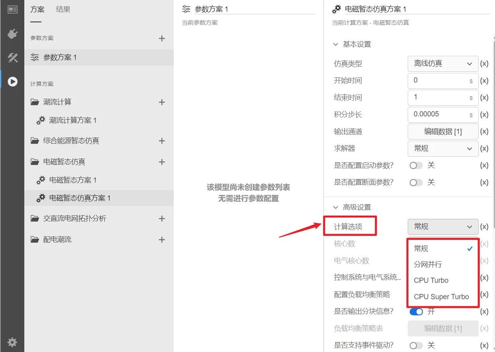

</TabItem>
<TabItem value="para2" label="队列及逻辑核心设置">

针对大规模算例选择**分网并行**、**CPU Turbo** 或 **CPU Super Turbo** 进行仿真加速时，需要选择**任务队列**并设置**逻辑核心数**。
  
- 点击**运行设置**中**计算资源**选项，设置最大可用的逻辑核心数限制。

    

- 点击**高级设置**中**核心数**选项，根据仿真效率需求填写实际使用的 CPU 核数，**核心数不能超过计算资源中配置的逻辑核心数限制**。

    
 
</TabItem>
<TabItem value="para3" label="交直流拓扑分析">

对**含长传输线**的大规模系统（如省级电网模型）进行仿真加速时，需要进行交直流拓扑分析实现自动分网。
  
- 在**运行标签页**新建**交直流电网拓扑分析**计算方案，并在**基本设置**中选择需要进行分网的电磁暂态仿真计算方案。

    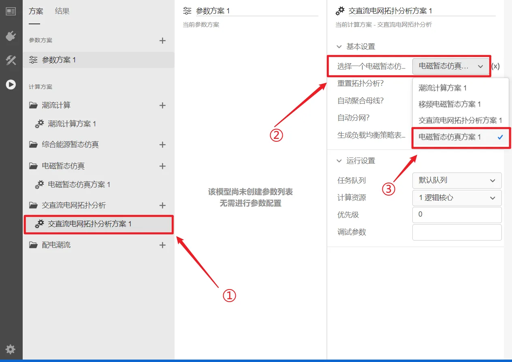

- 在**基本设置**中开启**自动分网**并点击**启动**按钮开始分网。

    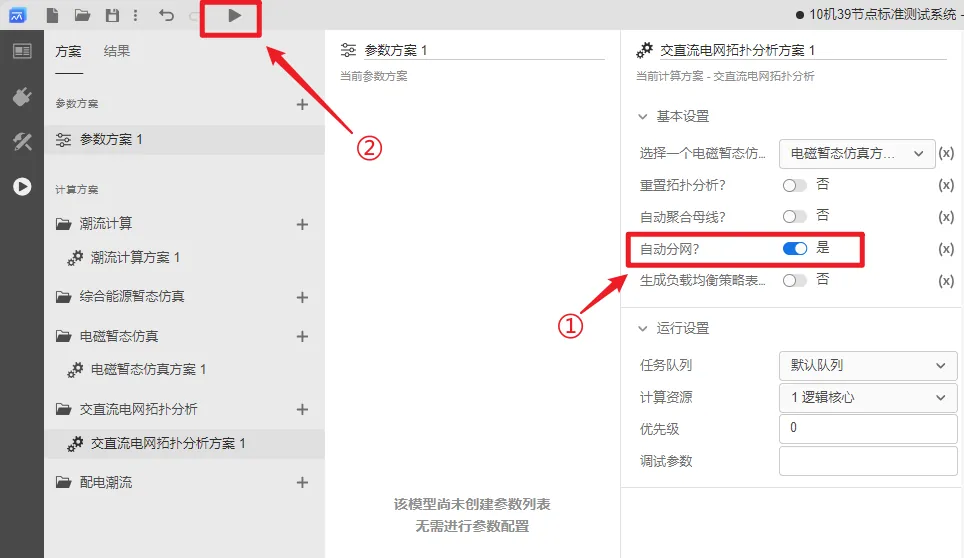

- 在**结果标签页**点击**修改项目文件**按钮，即可将分网结果应用到所选电磁暂态仿真方案中。

    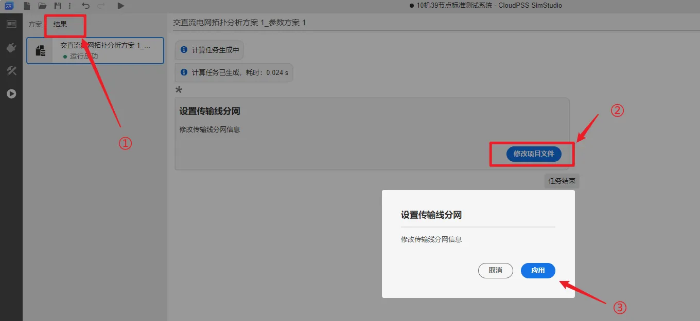

- 在计算方案中选择**电磁暂态仿真**计算方案并点击**启动**按钮即可实现并行仿真加速。**一般算例仿真规模越大，分网并行加速效果越好**。

    

</TabItem>
</Tabs>

 

### CPU Turbo计算选项配置

<Tabs>
<TabItem value="para-cpu1" label="基本设置">

- 在**运行标签页**新建**电磁暂态仿真**计算方案，对**基本设置**进行配置。

    

    电磁暂态仿真基本设置的参数如下图所示，通常仿真仅需配置**结束时间**、**积分步长**与**输出通道**三个参数即可。积分步长通常选择 50us 即可，但如果需要仿真电力电子开关模型，则需要配置更小的仿真步长。更多详细内容可查看 [电磁暂态仿真计算方案配置](../../50-emts/20-job-config/index.md) 帮助文档。

    

- 在**高级设置**中选择**CPU Turbo**计算选项。

    

</TabItem>
<TabItem value="para-cpu2" label="队列及逻辑核心设置">

针对大规模算例选择**分网并行**、**CPU Turbo** 或 **CPU Super Turbo** 进行仿真加速时，需要选择**任务队列**并设置**逻辑核心数**。
  
- 点击**运行设置**中**计算资源**选项，设置最大可用的逻辑核心数限制。

    

- 点击**高级设置**中**核心数**选项，根据仿真效率需求填写实际使用的 CPU 核数，**核心数不能超过计算资源中配置的逻辑核心数限制**。

    

</TabItem>
<TabItem value="para-cpu3" label="交直流拓扑分析">

对于**不具备分网条件**的大规模系统（如只有较短集电线的新能源场站模型），可以跳过此步骤直接点击**启动**按钮进行仿真。对于**含长传输线**的大规模系统（如省级电网模型），需要进行交直流拓扑分析实现自动分网。
  
- 在**运行标签页**新建**交直流电网拓扑分析**计算方案，并在**基本设置**中选择需要进行分网的**电磁暂态仿真方案**。

    

- 在**基本设置**中开启**自动分网**并点击**启动**按钮开始分网。

    

- 在**结果标签页**点击**修改项目文件**按钮，即可将分网结果应用到电磁暂态仿真方案中。

    

- 在计算方案中选择**电磁暂态仿真**计算方案并点击**启动**按钮即可实现并行仿真加速。**一般算例仿真规模越大，分网并行加速效果越好**。

    

</TabItem>
</Tabs>

 

### CPU Super Turbo计算选项配置

<Tabs>
<TabItem value="para-super1" label="基本设置">

- 在**运行标签页**新建**电磁暂态仿真**计算方案，对**基本设置**进行配置。

    

    电磁暂态仿真**基本设置**的参数如下图所示，通常仿真仅需配置**结束时间**、**积分步长**与**输出通道**三个参数即可。积分步长通常选择 50us 即可，但如果需要仿真电力电子开关模型，则需要配置更小的仿真步长。更多详细内容可查看 [电磁暂态仿真计算方案配置](../../50-emts/20-job-config/index.md) 帮助文档。

    

- 在**高级设置**中选择**CPU Super Turbo**计算选项。

    

</TabItem>
<TabItem value="para-super2" label="队列及逻辑核心设置">

针对大规模算例选择**分网并行**、**CPU Turbo** 或 **CPU Super Turbo** 进行仿真加速时，需要选择**任务队列**并设置**逻辑核心数**。
  
- 点击**运行设置**中**计算资源**选项，设置最大可用的逻辑核心数限制。

    

- 点击**高级设置**中**核心数**选项，根据仿真效率需求填写实际使用的 CPU 核数，**核心数不能超过计算资源中配置的逻辑核心数限制**。

    

</TabItem>
<TabItem value="para-super3" label="交直流拓扑分析">

对于**不具备分网条件**的大规模系统（如只有较短集电线的新能源场站模型），可以跳过此步骤直接点击**启动**按钮进行仿真。对于**含长传输线**的大规模系统（如省级电网模型），需要进行交直流拓扑分析实现自动分网。
  
- 在**运行标签页**新建**交直流电网拓扑分析**计算方案，并在**基本设置**中选择需要进行分网的**电磁暂态仿真**计算方案。

    

- 在**基本设置**中开启**自动分网**并点击**启动**按钮开始分网

    

- 在**结果标签页**点击**修改项目文件**按钮，即可将分网结果应用到电磁暂态仿真方案中。

    

- 在计算方案中选择**电磁暂态仿真**计算方案并点击**启动**按钮即可实现并行仿真加速。**一般算例仿真规模越大，分网并行加速效果越好**。

    

</TabItem>
</Tabs>

### 更多高级设置

电磁暂态仿真高级设置详细内容如下表所示，用户可根据需求配置**控制系统与电气系统并行**、**负载均衡策略**、**是否输出分块信息**等设置。

| 参数名 | 含义 | 说明 |
| :--- | :--- | :--- | 
| 核心数 | 仿真使用的 CPU 核心数 | 计算选项选择**分网并行**、 **CPU Turbo** 或 **CPU Super Turbo** 时可设置，代表 CPU 核心数，默认值为 1。 |
| 电气核心数 | 计算电气系统时使用的 CPU 核心数 | **控制系统与电气系统并行**开关开启时可设置，设置计算电气系统的 CPU 核心数, 如果**电气核心数** = **核心数**，代表控制系统与电气系统串行。 |
| 控制系统与电气系统并行 | 并行开关 | 电磁暂态仿真中控制系统与电气系统并行计算。 |
| 配置负载均衡策略 | 负载均衡策略配置开关 | 如果不开启，采用自动负载均衡策略；如果开启，可在负载均衡策略表进行配置。 |
| 是否输出分块信息 | 输出分块信息开关 | 在仿真过程中输出分块信息 |
| 负载均衡策略表 | 电气系统和控制系统仿真的负载均衡设置 | 使用该功能时，请先执行**交直流电网拓扑分析**，获取各个分区数据，并根据各个分区计算量和预估耗时，设计负载均衡策略，将分区编号对应填入“分区-核心”映射表。也可以在交直流电网拓扑分析结果页中写入负载均衡信息，将负载均衡策略表设置为拓扑分析后的默认值。更多详细说明可查看 [交直流拓扑分析](../../90-topology-analysis/index.md) 帮助文档 |
| 是否支持事件驱动 | 事件驱动开关 | 开启此选项后，可在仿真过程中添加异步事件。更多事件驱动相关内容可参考 [事件驱动仿真](../../100-event-driven/index.md) 帮助文档。 |
| 实时仿真超时时间 | 实时仿真超时设置 | 更多实时仿真相关内容可查看 [电磁暂态实时仿真](../../80-emts-rt/index.md) 帮助文档  |
| 只进行分网 | 分网选项 | 开启此选项后，仿真只进行初始化分网，不进行后续仿真。更多详细说明可查看 [交直流拓扑分析](../../90-topology-analysis/index.md) 帮助文档 |

<Tabs>
<TabItem value="adv-setting1" label="控制系统与电气系统并行">

在**高级设置**中启用**控制系统与电气系统并行**，根据电气系统与控制系统规模合理配置电气核心数。其中，**电气核心数不能超过核心数**。

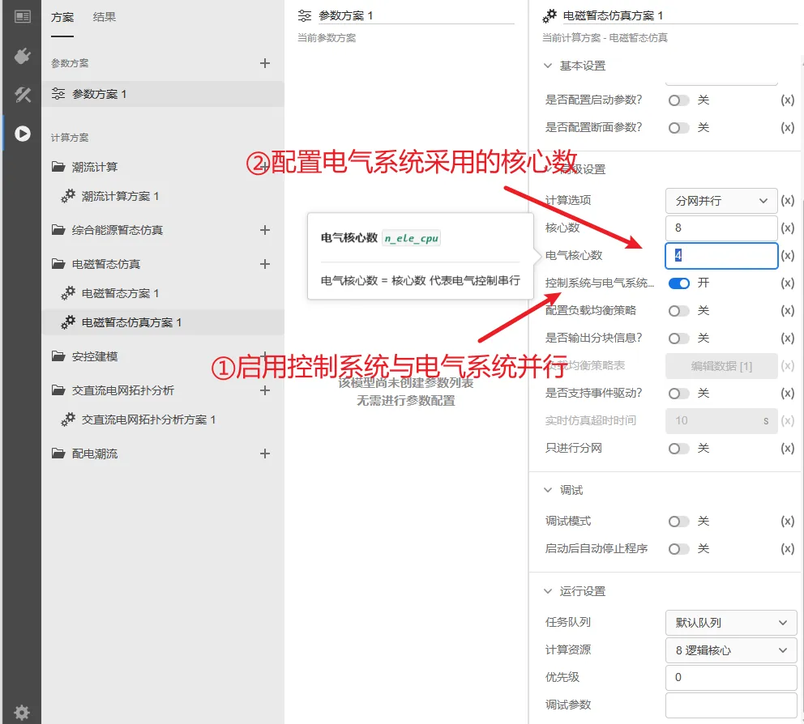

</TabItem>
<TabItem value="adv-setting2" label="配置负载均衡策略">

使用该功能，需要先进行**交直流电网拓扑分析**，获取各个分区数据，并将拓扑分析得到的负载均衡策略表写回到计算方案。

1. **自动写入负载均衡信息**
  
   1. 在**运行标签页**新建**交直流电网拓扑分析**计算方案，并在**基本设置**中选择需要进行拓扑分析的**电磁暂态仿真**计算方案。详见[交直流电网拓扑分析](../../90-topology-analysis/index.md)帮助文档。

        

   1. 在**基本设置**中开启**生成负载均衡策略表**选项。此时点击**启动**按钮即可开始分网并生成生成负载均衡策略表。

        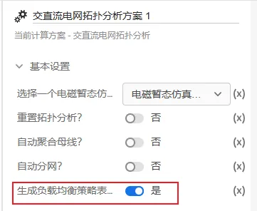

   1. 在**结果标签页**中的**负载均衡信息**页面点击**修改项目文件**按钮，即可将负载均衡策略表写回到电磁暂态仿真方案中。
  
        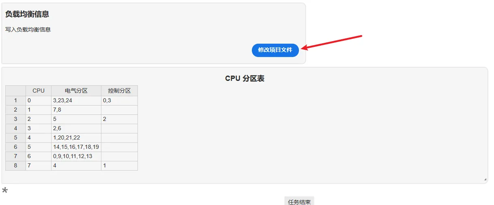
  
1. **手动写入负载均衡信息**
  
        用户也可在**高级设置**中启用**配置负载均衡策略**，根据各个分区计算量和预估耗时，设计负载均衡策略，将分区编号对应手动填入“分区-核心”映射表。**此项操作具有一定风险，普通用户不建议使用！**

        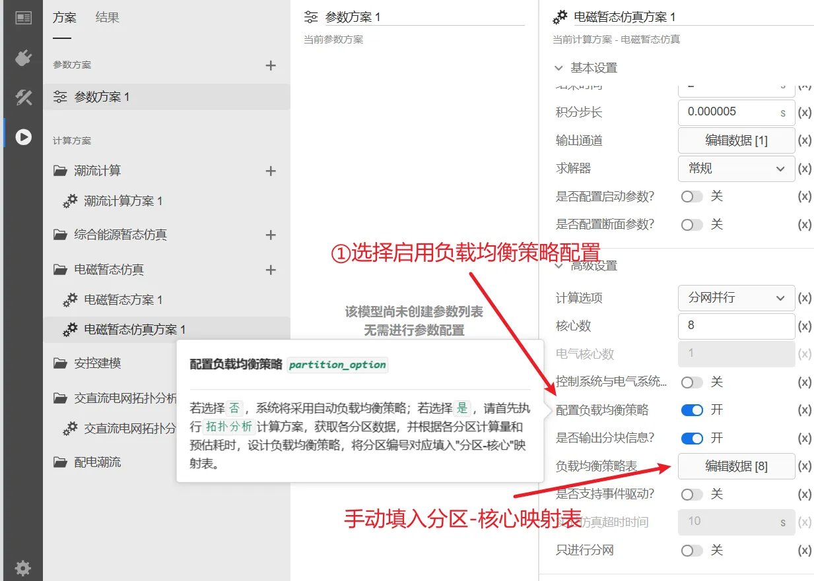

</TabItem>
<TabItem value="adv-setting3" label="输出分块信息">

CloudPSS EMTLAB 支持在仿真过程中输出分块信息以及将分区结果应用到拓扑中进行染色显示。

- 在**高级设置**中点击开启**是否输出分块信息**选项。

    

- 开启**是否输出分块信息**选项后可以输出**电气节点统计**、**控制节点统计**以及**CPU分区表**等信息。

    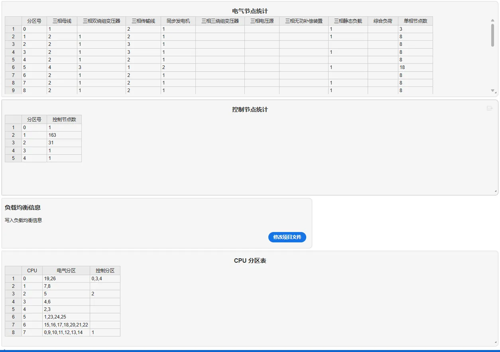

- 关闭**是否输出分块信息**选项后将不会输出**控制节点统计**以及**CPU分区表**等信息。

    

- 在**分网结果**界面点击**修改项目文件**按钮，即可将分网结果应用到电磁暂态仿真方案中，并在拓扑中显示分网结果。

    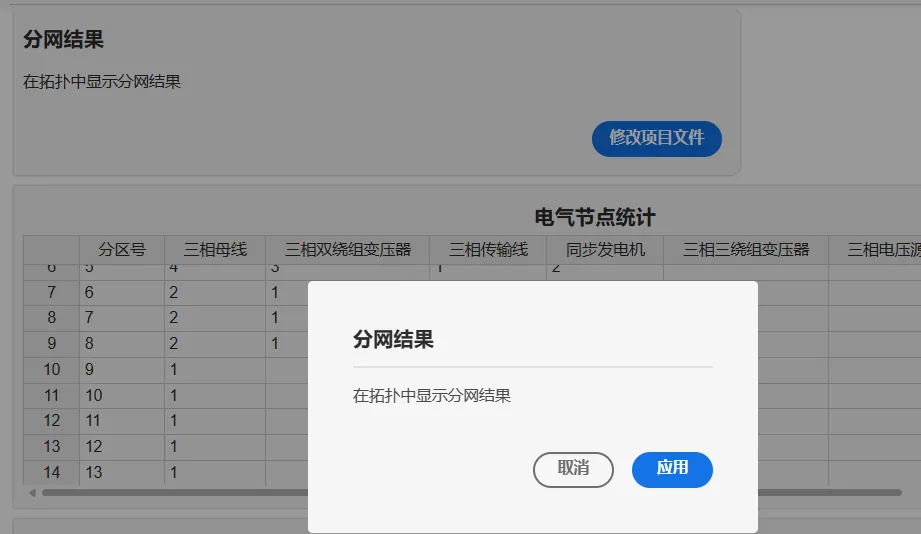
 
    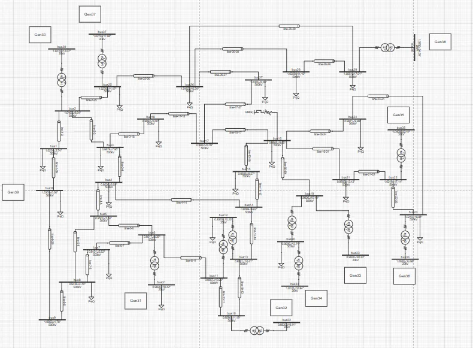
 
    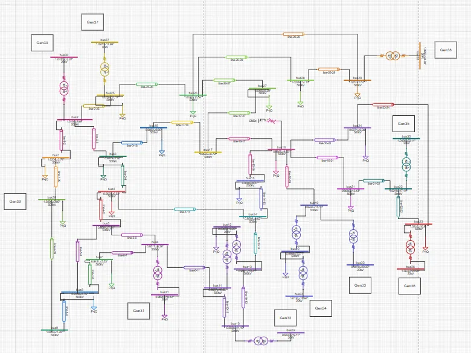

</TabItem>
</Tabs>

## 案例介绍

<Tabs>
<TabItem value="case1" label="10 机 39 节点系统分网并行仿真加速">

1. **新建算例与电磁暂态仿真方案**  
  
   1. 在 **CloudPSS SimStudio** 个人中心打开 **IEEE-39 节点标准测试系统算例**。

        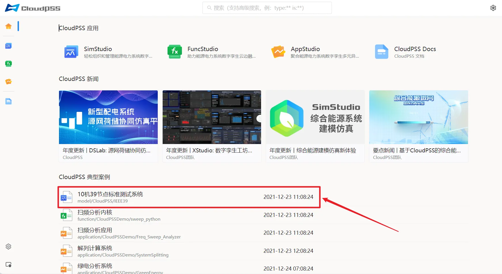

   1. 选择**运行标签页**新建电磁暂态仿真方案进行参数配置。

        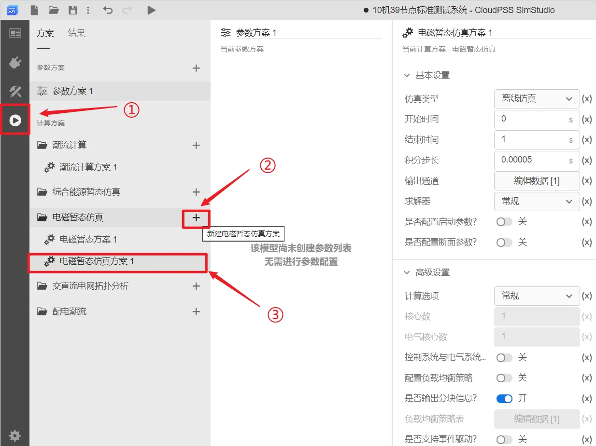
 
1. **并行计算方案配置**

   1. 点击**运行设置**中**计算资源配置**选项，根据仿真效率需求选择需要使用的 CPU 核数。

        

   1. 在**高级设置**中选择**分网并行**，并填写使用的核心数，**核心数需要小于等于计算资源中配置的值**。

        

1. **拓扑分析**

   1. 在**运行标签页**新建**交直流电网拓扑分析**方案，并在**基本设置**中选择需要进行分网的电磁暂态仿真计算方案。

        

   2. 选择**自动分网**并点击**启动**按钮开始分网。

        

   3. 在**结果标签页**点击**修改项目文件**按钮，将分网结果应用到电磁暂态仿真方案中。

        

2. **电磁暂态仿真计算**
  
    点击**启动**按钮进行电磁暂态仿真。**一般算例仿真规模越大，分网并行加速效果越好**。

        

3. **效率对比**

   1. 对于 **IEEE39 节点标准测试算例**，由于**CPU单核性能已经足够**，因此采用并行仿真的**加速比**仅为 **1.5** 左右。

        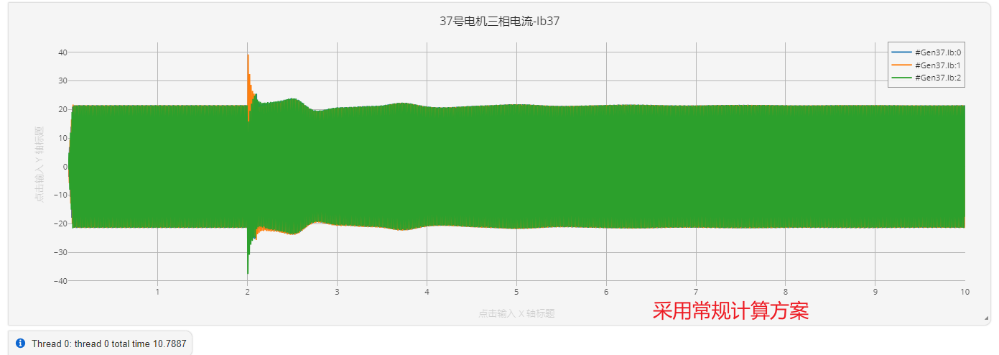

        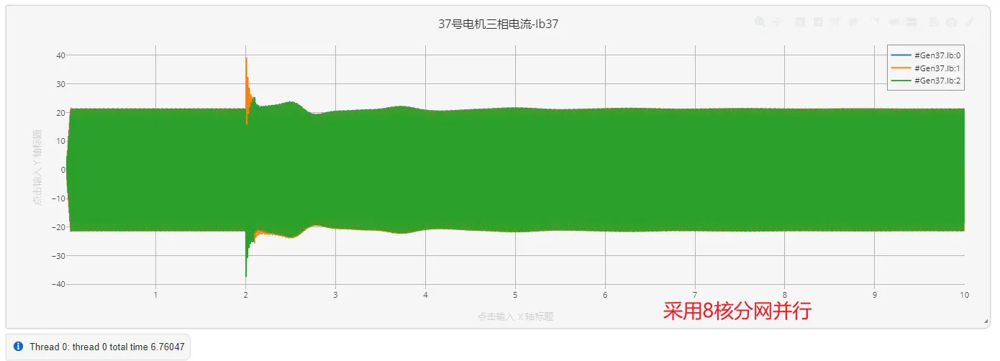

   1. 对于包含十一万电气与控制节点的**大规模交直流电网算例**，分网后 1s 仿真的物理过程从 **884s** 提升到了 **30s** 左右，**加速比**约为 **29**。

        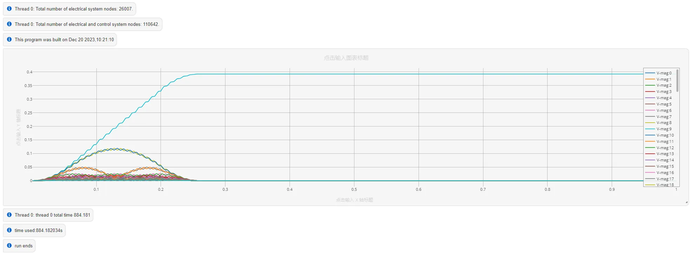

        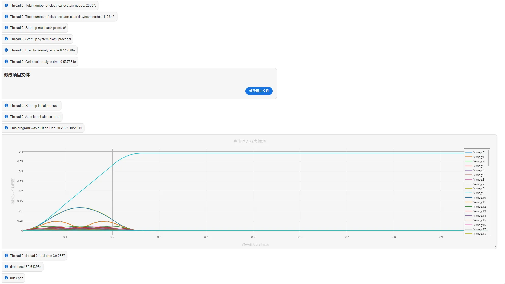

</TabItem>
<TabItem value="case2" label="10 机 39 节点系统 CPU Turbo/Super Turbo 仿真加速">

1. **新建算例与电磁暂态仿真方案**  
  
   1. 在 **CloudPSS SimStudio** 个人中心打开 **IEEE-39 节点标准测试系统算例**。

        

   1. 在**运行标签页**新建电磁暂态仿真方案进行参数配置。

        

1. **并行计算方案配置**

   1. 点击**运行设置**中**计算资源配置**选项，根据仿真效率需求选择需要使用的 CPU 核数。

        

   1. 在**高级设置**中选择 **CPU Turbo** 或**CPU Super Turbo**，并填写使用的核心数，**核心数需要小于等于计算资源中配置的值**。

        

1. **拓扑分析**

   1. 在**运行标签页**新建**交直流电网拓扑分析**方案，并在**基本设置**中选择需要进行分网的电磁暂态仿真计算方案

        

   1. 选择**自动分网**并点击**启动**按钮开始分网。

        

   1. 在**结果标签页**点击**修改项目文件**按钮，将分网结果应用到电磁暂态仿真方案中。

        

1. **电磁暂态仿真计算**
  
   点击**启动**按钮进行电磁暂态仿真。**一般算例仿真规模越大，分网并行加速效果越好**。

        

2. **效率对比**

   1. 对于 **IEEE39 节点标准测试算例**，由于**CPU单核性能已经足够**，因此采用并行仿真的**加速比**仅为 **1.5** 左右。

        

        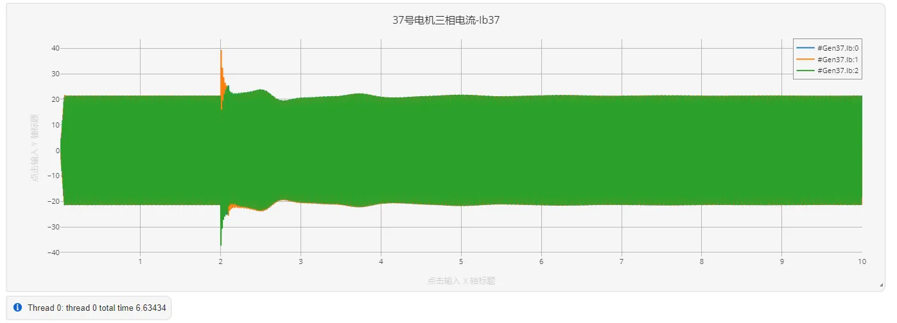

   2. 对于包含十一万电气与控制节点的**大规模交直流电网算例**，采用 CPU Turbo 加速后 1s 仿真的物理过程从 **884s** 提升到了 **22s** 左右，**加速比**约为 **40**。

        

        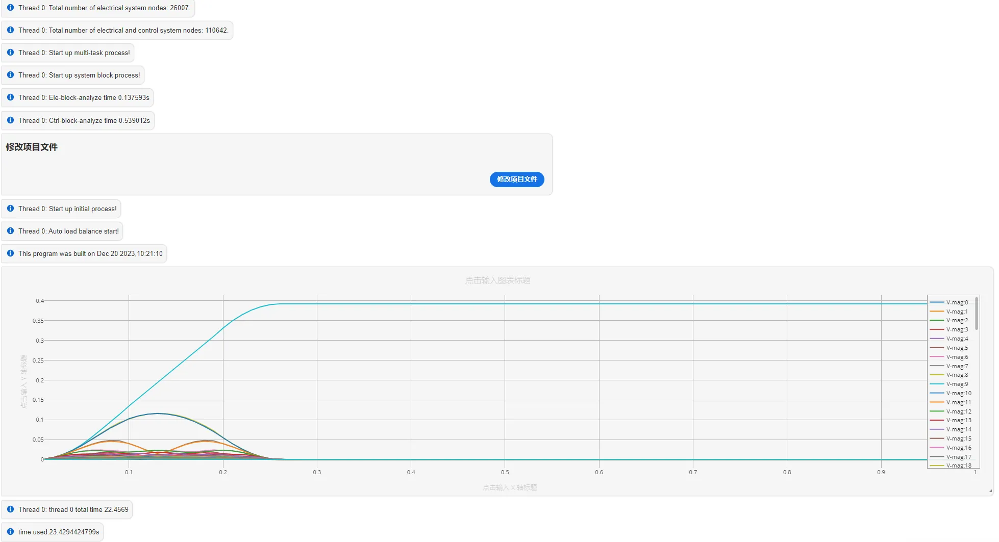

</TabItem>
</Tabs>

## 常见问题

为什么我无法选择多个逻辑核心？
:   目前并行计算功能仅在私有服务器上可用，公网暂未开放使用，仅能使用单核进行计算。

为什么我在分网后仿真效率提升不大？
:  一般是由于算例规模较小，采用单核进行计算已有较高效率，因此分网后仿真效率提升不大。

如何选取合适逻辑核心数量？
:   对于新能源单机模型、三机九节点算例等小规模算例，选用单核进行仿真即可；对于新能源场站模型，一般选取 4 核、8 核即可；对于大规模省级电网，需要综合考虑设备的核数以及同时使用的人数，对于 32 核的仿真设备，一般选择 16 核即可达到较高效率。

电磁暂态仿真报错: `Error: +/- Seq. Travel Time is less than the integration time step. Decrease the time step or use Lumped π-Model instead.`
:  由于传输线解耦需要电气信号在传输线中的传播延时 $τ$ 大于一个仿真步长 $ΔT$ ，若传输线较短，需要减小仿真步长。

交直流电网拓扑分析方案报错：`选择一个电磁暂态仿真方案="args":"@debug":"","@priority":0,"@queue":1,"@tres":"cpu=1.`

:   
    在**运行标签页**新建**电磁暂态仿真方案**进行参数配置即可。  

    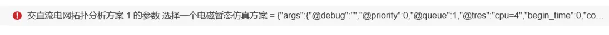

    