本文档主要介绍 CloudPSS EMTLab 在电磁暂态实时仿真中半实物硬件在环的应用方法及案例。

## 功能定义
CloudPSS EMTLab 可凭借高性能实时仿真器 [CloudPSS MiniRT](../../../../hardware/10-desktop-type/10-cloudpss-mini/index.md) 或 [CloudPSS ProRT](../../../../hardware/20-rack-type/10-cloudpss-pro/index.md) ，以及数模转换枢纽 [CloudPSS I/O Signal Hub](../../../../hardware/10-desktop-type/20-cloudpss-io-signal-hub/index.md)，实现硬件在环仿真的应用。

## 功能说明
### 硬件平台

硬件在环仿真需要仿真器与真实物理装置进行数据交互。CloudPSS-RT 仿真器具备多种数据交互接口，适用于多种硬件在环仿真应用场景。CloudPSS-RT 的硬件平台示意图如下所示。

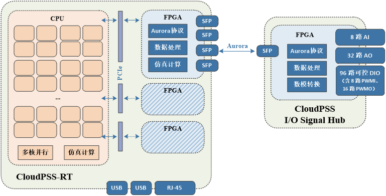

CloudPSS-RT 具备 1 个 RJ-45 以太网接口（网口也可通过 USB 接口扩展），可配置 1 - 3 块 FPGA 通信/计算卡，每块 FPGA 通信/计算卡具备 2 - 4 个 SFP 光纤接口。CloudPSS-RT 通过 SFP 接口与 Signal Hub 连接后，将具备 8 路模拟量输入和 32 路模拟量输出，并具备 96 路可控数字量输入/输出，其中含 12 路 PWM 输入和 16 路 PWM 输出，支持 1k - 100kHz 的 PWM 调制与解调。

通过上述数据交互接口，可实现与物理装置的硬件在环仿真。

### 通信协议

当使用 SFP 光纤接口或以太网接口与真实物理装置通信时，需要定制开发通信协议。  

- **SFP 光纤接口通信协议**
    
    CloudPSS-RT 的 SFP 光纤接口可采用 **Aurora** 通信协议。Aurora 协议是 Xilinx 公司提供的一个开放、免费的链路层协议，可进行点对点的串行数据传输，具有高效、稳定和简单易用的特点。Aurora 协议允许器件之间通过多个通道绑定进行通信。单个通道可实现 750Mbit/s - 6.5Gbit/s的通信传输，多个通道的组合可实现几十 Gbit/s 甚至上百 Gbit/s 的通信传输。Aurora 协议的链路结构如下图所示。

    
    
    CloudPSS-RT 的 FPGA 通信/计算卡中已内置了一个 Aurora 协议，协议各参数如下表。

    | **参数项** | **协议内容** |
    | :------------: | :-----------: |
    | 帧格式 | 32 位 Float |    
    | 同步帧 | 1 通道，4 字节，0x12345678 |
    | 有效帧 | 64 通道，256 字节，用户自定义 |
    | 帧长度 | 共 65 通道，260 字节 |
    | 光口速率 | 5Gbps |
    | 解析方式 | 大端解析 |

    若真实物理装置的数据交互接口配置成相同的协议，即可与 CloudPSS-RT 通过该协议进行数据交互。

    CloudPSS-RT 与 I/O Signal Hub 的数据交互也是通过 SFP 光纤接口进行，使用内置的 Aurora 通信协议实现。
  
- **以太网接口通信协议**

    CloudPSS-RT 的以太网接口可采用 Modbus 通信协议。Modbus 是一种串行通信协议，是工业电子设备之间常用的连接方式。由于 Modbus 通信协议是通过以太网进行数据传输的，因此它的数据交互是**非实时**的，可用于传输一些对延迟要求不高的指令信号。

    CloudPSS-RT 中没有内置通用的 Modbus 协议，需要根据真实物理装置的具体需求定制开发。

### 主从式同步机制

为确保 SFP 光纤接口传输的数据正确、稳定、无丢包，CloudPSS-RT 的光纤通信采用主从式的同步机制。光纤两端的器件，一端作为主模式，按一定时间间隔（一般是仿真步长）发送数据；另一端作为从模式，按相同的时间间隔接收数据，并校验同步帧，默认同步帧之后的帧数据有效。

CloudPSS-RT 可在电磁暂态仿真方案中，设置实时仿真的类型后，选择设置为**主模式**或**从模式**，当选为主模式时，CloudPSS-RT 将会以设置的仿真积分步长为间隔，持续发送和接收数据，并且不会校验接收到的数据；当选为从模式时，CloudPSS-RT 将会以设置的仿真积分步长为间隔接收数据，并校验数据的同步帧，若同步帧匹配，则发送数据。以此实现光纤通信的时序同步和数据的正确、稳定交互。

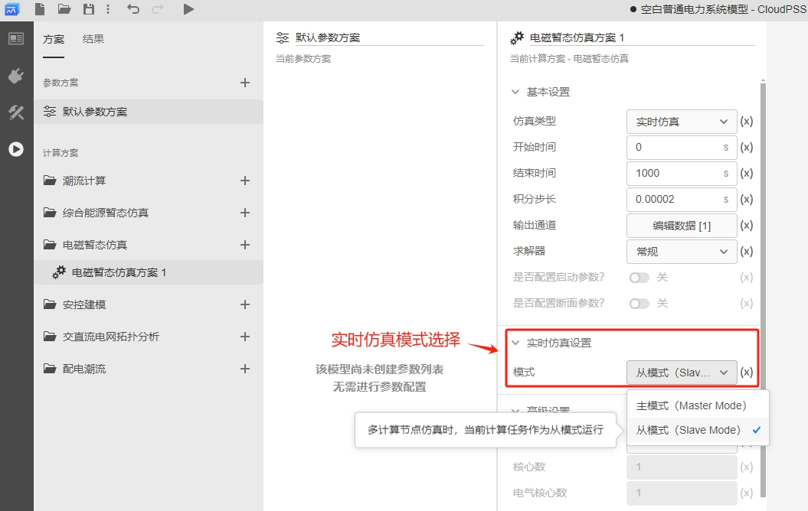

CloudPSS-RT 与其它真实物理装置通过光纤通信时，通常设置为**从模式**，由 CloudPSS-RT 跟随其它装置的同步信号。

CloudPSS-RT 与 I/O Signal Hub 通信时需设置为**从模式**。

### 软件接口

EMTLab 提供了一套**实时仿真工具库**，包含了硬件在环仿真的软件接口，可将模型中的数据通过 SFP 接口或 I/O Signal Hub 的模拟量、数字量接口输出，或接收 SFP 数据、模拟量信号、数字量信号，参与模型中的仿真计算。

- **SFP 接口元件**

    提供 SFP 接口功能，输入和输出引脚的维数均为 64，对应 CloudPSS-RT 内置 Aurora 协议的 64 通道有效帧，需配合**多路信号合并**和**多路信号分离**元件使用。协议中的同步帧 0x12345678 已隐藏在接口中作为帧头，无需用户设置。

    

- **虚拟端口元件**

    提供以太网接口交互功能，**虚拟输出端口**可将模型的数据从以太网接口输出，**虚拟输入端口**可接收以太网接口的输入到模型中。
    
    虚拟端口元件一般用于在实时仿真过程中，通过以太网将仿真结果数据传输到上位机观测，也可以接收上位机下发的数据指令。使用方法可参考软件工具 [CloudPSS Signal Monitor](../../../../software-tools/20-signal-monitor/index.md) 文档。
    
    若需要通过以太网接口与真实物理装置通信，需定制开发通信协议，并选定一些虚拟端口元件与待输出、待输入信号绑定。
    
    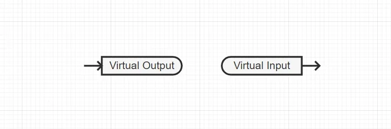
    

- **模拟量接口元件**

    与 I/O Signal Hub 交互数据，实现**模拟量输出**、**模拟量输入**功能。一台 CloudPSS I/O Signal Hub 支持最多 32 路模拟量输出通道和 8 路模拟量输入通道，模拟量输出信号的幅值范围为 ±10V，模拟量输入信号的幅值范围为 ±10V，具体使用方法可参考硬件产品 [CloudPSS I/O Signal Hub](../../../../hardware/10-desktop-type/20-cloudpss-io-signal-hub/index.md) 文档。

    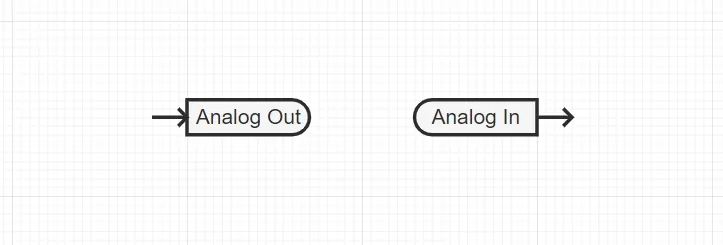
    

- **数字量接口元件**

    与 I/O Signal Hub 交互数据，实现**数字量输出**、**数字量输入**功能。一台 CloudPSS I/O Signal Hub 支持最多 96 路数字量通道，每 8 路为 1 组，可按组为单位切换数字量方向，选择接口为数字量输出或数字量输入。数字量输出信号的低电平为 0V，高电平为 5V，数字量输入信号的高电平判断阈值为 2V。
    
    

    在 96 路通道的数字量接口中，有 16 路可设置为 PWM 输出接口，通过**调制波输出**元件将基波信号传输至 CloudPSS I/O Signal Hub，Signal Hub 根据用户设置的载波参数将基波调制为 1k - 100kHz 的 PWM 信号，并从对应的数字量接口输出。
    
    并且，还有 12 路可设置为 PWM 输入接口，CloudPSS I/O Signal Hub 将以 10MHz 的频率采样和接收 PWM 信号，并将其解调还原为基波，通过**调制波输入**元件将基波信号传输至模型中，支持解调的 PWM 频率范围为 1k - 100kHz。

    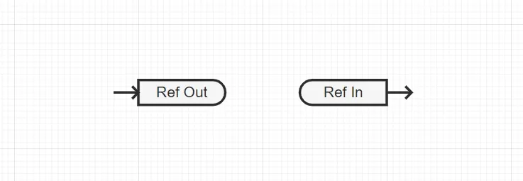
    
    数字量接口元件的具体使用方法可参考硬件产品 [CloudPSS I/O Signal Hub](../../../../hardware/10-desktop-type/20-cloudpss-io-signal-hub/index.md) 文档。

## 案例

import Tabs from '@theme/Tabs';
import TabItem from '@theme/TabItem';

<Tabs>
<TabItem value="case1" label="储能变流器控制器硬件在环仿真">

- **案例介绍**

    该案例搭建了储能变流器控制器的硬件在环仿真测试平台，被测设备为 ANPC 拓扑的储能变流器控制器，对变流器控制器进行了电压跌落、故障模拟测试，以及阻抗扫描振荡风险分析。

    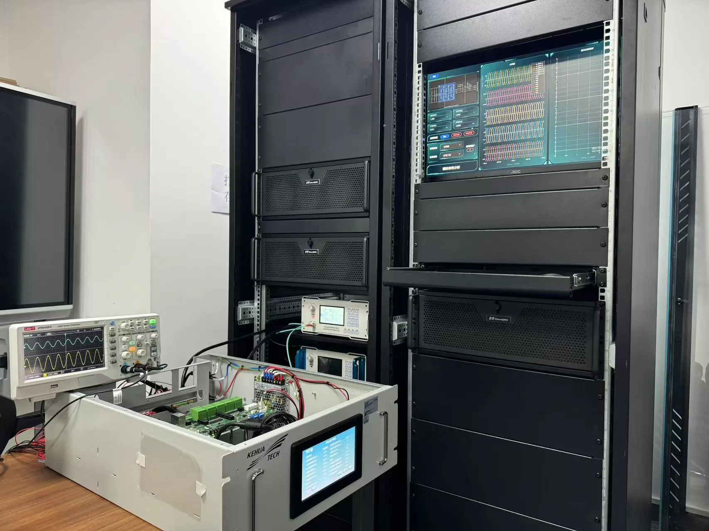

- **平台结构**

    平台通过 CloudPSS I/O 信号枢纽向储能变流器实物控制器提供网侧电压、变流器交流电压、电流、直流电压等模拟信号；储能变流器实物控制器通过对采集信号进行程序运算并生成 PWM 控制信号，通过高速通信协议传入仿真器中的开关函数模型，对逆变器、各试验开关等模型进行控制，构成闭环试验环境。硬件架构示意图如下图所示。

    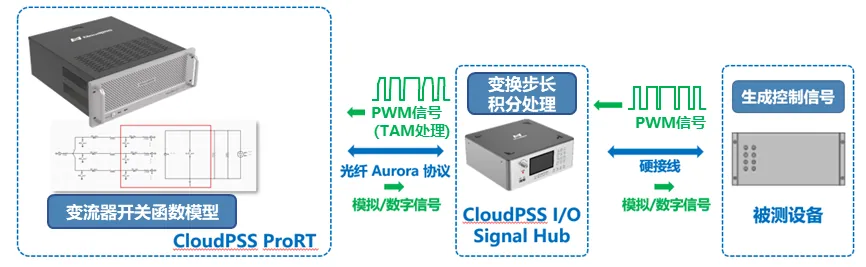

- **系统规模**
    
    在环仿真测试模型如图所示，含 21 个开关元件，基于 CPU 的电磁暂态实时仿真步长 10us。

    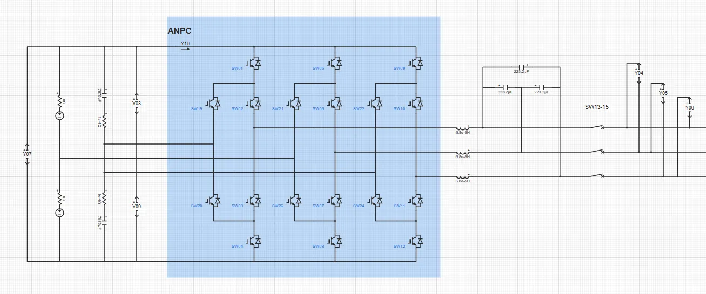

</TabItem>

<TabItem value="case2" label="集群储能紧急控制系统硬件在环仿真">

- **案例介绍**

    该案例搭建了集群储能紧急控制系统硬件在环仿真测试平台，被测设备为区域协同稳定控制系统，涉及储能主站与子站的控制器，解决在区域电网功率缺额、功率不平衡、频率越限等工况下的储能控制器功能验证问题。
    
    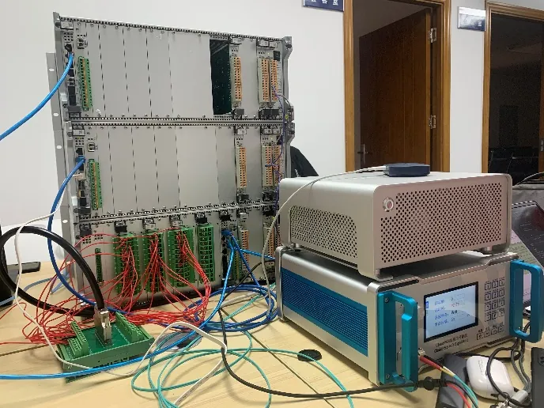

- **平台结构**
    
    在 CloudPSS-RT 仿真器中构建区域电网模型和储能模型，通过 CloudPSS I/O Signal Hub 将区域电网的电压、电流数据输出至集群储能紧急控制系统。控制系统根据采集的电压、电流数据完成协同控制，并将储能调控指令通过定制 Modbus 协议传送回区域电网中的储能模型，实现控制器的硬件在环测试。平台结构示意图如下图所示。

    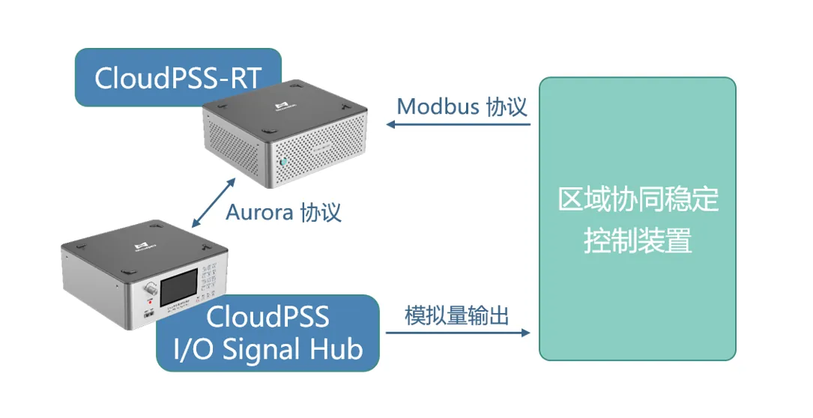
   
- **系统规模**
    
    仿真测试模型如图所示。区域电网模型采用 10 机 39 节点标准测试算例模型，并根据实际储能电站参数构建 4 台储能 PCS 模型；包含模拟量输出接口和 Modbus 协议接口，共含 367 个电气节点，1824 个控制节点。基于 CPU 的电磁暂态实时仿真步长 20us。

    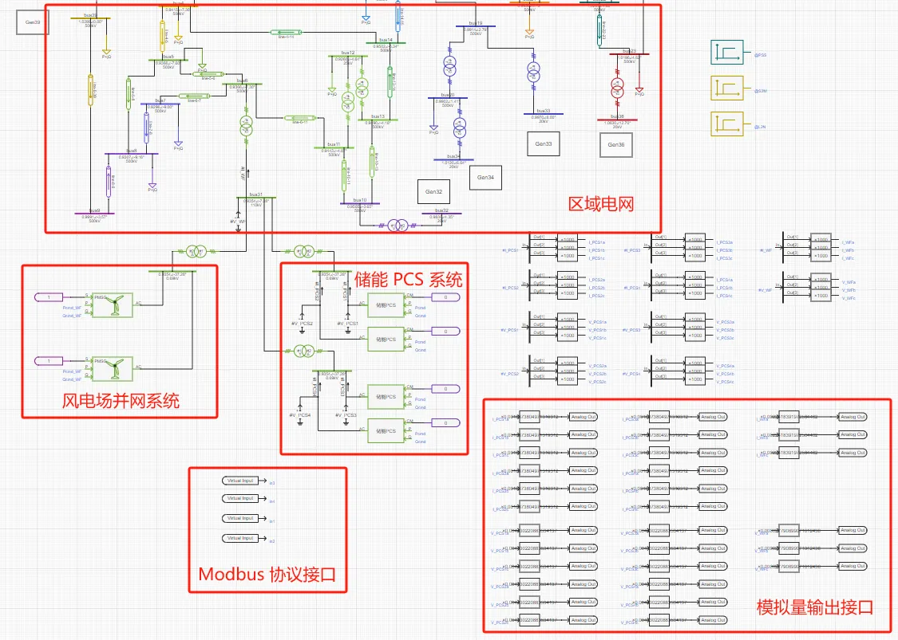

</TabItem>

<TabItem value="case3" label="多能源动模系统功率硬件在环仿真">

- **案例介绍**

    该案例搭建了多能源动模系统功率硬件在环仿真测试平台，平台中包含光伏发电系统、光伏逆变器、RLC负载、故障模拟系统等真实物理设备，通过功率放大器连接物理设备与仿真器，构成功率硬件在环仿真环境。

    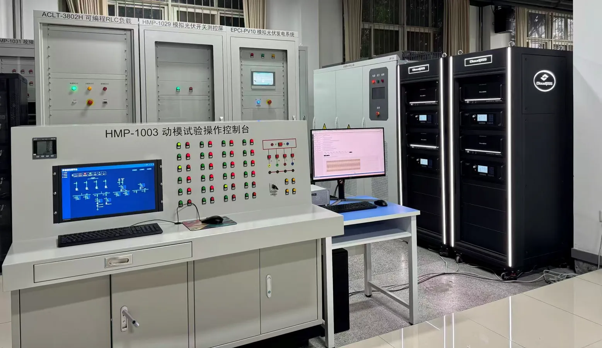

- **平台结构**
    
     在 CloudPSS-RT 仿真器中构建电网等值模型，选择一条母线作为多能源动模系统的并网点，构建功率接口模型。通过 CloudPSS I/O Signal Hub 将多能源动模系统并网母线的三相电压瞬时值经模拟量输出通道（电压范围 ±10V）实时输出，并由功率放大器放大至电压幅值 ±311V，为多能源动模系统中的真实物理设备供电。

     同时，功率放大器量测多能源动模系统中一次线缆的三相电流瞬时值，并转换为小电压信号（电压范围 ±10V），从 CloudPSS I/O Signal Hub 的模拟量输入通道返回仿真器，实现仿真器中的电网等值模型和多能源动模系统中光伏发电系统、RLC负载的功率硬件在环。平台结构示意图如下。

    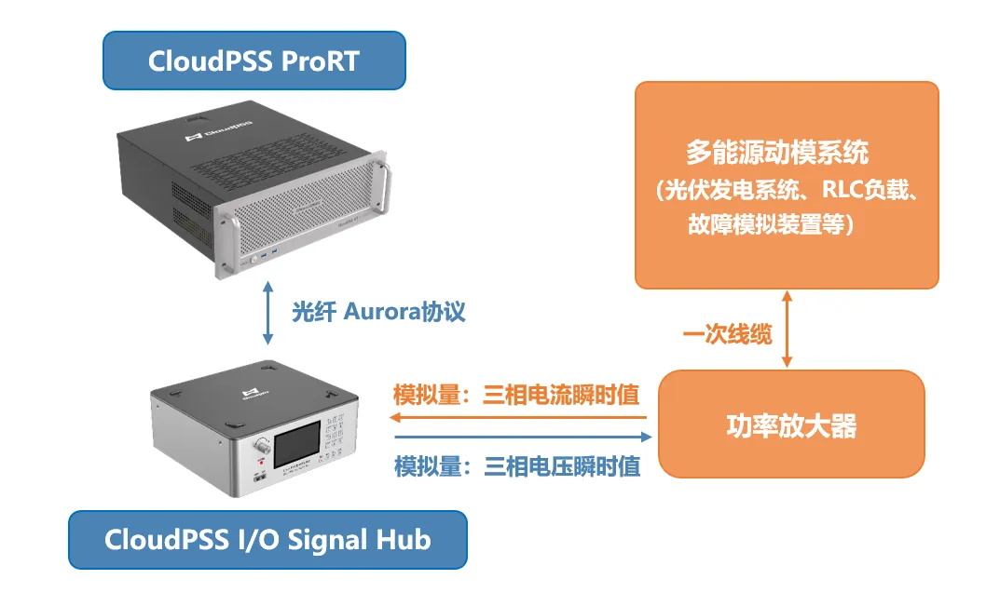

  
- **系统规模**
    
    仿真测试模型如图所示。模型中包含变压器、传输线和功率接口，以及详细构建的光伏电站、直驱风机的全数字模型，共含 960 个电气节点，3200 个控制节点。基于 CPU 的电磁暂态实时仿真步长 50us。

    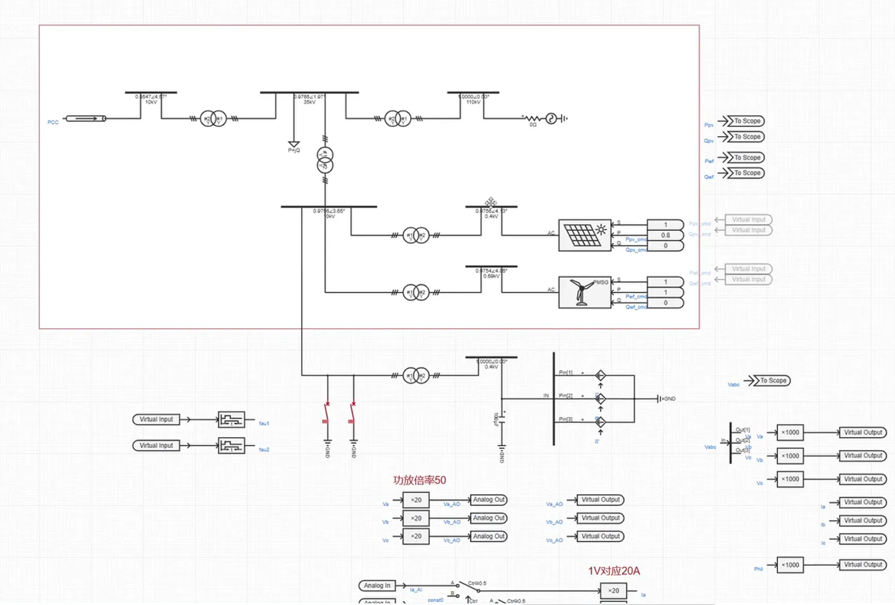
    
    在功率硬件在环仿真中，操作 RLC 负载物理设备进行负荷投切，仿真结果如图所示。

    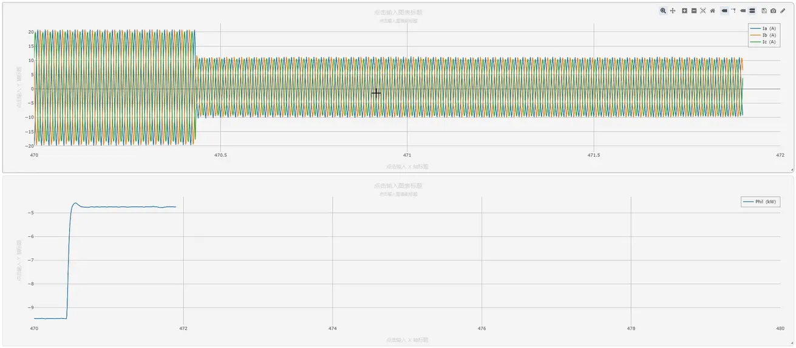

</TabItem>
</Tabs>

## 常见问题

如何修改 SFP 光纤接口通信协议？

:   
    CloudPSS-RT 内置的 Aurora 通信协议已固化在通信模块中，无法由用户自定义，如需修改通信协议，可联系 CloudPSS 技术人员定制开发。
