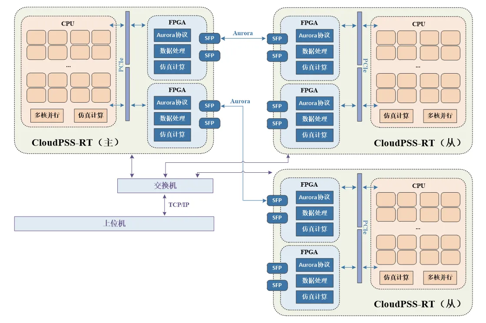
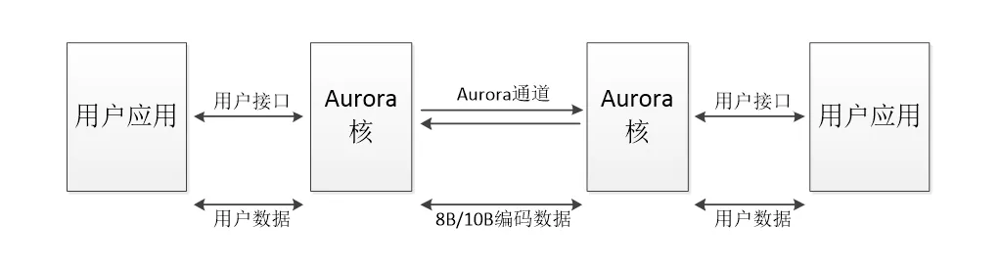
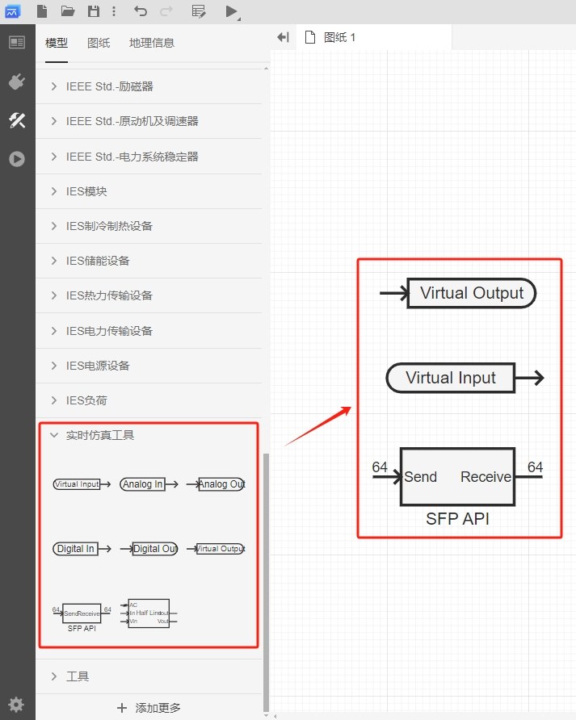
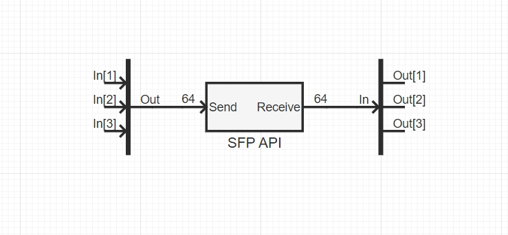
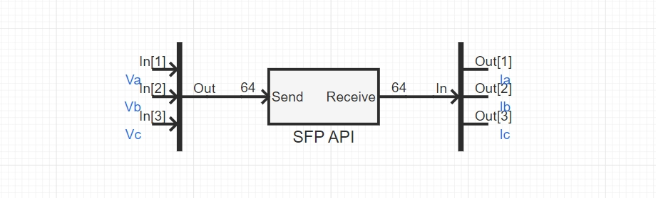
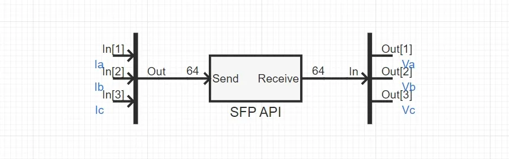
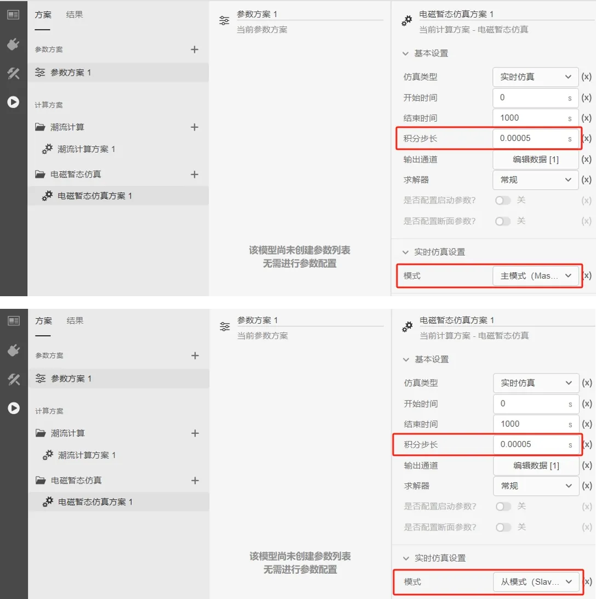
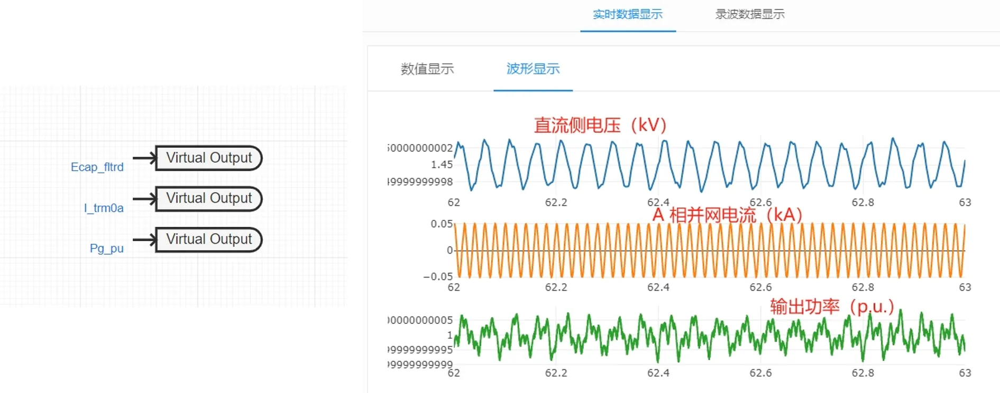

本文档主要介绍 CloudPSS EMTLab 在电磁暂态实时仿真中多机实时仿真的应用方法及案例。

## 功能定义
CloudPSS EMTLab 可通过两台或多台高性能实时仿真器 CloudPSS-RT 互联，实现仿真规模扩展的多机实时仿真应用。

## 功能说明
### 硬件平台

多机实时仿真需要仿真器与另一台或多台仿真器进行数据交互。一台 CloudPSS-RT 可配置 1 - 3 块 FPGA 通信/计算卡，每块 FPGA 通信/计算卡具备 2 - 4 个 SFP 光纤接口，通过这些 SFP 光纤接口，可实现与另一台或多台 CloudPSS-RT 的多机实时仿真。

CloudPSS-RT 的多机实时仿真硬件平台示意图如下所示。

### 通信协议

- **仿真器与上位机**

    多机实时仿真应用中，多台 CloudPSS-RT 通过以太网交换机组网，并与上位机通信。用户在上位机构建好模型后，通过 TCP/IP 协议将仿真任务下发至多台仿真器，并接收各仿真器传回的仿真结果。

- **仿真器与仿真器**
    
    多台 CloudPSS-RT 之间的数据交互通过 SFP 光纤接口实现，采用 Aurora 通信协议。Aurora 协议是 Xilinx 公司提供的一个开放、免费的链路层协议，可进行点对点的串行数据传输，具有高效、稳定和简单易用的特点。Aurora 协议允许器件之间通过多个通道绑定进行通信。单个通道可实现 750Mbit/s - 6.5Gbit/s的通信传输，多个通道的组合可实现几十 Gbit/s 甚至上百 Gbit/s 的通信传输。Aurora 协议的链路结构如下图所示。

    

    CloudPSS-RT 的 FPGA 通信/计算卡为多机实时仿真应用提供了一个 Aurora 协议，协议各参数如下表。

    | **参数项** | **协议内容** |
    | :------------: | :-----------: |
    | 帧格式 | 32 位 Float |    
    | 同步帧 | 1 通道，4 字节，0x12345678 |
    | 有效帧 | 64 通道，256 字节，用户自定义 |
    | 帧长度 | 共 65 通道，260 字节 |
    | 光口速率 | 5Gbps |
    | 解析方式 | 大端解析 |

### 主从式同步机制

为确保 SFP 光纤接口传输的数据正确、稳定、无丢包，CloudPSS-RT 的光纤通信采用主从式的同步机制。光纤两端的器件，一端作为主模式，按一定时间间隔（一般是仿真步长）发送数据；另一端作为从模式，按相同的时间间隔接收数据，并校验同步帧，默认同步帧之后的帧数据有效。

CloudPSS-RT 可在电磁暂态仿真方案中，设置实时仿真的类型后，选择设置为**主模式**或**从模式**，当选为主模式时，CloudPSS-RT 将会以设置的仿真积分步长为间隔，持续发送和接收数据，并且不会校验接收到的数据；当选为从模式时，CloudPSS-RT 将会以设置的仿真积分步长为间隔接收数据，并校验数据的同步帧，若同步帧匹配，则发送数据。以此实现光纤通信的时序同步和数据的正确、稳定交互。

CloudPSS-RT 的多机实时仿真应用中，选择一台 CloudPSS-RT 设置为**主模式**，作为主仿真器；另外一台或多台 CloudPSS-RT 设置为**从模式**，作为从仿真器，从仿真器将跟随主仿真器的同步信号。

### 软件接口

多机实时仿真的软件接口需使用 EMTLab **实时仿真工具库**中的**虚拟端口元件**和 **SFP 接口元件**。

- **虚拟端口元件**
       
    虚拟端口元件实现的是仿真器与上位机的数据交互，可在多机实时仿真过程中，通过以太网将仿真结果数据传输到上位机观测，也可以接收上位机下发的数据指令。使用方法可参考软件工具 [CloudPSS Signal Monitor](../../../../software-tools/20-signal-monitor/index.md) 文档。        
    
    

- **SFP 接口元件**

    SFP 接口元件实现的是仿真器与仿真器的数据交互，输入和输出引脚的维数均为 64，对应 CloudPSS-RT 内置 Aurora 协议的 64 通道有效帧，需配合**多路信号合并**和**多路信号分离**元件使用。协议中的同步帧 0x12345678 已隐藏在接口中作为帧头，无需用户设置。

    

## 案例
import Tabs from '@theme/Tabs';
import TabItem from '@theme/TabItem';

<Tabs>
<TabItem value="case1" label="风机并网的多机实时仿真">

采用两台 CloudPSS-RT 互联，实现风机并网的多机实时仿真应用。

- **构建多机实时仿真模型**
    
    分别在两台 CloudPSS-RT 中搭建区域电网模型和风机并网模型，将风机并网点作为多机实时仿真的接口位置。
    
    采用受控电压源与受控电流源等效的方式将风机与区域电网并网的电气连接线解耦，风机并网点的三相电压、三相电流作为多机实时仿真中需要交互的数据。示意图如下所示。

    
    
    在区域电网模型中，选取一条母线，量测母线的三相电压，并连接一个三相受控电流源。添加一个 **SFP 接口**元件、一个**多路信号合并**元件，以及一个**多路信号分离**元件，将三相电压量测值通过 SFP 接口元件输出，并通过 SFP 接口元件接收受控电流源的控制值。注意，多路信号合并元件的输出维数与多路信号分离元件的输入维数需要设置为 64。

    
    
    在风机并网模型中，风机经逆变器与变压器后，与三相受控电压源连接，量测并网点的三相电流。添加一个 **SFP 接口**元件、一个**多路信号合并**元件，以及一个**多路信号分离**元件，将三相电流量测值通过 SFP 接口元件输出，并通过 SFP 接口元件接收受控电压源的控制值。注意，多路信号合并元件的输出维数与多路信号分离元件的输入维数需要设置为 64。

    

- **实时仿真方案设置**

    分别在**运行**标签页配置两台 CloudPSS-RT 的电磁暂态实时仿真方案。

    仿真类型设为**实时仿真**，仿真结束时间设为 **1000s**，积分步长设为 **0.00005s**。
    
    区域电网模型的实时仿真模式设为**主模式**，风机并网模型的实时仿真模式设为**从模式**，实时仿真超时时间默认为 **10s**。

    

  
- **多机实时仿真启动时序**

    将两台 CloudPSS-RT 通过光纤连接。先启动设为从模式的风机并网模型，等待出现 **start success** 的提示后，在实时仿真超时时间（10s）内启动设为主模式的区域电网模型。

    

    :::warning
    出现 **start success** 的提示时，从仿真器已开始运行实时仿真，并等待接收主仿真器的数据与同步信号，若在设置的实时仿真超时时间内接收到同步帧，则通信成功建立，否则将报错 **time out**。
    :::
  

- **多机实时仿真结果**

    使用**虚拟输出端口**元件，在上位机观测多机实时仿真的结果。

    在风机并网模型中，添加三个虚拟输出端口元件，分别连接风机并网模型的直流侧电压、A 相并网电流以及风机的输出功率，使用软件工具 [CloudPSS Signal Monitor](../../../../software-tools/20-signal-monitor/index.md) 观测仿真结果如下图所示。

    

</TabItem>

<!-- <TabItem value="case2" label="多台 CloudPSS-RT 互联的实时仿真">

</TabItem> -->
</Tabs>

## 常见问题
多机实时仿真是否存在通信延迟，通信延迟对仿真结果是否有影响？

:   
    CloudPSS EMTLab 的多机实时仿真采用主从式的同步机制，从仿真器跟随主仿真器的同步信号保持数据交互同步，多个仿真器之间存在 1 个仿真积分步长的固定通信延迟。  
    
    若设置仿真积分步长为 20us，则多机实时仿真的通信延迟为 20us，仿真器接收到的数据为对侧仿真器在上一时步计算并输出的仿真结果。在 50Hz 的电网系统中，该通信延迟的影响可忽略不计。  

    若对通信延迟有更高的要求，CloudPSS 也可提供一个基于长传输线解耦的多机实时仿真方案，利用长传输线自身的延迟特性将通信延迟补偿，具体的实现方法可联系 CloudPSS 技术人员。

