本文档主要介绍电磁暂态实时仿真的原理和应用场景。为满足电磁暂态实时仿真对平台计算性能的要求，该功能需搭配硬件产品 [CloudPSS Mini (RT)](../../../hardware/10-desktop-type/10-cloudpss-mini/index.md) 或 [CloudPSS Pro (RT)](../../../hardware/20-rack-type/10-cloudpss-pro/index.md) 使用，公网平台暂不支持电磁暂态实时仿真。

## 功能定义
EMTLab 可凭借 CloudPSS 高性能实时仿真器和实时仿真内核，实现电磁暂态实时仿真功能。

## 功能说明
### 实时仿真原理
实时仿真，即仿真运行时间与真实物理装置运行时间相同的仿真，它是数字仿真技术、高性能计算技术发展的产物，不仅具有离线仿真的特点，还可通过并行处理、硬件加速等技术，具备实时的仿真计算及动态输入输出能力。

EMTLab 的电磁暂态仿真是对离散化系统的求解，离散时间即仿真步长。因此，对于电磁暂态实时仿真，就需要在每一个离散时间内，完成仿真模型的数据输入、系统求解以及数据输出，示意图如下。

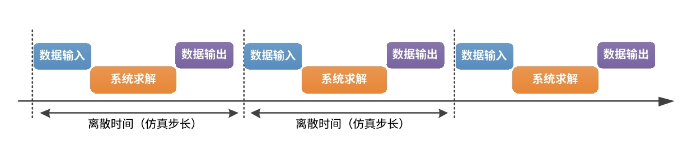

当系统模型较为复杂、规模较大时，系统求解的耗时就会增加，当在一个离散时间内无法完成模型的数据输入、系统求解和数据输出时，可能造成数据未及时输出或错误的数据被输出的**数据丢包**现象，而下一个离散时间内的系统求解将使用错误的数据导致结果发散，并引发连锁的**超时错误**。

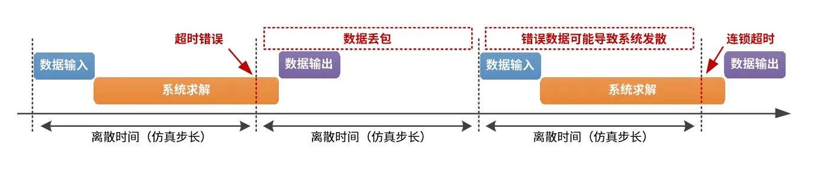

因此，电磁暂态实时仿真的规模依赖于平台的计算性能以及仿真步长。仿真步长越小，计算压力越大，则可实时仿真的系统规模越小。用户在使用电磁暂态实时仿真功能时，若发现系统模型不能满足实时要求，可选择放大仿真步长，或减小仿真规模，或改进模型以提升仿真计算效率。

### 实时仿真应用场景

电磁暂态实时仿真功能使仿真器具备了实时的数据输入输出能力。因此，在应用场景上，实时仿真总体可以分为与真实物理装置进行实时数据交互的**半实物硬件在环仿真**应用，和与其它仿真器进行实时数据交互的**仿真平台扩展**应用。

#### 半实物硬件在环仿真
  
半实物硬件在环仿真是指仿真器中的数字模型与真实物理装置进行实时信号交互的仿真。其中，根据所交互信号的类型，可分为**信号级**硬件在环和**功率级**硬件在环。在信号级硬件在环中，又根据物理装置的不同可分为**快速原型控制**和**控制器硬件在环**。它们的区别如下：

- 快速原型控制：电气系统为物理装置，控制系统为数字模型，交互的一般为模拟量、数字量的小电压信号。

- 控制器硬件在环：电气系统为数字模型，控制系统为物理装置，交互的一般为模拟量、数字量的小电压信号。

- 功率硬件在环：物理装置等被试系统与数字仿真系统之间需要交换真实的物理功率，通过物理接线交互电信号。

EMTLab 搭配高性能实时仿真器 CloudPSS-RT 和数模转换枢纽 CloudPSS I/O Signal Hub，可具备半实物硬件在环仿真的功能，详见**硬件在环仿真**标签卡。

#### 仿真平台扩展
  
仿真平台扩展应用可以包括系统规模上的扩展，以及平台功能上的扩展。

不同的仿真器或仿真平台间，可以通过实时数据交互实现仿真规模的扩展，突破单台实时仿真器计算性能的限制，解决大规模系统的实时仿真难题。

也可以充分利用两个仿真平台的功能特点和建模优势，通过实时数据交互的方式将运行在两个仿真平台的系统耦合，在保留各自关键模型特性的同时，大大减小建模的难度，发挥各自的仿真性能。

EMTLab 搭配高性能实时仿真器 CloudPSS-RT，通过定制的通信接口和通信协议，可实现两台或多台实时仿真器互联的多机实时仿真，详见**多机实时仿真**；也可以与第三方其它仿真平台实现联合仿真，详见**联合实时仿真**。

import DocCardList from '@theme/DocCardList';

<DocCardList />

### 实时仿真计算方案

EMTLab 中，电磁暂态离线仿真与实时仿真可共用同一套模型，仅需在仿真开始前，在工作台的**运行标签页**完成实时仿真计算方案的配置，即可实现电磁暂态实时仿真。

#### 基本设置
    
在工作台的**运行标签页**，选择或新建一个**电磁暂态仿真方案**，在基本设置中，设置仿真类型为**实时仿真**。

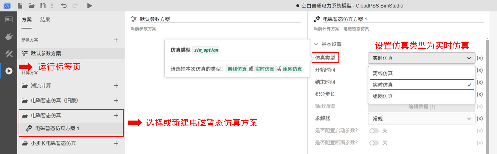

由于实时仿真的时间与真实物理时间同步，因此结束时间应设一个较大的值，以便在实时仿真过程中观测系统的输入输出和动态响应。例如，设为 **1000**。

实时仿真的积分步长，即对系统进行电磁暂态仿真求解的离散时间，积分步长越小，计算压力越大，则可实时仿真的系统规模越小。用户需根据系统规模选择一个合适的积分步长。

考虑到仿真器与其它设备的数据交互通信耗时，目前支持的最小实时仿真积分步长为 **20 us**。

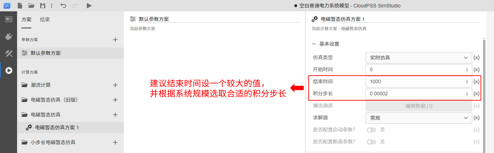

#### 实时仿真设置

当仿真类型设为实时仿真时，**实时仿真设置**的参数组将被启用，用户可设置实时仿真的模式、数值型输出通道、曲线型输出通道和超时时间。  

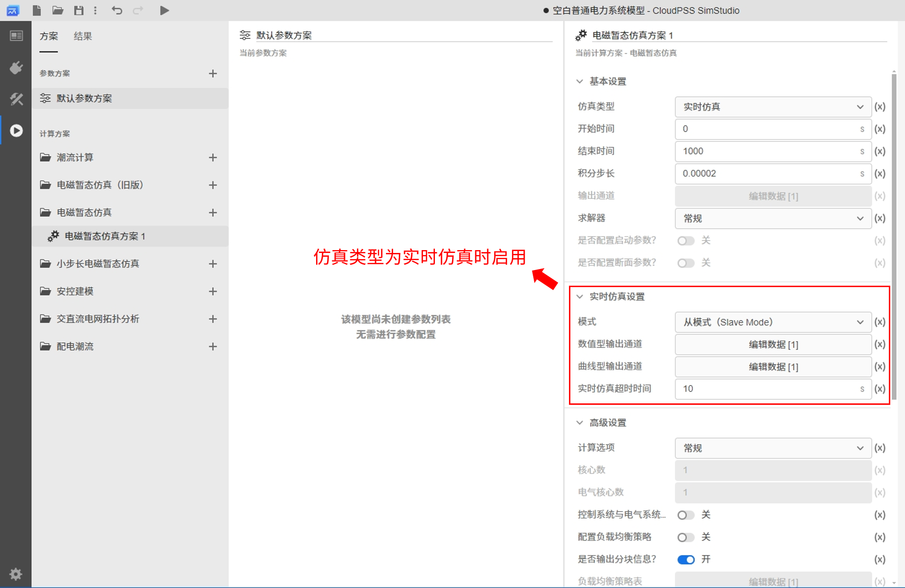

- **a. 模式**

    电磁暂态实时仿真具有两种模式，分别是**主模式（Master Mode）** 和**从模式（Slave Mode）**，区别在于是否需要 CloudPSS-RT 跟随同步信号。

    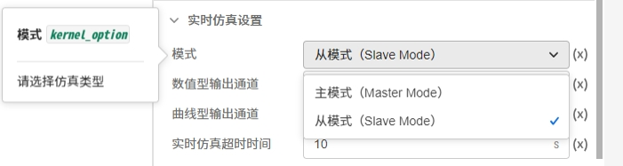

    - 当选为主模式时，CloudPSS-RT 将会以设置的仿真积分步长为间隔，持续发送和接收数据，并且不会校验接收到的数据。

    - 当选为从模式时，CloudPSS-RT 将会以设置的仿真积分步长为间隔接收数据，并校验数据的同步帧，若同步帧匹配，则发送数据。通过从模式下的同步帧校验，CloudPSS-RT 可以跟随其它仿真器或仿真平台的同步信号，实现时序同步，确保数据的正确、稳定交互。

- **b. 输出通道**

    仿真类型为实时仿真时，算例中的**输出通道**元件将被忽略，**基本设置**中的输出通道参数配置也将被禁用。需在算例中添加**虚拟输出端口**元件，与待观测信号相连。实时仿真的输出通道将与虚拟输出端口元件关联。

    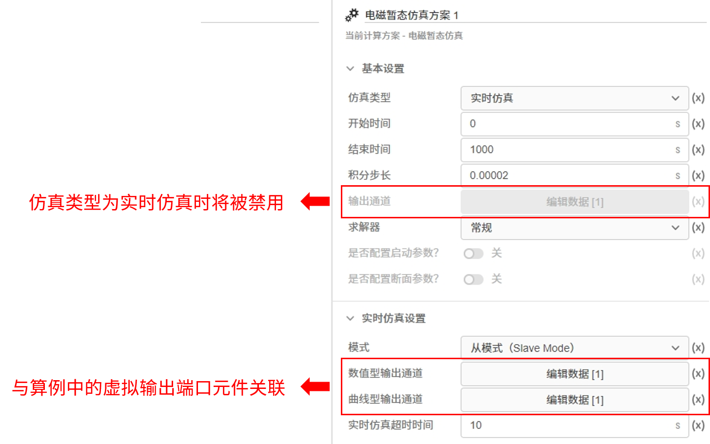    

    在实时仿真设置中，可配置数值型输出通道和曲线型输出通道。

    - 数值型输出通道：仿真结果将以数值的形式显示，可设置**分组名称**、**刷新频率**、**小数位数**，并选择待观测的**输出通道**。同一个分组中可选择多个输出通道。可添加多个分组。

    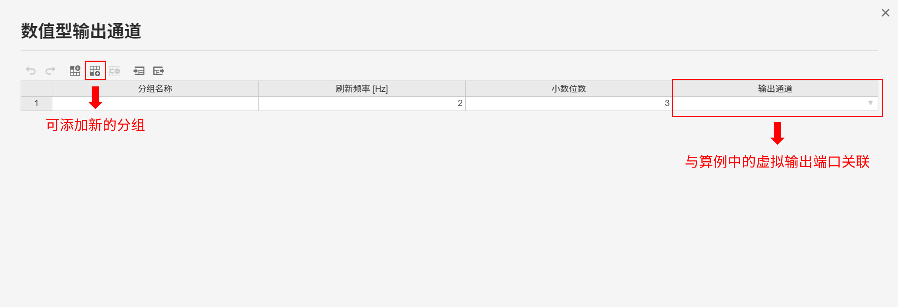    

    - 曲线型输出通道：仿真结果将以曲线的形式显示，可设置**分组名称**、**窗口类型**、**窗口宽度**，并选择待观测的**输出通道**。窗口类型可选择为**移动窗口**或**示波器窗口**，详见 [电磁暂态仿真计算-量测和输出系统-示波器窗口类型](../50-emts/30-meters-and-outputs/index.md#示波器窗口类型)。同一个分组中可选择多个输出通道。可添加多个分组。

    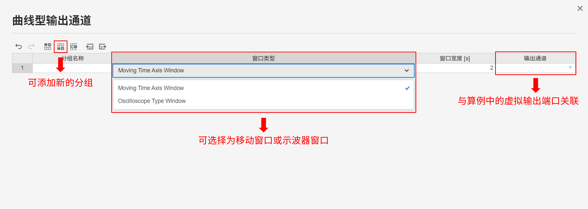    

- **c. 实时仿真超时时间**

    当实时仿真模式设置为**从模式**时，**实时仿真超时时间**参数将被启用，可设置判定通信是否超时的时间阈值。

    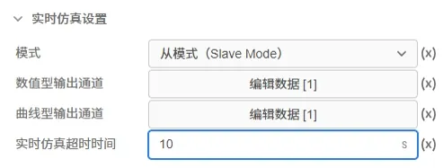

    - 主模式下，无需超时时间判定，该参数将被禁用。

    - 从模式下，若在设置的超时时间内，没有收到同步帧信号，则判定数据交互的通信没有成功建立，CloudPSS-RT 的实时仿真任务将自动终止。

    

## 常见问题

哪些平台可以用实时仿真功能？

:   
    电磁暂态实时仿真功能需搭配 CloudPSS-RT 实时仿真器使用，其半实物硬件在环应用需与数模转换枢纽 [CloudPSS I/O Signal Hub](../../../hardware/10-desktop-type/20-cloudpss-io-signal-hub/index.md) 配合实现。

    公网平台暂不支持电磁暂态实时仿真功能。

哪些模型可以进行实时仿真？

:
    CloudPSS EMTLab 提供离线仿真与实时仿真一体化的模型构建平台，实时仿真与离线仿真采用同一套模型，无需添加实时化模块进行特殊处理。但仍需添加实时仿真的接口用于与其它设备或平台数据交互。

    实时仿真对算例规模与仿真积分步长有一定要求，用户需确保模型满足实时仿真的效率要求。

如何判断仿真是否达到实时？

:   
    可对算例进行离线仿真判断是否达到实时。  

    例如，设置离线仿真结束时间为 10s，启动任务运行仿真，在仿真结束后会出现仿真计算实际耗时的报文提示，若仿真计算耗时小于设置的仿真结束时间，则可认为本次仿真达到实时。
    

    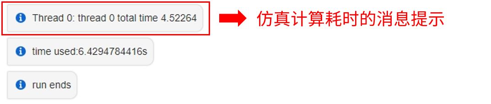

如何观测实时仿真结果？

:   
    在实时仿真中，离线仿真的输出通道将失效。需在算例中添加**虚拟输出端口**元件，与待观测信号相连，并在**实时仿真设置**中配置数值型输出通道或曲线型输出通道。  
    
    也可通过软件工具 [CloudPSS Signal Monitor](../../../software-tools/20-signal-monitor/index.md) 观测实时仿真结果。

仿真运行报错："start failed"

:   
    请检查对应的计算服务器是否含实时仿真内核，电磁暂态实时仿真功能需搭配 CloudPSS-RT 实时仿真器使用。  

    若 CloudPSS-RT 仿真器搭载的平台运行实时仿真报此错误，请联系 CloudPSS 技术人员。
    

仿真运行报错："time out"

:   
    此报错原因为**数据交互超时**，请检查 CloudPSS-RT 的通信模块是否正常工作（背面板通信板卡指示灯应常量），检查与 CloudPSS-RT 通信的设备是否正常工作、硬件连接是否正常。  

    若与 CloudPSS-RT 通信的设备需要编译、下载等启动环节，可适当放宽等待时间。在**运行标签页**的电磁暂态仿真方案栏，设置**实时仿真超时时间**为一个更大的值。