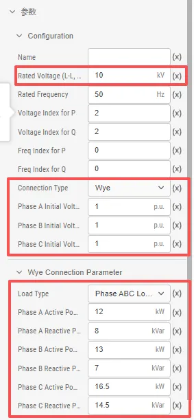

本文档介绍进行三相不平衡潮流计算的基本要求，以及三相不平衡潮流计算方案的参数配置。

## 功能定义
EMTLab 提供的三相不平衡潮流计算方案设置功能。

## 功能说明

### 三相不平衡潮流计算基本要求
要使用 EMTLab 提供的三相不平衡潮流计算功能，需要搭建满足要求的算例。本小节介绍 EMTLab 支持三相不平衡潮流计算的元件和潮流计算前所需的元件设置。

#### 支持三相不平衡潮流计算的设备元件
目前，三相不平衡潮流计算功能支持的设备元件包含**配电网传输线**、**配电网交流电压源**、**配电网静态负荷**、**配电网双绕组变压器**和**配电网并联电容/电抗器**，更多元件支持将在后续版本中逐步加入。

三相不平衡潮流计算功能是围绕着**配电网母线**进行的。因此，上述设备元件中，单电气端口的元件只有当其电气端口与母线直接相连时，才会被计入；对于多电气端口的元件，则其每一个电气端口都必须与母线直接相连。特别地，电流表可以串入电路中，在潮流计算过程中将被忽略。

:::tip 三相不平衡潮流计算的注意事项
- 每条母线至多连接一个交流电压源，未连接电源的母线将作为 PQ 节点参与计算。
- 潮流计算中暂不考虑静态负载的功率特性。
:::
#### 元件的相关设置
进行三相不平衡潮流计算前，需要对元件的初值和节点类型进行设置。

**单电气端口**的元件三相不平衡潮流计算的相关设置如下所示：

import Tabs from '@theme/Tabs';
import TabItem from '@theme/TabItem';

<Tabs>
<TabItem value="component1" label="配电网母线">
配电网母线需要设置的参数值如下图所示，具体的参数说明可见表格：

| 参数名称 | 单位 | 备注 | 说明 |
| :--- | :--- | :--- | :--- |
| Phase A Voltage | p.u. | A相电压幅值 | A相初始电压，潮流回写时，将A相电压迭代值写回该参数 |
| Phase A Voltage Angle | Deg | A相电压相位 | A相初始电压相位，潮流回写时，将A相电压相位迭代值写回该参数 |
| Phase B Voltage | p.u. | B相电压幅值 | B相初始电压，潮流回写时，将B相电压迭代值写回该参数 |
| Phase B Voltage Angle | Deg | B相电压相位 | B相初始电压相位，潮流回写时，将B相电压相位迭代值写回该参数 |
| Phase C Voltage | p.u. | C相电压幅值 | C相初始电压，潮流回写时，将C相电压迭代值写回该参数 |
| Phase C Voltage Angle | Deg | C相电压相位 | C相初始电压相位，潮流回写时，将C相电压相位迭代值写回该参数 |
| Base Voltage (L-L, RMS) | kV | 母线电压基值 | 用于在潮流计算过程中将参与计算的母线电压数据转换为标幺值 |
| Rated Frequency | Hz | 母线的额定频率 | 潮流计算要求相连的母线必须采用相同频率 |
</TabItem>

<TabItem value="component2" label="配电网静态负载">
配电网静态负载需要设置的参数值如下图所示，具体的参数说明可见表格：

| 参数名称 | 单位 | 备注 | 说明 |
| :--- | :--- | :--- | :--- |
| Rated Voltage (L-L, RMS) | kV | 标称负载线电压有效值 | 用于在潮流计算后将初始电压幅值数据转换为标幺值 |
| ConnectionType |  | 负载接线方式| | 可选择为星形(Y)或三角形(Delta) |
| Phase A Initial Voltage | p.u. | A相初始电压幅值，由潮流计算决定 | 潮流计算后迭代的节点A相电压有名值会换算为标幺值，潮流回写时修改该参数 |
| Phase B Initial Voltage | p.u. | B相初始电压幅值，由潮流计算决定 | 潮流计算后迭代的节点B相电压有名值会换算为标幺值，潮流回写时修改该参数 |
| Phase C Initial Voltage | p.u. | C相初始电压幅值，由潮流计算决定 | 潮流计算后迭代的节点C相电压有名值会换算为标幺值，潮流回写时修改该参数 |
| LoadType |  | 负荷类型 | 可以选择为A相、B相、C相、AB相负载等 |
| Phase A Active Power | kW | A相有功功率 | 潮流计算时节点A相消耗有功功率 |
| Phase A Reactive Power | kVar | A相无功功率，感性负荷为正 | 潮流计算时节点A相消耗无功功率 |
| Phase B Active Power | kW | B相有功功率 | 潮流计算时节点B相消耗有功功率 |
| Phase B Reactive Power | kVar | B相无功功率，感性负荷为正 | 潮流计算时节点B相消耗无功功率 |
| Phase C Active Power | kW | C相有功功率 | 潮流计算时节点C相消耗有功功率 |
| Phase C Reactive Power | kVar | C相无功功率，感性负荷为正 | 潮流计算时节点C相消耗无功功率 |

</TabItem>
<TabItem value="component3" label="配电网交流电压源">
配电网交流电压源需要设置的参数值如下图所示，具体的参数说明可见表格：

| 参数名称 | 单位 | 备注 | 说明 |
| :--- | :--- | :--- | :--- |
| Generator Type |  | 电压源类型 | 可选择为A相、B相、C相、AB相交流电压源等 |
| Bus Type |  | 节点类型 | 潮流计算时指定电源所在母线的节点类型，可选择 **PQ Bus**，**PV Bus** 或 **Slack Bus** |
| Phase A Injected Active Power | kW | 节点A相注入有功功率 | 潮流计算时 **PV**、**PQ** 节点的A相注入有功功率 |
| Phase B Injected Active Power | kW | 节点B相注入有功功率 | 潮流计算时 **PV**、**PQ** 节点的B相注入有功功率 |
| Phase C Injected Active Power | kW | 节点C相注入有功功率 | 潮流计算时 **PV**、**PQ** 节点的C相注入有功功率 |
| Phase A Injected Reactive Power | kVar | 节点A相注入无功功率 | 潮流计算时 **PV**、**PQ** 节点的A相注入无功功率 |
| Phase B Injected Reactive Power | kVar | 节点B相注入无功功率 | 潮流计算时 **PV**、**PQ** 节点的B相注入无功功率 |
| Phase C Injected Reactive Power | kVar | 节点C相注入无功功率 | 潮流计算时 **PV**、**PQ** 节点的C相注入无功功率 |
| Lower Voltage Limit | p.u. | 母线电压下限 | 由节点的电压基准值转换为有名值，决定 **PQ** 节点电压下界，越界后该节点由无功约束转为电压约束 |
| Upper Voltage Limit | p.u. | 母线电压上限 | 由节点的电压基准值转换为有名值，决定 **PQ** 节点电压上界，越界后该节点由无功约束转为电压约束 |
| Phase A Bus Voltage Magnitude | p.u. | 母线A相电压幅值 | 由节点的A相电压基准值转换为有名值 |
| Phase B Bus Voltage Magnitude | p.u. | 母线B相电压幅值 | 由节点的B相电压基准值转换为有名值 |
| Phase C Bus Voltage Magnitude | p.u. | 母线C相电压幅值 | 由节点的C相电压基准值转换为有名值 |
| Lower Reactive Power Limit| MVar | 无功功率下限 | **PV** 节点和**平衡节点**的注入无功下界，越界后该节点由电压约束转为无功约束 |
| Upper Reactive Power Limit| MVar | 无功功率上限 | **PV** 节点和**平衡节点**的注入无功上界，越界后该节点由电压约束转为无功约束 |
| Phase A Bus Voltage Angle | Deg | 母线A相电压相位 | **平衡节点**的A相相角 |
| Phase B Bus Voltage Angle | Deg | 母线B相电压相位 | **平衡节点**的B相相角 |
| Phase C Bus Voltage Angle | Deg | 母线C相电压相位 | **平衡节点**的C相相角 |

</TabItem>

<TabItem value="component4" label="配电网并联电容/电抗器">
配电网并联电容/电抗器需要设置的参数值如下图所示，具体的参数说明可见表格：

| 参数名称 | 单位 | 备注 | 说明 |
| :--- | :--- | :--- | :--- |
| ConnectionType |  | 电容/电抗器接线方式 | | 可选择为星形(Y)或三角形(Delta) |
| ShuntType |  | 电容/电抗器类型 | | 可选择为A相、B相、C相、AB相电容/电抗器等 |
| Phase A Input Capacity | kVar | A相投入容量 | | 与电压一起决定潮流计算时的A相对地电纳 |
| Phase A Rated Voltage | kV |    A相额定电压有效值 | | 与容量一起决定潮流计算时的A相对地电纳 |
| Phase B Input Capacity | kVar | B相投入容量 | | 与电压一起决定潮流计算时的B相对地电纳 |
| Phase B Rated Voltage | kV |    B相额定电压有效值 | | 与容量一起决定潮流计算时的B相对地电纳 |
| Phase C Input Capacity | kVar | C相投入容量 | | 与电压一起决定潮流计算时的C相对地电纳 |
| Phase C Rated Voltage | kV |    C相额定电压有效值 | | 与容量一起决定潮流计算时的C相对地电纳 |

</TabItem>

</Tabs>

-----------------
**多电气端口**的元件潮流计算的相关设置如下所示：

<Tabs>
<TabItem value="component1" label="配电网传输线">
配电网传输线需要设置的参数值如下图所示，具体的参数说明可见表格：

| 参数名称 | 单位 | 备注 | 说明 |
| :--- | :--- | :--- | :--- |
| Length of Line | km | 线路长度 | 用于计算传输线总电阻 R、总电抗 X 和总对地电纳 B |
| Parameter Format |  | 参数输入方式，可选择标幺值或有名值 | 计算传输线总电阻 R、总电抗 X 和总对地电纳 B 时，标幺值会根据额定电压和额定容量转换为有名值 |
| Phase or Sequence component input |  | 相分量或序分量输入 | 序分量输入方式只适用于三相传输线 |
| Line Type |  | 线路类型 | 可选择为A相、B相、C相、AB相线路 |
| Raa: Phase A Self Resistance | Ω/km | 单位长度A相自电阻 | 用于计算传输线总电阻 R |
| Rba: Phase B-A Mutual Resistance | Ω/km | 单位长度A-B相互电阻 | 用于计算传输线总电阻 R |
| Rca: Phase C-A Mutual Resistance | Ω/km | 单位长度A-C相互电阻| 用于计算传输线总电阻 R |
| Xaa: Phase A Self Reactance | Ω/km | 单位长度A相自电抗 | 用于计算传输线总电抗 X |
| Xba: Phase B-A Mutual Reactance | Ω/km | 单位长度AB相互电抗 | 用于计算传输线总电抗 X |
| Xca: Phase C-A Mutual Reactance | Ω/km | 单位长度A-C相互电阻| 用于计算传输线总电抗 X |
| Caa: Phase A Self Cap. Reactance | MΩ*km | 单位长度A相自容抗 | 用于计算传输线总对地电纳 B |
| Cba: Phase B-A Mutual Cap. Reactance | MΩ*km | 单位长度A-B相互容抗 | 用于计算传输线总对地电纳 B |
| Cca: Phase C-A Mutual Cap. Reactance | MΩ*km | 单位长度A-C相互容抗| 用于计算传输线总对地电纳 B |

</TabItem>

<TabItem value="component2" label="配电网双绕组变压器">
配电网双绕组变压器需要设置的参数值如下图所示，具体的参数说明可见表格：

| 参数名称 | 单位 | 备注 | 说明 |
| :--- | :--- | :--- | :--- |
| Rated Power | MVA	 | 变压器每侧绕组的额定容量 | 用于标幺值转换为有名值 |
| Winding #1 Rated Voltage (L-L, RMS) | kV | 绕组 #1 额定线电压有效值 | 用于标幺值转换为有名值和计算变压器变比 |
| Winding #2 Rated Voltage (L-L, RMS) | kV | 绕组 #2 额定线电压有效值 | 用于计算变压器变比 |
| Winding #1 Type |  | 绕组 #1 连接类型为星形(Y)或三角形(Delta) | 用于计算潮流中的移相角度 |
| Winding #2 Type |  | 绕组 #2 连接类型为星形(Y)或三角形(Delta) | 用于计算潮流中的移相角度 |
| Delta Lags or Leads Y |  | Delta绕组连接方式 | 选择 Delta 连接绕组电压超前或滞后 Y 连接绕组电压 30°，仅当有绕组为三角形连接时有效，用于计算潮流中的移相角度 |
| Positive Sequence Leakage Reactance | p.u. | 正序漏电抗 | 用于计算潮流中的线路电抗 |
| Positive Sequence Leakage Resistance | p.u. | 正序漏电阻 | 用于计算潮流中的线路电阻 |
| Tap Changer |  | 选择变压器分接头位置（无 / 绕组 1 / 绕组 2）| 用于计算变压器变比 |
| Initial Tap Ratio |  | 填写变压器初始的分接头档位下的标幺值变比| 用于计算变压器变比 |
| Transformer Type  |  | 双绕组变压器类型| 可以选择为A相、B相、C相、AB相变压器 |

</TabItem>

</Tabs>

### 潮流计算方案的参数设置
选择**运行标签页**，新建**配电网三相不平衡潮流计算**计算方案，选中新建的计算方案，即可对三相不平衡潮流计算方案进行配置。以下对三相不平衡潮流计算的设置参数进行说明。

<Tabs>
<TabItem value="set1" label="初始设置">
初始设置参数说明如下：

| 参数名 | 含义 | 说明 |
| :--- | :--- | :--- | 
| 使用母线电压幅值 | 母线电压幅值的启用开关 | 开启后，使用母线电压幅值作为潮流初值；不开启时，母线电压幅值默认为 1 p.u. |
| 使用母线电压相角 | 母线电压相角的启用开关 | 开启后，使用母线电压相角作为潮流初值，不开启时，母线电压相角默认为 0 Deg |
</TabItem>

<TabItem value="set2" label="求解设置">
求解设置参数说明如下：

| 参数名 | 含义 | 说明 |
| :--- | :--- | :--- | 
| 最大迭代次数 | 潮流计算的最大迭代次数 | 设置潮流计算的最大迭代次数 |
</TabItem>

<TabItem value="set3" label="运行设置">
运行设置参数说明如下：

| 参数名 | 含义 | 说明 |
| :--- | :--- | :--- | 
| 任务队列 | 任务运行使用的队列 | 默认设置为**默认队列** |
| 计算资源 | 任务运行使用的计算资源 | 默认设置为 **1 逻辑核心** |
| 优先级 | 任务运行的优先级 | 默认值为 0，即最低优先级 |
| 调试参数 | 任务调试时使用的调试参数 | 默认为空 |
</TabItem>
</Tabs>

## 常见问题
怎么导出 EMTLab 的潮流计算的结果

:
    潮流计算的结果页面会展示 `Buses` 和 `Branches` 两个潮流数据表格，鼠标悬浮在表格上时，表格的右上角会出现导出数据按钮，点击按钮可将表格中的数据导出为 CSV 格式。

    

潮流计算方案的参数设置有哪些是必选项

:
    潮流计算方案的参数设置没有必选的选项，但为了潮流结果更好的收敛，建议开启初值设置。