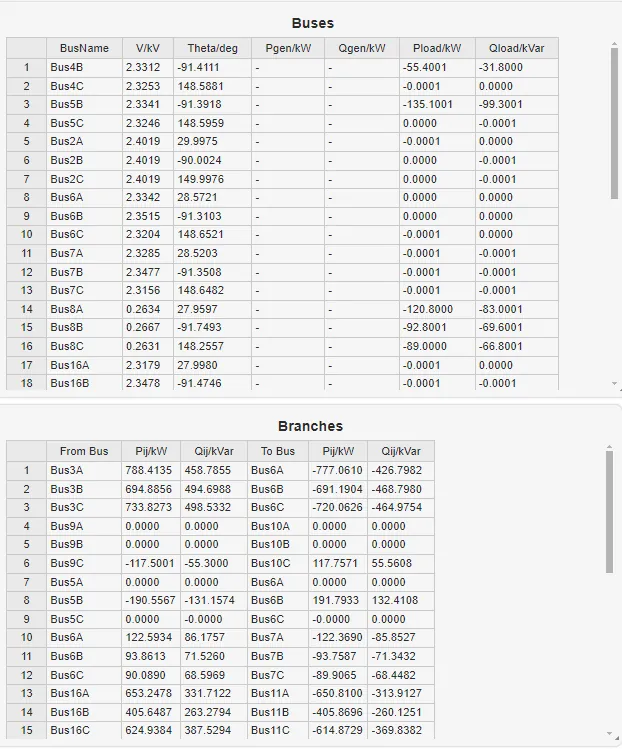
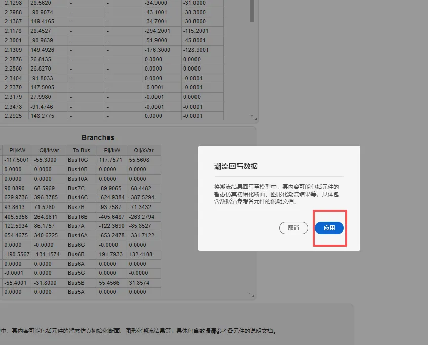
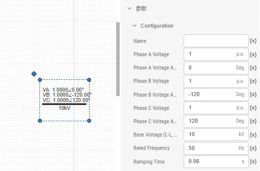
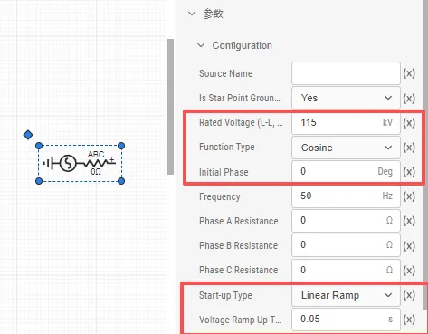
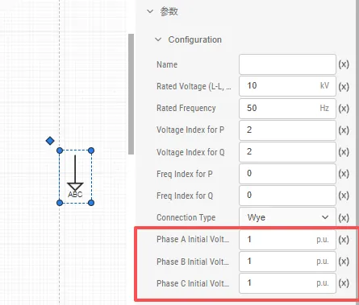

本文档介绍 EMTLab 的三相不平衡潮流结果写回及初始化的详细内容，以及从给定三相不平衡潮流断面直接启动需配置的参数。

## 功能定义
EMTLab 的三相不平衡潮流结果写回及初始化功能。

## 功能说明
### 潮流数据说明
运行三相不平衡潮流计算后，结果页面会展示 `Buses` 和 `Branches` 两个潮流数据表格，以下分别对这两个表格的参数进行说明：

import Tabs from '@theme/Tabs';
import TabItem from '@theme/TabItem';

<Tabs>
<TabItem value="case1" label="Buses">
`Buses` 表格中的参数说明如下：

| 参数名 | 单位 | 说明 |
| :--- | :--- | :--- | 
| BusName |  | 母线名及相序信息 |
| $ V $ | kV | 母线各相的电压有效值 |
| $ Theta $ | Deg | 母线各相的电压相角 |
| $ P_{gen} $ | kw | 电压源注入各相有功功率 |
| $ Q_{gen} $ | kVar | 电压源注入各相无功功率 |
| $ P_{load} $ | kw | 恒功率负载注入各相有功功率 |
| $ Q_{load} $ | kVar | 恒功率负载注入各相无功功率 |

</TabItem>

<TabItem value="case2" label="Branches">
`Branches` 表格中的参数说明如下：

| 参数名 | 单位 | 说明 |
| :--- | :--- | :--- | 
| From Bus |  | 支路的起始各相母线 |
|  $ P_{ij} $ | kW | From Bus 各相流出的有功功率 |
|  $ Q_{ij} $ | kVar | From bus 各相流出的无功功率 |
| To Bus |  | 支路的终止各相母线 |
|  $ P_{ji} $ | kW | To bus 流出的各相有功功率 |
|  $ Q_{ji} $ | kVar | To bus 流出的各相无功功率 |

</TabItem>
</Tabs>

### 潮流断面写回
运行三相不平衡潮流计算后，点击**潮流回写数据**选项框下的**修改项目文件**按钮，弹出的确认框中点击**应用**，将潮流计算得到的结果回写到支持潮流计算的元件参数组中。

### 潮流断面启动
EMTLab 的电磁暂态仿真中电气系统的启动主要包含两种方式：斜坡启动与从潮流断面直接启动，本文主要介绍从潮流断面直接启动。

<Tabs>
<TabItem value="case1" label="从给定潮流断面直接启动">
从潮流断面的启动方式则利用潮流断面数据直接从稳态启动。该方法可指定潮流断面，且启动耗时短，效率高。这种启动方式有四个使用前提要求：

:::info 稳态潮流初始化前提要求
1. 全部设备元件的端口必须与母线元件直接相连（或通过分线器与母线相连）。
2. 参与潮流计算的系统拓扑和参数应与电磁暂态仿真算例一致，以保证潮流断面可用。
3. **配电网母线**、**配电网交流电压源**、**配电网静态负荷**的启动参数需要与潮流计算结果一致，否则仿真无法达到稳态甚至出现错误。
4. 需要在运行标签页下启用 **计算方案 - 电磁暂态方案 - 启动参数 - 预启动流程**
:::

使用从给定潮流断面直接启动功能前，需要运行一次**三相不平衡潮流计算**，并将**三相不平衡潮流数据回写**，然后对元件进行相应的配置，以下为元件的设置说明：

#### 配电网母线
配电网母线的 `Configuration` 参数组中，额定频率填入`Rated Frequency [Hz]`；`Ramping Time (s)` 一项可留空；`Phase A Voltage Magnitude [p.u.]` 、 `Phase A Voltage Angle [Deg]`，`Phase B Voltage Magnitude [p.u.]` 、 `Phase B Voltage Angle [Deg]`等在**潮流数据回写**后自动填入；潮流计算所用的线电压基值填入`Bus Voltage (L-L, RMS) [kV]`。

#### 配电网交流电压源
配电网交流电压源的 `Configuration` 参数组中，`Function Type` 需设置为 `Cosine`；`Initial Phase [Deg]`、和`Rated Voltage (L-L, RMS) [kV]`在**潮流数据回写**后自动填入；启动方式 `Start-up Type` 选择`Linear Ramp`，`Voltage Ramp Up Time [s]` 设置为 0。

#### 配电网静态负荷
配电网静态负荷的 `Configuration` 参数组中；`Phase A Initial Voltage [p.u.]`、`Phase B Initial Voltage [p.u.]`和`Phase C Initial Voltage [p.u.]`在**潮流数据回写**后自动填入。

</TabItem>
</Tabs>

## 常见问题
启动参数有什么作用，开启后相关参数如何设置

:
    开启启动参数和预启动流程并进行参数设置，可从给定潮流断面直接启动电磁暂态仿真。具体操作步骤如下：

    - 点击**运行标签页**，选择**电磁暂态仿真**计算方案，开启**是否配置启动参数**，在启动参数设置中开启**预启动流程**。
    - **电压爬升时间**应根据交流系统的频率来确定，通常为 3 个工频周波，用于启动系统中的非线性元件。典型值：50Hz 系统选择 0.06s，60Hz 系统选择 0.05s。填入更大的爬升时间，启动效果更稳定，但相应耗时变长。
    - **最大启动时间**应填入大于等于电压爬升时间的数值（典型值与电压爬升时间相等）。最大启动时间即启动过程中单个非线性元件的最长启动时间，该数值越大，启动效果更稳定，但相应耗时变长。

    
为什么出现了电磁暂态仿真结果和潮流计算结果不一致

:
    - 如果算例中有含有**配电网交流电压源**，在潮流回写数据后，需要将三相交流电压源的 `Configuration` 参数组中的`Function Type` 设置为 `Cosine`，否则会因为相角问题导致电磁暂态仿真与潮流计算的结果不一致。
