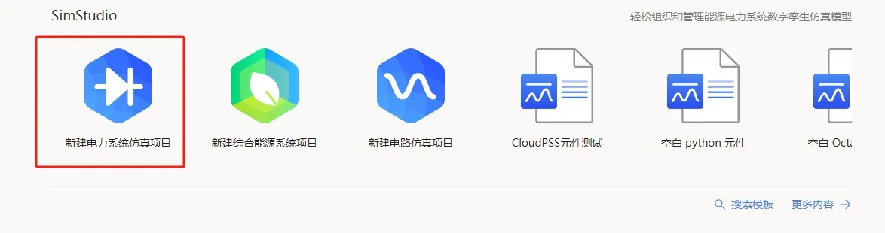
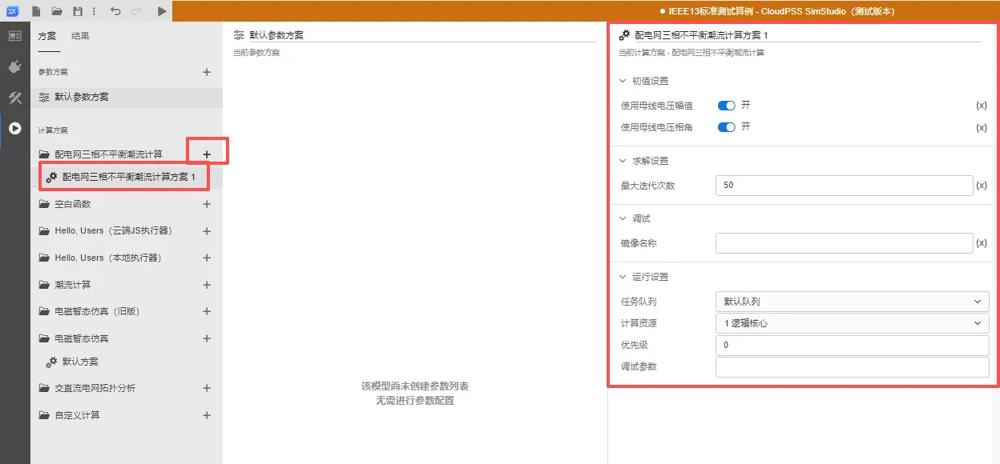
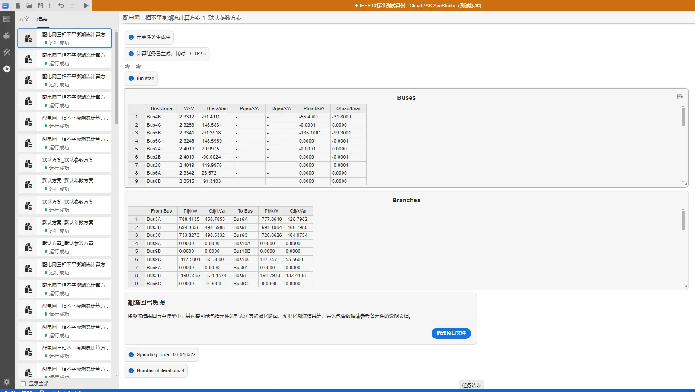
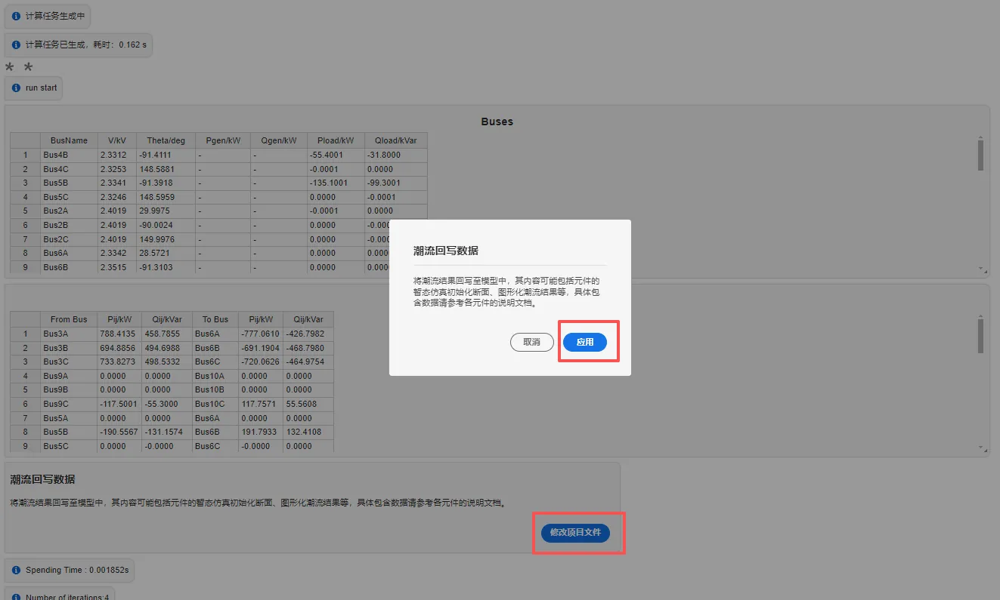
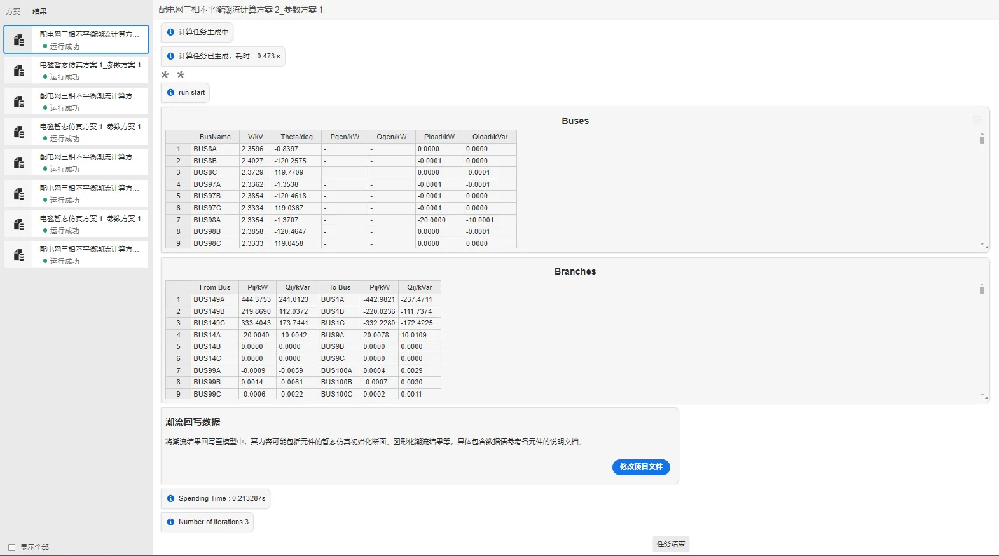
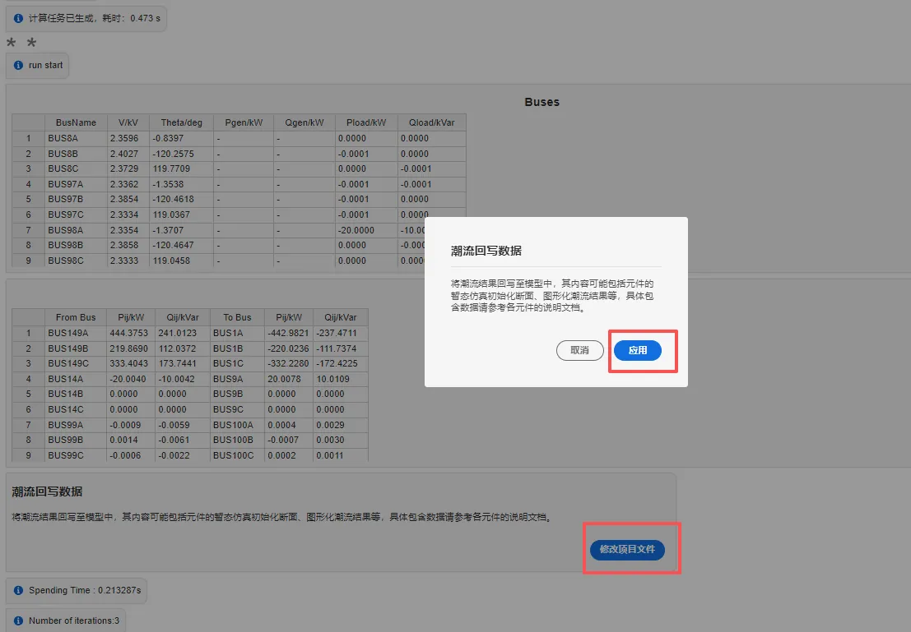

import Tabs from '@theme/Tabs';
import TabItem from '@theme/TabItem';

<Tabs>
<TabItem value="case1" label="IEEE-13系统三相不平衡潮流计算">
本案例使用 IEEE 13 节点算例，演示潮流计算的基本使用方法。

- 在 SimStudio 工作台，点击新建电力系统仿真项目。  

- 点击左上角的新建图标，选中 IEEE 标准系统，选择 IEEE-13 节点标准测试系统，最后点击新建。

- 模板中已经对元件的三相不平衡潮流相关初始值参数进行了设置，比如配电网交流电压源的 `Power Flow Data` 参数配置如下：

| Generator type | Bus Type | Phase A Bus Voltage Magnitude [p.u.] | Phase B Bus Voltage Magnitude [p.u.] |  Phase C Bus Voltage Magnitude [p.u.] |Phase A Bus Voltage Angle [Deg] |Phase B Bus Voltage Angle [Deg] |Phase C Bus Voltage Angle [Deg] |
| :--- | :-: | --: | ----: | -: | -: |-: |-: |
| Phase ABC Generator | Slack Bus | 1.0001 | 1.0001 |1.0001 | 30  | -90 |150 |

- 点击运行标签页，新建配电网三相不平衡潮流仿真计算方案，选中并开始设置仿真方案：将**初值设置**开启，**最大迭代次数**为 50；**运行设置**使用默认队列，1虚拟核心的计算资源，优先级为 0，调试参数为空。

- 点击左上角的运行按钮，在结果页面会显示三相不平衡潮流计算结果相关的表格。

- 点击**潮流回写数据**选项框下的**修改项目文件**按钮，弹出的确认框中点击**应用**，将潮流计算得到的结果回写到支持潮流计算的元件参数组中。

</TabItem>

<TabItem value="case2" label="IEEE 123节点系统潮流计算">
本案例使用 IEEE 123 节点算例，并演示三相不平衡潮流计算的基本使用方法。

IEEE 123 节点算例由1台交流电压源，110条配网传输线，110条母线及65台配网负荷组成。

- 点击左上角的新建图标，选中 IEEE 标准系统，再选择 IEEE 123 节点标准测试系统，最后点击新建。

- 对于潮流计算，模板中已经对元件的潮流相关初始值参数进行了设置，比如配电网交流电压源的 `Power Flow Data` 参数配置如下：

| Generator type | Bus Type | Phase A Bus Voltage Magnitude [p.u.] | Phase B Bus Voltage Magnitude [p.u.] |  Phase C Bus Voltage Magnitude [p.u.] |Phase A Bus Voltage Angle [Deg] |Phase B Bus Voltage Angle [Deg] |Phase C Bus Voltage Angle [Deg] |
| :--- | :-: | --: | ----: | -: | -: |-: |-: |
| Phase ABC Generator | Slack Bus | 1 | 1|  1 | 0  | -120 |120 |

- 点击运行标签页，新建配电网三相不平衡潮流仿真计算方案，选中并开始设置仿真方案：将**初值设置**开启，**最大迭代次数**为 50；**运行设置**使用默认队列，1虚拟核心的计算资源，优先级为 0，调试参数为空。

- 点击左上角的运行按钮，在结果页面会显示三相不平衡潮流计算结果相关的表格。

- 点击**潮流回写数据**选项框下的**修改项目文件**按钮，弹出的确认框中点击**应用**，将潮流计算得到的结果回写到支持潮流计算的元件参数组中。

</TabItem>
</Tabs>
