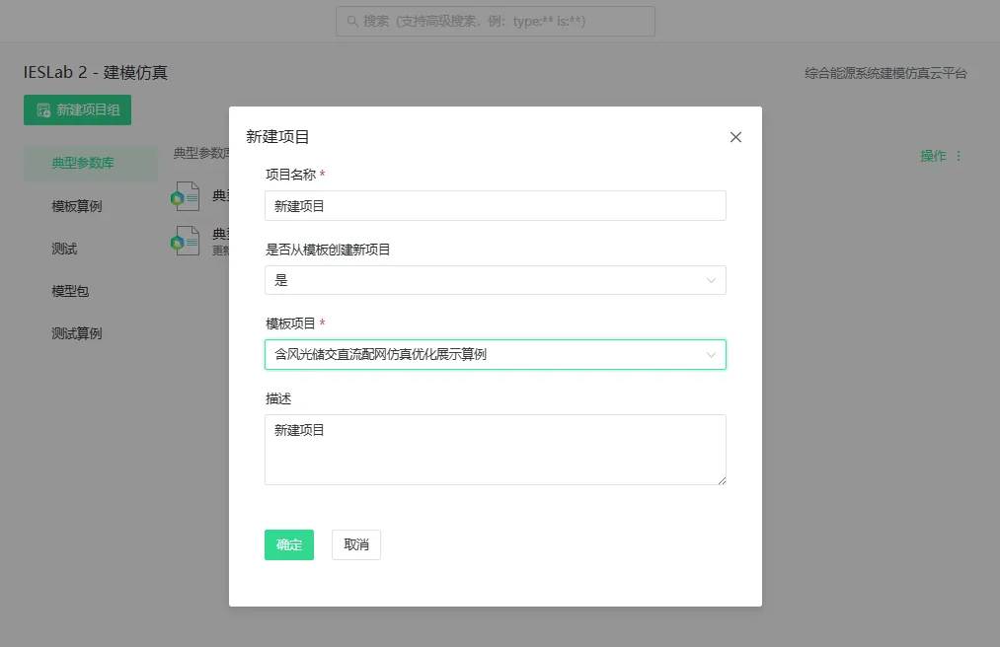
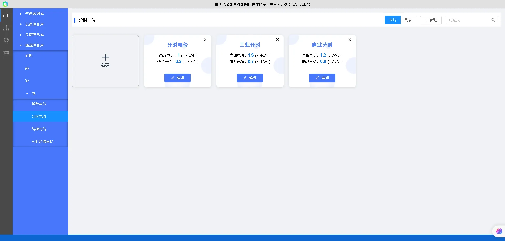
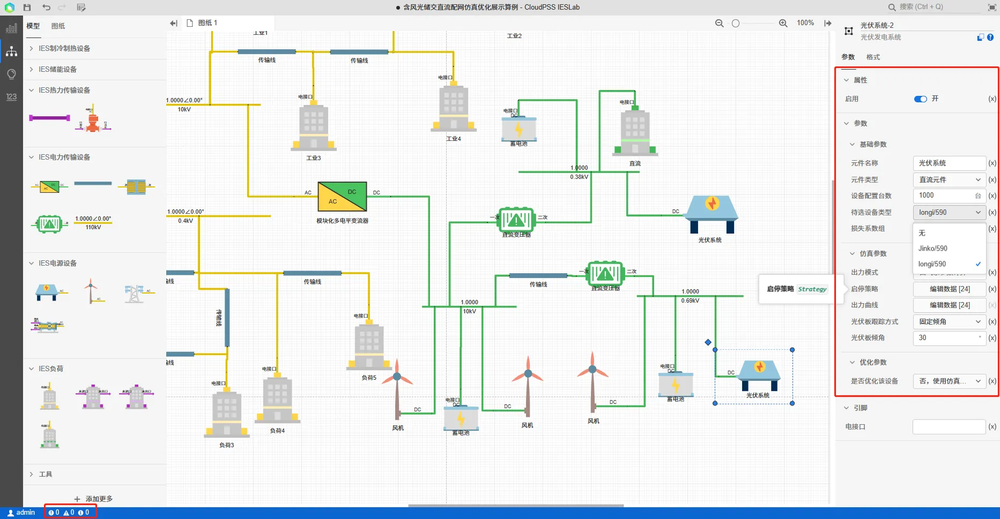
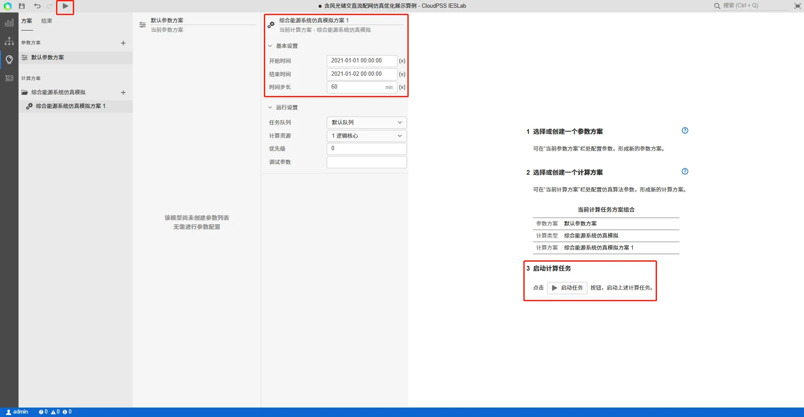

本节以**含风光储交直流配网仿真项目**为例，介绍IESLab 建模仿真平台的主要使用流程。

## 平台使用步骤

建议您按照以下步骤使用 CloudPSS IESLab 建模仿真平台：

 1.	注册并登录 CloudPSS 平台，进入 IESLab  建模仿真平台
 2.	建立项目并打开
 3.	数据管理模块：在气象数据库、设备信息库、负荷信息库和能源信息库录入项目基础信息
 4.	拓扑编辑模块：将元件拖拽并连接，搭建能源系统拓扑，并设置仿真参数等边界条件
 5.	开始计算：仿真模拟
 6.	查看、导出及分析计算结果

## 新建与打开

### 新建项目组

点击**新建项目组**，输入项目组名称及描述，**是否从已有项目组导入**选择**否**，创建一个空白项目组。

### 从模板创建新项目

点击项目组右侧的**操作**，选择**新建项目**。

在弹出的**新建项目**对话框中，输入项目名称及描述，**是否从模板创建新项目**选择**是**，选择**含风光储交直流配网仿真项目**。

### 打开项目

通过点击项目所在行打开项目，此外也可以通过点击文件夹按钮或点击**更多**打开项目

## 数据管理模块

打开项目后，首先进入数据管理模块，可在该模块输入项目资料和相关参数信息。

### 气象数据

模板算例已经预置项目地点及该地点的历史气象数据，如果需要修改可以通过在第三方地图组件上输入项目地 GPS 经纬度坐标、城市搜索、地图选点定位等方式选择项目地点，然后点击**载入气象数据**按钮获取历史气象数据。关于历史气象数据的查看和二次编辑可以参考[气象数据库](../40-data-module/10-meteorological-database/index.md)。

### 设备信息库

模板算例已经预置了包含风机、光伏、电池、MMC等典型设备型号及参数信息，用户也可以根据需要自行添加新的设备。关于设备信息库的编辑方法可以参考[设备信息库](../40-data-module/20-device-database/index.md)。

### 负荷信息库

模板算例已经预置了电负荷信息，用户也可以根据需要自行添加新的电负荷。关于负荷信息库的编辑方法可以参考[负荷信息库](../40-data-module/20-device-database/index.md)。

### 能源信息库

模板算例已经预置了销售电价和市电电价的信息，以及市电购电的等效污染物信息，用户也可以根据需要自行添加新的能源价格参数。关于能源信息库的编辑方法可以参考[能源信息库](../40-data-module/40-energy-info-database/index.md)。

## 拓扑编辑模块

在左侧导航栏中，切换到**拓扑编辑**模块，本模板算例已经在工作区中搭建了系统拓扑模型并设置好了相关元件参数。用户可以根据需要对拓扑模型或者参数进行修改，相关编辑方法可以参考[拓扑编辑模块](../50-topology-module/index.md)。

## 仿真模拟模块

在完成拓扑构建和参数编辑后，切换到**仿真模拟**模块，在**方案**页面设定仿真计算方案的参数，并点击**启动任务**启动计算。

计算开始后，平台自动跳转到**结果**栏页面，可在**结果概览**页面查看计算过程及相关统计指标

在**元件运行结果**页面，选择设备及参数，检查分析计算结果。

## 项目文件下载

点击下载项目 zip 文件：[含风光储交直流配网仿真项目](../../20-simulation-suite/80-typical-cases/30-ac-dc-hybrid-distribution-system-with-renewables/ac-dc-hybrid-distribution-system-with-renewables.zip)  

项目 zip 文件可以通过**云空间**的项目**导入与导出**功能进行上传，可参考[云空间-导入与导出](../30-cloud-space/index.md#导入与导出)