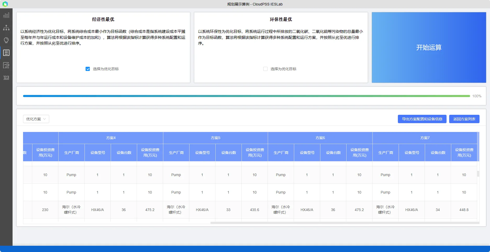

本文主要介绍了综合能源系统园区规划优化展示项目的项目背景、项目搭建设置、结果分析方法。

## 项目描述

**园区型综合能源**：作为最常见应用最广泛的综合能源系统，一般通过建设分布式新能源、储能系统和冷热系统，通过优化运行控制，实现系统能效提升，帮助用户实现节能、增效、降本。

**背景**：**多能耦合、协同互补**的综合能源系统是未来多能源利用的方向，涵盖了各种形式和特点的多能源，目前将供气系统、供热系统与电力系统等集成的综合能源园区因应用广泛发展迅速，既实现电力、燃气、供热等一体化多能互补，又实现源网荷储全环节高度协调与灵活互动、集中化与分布式相互结合。以某典型园区型综合光储能源园区为例，搭建开展综合能源系统模型，进行设备**选型容量配置规划设计**，以及系统**运行优化**。

**项目简介**：项目是一个典型的园区型综合能源系统，拟通过建设综合智慧园区实现“降碳、降耗、降费、舒适”的目标。该综合能源园区包括供冷、供热、供电以及新能源交直流发电几部分，拟在住宅楼办公楼宇等屋顶安装屋顶光伏，园区安装小型风力发电机，由于市电执行分时电价，拟建设储能系统，对储能电站进行选型容量配置及运行优化，利用峰谷电价差提高经济收益，随着电动车的大力发展，拟建设电动车充放电站等。

**能源站**：为满足日常供冷供热的需求，拟建设分布式能源站，能源站通过多能互补进行“**制热、制冷、储能**”实现一举三得，提高能源利用率，实现节能减排。能源站中，由空气源热泵机组供热，由热水驱动型溴化锂吸收式制冷机组和压缩式制冷机联合供冷，各供能机组均选用高能效比 COP 的机组，代替常见的电热锅炉、燃气锅炉等低能效高排放设备。

**园区设备**：电源设备有：外部电源、光伏组件、风机；储能设备包含蓄电池；主要负荷包括电负荷、冷水负荷、热水负荷，其冷热源设备包括：电压缩制冷机、吸收式制冷机、空气源热泵；输变电系统设备包括 MMC、母线、传输线和变压器等。

*模型拓扑结构图如下：*

### 边界条件

*气象数据*

气象数据主要用于计算风机光伏等新能源设备出力。

*柔性负荷*

柔性负荷是指可通过主动参与电网运行控制，能够与电网进行能量**互动**，具有**柔性特征**的负荷。这类负荷的调度和调节是**缓解供需侧矛盾**的重要手段之一，其柔性调节能力改变了原本负荷单向、被动接受调节的历史，也使负荷参数的刚性、不确定性等特征发生了变化。柔性负荷具有很大的灵活性，可以依据市场电价灵活调整各类负荷，实现**削峰填谷**，改善负荷曲线等优势。

*热负荷*

### 约束条件

**吸收式制冷系统**

制冷剂液态在蒸发器中吸热蒸发，所形成的蒸气被吸收剂所吸收，在此之后，吸收了制冷剂蒸气的吸收剂由溶液泵送至发生器，在发生器中被加热，而分离出制冷剂蒸气，该蒸气在冷凝器中被冷凝成液体，再经节流后进入蒸发器。

在本项目种，吸收式制冷系统运行在**定功率**模式，供热系统的需求由热泵供给，供冷系统的需求由压缩式制冷供给。对于**无需选型定容**的设备，需绑定具体的设备型号及配置台数；对于**无需优化出力**的设备，需在优化参数处，选择**否，使用仿真策略**，并录入具体的仿真策略曲线。

**热泵**

热泵是一种将低温热源的热能转移到高温热源的装置，从而达到制热和制冷的目的。根据外界热源的不同，热泵可以分为空气源热泵，水源热泵，地源热泵等。对于不同的热泵，都是通过消耗电能提供热能。

### 典型场景

本项目较为复杂，为减少优化庞大的计算量，选择在月度典型场景上进行规划优化。

### 优化目标

本项目选用经济性为优化目标。

## 结果分析

该园区原采用传统的供能方案，由电热锅炉等供能，首先利用平台对园区进行了全年的运行仿真模拟，计算园区的能耗做为基准；然后利用平台对改造方案进行规划设计、运行优化和详细评估，对比各方案的主要指标，分析项目可行性。

主要结论有：

>1. 相比电热水锅炉、燃气锅炉等低能效高排放设备，自建高能效比的热泵能源站，通过**能量梯级利用和储能系统协**同配合，大幅提升了能源利用率。

>2. 相比传统方式设定的仿真策略，规划的供能方案设备冗余较少，节省了投资；运行优化后，典型场景的设备基本运行在高能效的高载荷状态。而传统供热主要依赖于燃气锅炉，优化后则采用能效比高的热泵，利用能量梯级利用和储能系统协同。提升效率，大幅降低了燃料购置费用；另外，畜电池利用**峰谷电价**差进行调峰，也带来了经济收益。

>3. 综上，综合能源能效高，灵活性好，大幅降低碳排放，助力实现**双碳目标**