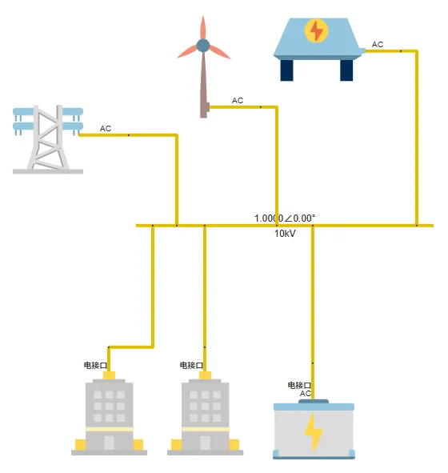
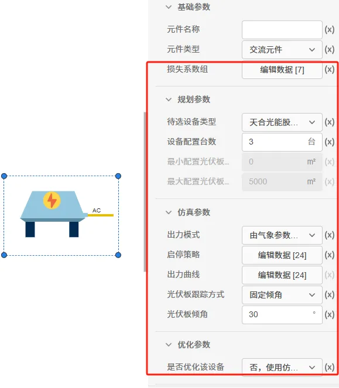
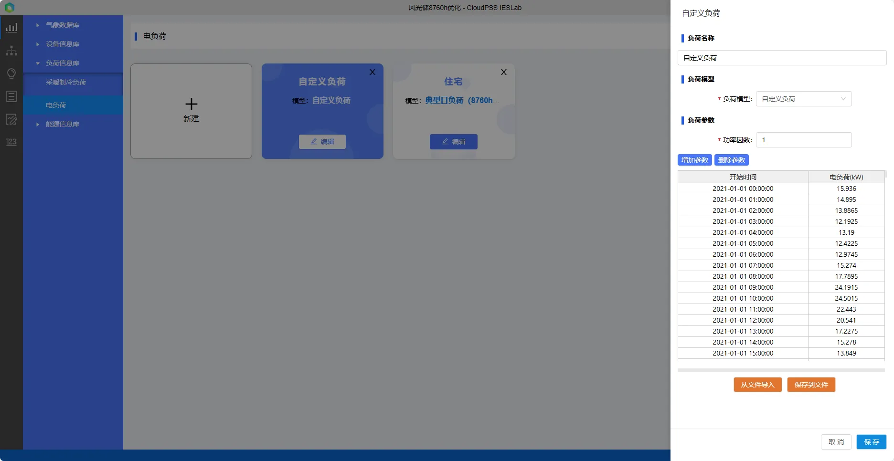

本文主要介绍了风光储综合能源系统 8760h 规划优化项目的项目背景、项目搭建设置、结果分析方法。

## 项目描述

选取某风光储综合能源项目为例，项目集成了风力发电、光伏发电和储能系统，通过风力、光伏和储能等多种能源的组合，实现多元化能源供应，提高能源利用效率和可靠性，是一种清洁、可再生的能源项目，能够减少对化石燃料的依赖，降低碳排放和环境污染。由于风光新能源的随机性、波动性和间歇性会对电网的稳定性和供能质量带来不好的影响，一般风机光伏项目会配备了相应的储能设施，以平滑风能和太阳能的缺点，并确保电力供应的稳定性和可靠性。

本案例的风机光伏均已配置好，储能系统需要选择合适的型号，进行**容量配置**规划，并在针对全年运行场景进行**8760h 优化**出力，使得方案的**经济性成本最低**。

*模型拓扑结构图如下：*

### 模型参数及边界条件

1. 载入气象参数
2. 输入设备参数
3. 输入电负荷参数
4. 绑定风光设备并配置台数

光伏配置参数：

系统负荷主要为纯电负荷：

*电负荷：*

### 储能约束条件

*储能*

### 8760h 运行场景

## 结果分析：

储能选型定容及运行优化结果：

方案评估结果

通过分析储能的规划优化结果可知，本案例中，储能配置较少，主要在夜间低电价时充电，白天高电价时放电，以提升项目经济收益。若储能配置较多，则能够在风光发电剩余时充电，提升新能源消纳率。

