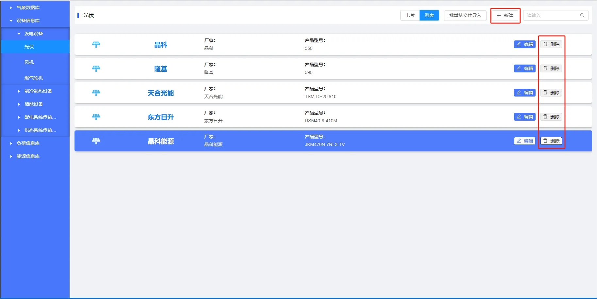
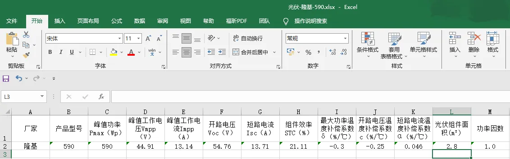

本节主要介绍设备信息库的设备参数录入、编辑、导入及导出等功能使用方法，并通过常见问题答疑快速熟悉设备信息库的基本使用方法。

## 功能定义

用户可以将设备参数录入到**设备信息库**中进行管理，录入后可在**拓扑编辑模块**选择对应设备并自动关联该设备所对应的参数。
平台设备模型均为**稳态模型**，支持建立**多挡位**的变工况设备模型，以更好地模拟设备启停及复杂运行工况。

### 设备模型

平台设备主要分为发电设备、制冷制热设备、储能设备、配电系统传输设备和供热系统传输设备，共5类：

+ **发电设备**有光伏、风机、燃气轮机；
+ **制冷制热设备**有热泵、燃气锅炉、热管式太阳能集热器、电压缩制冷机、吸收式制冷机；
+ **储能设备**蓄电池、蓄冰空调、储水罐；
+ **配电系统传输设备**有变压器、传输线、模块化多电平换流器MMC；
+ **供热系统传输设备**有离心泵和管道；

### 设备模型说明

平台设备模型均包含主要主辅机设备，以下是设备的相关主辅机说明：

**发电设备**  
1. 风机：主要包含风力发电机组（轮毂、叶片、塔架、控制系统等）、整流器（变流器）、变压器、外送线路等；
2. 光伏系统：主要包含光伏组件、支架、跟踪系统、汇流箱、逆变器、变压器、外送线路等；
3. 燃气轮机为 CHP (combined heat and power) 机组：包含压气机（compressor）、燃烧室（combustor）、燃气透平（turbine）、余热锅炉、供热水系统和冷却系统等，其输入为燃料，输出为电能和热能（热水）；

**制冷制热设备**  
燃气锅炉、热泵、热管式太阳能集热器、电压缩制冷机、吸收式制冷机的工质均为水，其辅机主要有：燃料系统、控制系统、循环水系统、冷却水系统等；

**储能设备**  
蓄电池系统主要包含：蓄电池组、电池管理系统（BMS）、能量管理系统（EMS）、储能变流器（PCS）以及其他电气设备等；

### 设备参数

设备需要录入的参数主要包括厂家型号基础信息、额定运行参数、设备运行约束和设备经济性参数。设备模型详见 [元件库](../../90-component-library/index.md) 厂家型号基础信息如下：

| 参数名 | 键值 (key) | 单位 | 备注 | 类型 | 描述 |
| :--- | :--- | :--- | :--: | :--- | :--- |
| 生产厂商 | `manufacturer` |  | 生产厂商 | 文本 | 生产厂商 |
| 设备型号 | `equipType` |  | 设备型号 | 文本 | 设备型号 |

#### 设备经济性参数

:::tip
在 IESLab 仿真规划平台数据管理模块的设备信息库中，各类设备均需要录入设备经济性参数，以计算项目经济性指标，其中，每年设备的运维成本 = 固定运维成本 + 可变运维成本 × 年用电量
:::

| 参数名 | 键值 (key) | 单位 | 备注 | 类型 | 描述 |
| :--- | :--- | :--- | :--: | :--- | :--- |
| 采购成本 | `PurchaseCost` | 万元/台 | 采购成本 | 实数 | 设备采购成本 |
| 固定运维成本 | `FixedOMCost` | 万元/年 | 固定运维成本 | 实数 | 设备固定运维成本 |
| 可变运维成本 | `VariableOMCost` | 元/kWh | 可变运维成本 | 实数 | 设备可变运维成本 |

## 功能说明

### 设备管理

#### 新建与删除

打开设备信息库并选择设备类型及种类后，进入设备管理页面，设备显示模式默认为**卡片**模式。点击卡片**新建**或右上方的**新建**快捷键，会自动创建一个新的设备卡片，初始化设备的各项参数并弹出编辑区域，默认值可以不用修改即可使用，点击左侧空白阴影处可以隐藏编辑区域；也可修改设备参数，并点击**保存**。
点击卡片右上角的“**×**”，可以删除此设备。

切换到**列表**模式时，需点击右上方的**新建**快捷键进行新建操作。点击设备项目右侧的**删除**，可以删除此设备。

#### 设备搜索与筛选

在页面右上方的**搜索输入框**，在输入框中输入厂家、型号等任意关键字，点击放大镜**🔍**或回车确定，即可进行模糊搜索或筛选（关键字不区分大小写）。清空输入框后，点击放大镜**🔍**或回车确定可显示所有设备。

### 设备参数编辑

在卡片模式下，点击设备所在的卡片或**编辑**；在列表模式下设备所在的行或**编辑**，即可编辑设备参数信息。修改成功后，点击**保存**完成修改并保存；点击**取消**放弃修改。若修改后点击非编辑区域的左侧空白阴影区域，则会弹出告警框，可选择**保存**、**不保存**或**返回**编辑区域。当用户未修改参数，左侧空白阴影区域则会隐藏编辑区域。

#### 导出与导入
在编辑区域下方有**从文件导入**、**保存到文件**和**从典型库导入**快捷键，当展示内容较多时，可使用鼠标滚轮向下滑动或选中编辑区域右侧的滑块下拉即可看到。

点击**保存到文件**会将该设备相关参数另存为 excel 文件，文件格式如下所示：

点击**从文件导入**将会弹出文件选择框，选择相应类别及种类的设备参数 excel 文件后，平台将会自动校验文件格式，若格式无误会覆盖原设备参数；若格式有误将会提示**表格格式不正确！**用户可以先**保存到文件**，参照导出文件的格式进行修改，再进行**从文件导入**。

#### 从典型库导入
点击编辑区域下方的**从典型库导入**快捷键，在弹出的**典型库**选择框中，选择厂商和型号后会自动显示设备参数信息，点击**确定**后，在弹出的**加载典型库**框中选择**确定**，将会**覆盖**当前设备参数，点击编辑区域下方的**保存**完成典型库导入。

## 案例

import Tabs from '@theme/Tabs';
import TabItem from '@theme/TabItem';

<Tabs>
<TabItem value="js" label="案例1">

以电源设备的**光伏系统**为例，说明设备信息库的用法。

1. 点击“新建”后，输入**厂家和产品型号**名称。

2. 录入设备额定参数  
录入最关键的**设备额定运行参数**，额定参数作为设备模型最重要的参数，参与设备出力计算，直接影响设备的性能及系统运行。您可以联系厂家提供相关参数。
对于光伏系统来说，主要参数有：  
   - 峰值功率 $P_{max}$（$\mathrm{Wp}$） 
   - 峰值工作电压 $V_{mpp}$（$\mathrm{V}$）  
   - 峰值工作电流 $I_{mpp}$（$\mathrm{A}$）  
   - 开路电压 $V_{oc}$（$\mathrm{V}$） 
   - 短路电流 $I_{sc}$（$\mathrm{A}$）  
   - 组件效率 $STC$（$\mathrm{\%}$）  
   - 开路电压温度补偿系数 $c$（$\mathrm{\%/^{\circ}C}$） 
   - 短路电流温度补偿系数 $α$（$\mathrm{\%/^{\circ}C}$）  

根据设备参数和具体的工况参数，就可以计算光伏系统的理想出力了。

3. 保存

</TabItem>
<TabItem value="py" label="案例2">

以**传输线**为例，说明从典型库导入设备的方法。

1. 点击**新建**，创建新的设备卡片。

2. 从典型库导入
   参数编辑区域右下角选择**从典型库导入**，在弹出框中选择**厂家和型号**，检查参数无误后点击**确定**，覆盖当前设备参数。
   

3. 保存
</TabItem>
</Tabs>

## 常见问题

能否支持暂态模型？  

: 对于综合能源系统来说，其热力系统的**稳态过程较长**，达到准稳态的时间尺度为分钟级，一般约 15-60min，因此平台主要聚焦**综合能源稳态过程**，设备处主要关注**能量流的变化和转换**过程，设备模型为**稳态变工况**模型，可通过运行在不同挡位来模拟能量转换的动态过程。

能否支持常见的控制模型？  

: 平台暂无控制系统及控制元件，其仿真策略等边界条件为常量，需用户录入，无法实现元件仿真模拟过程中运行策略的自动控制。暂无开关、阀门等实体控制元件，无 P、I、D、非线性控制等过程控制函数。

能否支持流程过程模型？  

: 平台基于综合能源稳态能量流仿真内核设计，并不关心能量生产的工艺过程、流动流程和能量转换过程，无分离器、反应器、冷却塔等流程过程组件。

能否修改平台模型及自定义元件模型？  

: IESLab平台暂不支持修改元件设备模型，自定义元件功能仍在开发中，敬请期待。

    若平台提供的模型无法满足您的需求，您目前可以利用平台的数据管理模块、拓扑编辑模块和 **IESLab SDK**, 自行编写元件模型和能量流求解器进行仿真计算，平台主要做数据录入和系统展示等基础功能。
    
能否修改典型库？  

: CloudPSS IESLab 官网的典型库不支持修改，对于服务器版本，管理员账户可以修改典型库，修改后该服务器下所有用户即可导入。

设备经济性参数有什么用？

: 设备经济性参数主要用来计算项目经济指标，采购成本用来计算项目投资，固定运维成本和可变运维成本用来计算项目运营费用。