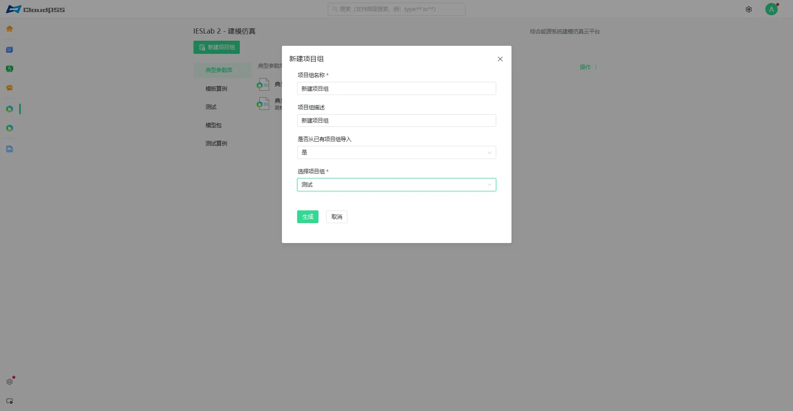
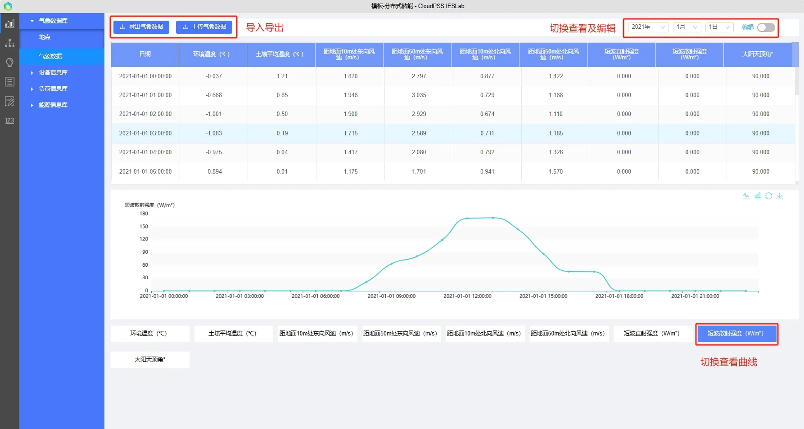
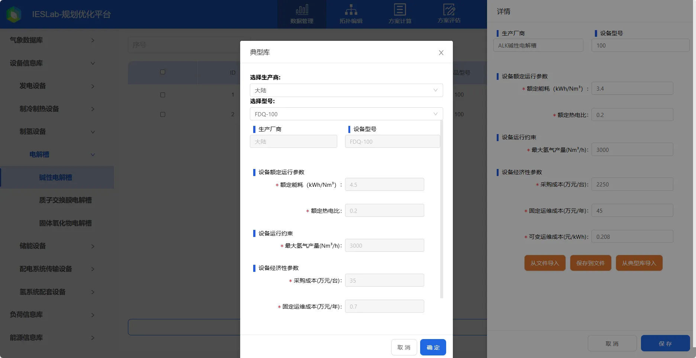
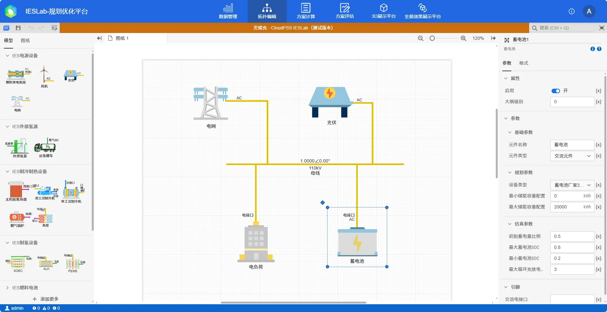
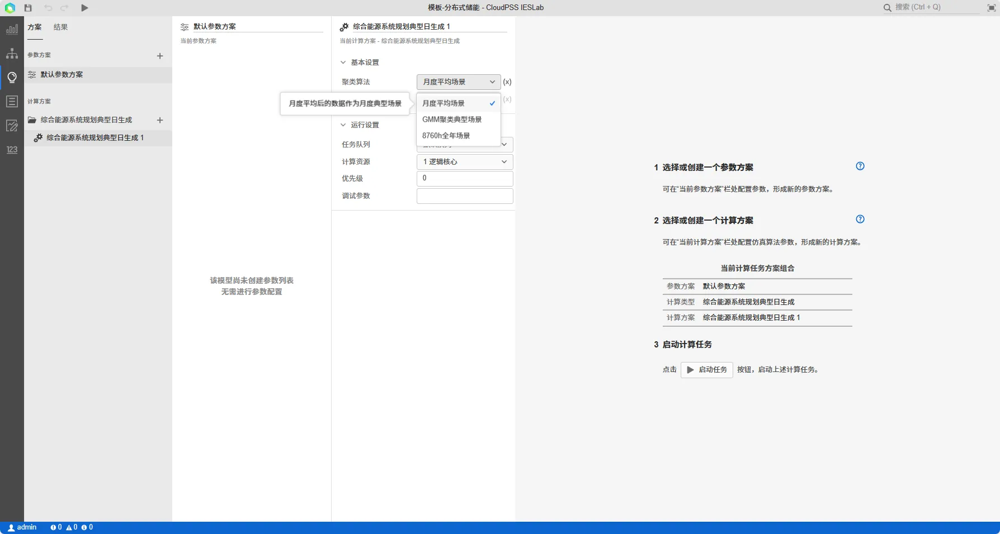
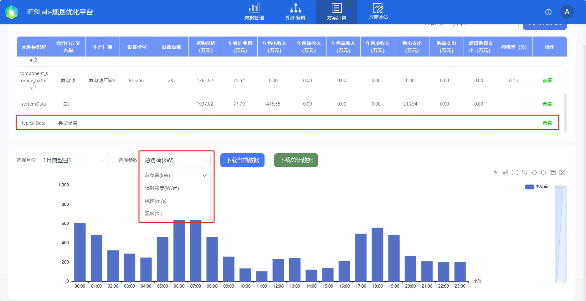
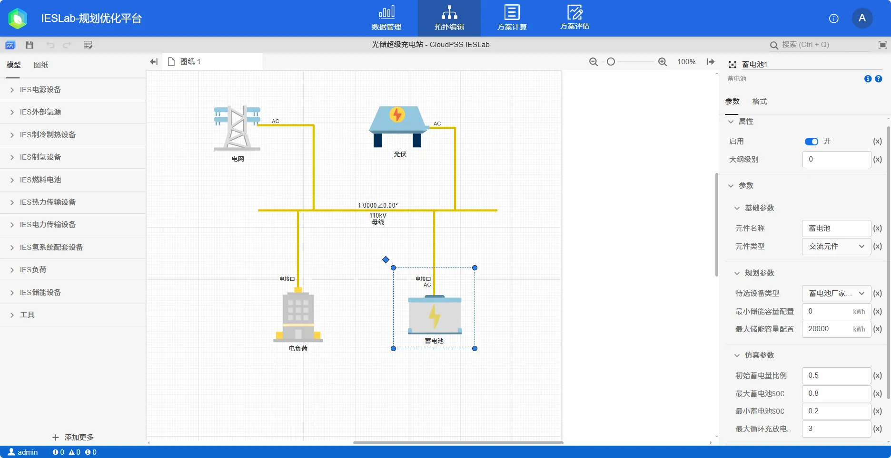
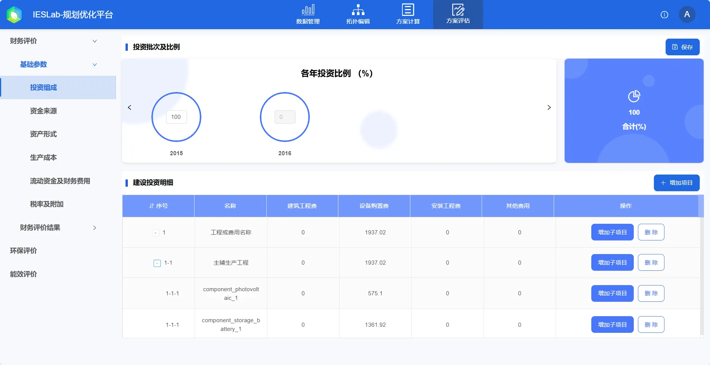
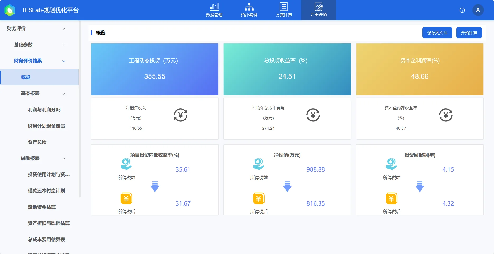

本节以**分布式储能**项目为例，介绍 IESLab 规划优化平台入门案例的规划设计和分析方法。

## 规划设计步骤：
 1.	登录 CloudPSS 平台，进入 CloudPSS IESLab 规划优化平台
 2.	建立项目并打开
 3.	数据管理模块：录入编辑项目基础参数
 4.	拓扑编辑模块：搭建拓扑，设置约束条件参数
 5.	典型场景生成模块：生成综合能源系统典型运行场景
 6.	方案优选模块：选择优化目标并优化，查看、导出及分析计算结果
 7.	方案评估模块：选择方案并评价，查看、导出及分析计算结果

## 新建与打开

用户成功登录后，在 CloudPSS 个人中心点击 **IESLab规划设计** 的图标后，页面跳转至 **IESLab 规划优化平台**，该界面包含新建项目、项目管理等。

### 新建项目组

点击**新建项目组**，输入项目组名称及描述，**是否从已有项目组导入**选择**否**，创建一个空白项目组。

### 从模板创建新项目

点击项目组右侧的**操作**，选择**新建项目**。

在弹出的**新建项目**对话框中，输入项目名称及描述，**是否从模板创建新项目**选择**是**，选择模板**分布式电源**。

### 打开项目

点击项目所在行，或点击文件夹按钮打开；或点击**更多**打开项目。

## 数据管理模块

打开项目项目后，首先进入数据管理模块，可在该模块输入项目资料和相关参数信息

### 气象数据

通过输入项目地 GPS 经纬度坐标、城市搜索、地图选点定位等方式选择项目地点，利用地图插件可查看项目位置信息，点击**载入气象数据**按钮载。

载入气象数据后，可以选择类别查看。

### 录入项目参数

接下来录入综合能源项目所需数据参数，如**源-网-荷-储**设备参数、**电/冷/热**负荷曲线、电价信息等，平台内置典型参数库，可从典型库导入。

## 搭建拓扑，设置约束条件

在左侧导航栏中，切换到**拓扑编辑**模块，从工作区左侧**模型**中选择元件拖拽至工作区并连接拓扑，在工作区左下角查看拓扑连接情况

选中元件并设置**约束条件**，绑定在**数据管理**模块录入的数据，输入运行策略等。

## 生成综合能源系统典型运行场景

在对系统进行规划设计和运行优化前，需要明确运行场景。

拓扑连接无误并设置约束条件后，切换到**典型场景**模块，在**方案**页面设定规划参数，并点击**启动任务**启动计算。

计算开始后，平台自动跳转到**结果**页面，可在**结果**页面查看计算过程及典型场景曲线

## 选择目标，规划优化

生成典型运行场景后，就可以进行系统规划和优化了。

在**方案优选**模块中选择优化目标，并点击**开始计算**进行系统规划设计和运行优化。

计算过程中可以切换到**日志**查看过程信息，平台会将寻优过程的可行解**从劣至优**进行展示。

有可行方案后，平台会统计主要经济性、环保性等评价指标，并支持导出方案配置和设备信息、查看方案配置等。

用户点击方案右侧的“**详细信息**”可以进入详细方案信息页面。查看改方案的**具体设备配置及评价参数**、方案在每一个典型日的**运行优化结果**。用户也可以在页面右上角点击“返回方案列表”返回，或重新选择其他方案。

方案详细信息页面分为上下两部分，上半部分为方案的**详细描述**，包括设备配置参数（厂家、型号、台数、采购价格及运维费用）、收入及支出等经济性参数、年CO2排放量和方案统计信息。下半部分为**运行优化结果**，默认显示不包括母线、外部电源和统计信息等项目的负荷信息、收入及支出、运维和碳排放量等表格信息；当用户在元件参数行的右侧点击“查看”后，下半部分会显示该元件在每一个典型日的运行优化结果曲线，支持切换典型日、参数类型和下载结果数据。

## 选择方案，综合评估

用户在方案评估模块中选择一个方案，设定基础参数，平台算法会根据财务模型和工程经济学等相关模型自动计算评价指标，并显示计算得到的评价指标，平台支持将结果导出。

方案评估支持对方案进行财务、环保和能效综合评价。

## 项目文件下载

点击下载项目 zip 文件：[分布式储能项目](./distributed-storage.zip)  

项目 zip 文件可以通过**云空间**的项目**导入与导出**功能进行上传，可参考[云空间 - 导入与导出](../30-cloud-space/index.md#导入与导出)