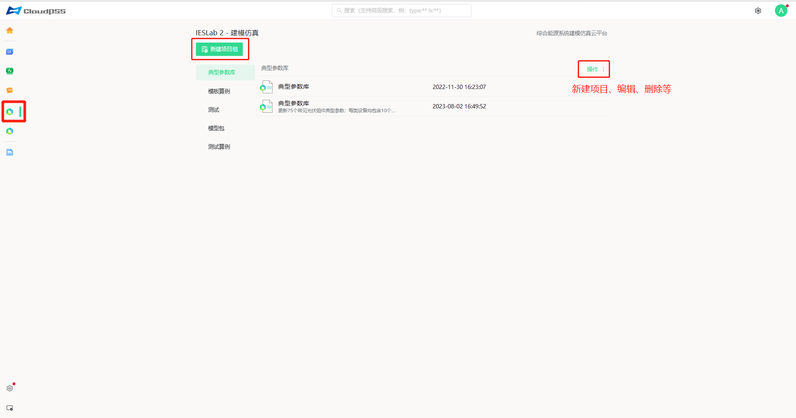
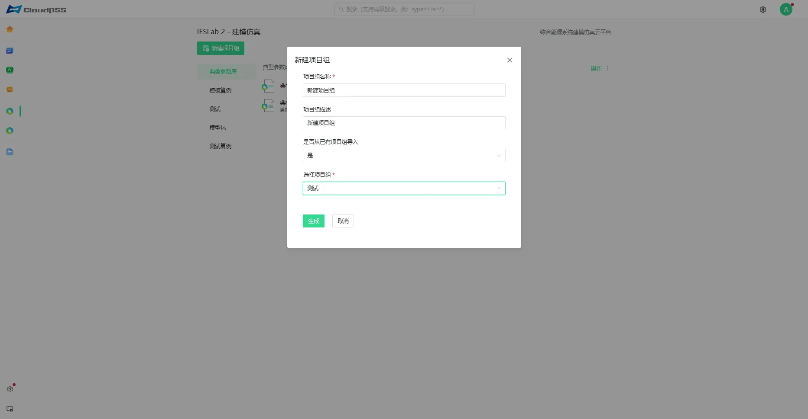
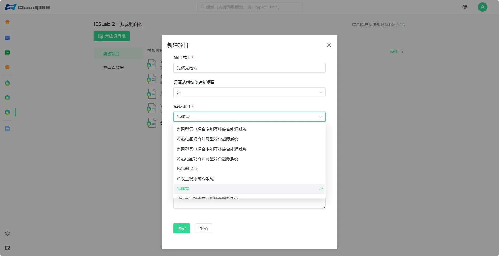
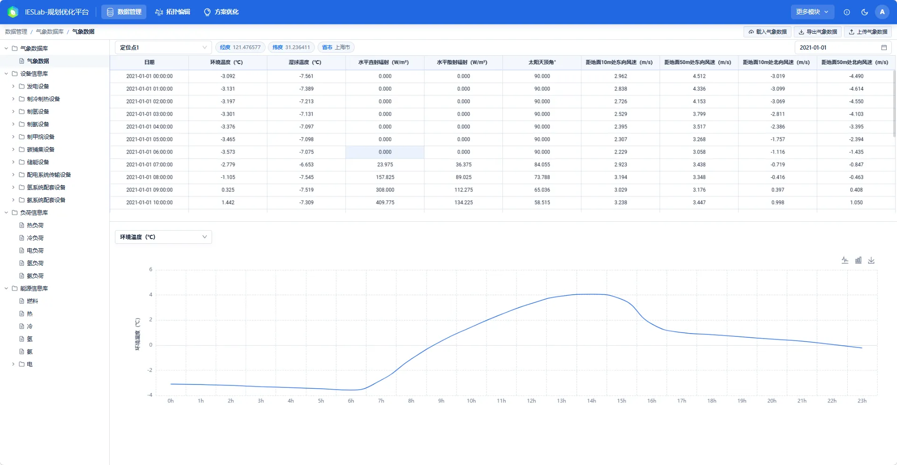
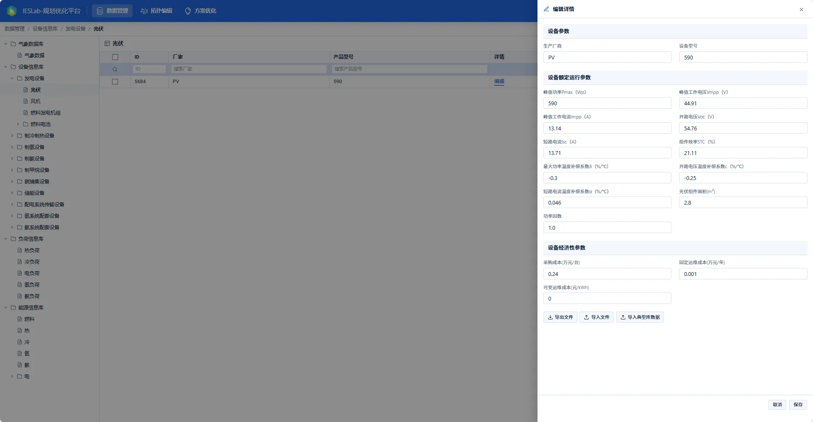
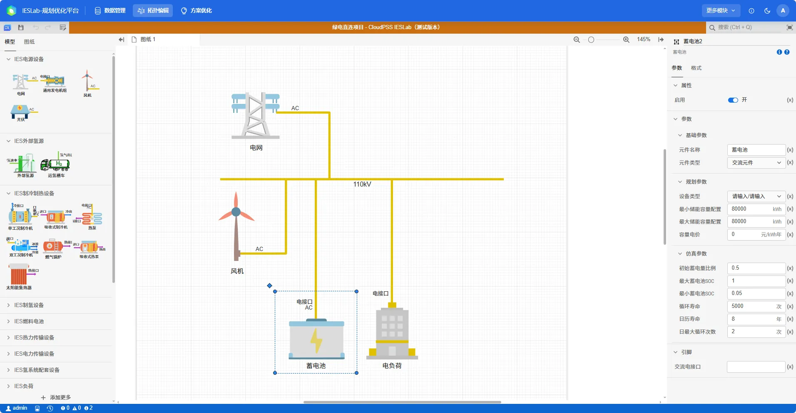
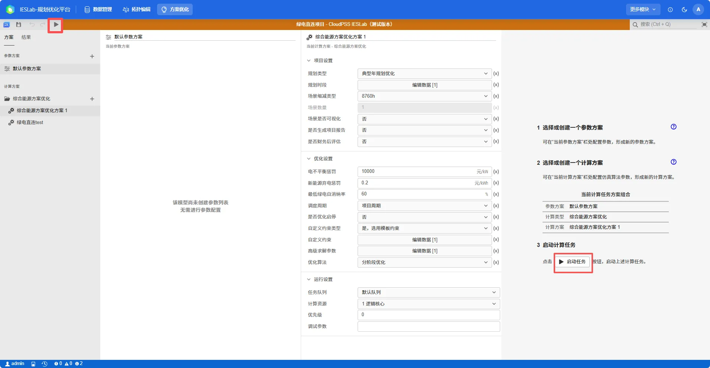
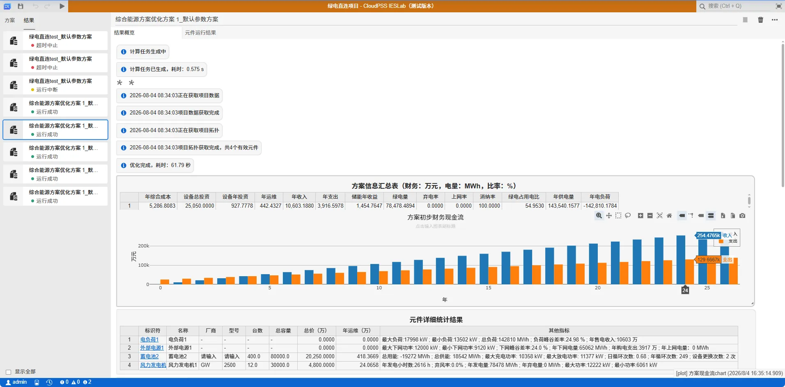
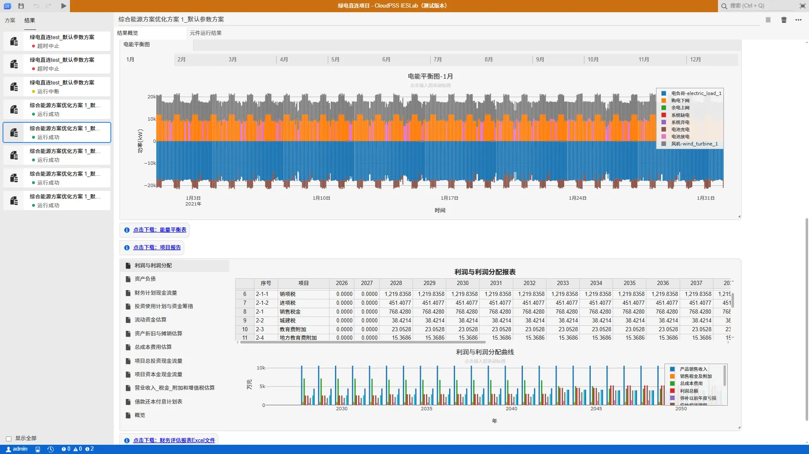
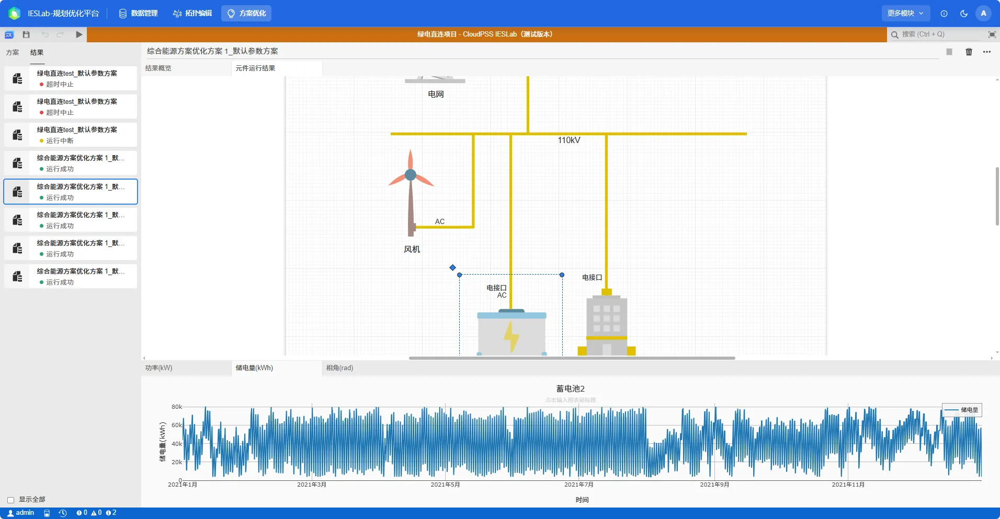

本节以**绿电直连项目**为例，带您从零开始走一遍 IESLab 规划优化平台的规划设计全流程。即使您是第一次接触综合能源规划软件，按下面的步骤操作也能在半小时内搭建出第一个可计算的算例。

> **阅读建议**：本章按"登录 → 建项目 → 录数据 → 搭拓扑 → 算方案 → 看结果"的真实操作顺序展开，每一步都标有界面截图位置（当前以文字说明占位，待补充实际截图）。建议您打开平台，边看边点。若某一步结果与预期不符，先回到上一步核对，再继续往下。

---

## 一、规划设计总步骤

整体流程是一条**单向流水线**：前一步的输出是后一步的输入，因此请严格按顺序操作，不要跳步。

1. **登录 CloudPSS 平台**，进入 CloudPSS IESLab 规划优化平台；
2. **建立项目并打开**（建议新手先用模板创建，预置好拓扑骨架与数据）；
3. **数据管理模块**：录入、编辑项目基础参数（气象、设备、负荷、能源价格）；
4. **拓扑编辑模块**：从元件库拖拽元件、连线，搭建拓扑，绑定数据，设置约束条件与运行策略；
5. **方案优化模块**：设置优化参数并开始计算，查看、导出及分析计算结果。

> **为什么不能跳步**：拓扑里的元件要绑定"数据管理"里录入的气象/设备/负荷/电价；优化参数又依赖拓扑里选定的设备与约束。任何一步遗漏，都会在下两步走不下去或算出空结果。

**预计耗时**（新手，含熟悉界面）：建项目 3 分钟 → 录数据 10 分钟 → 搭拓扑 10 分钟 → 算方案与看结果 7 分钟。熟练后可压缩到 15 分钟以内。

---

## 二、新建与打开项目

用户成功登录后，在 CloudPSS **个人中心**点击 **IESLab 规划设计** 的图标，页面会跳转至 **IESLab 规划优化平台**。该界面包含新建项目、项目管理等功能。

### 1. 新建项目组

点击 **新建项目组**，输入项目组名称及描述，**是否从已有项目组导入** 选择 **否**，即可创建一个空白项目组。

> **新手提示**：项目组（Project Group）是多个项目的容器，便于同一地区、同一类型的研究归类管理。第一次使用直接建一个空白组即可。

### 2. 从模板创建新项目

点击项目组右侧的 **操作**，选择 **新建项目**。

在弹出的 **新建项目** 对话框中，输入项目名称及描述，**是否从模板创建新项目** 选择 **是**，并选择模板（例如 **光储充**）。模板已预置好常用的拓扑骨架与典型数据，非常适合新手快速上手。

> **模板 vs 空白**：模板自带拓扑骨架与典型参数，省去从零搭建；空白项目适合完全自定义。绿电直连/园区微网等常见场景，优先用模板。

### 3. 打开项目

点击项目所在行，或点击文件夹按钮打开；也可以点击 **更多** 打开项目。打开后默认进入 **数据管理模块**。

> **下一步前确认**：项目已成功打开，且界面默认停留在"数据管理"页。若打开后是空白，检查是否选错项目或项目组。

---

## 三、数据管理模块

打开项目后，首先进入 **数据管理模块**，在该模块中输入项目资料与各类参数信息。数据管理包含四个子库：**气象数据库、设备信息库、负荷信息库、能源信息库**（详见 [数据管理模块](../40-data-module/index.md)）。

> **这一步决定结果上限**：绝大多数"结果不合理"的排查，最后都能追溯到数据模块——单位填错、曲线缺失、上网电价未绑定。建议在本模块就把数据核对清楚，不要带着疑问往下走。

### 1. 气象数据

打开项目后，默认展示气象数据信息。若项目为新的空白项目，需首先载入气象数据。

通过输入项目所在地 **省市** 或 **GPS 经纬度坐标**，或利用在线地图插件 **地图选点定位** 等方式选择项目地点，点击 **载入气象数据** 按钮。因气象数据量较大（平台内置近 10 年中国大陆地区的 8760 h 逐时数据），载入需要等待片刻

> **常见坑**：未载入气象数据 → 光伏/风机理论出力为 0，等同于"没装新能源"。务必确认载入完成后曲线已显示。

### 2. 录入项目参数

接下来录入综合能源项目所需的电、冷、热、氢各类设备参数，**电/冷/热/氢负荷曲线**、价格信息等。平台内置典型参数库，可一键从典型库导入，省去手工录入。

> **效率类用小数、比率类用百分数**：设备效率（如光伏转换效率、充放电效率）填 0~1 小数；上网率、自消纳率、SOC、峰谷差率等填百分数。把 0.95 填成 95 是"结果差两个数量级"的头号原因。

---

## 四、搭建拓扑，设置约束条件

切换到 **拓扑编辑** 模块（SimStudio 工作台）。从工作区左侧 **模型（元件库）** 中选择元件，拖拽至工作区并连接拓扑；在工作区左下角可查看拓扑连接情况。

选中元件后可设置 **约束条件**，绑定在 **数据管理** 模块录入的数据，并输入运行策略等。拓扑建模的完整流程见 [拓扑建模流程](../50-topology-module/20-topology-modeling-workflow/index.md)，元件参数设置的细节见 [参数设置](../50-topology-module/20-topology-modeling-workflow/20-setting-params/index.md)。

> **连线即能量流**：拓扑里的连线代表能量传递关系，连错或漏连会导致能量平衡约束无法闭合，进而无解。搭完先确认左下角连接状态无异常，再进参数设置。

---

## 五、设置参数，规划优化

在对系统进行规划设计和运行优化前，首先需要设置优化参数。参数分三块，建议逐项确认：

1. **项目设置**：设置项目的基础参数，如**典型场景**（典型日 / 全年 8760h）、**是否生成报告**、**是否财务后评估**等。这一步决定"算什么规模、出不出报告"。
2. **优化设置**：设置优化参数，如**惩罚成本**（缺电/弃电/软约束的代价）、**全局约束**（容量上限、上网率等）、**优化算法**（求解器与并行设置）等。这一步决定"怎么算、算多严"。
3. **财务参数**：仅当项目设置中选择 **财务后评估** 时才需要设置，如**资金来源**、**建造成本**、**税率**等，用于计算投资回收期、净现值等评价指标。

点击 **开始计算**，计算过程中可通过日志查看过程信息。

计算完成后，平台会展示寻找到的最优方案，包括 **具体设备配置及指标参数**、 **能量平衡图** 等结果。

若选择了 **财务后评估**，设定基础参数后，平台会根据财务模型与工程经济学模型自动计算评价指标并显示；结果支持导出。

切换到 **元件运行结果页面**，将展示各元件的 8760h 运行结果曲线。

> **下一步**：结果出来了先看"对不对"再"好不好"。如何判断结果正确性、如何排查松弛与无解，见 [计算方案配置 · 优化调试技巧](../60-optimization-module/30-results-tab/index.md)。

---

## 六、项目导入导出

项目 zip 文件可通过 **云空间** 的项目 **导入与导出** 功能进行上传 / 分发，可参考 [云空间](../30-cloud-space/index.md)。

> **协作提示**：导出 zip 便于备份与团队共享；导入他人项目时，注意其对应的平台版本是否一致，避免"能打开但数据缺项"。导入后建议先跑一次计算，确认数据完整。
