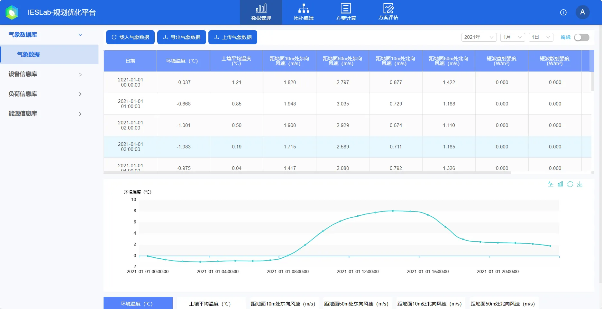
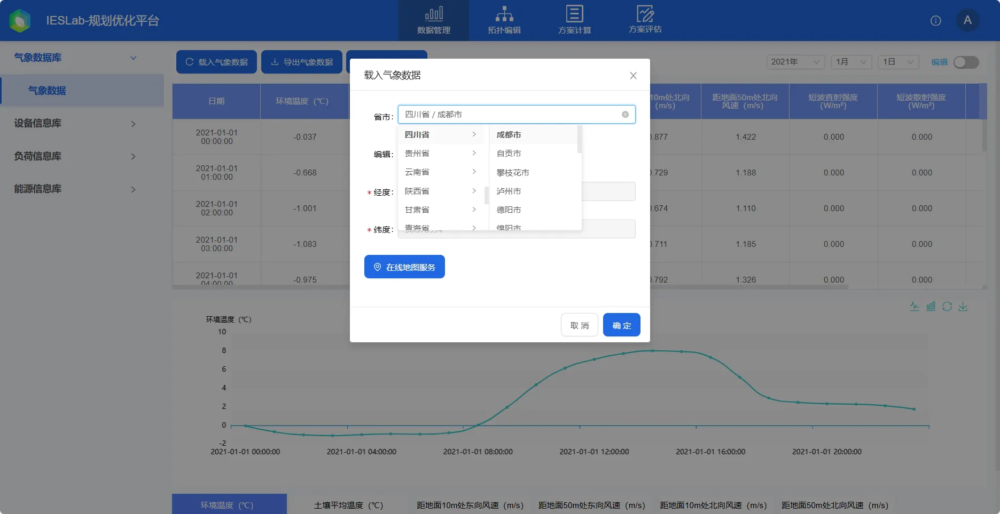
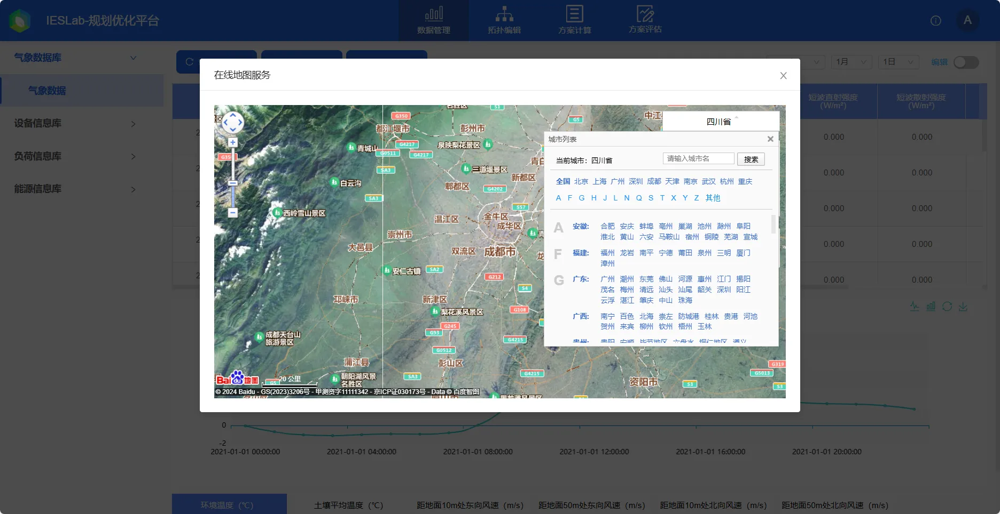

本节主要介绍气象数据库的功能和使用方法，并对使用过程中遇到的常见问题进行解答。

## 功能定义

通过设置项目所在地的位置信息，基于平台内置的气象数据集获取目标位置处的历史年气象数据，并支持用户二次编辑和修改，这些气象数据可用于新能源出力测算等环节。

## 功能说明

在用户从个人中心打开项目后，默认首先进入数据管理模块的气象数据库。若项目为新的空白项目，需首先载入气象数据。。

### 气象数据载入

点击**载入气象数据**栏时，可通过选择项目所在地省市，载入该市默认位置的气象数据；

或点击“**编辑**”，输入项目地的GPS经纬度坐标，载入该地气象数据。

也可利用在线地图负荷，借助第三方地图插件，定位当前项目的位置信息。用户可以通过以下三种方式进行项目定位：

1. 通过搜索或选择目的地城市名进行定位。

2. 输入目的地的经纬度信息。

3. 通过地图组件的拖动、缩放、位移等功能进行手动定位。
   

:::info
地图组件仅在联网环境下才能查看地图信息。
:::

确定实际项目地点后，点击**载入气象数据**按钮载入气象数据。因数据量大，等待一段时间后载入气象数据成功后回自动进入**气象数据**栏展示。

### 查看气象数据

在**气象数据**栏下，中间的表格默认显示 2021-01-01 当天的气象数据，如需切换显示日期可使用右上角的年月日下拉框，平台默认提供了 2016-2021 年的气象数据。下方的图形控件则显示了当前日期不同气象要素的时序变化曲线，用户可通过下方的选择框进行要素类别的切换。

以上的气象数据也支持用户进行二次编辑和修改，通过点击右上方**编辑**按钮，可以使气象数据表格为处可编辑状态，此时用户可以采用类似编辑 excel 表格的形式编辑目标数据，编辑后平台回自动校验用户编辑的**数据合法性**，数据格式不对时会提示**验证错误，请检查格式!**，关闭**编辑**按钮后，平台会自动更新并提示**更新数据成功**。

气象数据页面左上方的工具栏**导出气象数据**按钮可以气象数据导出为 **excel** 文件，并支持用户上传气象数据，具体格式参考导出的文件。

## 常见问题

为什么地点模块空白，不显示地图？  
:   地图插件需要联网使用，若您的服务器设备无法连接 Internet 网络，您可以通过输入项目地经纬度坐标，同样可以载入气象数据。

已有的气象数据如何上传，平台是否会泄露？  
:   1. 需要按照平台默认的格式才能上传。若您的气象数据类别与平台一致，您可以下载已经载入的气象数据文件，将已有的数据替换下载的文件后上传；
    2. 若您在公网使用 IESLab 平台，数据将上传至公有云服务器上您的账户下，为了您的数据安全隐私，建议您购买使用服务器版本，数据将存储至您本地的服务器中，更好地保障您的数据安全。

气象数据上传为什么失败？  
:   上传气象数据需要参考平台默认格式进行修改，并检验数据合法性，如时间和数字格式等。
   
气象数据是否准确？  
:   平台内置**中国大陆区域** 8760 小时数据来源于 NASA，其中，环境温度、土壤平均温度、距地面10m 处东向风速、距地面50m 处东向风速、距地面10 m 处北向风速、距地面50m 处北向风速、湿球温度数据来源于 **MERRA2**（`https://gmao.gsfc.nasa.gov/reanalysis/MERRA-2/`）项目，短波直射强度、短波散射强度、太阳天顶角来源于**CERES**（`https://ceres.larc.nasa.gov/`）项目。

## 气象数据小知识

### 常见的气象数据库

美国太空总署（NASA）的各个项目提供了多种多样的气象数据，其项目数据采集传感器一般不在地表，地面气象数据需要通过模型计算。例如，地球表面辐照从地球外层的辐照计算得到：通过卫星等手段得到大气层顶的辐射(Top of atmosphereradiance)，这一步的准确度较高。然后再通过云层分布图、臭氧层分布图、悬浮颗粒物分布等数据，通过复杂的建模和运算得到地表水平面总辐射数据，这一步的准确度就受很多因素的制约。首先，卫星的传感器不能分辨云层的覆盖和地面雪的覆盖之间的区别；第二，在靠海、山区及有大型水体的区域，传感器的准确度较差；第三，云层对辐射的影响很难准确计算；第四，气溶胶（悬浮颗粒物）对辐射的影响很难准确计算，因此其可靠度及精确性与实际情况有点偏差。

1. **NASA POWER**（`https://power.larc.nasa.gov`）：POWER（Prediction Of Worldwide Energy Resources） 项目提供常见的辐照等气象数据，替换了 PVsyst中的 SSE (Surface meteorology and Solar Energy)数据，提供了 **GHI**和**DNI**数据。NASA POWER 数据空间分辨率为0.5 &deg;×0.625 &deg;, 时间分辨率为1h。  对于开阔、干旱地区，云量、雪量、水体均较少，并且空气质量相对较好的地区，其地面辐射测量值与NASA数据库的值相差不大。受云层及空气质量影响，云、雨及阴天较多地区，相比于 PVSyst 内置的 **Meteonorm8** 气象数据库，约有 0-10% 的偏差。

2. **NASA CERES** ： 云和地球的辐射能量系统（Clouds and the Earth's Radiant Energy System），Terra、 Aqua、 S-NPP 和联合极地卫星系统（JPSS-1）等太阳同步卫星都搭载了 CERES 仪器，其数据来源于多个高精度的卫星仪器和地面观测站，经过严格的交叉校准和质量控制，具有较高的准确性和可靠性。CERES数据通常供科研人员和专业人士使用，专业性高，提供**GHI**、**DHI**和**DirHI**数据。空间分辨率为 20 km, 时间分辨率为1h。

3. **NASA MERRA-2**：一套长时间序列的再分析数据集，其中包括各种气象变量，像净辐射、温度、相对湿度、风速、湍流蒸散等。同时，MERRA-2数据覆盖全球，空间分辨率为0.5  &deg;x 0.625 &deg;，时间分辨率为1小时。这种气象数据在定量遥感中的应用十分广泛，辐照数据仅提供 **GHI**。

4. **METEONORM**气象数据库：数据来源于Global Energy Balance Archive、世界气象组织WMO/OMM和瑞士气象局等机构，包含有全球7750个气象站的辐射数据，我国98个气象辐射观测站中的大部分均被该软件的数据库收录。另外该软件还提供其他无气象辐射观测资料的任意地点的通过插值等方法获得的多年平均各月的辐射量。

5. **GHI**:数据库的本质是由一系列太阳辐射、光伏数据、气象和地理要素构成的数据库，并以此数据库为基础，经科学算法计算之后，提供太阳能资源评估和光伏发电量模拟等数据服务。 该数据库可以提供覆盖全球10年以上的、时间分辨率为月、日、小时及30分钟级别的详细数据，提供的参数的参数包括水平面总辐照（GHI）、倾斜面辐照（GTI）、直接辐照（DNI）、散射（DIF）、温度（TEMP)等时间序列和典型气象年数据（TMY P90+P50)，分辨率可以精确到250米。现已被广泛应用于光伏、聚光光伏和光热项目的前期开发、资源评估和发电量计算。

6. **PVGIS**：数据来源于欧洲中期天气预报中心（ECMWF）等。提供太阳能资源评估和光伏发电量模拟等数据服务。 适用于光伏项目的选址、评估和后续管理，提供了较为全面的太阳能资源数据。数据覆盖范围可能不如NASA POWER和Meteonorm广泛。

7. **ERA5**：欧洲中期天气预报中心（ECMWF）的第五代大气再分析数据集。包含了日平均温度、降水、比湿度和距离地表2米的气压等气候变量，时间分辨率和空间分辨率都较高。数据全面且详细，适用于气候研究和长期趋势分析。虽然提供了气候变量数据，但专门针对太阳能辐照的数据可能不如NASA POWER和Meteonorm丰富。

8. 其他高精度辐照数据：ISCCP-FD（国际卫星云气候计划）、GEWEX-SRB（（全球能量与水循环试验）以及国家青藏高原科学数据中心提供的全球高分辨率（3小时，10公里）地表太阳辐射数据集（1983-2018）（`https://data.tpdc.ac.cn/zh-hans/data/be562de3-6367-402f-956d-59f7c21ad294/`）

### 太阳辐照数据

**法向直接辐射DNI**: Direct Normal Irradiance 太阳直射到垂直于太阳光线方向上的单位面积上的辐射能量，法向直接辐射简写为 DNI。

**水平散射辐射DHI**: Diffuse Horizontal Irradiance 在大气中散射辐射的直接到达地面的部分。散射辐射的标准测量在水平面上进行，这个测量叫做散射水平辐射，或者简化为“散射”简写为 DHI。

**水平直射辐射DirHI**: Direct Horizontal Irradiance 在大气中直射辐射的直接到达地面的部分称为水平直射辐射。极易和 DHI 混淆，因此简写为DirHI。

**水平总辐射GHI**:Global Horizontal Irradiance  太阳的 DHI和 DNI到达水平表面称为总水平辐射，通常简称为总辐射，简写为 GHI。

Solar Zenith Angle: 太阳天顶角 （与太阳高度角之和为90度，互余关系）解释为一束光线从太阳到达地面一点形成的光线与此点垂直于地面的直线夹角；所以在日出和日落时天顶角为 90度（太阳高度角为0），没有直射辐射到达水平面。

各个辐射参数之间的关系：

$$
GHI = DHI + DirHI
$$

$$
GHI = DHI + \cos\theta DNI
$$

$$
DirHI =  \cos\theta  DNI
$$

其中，$\theta$ 为 Solar Zenith Angle（太阳天顶角）

**太阳辐照数据替换方法**

一般而言，用户可能收集到**GHI**和**DHI**数据，平台为**dirHI**和**DHI**，可通过$DirHI = GHI - DHI$计算并替换上传即可。