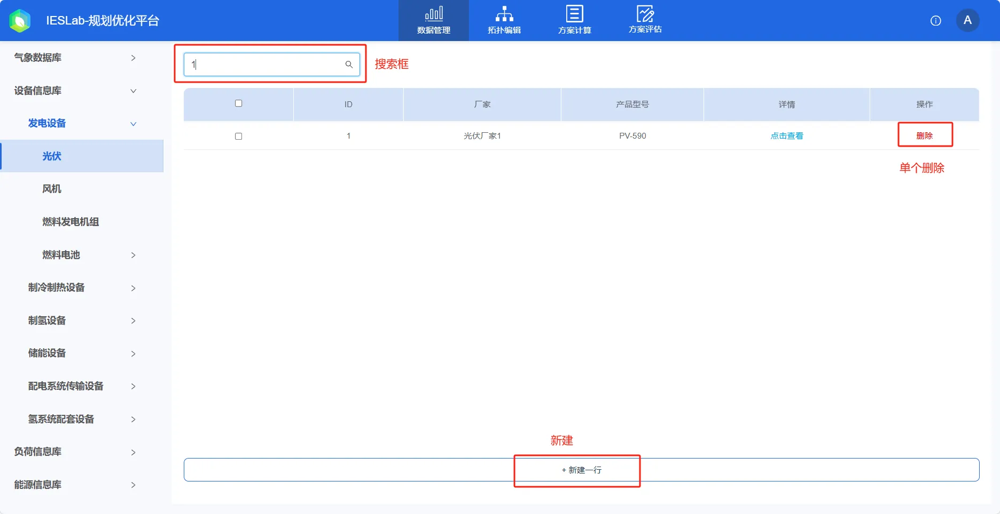
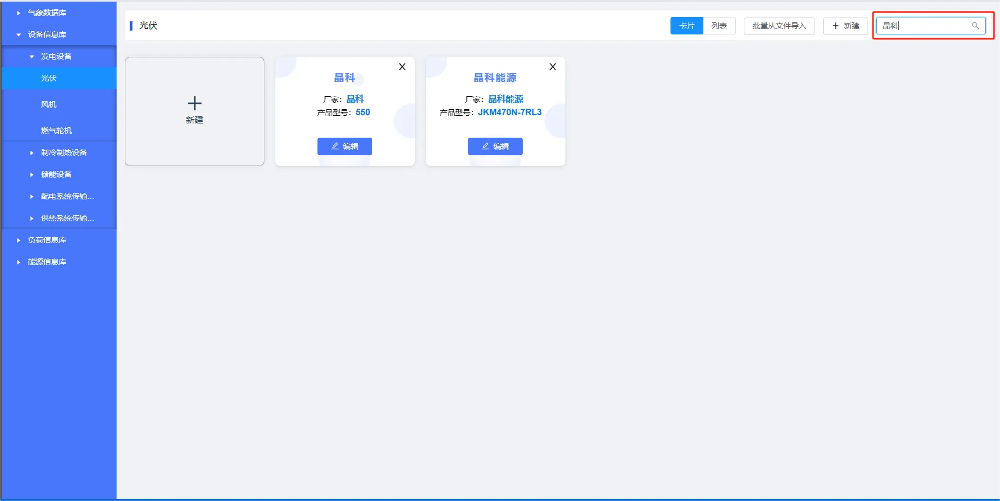
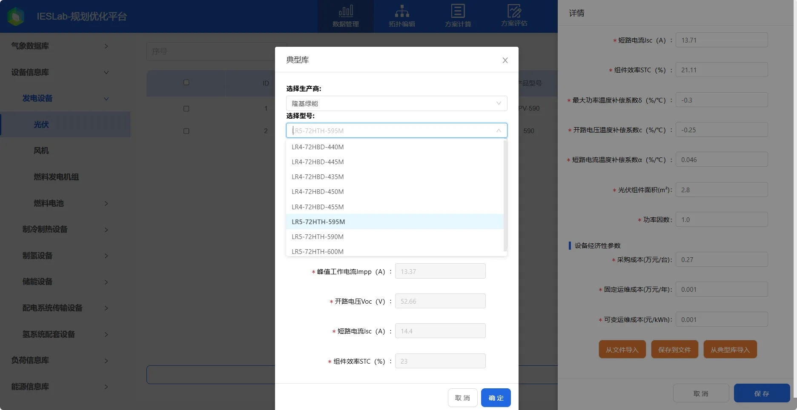
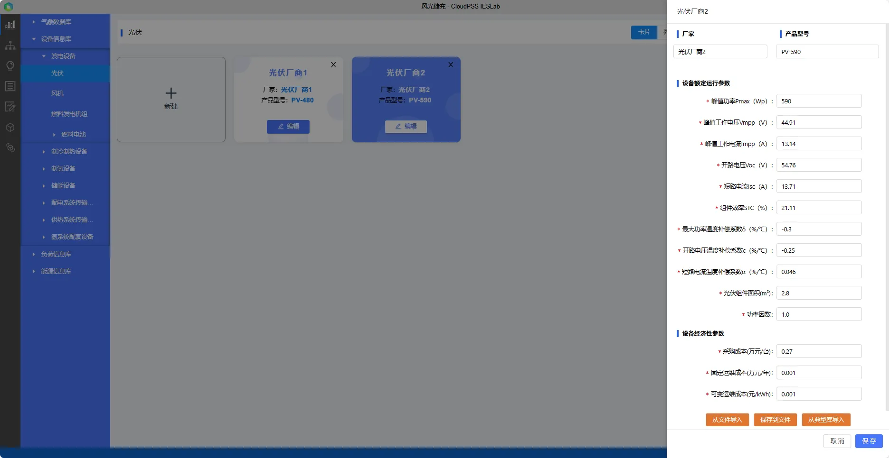

本节主要介绍设备信息库的设备参数录入、编辑、导入及导出等功能使用方法，并对使用过程中遇到的常见问题进行解答。

## 功能定义

该功能主要用于录入目标综合能源系统中所使用的不同型号设备的**额定参数**（比如性能曲线、经济性参数、设备运行约束等，运行边界条件不包括在内），并进行分类管理。这些参数将用于后续拓扑建模时与元件的**设备待选类型**参数进行绑定，同一型号的设备参数可以绑定至多个元件的对应参数上，从而实现设备额定参数数据的复用，简化用户输入。

## 功能说明

### 设备分类

设备信息库中将所有综合能源设备分为发电设备、制冷制热设备、储能设备、配电系统传输设备和供热系统传输设备5类：

| 大类设备 | 子类设备 |
| :--- | :--- |
| 发电设备 | 风机、光伏、燃气轮机 |
| 制冷制热设备 | 燃气锅炉、热泵、热管式太阳能集热器、电压缩制冷机、吸收式制冷机 |
| 储能设备 | 储热水罐、蓄电池 |
| 配电系统传输设备 | 变压器、模块化多电平换流器MMC、传输线 |
| 供热系统传输设备 | 离心泵、管道 |

### 设备管理

打开设备信息库并选择特定子类设备后，进入该类设备的管理页面。默认的显示模式为**卡片模式**，可通过右上方的按钮切换至**列表**模式。

#### 新建与删除

点击右上方的**新建**按钮（**卡片**模式下还可以点击下图中的**新建**卡片），会自动创建一个新的可选设备并弹出设备参数编辑框。如果需要删除设备，在卡片模式下可点击卡片右上角的“**×**”，在列表模式下可点击列表右侧的**删除**按钮，即可进行删除。

#### 设备搜索与筛选

在页面右上方的**搜索输入框**，在输入框中输入厂家、型号等任意关键字，点击放大镜🔍或回车确定，即可进行模糊搜索或筛选（关键字不区分大小写）。清空输入框后，点击放大镜**🔍**或回车确定可显示所有设备。

#### 设备参数编辑

在卡片模式下，点击设备所在的卡片或者**编辑**按钮；在列表模式下点击设备所在的行或**编辑**，即可编辑设备参数信息。

在编辑区域下方有**从文件导入**、**保存到文件**和**从典型库导入**按钮：

1. 点击**保存到文件**会将该设备相关参数另存为 excel 文件。
2. 点击**从文件导入**将会弹出文件选择框，选择相应类别及种类的设备参数 excel 文件后，平台将会自动校验文件格式，若格式无误会覆盖原设备参数，若格式有误将会提示**表格格式不正确!**。
:::info
用户可以先**保存到文件**，参照导出文件的格式进行修改，再进行**从文件导入**。
:::
3. 点击**从典型库导入**按钮，在弹出的**典型库**对话框中，选择厂商和型号后会自动显示设备参数信息，点击**确定**后，将会**覆盖**当前设备参数。

在完成参数编辑后，点击**保存**完成修改并保存；点击**取消**则放弃修改；点击非编辑区域的左侧空白阴影区域，则会弹出是否保存的确认提示。

## 案例

import Tabs from '@theme/Tabs';
import TabItem from '@theme/TabItem';

<Tabs>
<TabItem value="js" label="案例1">

以电源设备的**光伏系统**为例，说明设备信息库的用法。

1. 点击“新建”后，输入**厂家和产品型号**名称。

2. 录入设备额定参数
录入最关键的**设备额定运行参数**，额定参数作为设备模型最重要的参数，参与设备出力计算，直接影响设备的性能及系统运行。您可以联系厂家提供相关参数。
对于光伏系统来说，主要参数有：  
峰值功率Pmax（Wp）  
峰值工作电压Vmpp（V）  
峰值工作电流Impp（A）  
开路电压Voc（V）  
短路电流Isc（A）  
组件效率STC（%）  
开路电压温度补偿系数c（%/$^{\circ}$C）  
短路电流温度补偿系数α（%/$^{\circ}$C）  

根据设备参数和具体的工况参数，就可以计算光伏系统的理想出力了。

3. 保存

</TabItem>
<TabItem value="py" label="案例2">

以**传输线**为例，说明从典型库导入设备的方法。

1. 点击“新建”，创建新的设备卡片。

2. 从典型库导入
   参数编辑区域右下角选择**从典型库导入**，在弹出框中选择**厂家和型号**，检查参数无误后点击**确定**，覆盖当前设备参数。
   

3. 保存
</TabItem>
</Tabs>

## 项目文件下载
[光伏系统-设备参数文件](./PV-JKM590N.xlsx)  
[传输线-设备参数文件](./distribution-line.xlsx)

## 常见问题

1. 能否支持暂态模型？  
   对于综合能源系统来说，其热力系统的**稳态过程较长**，达到准稳态的时间尺度为分钟级，一般约15-60min，因此平台主要聚焦**综合能源稳态过程**，设备处主要关注**能量流的变化和转换**过程，设备模型为**稳态变工况**模型，可通过运行在不同挡位来模拟能量转换的动态过程。

2. 能否支持常见的控制模型？  
   平台暂无控制系统及控制元件，其仿真策略等边界条件为常量，需用户录入，无法实现元件仿真模拟过程中运行策略的自动控制。暂无开关、阀门等实体控制元件，无P、I、D、非线性控制等过程控制函数。

3.	能否支持流程过程模型？  
    平台基于综合能源稳态能量流仿真内核设计，并不关心能量生产的工艺过程、流动流程和能量转换过程，无分离器、反应器、冷却塔等流程过程组件。

4.	能否修改平台模型及自定义元件模型？  
    IESLab平台暂不支持修改元件设备模型，自定义元件功能仍在开发中，敬请期待。

    若平台提供的模型无法满足您的需求，您目前可以利用平台的数据管理模块、拓扑编辑模块和**IESLab SDK**, 自行编写元件模型和能量流求解器进行仿真计算，平台主要做数据录入和系统展示等基础功能。
    
5.	能否修改典型库？  
    CloudPSS IESLab 官网的典型库不支持修改，对于服务器版本，管理员账户可以修改典型库，修改后该服务器下所有用户即可导入。

6. 设备经济性参数有什么用？
   设备经济性参数主要用来计算项目经济指标，采购成本用来计算项目投资，固定运维成本和可变运维成本用来计算项目运营费用。