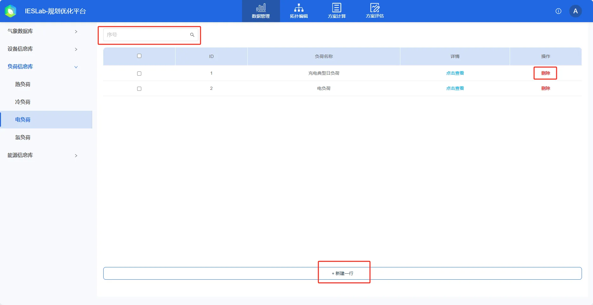
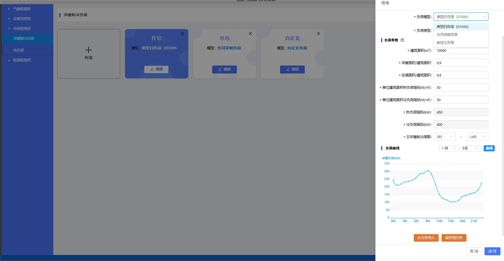
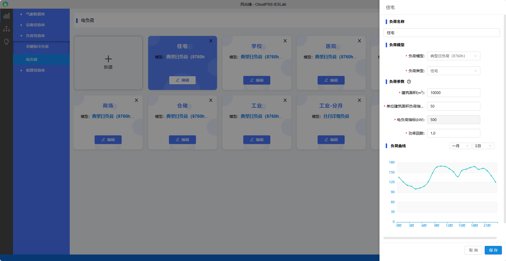

本节主要介绍负荷信息库的负荷模型、参数录入、编辑、导入及导出等功能使用方法，并通过常见问题答疑快速熟悉负荷信息库的基本使用方法。

## 功能定义

用户可以在负荷信息库中录入、编辑和管理电冷热负荷模型及曲线。

负荷是综合能源系统规划设计的关键参数，用户将在**负荷信息库**中建立负荷模型进行管理，录入后可在**拓扑编辑模块**选择负荷名称并自动关联对应的负荷曲线。

## 功能说明

### 新建与删除

打开负荷信息库并选择负荷类型及种类后，进入负荷管理页面，负荷显示模式默认为**卡片**模式。点击卡片**新建**或右上方的**新建**快捷键，会自动创建一个新的负荷卡片，初始化负荷的各项参数并弹出编辑区域，默认值可以不用修改即可使用，点击左侧空白阴影处可以隐藏编辑区域；也可修改负荷参数，并点击**保存**。
点击卡片右上角的“**×**”，可以删除此负荷。

切换到**列表**模式时，需点击右上方的**新建**快捷键进行新建操作。点击负荷项目右侧的**删除**，可以删除此负荷。

### 负荷搜索与筛选

在页面右上方的**搜索输入框**，在输入框中输入负荷名称等任意关键字，点击放大镜**🔍**或回车确定，即可进行模糊搜索或筛选（关键字不区分大小写）。清空输入框后，点击放大镜**🔍**或回车确定可显示所有负荷。

### 负荷参数编辑

在卡片模式下，点击负荷所在的卡片或**编辑**；在列表模式下负荷所在的行或**编辑**，即可编辑负荷参数信息。修改成功后，点击**保存**完成修改并保存；点击**取消**放弃修改。若修改后点击非编辑区域的左侧空白阴影区域，则会弹出告警框，可选择**保存**、**不保存**或**返回**编辑区域。当用户未修改参数，左侧空白阴影区域则会隐藏编辑区域。

### 负荷模型

负荷模型有**典型日负荷（8760h）**、**分月详细负荷**和**自定义负荷**三种模型。

**典型日负荷（8760h）**：平台内置了 13 种典型的 8760h 负荷，包含住宅、学校、医院、办公、酒店、仓储、商场、小型工业、大型工业、影剧院、赛事管、博物馆和超市。用户需输入建筑面积和单位面积负荷指标，平台利用负荷指标法、基准曲线和逐时曲线等方法生成粗略曲线，仅供用户在项目初期，缺少相关负荷数据，依靠相关建筑设计规范和指标，进行综合能源系统规划设计时参考。

**分月详细负荷**：每个月选取一天作为该月的典型日，入各月典型日的 24h 的负荷数据，支持区分工作日和休息日，适合于用户已对项目地区负荷评估计算的情况；

**自定义负荷**：用户按照相应格式导入用户收集的负荷曲线，如 24 点、96 点等负荷数据 ，平台内置插值等数据处理算法，支持任意时间间间隔。适合于升级改造等项目，用户已有详尽的负荷数据和规划的预测负荷数据。

### 导出与导入
在编辑区域下方有**从文件导入**、**保存到文件**和**从典型库导入**快捷键，当展示内容较多时，可使用鼠标滚轮向下滑动或选中编辑区域右侧的滑块下拉即可看到。

点击**保存到文件**会将该负荷相关参数另存为 excel 文件，文件格式如下所示：

点击**从文件导入**将会弹出文件选择框，选择相应类别及种类的负荷参数 excel 文件后，平台将会自动校验文件格式，若格式无误会覆盖原负荷参数；若格式有误将会提示**表格格式不正确!**。用户可以先**保存到文件**，参照导出文件的格式进行修改，再进行**从文件导入**。

## 案例

import Tabs from '@theme/Tabs';
import TabItem from '@theme/TabItem';

<Tabs>
<TabItem value="js" label="案例1">

以典型项目**含风光储交直流配网综合能源系统**的**电负荷**为例，说明相关用法。

1. 点击“新建”后，输入**负荷**名称，拟建立“住宅”电负荷。
   
2. 选择负荷模型，录入参数  
本项目在规划建设前期，建筑物暂未建设，用户尚未进行负荷综合评估，缺乏相应负荷数据。只能参考设计规范和负荷指标进行估计。正好平台提供了典型日负荷（8760h）模型：利用负荷指标法、基准曲线和逐时曲线等方法生成粗略曲线，提供常见类型的负荷基准数据，便于综合能源系统规划设计前期参考。  
平台根据建筑面积和单位建筑面积负荷指标，就可以提供粗略的 8760h 负荷数据供用户参考。

3. 保存
4. 搜索
点击右上方的**搜索框**，输入“工业”并点击“🔍”或确定，即可实现搜索筛选；清空搜索框并确定，则会显示所有负荷卡片。

</TabItem>
<TabItem value="py" label="案例2">

以典型项目**楼宇型综合能源系统**的**采暖制冷负荷**为例，说明相关用法。

1. 点击“新建”后，输入**负荷**名称，拟建立“商场”采暖制冷负荷。
   
2. 选择负荷模型，录入参数  
本项目在规划建设前期，商场暂未建设，用户尚未进行负荷综合评估，缺乏相应负荷数据。只能参考设计规范和负荷指标进行估计。正好平台提供了典型日负荷（8760h）模型：利用负荷指标法、基准曲线和逐时曲线等方法生成粗略曲线，提供常见类型的负荷基准数据，便于综合能源系统规划设计前期参考。  
平台根据建筑面积、采暖面积/建筑面积（计算热负荷）、空调面积/建筑面积（计算冷负荷）、单位建筑面积热负荷指标、单位建筑面积冷负荷指标，就可以提供粗略的 8760h 负荷数据供用户参考。  
特别地，对于采暖制冷负荷，平台约定正数为采暖负荷，负数为制冷负荷。在负荷曲线显示时，平台会自动识别此时为采暖还是制冷负荷。

3. 保存

</TabItem>
</Tabs>

## 常见问题

典型负荷是否准确？  
:    平台的典型负荷仅供参考，建议使用准确的负荷数据。典型负荷利用**负荷指标法**、**基准曲线**和**逐时曲线**等方法生成粗略曲线，仅供用户在项目初期，缺少相关负荷数据，依靠相关建筑设计规范和指标，进行综合能源系统规划设计时参考。

能否修改典型负荷的基准曲线？  
:    平台暂不支持。

能否支持可中断等可调节负荷？  
:    平台暂不支持可调节负荷，仿真模拟时负荷大小需明确；在规划优化时，平台提供柔性电负荷元件，其负荷大小可调节，但负荷总和不变。

负荷时间间隔变化，时间分辨率与仿真时间步不一致时，能否仿真？  
:    可以，平台内置插值等算法，可以解决该问题。

平台的典型负荷无法满足我的需求，如何进行更准确的建筑物能耗仿真评估？  
:    对于建筑能耗仿真，平台拓扑编辑模块提供了建筑物负荷模型，需要建筑物的详细围护结构、换热性能等参数；若需要非常准确的建筑物能耗仿真，建议使用专业的建筑能耗商业软件。