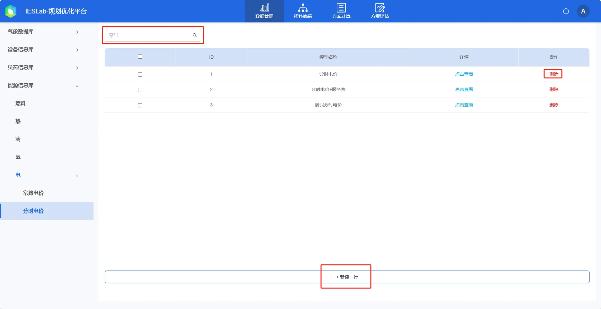
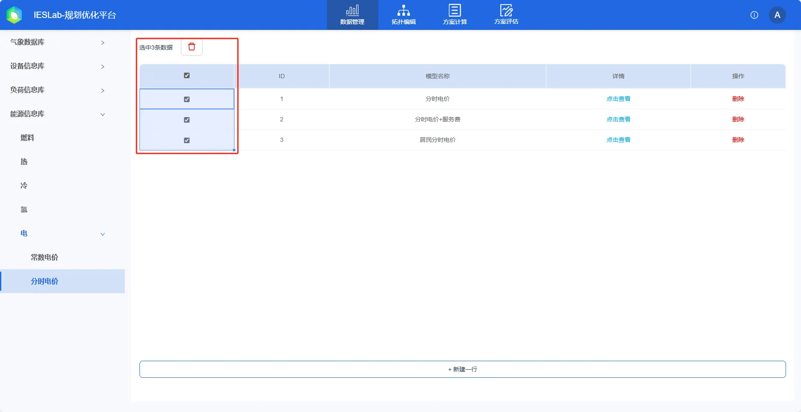
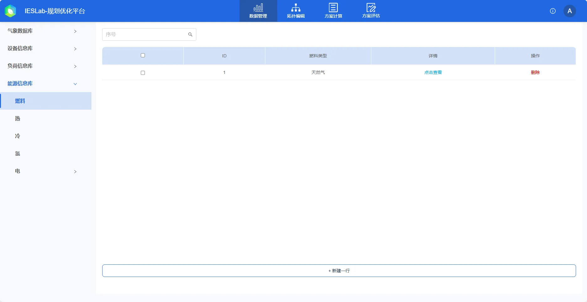
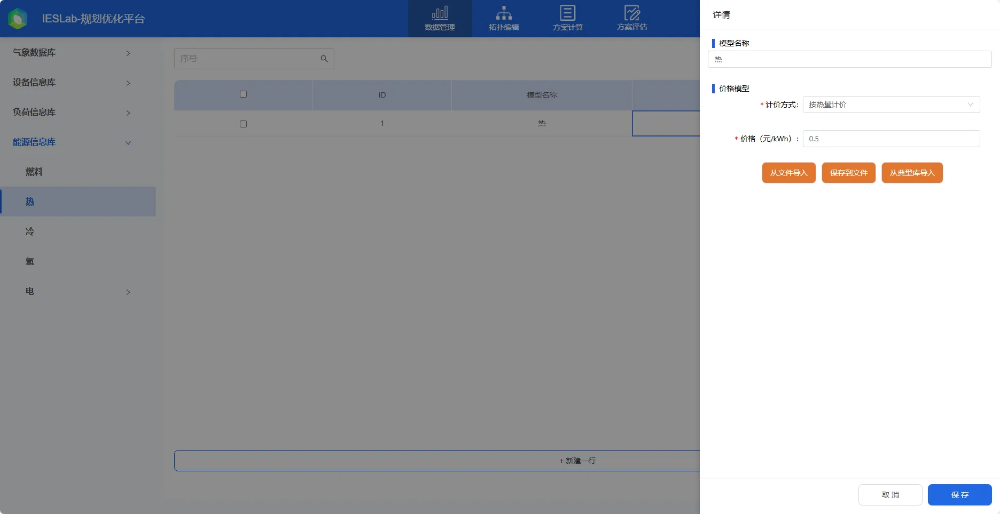
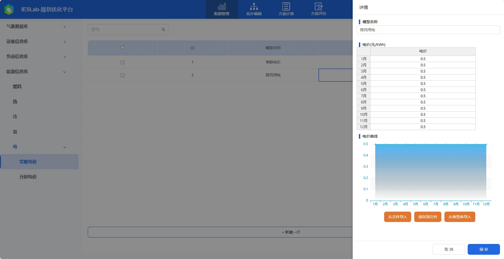
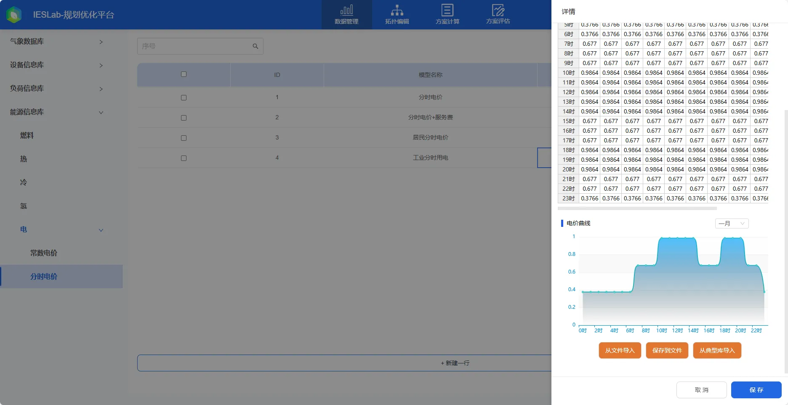
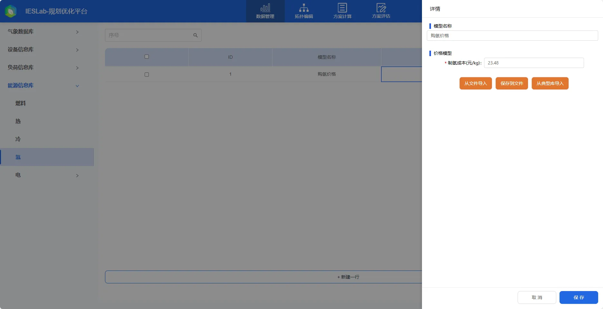

本节主要介绍能源信息库的计价模型、参数录入、编辑、导入及导出等功能使用方法，并通过常见问题答疑快速熟悉能源信息库的基本使用方法。

## 功能定义

录入编辑燃料、电冷热价格模型

## 功能说明

用户可在能源信息库中建立**燃料、电、冷、热、氢**等能源的价格等信息，用于计算系统**经济性及环保性**指标。拓扑编辑模块可以选择对应价格模型，用户绑定该能源信息后平台将自动关联并纳入环保性和经济性的计算。

### 能源信息管理

### 新建与删除

点击**新建一行**按钮，会自动创建一个新的可选设备并弹出设备参数编辑框。

在页面右上方的**搜索输入框**，在输入框中输入负荷名称等任意关键字，点击放大镜**🔍**或回车确定，即可进行模糊搜索或筛选（关键字不区分大小写）。清空输入框后，点击放大镜**🔍**或回车确定可显示所有负荷。

如果需要删除设备，点击列表右侧的**删除**按钮，即可进行单个删除。
点击设备信息左侧的选中框，点击“**删除**”按钮，可将选中的设备信息删除

### 能源参数编辑

在卡片模式下，点击能源所在的卡片或**编辑**；在列表模式下能源所在的行或**编辑**，即可编辑能源参数信息。修改成功后，点击**保存**完成修改并保存；点击**取消**放弃修改。若修改后点击非编辑区域的左侧空白阴影区域，则会弹出告警框，可选择**保存**、**不保存**或**返回**编辑区域。当用户未修改参数，左侧空白阴影区域则会隐藏编辑区域。

#### 导出与导入
在编辑区域下方有**从文件导入**、**保存到文件**和**从典型库导入**快捷键，当展示内容较多时，可使用鼠标滚轮向下滑动或选中编辑区域右侧的滑块下拉即可看到。

点击**保存到文件**会将该能源相关参数另存为 excel 文件。

点击**从文件导入**将会弹出文件选择框，选择相应类别及种类的能源参数 excel 文件后，平台将会自动校验文件格式，若格式无误会覆盖原能源参数；若格式有误将会提示**表格格式不正确!**。用户可以先**保存到文件**，参照导出文件的格式进行修改，再进行**从文件导入**。

#### 从典型库导入
点击编辑区域下方的**从典型库导入**快捷键，在弹出的**典型库**选择框中，选择厂商和型号后会自动显示能源参数信息，点击**确定**后，在弹出的**加载典型库**框中选择**确定**，将会**覆盖**当前能源参数，点击编辑区域下方的**保存**完成典型库导入。

### 燃料价格

燃料：内置典型库，主要包含煤炭天然气等，燃料热值（MJ/计量单位）用于计算燃料的消耗量，分月价格用于计算燃料的购置支出，污染物排放系数则用于计算CO2等污染物排放量。

### 冷/热价格
供冷和供热的价格通常受到许多因素的影响，包括能源成本、运营和维护成本、政府政策和市场竞争等。常见的计价方法是按热量计价。

按热量计价是按照建筑物或设备的热量消耗来计价。这种方法的优点是可以鼓励用户减少能源消耗，并且可以根据建筑物或设备的实际负荷进行调整。但是，它需要测量和记录每个用户的热量消耗，这需要安装和运行热量计量设备，增加了成本和管理难度。

### 电价

电价模型平台提供了分月**常数电价**和**分时电价**。在综合能源项目中，运营商一般通过向电网购电，通过建设高效的综合能源系统，向用户提供能源并获取盈利。平台绑定用电/冷/热计价模型用于计算项目收入。电网及用燃料的设备的计价模型则用于计算项目支出。

特别地，平台提供**两部制**电费计价模式，两部制电价分成**基本电价**与**电度电价**两部。基本电价一般是按照工业企业的变压器容量或最大需量作为计算电价的依据；电度电价，是按用实际用电量（有功电量）计算的电价。
平台的需量电费计价模型绑定**常数电价**,按照电负荷最大需量计算基础电费,最大需量的基本电费=需量电费计价模型×最大需量。

常数电价：即单一制电价，只按用户的用电量（有功电量）计收电费，其中电价中有的还实行峰谷分时电价。它适用于居民生活用电、照明用电、商业用电、非工业用电和普通工业用电等。

分时电价：即两部制电价中的一部分，按用户的有功用电量计收电费。在电度电价中，有的还实行峰谷分时电价及丰枯季节电价。适用于居民生活用电、商业用电、普通工业用电、大工业用户。

### 氢价格
氢源价格模型主要分为**化石燃料制氢和运氢槽车**两类。

化石燃料制氢如甲烷制氢等，输入制氢成本(元/kg)即可。

运氢槽车则提供了**简化模型和详细模型**两种，简化模型输入制氢成本(元/kg)和附加成本(元/kg)；详细模型输入有效卸氢率(%)、制氢成本(元/kg)、压缩成本(元/kg)、卸车成本(元/kg)和运输成本(元/kg)。

## 常见问题

1. 价格模型有什么意义？  
   平台的综合能源系统主要承担运营商投资者的角色，运营商通过建设高效的综合能源系统，从外部购买能源（如电网），向多能用户提供多种能源，对负荷收取对应的电费及冷热费用；因此有电冷热负荷处有收入；其支出主要为电网购电和燃料购置费等。

2. 典型库中是否包含所有城市的电价信息，能够自动补全？  
   平台典型库内置了部分典型的电价信息，暂不支持自动补全所有城市的电价信息。
