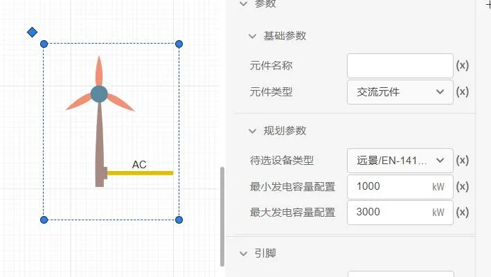
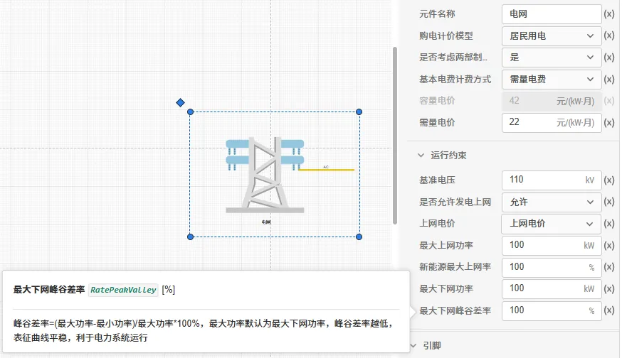

本节介绍拓扑编辑模块中**元件参数设置**的完整方法：设备规划设置、运行优化设置、数据绑定，并针对"参数不会设、数值不合理、漏绑上网电价导致无法求解"等高频问题给出**参数含义、合理取值范围、典型配置示例与排错流程**。

> **设置参数的三个层次**，务必按顺序完成，缺一层都会导致计算异常：
>
> 1. **规划设置**——这个设备是"交给平台选型"还是"我已定好型号"？（决定优化变量）
> 2. **运行设置**——运行方式是"平台优化"还是"我给定策略"？（决定仿真/优化边界）
> 3. **数据绑定**——设备型号、负荷、电价、燃料是否绑定到位？（决定模型有没有数据）
>
> **延伸阅读（与《优化计算》模块衔接）**：本文档讲"拓扑层如何把参数设对"；更底层的**优化模型原理**（目标 / 变量 / 约束 / 惩罚项）与**结果正确性判定方法**见 [《优化计算·优化数学模型》](../../../60-optimization-module/10-fundamentals/index.md#3-优化数学模型) 与 [《优化计算·结果正确性如何判定》](../../../60-optimization-module/10-fundamentals/index.md#8-结果正确性如何判定)；求解失败后的逐类排查见 [《优化计算·结果查看·优化调试技巧》](../../../60-optimization-module/30-results-tab/index.md#优化调试技巧)。

> 设置完成后，建议用文末[自检清单](#7-参数设置自检清单)逐项核对再点"开始计算"。

---

## 1. 功能定义

在数据管理模块录入的**设备、负荷、能源信息**等基础参数，需要在拓扑编辑模块绑定到具体元件上，才能参与优化计算。绑定关系决定了模型"用哪套数据算"。

---

## 2. 规划参数设置

### 2.1 设备待选型（推荐用于规划阶段）

若项目的设备型号和配置台数/容量**尚未确定**，选择 **设备待选型**——无需绑定设备型号及台数，交由平台在您给定的候选池与容量范围内自动寻优。

此时**必须**在"待选设备类型"中选中数据管理模块录入的设备型号，并设置**容量配置范围**，否则平台没有选型空间。

下图以风机为例展示"容量配置范围"的设定界面——容量上下限共同决定优化变量的可行域（来自 [《优化计算·设备选型与定容》](../../../60-optimization-module/10-fundamentals/index.md#21-设备选型与定容)）：



> **选型边界的本质**：容量上限/下限共同决定优化变量的可行域——下限即"至少装多少"、上限即"最多装多少"；上限过小会人为压制经济性最优配置，下限大于 0 表示"本项目必须上该设备"。更系统的约束分类（系统级合规约束 vs 设备运行约束）见 [《优化计算·约束条件》](../../../60-optimization-module/10-fundamentals/index.md#34-约束条件)。

### 2.2 设备定型定容

当项目**已确定**设备型号及台数（例如已完成采购、或做既有系统改造评估），需在拓扑中指定具体设备型号并填写台数，此时该设备不再作为优化变量。

> **选型 vs 定型的判据**：问自己"这个型号/台数是不是已经板上钉钉"。规划可研阶段几乎都应是**待选型**；只有"已建成、只评估运行"的场景才用定型。

---

## 3. 仿真参数设置

选择计算模式或上传仿真出力曲线等参数，以指定优化计算的边界。

---

## 4. 数据绑定（必绑项清单）

### 4.1 设备参数绑定

在数据管理模块录入源网荷储设备的基础参数后，拓扑元件通过"待选设备类型"绑定，绑定后自动带出厂家、型号与额定运行参数，建议都绑定设备型号，仅当无法确定设备型号时，才选择“由算法选型定容”。

### 4.2 负荷绑定

平台提供**典型日负荷（8760h）**、**分月详细负荷**和**自定义负荷**三种模型。在数据管理模块建立**电/冷/热/氢**负荷模型后，拓扑中的负荷元件即可绑定。

### 4.3 电价绑定

平台中的综合能源系统承担"投资建设运营者"角色：运营商从外部购买一次能源（产生**支出**），通过高效系统向多能用户供能并收费（产生**收入**）。因此在**外部电源**（购电支出、上网收入）与**电冷热负荷**（用能收入）处需要绑定价格模型。

| 元件                   | 计价模型           | 收支方向       | 说明                                          |
| :--------------------- | :----------------- | :------------- | :-------------------------------------------- |
| **外部电源**     | **购电计价** | **支出** | 计算从外部电网购电的费用                      |
| **外部电源**     | **上网电价** | **收入** | 计算新能源反送电网的收益，**见第 5 章** |
| **电/冷/热负荷** | **用电计价** | **收入** | 计算向用户供能收取的费用                      |

### 4.4 燃料绑定

燃料（煤、天然气等）用于燃气锅炉等一次能源转换设备。**燃料价格**用于计算燃料购置费用（支出）。

---

## 5. 上网电价绑定专题

> 本节是整篇文档最重要的一节——**最易漏、最易致错、也最容易导致模型无法求解**。

> **这是导致"无法求解/结果异常"的第一高频原因。** 请务必逐条核对。

### 5.1 相关参数一览（外部电源元件）



| 参数名           | 键值                  | 单位   | 生效条件         | 说明                                                            |
| :--------------- | :-------------------- | :----- | :--------------- | :-------------------------------------------------------------- |
| 是否允许发电上网 | `IsPowerToGrid`     | —     | —               | **总开关**。选"不允许"时，以下上网参数全部失效            |
| 发电上网价格     | `PricePowerToGrid`  | 元/kWh | 仅当"允许"时生效 | **上网电价**，未填/为 0 则上网收益为 0                    |
| 最大发电上网功率 | `MaxiumPowerToGrid` | kW     | 仅当"允许"时生效 | 允许反送的最大功率                                              |
| 最大上网率       | `MaxFeedinRatio`    | %      | 仅当"允许"时生效 | 上网电量占总可用发电量的比例上限；**绿电直连一般 ≤ 20%** |
| 最大供电功率     | `MaxiumPowerSupply` | kW     | —               | 电网允许的最大下网（购电）功率                                  |
| 峰谷差率上限     | `RatePeakValley`    | %      | —               | 约束下网功率波动幅度                                            |

### 5.2 为什么会"无法求解"——机理说明

优化模型要求**每一个时刻、每一种能源载体都严格能量平衡**。当新能源大发而负荷较低时，富余电力必须有去处。可用的"去处"只有三个：

```
富余电力去向：上网反送、储能吸收、弃电（弃风弃光）
```

**如果三个去向同时被堵死，能量平衡约束就无解（Infeasible）**：

| 堵死原因      | 对应设置                                                                            | 结果           |
| :------------ | :---------------------------------------------------------------------------------- | :------------- |
| ① 不能上网   | `IsPowerToGrid` = 不允许，或 `MaxiumPowerToGrid` = 0，或 `MaxFeedinRatio` = 0 | 富余电无法反送 |
| ② 储能吸不下 | 未配储能，或容量范围过小，或 SOC 上下限过窄                                         | 富余电无处存   |
| ③ 不许弃电   | 弃电惩罚设得极高，或弃电率约束上限设为 0                                            | 富余电不能弃   |

> **结论**：**只要"不允许上网"或"上网电价未绑定"，就必须给富余电力留出储能或弃电通道**；反之亦然。三者至少要有一个通畅。

### 5.3 未绑定上网电价的两类典型后果

1. **收益失真（最常见）**：发电上网价格`PricePowerToGrid` 留空或为 0 → 上网收益计为 0 → 优化"不愿"上网 → 转而大量弃电或强配储能 → 方案投资虚高、自消纳率虚高，财务指标偏离真实。
2. **求解失败**：若同时设置了严格的上网/消纳约束（如 最大发电上网功率`MaxFeedinRatio` 与自消纳率约束并存），而上网电价为 0 导致上网经济性不成立，约束之间可能互相矛盾 → 无解或大量松弛告警。

### 5.4 正确配置步骤

1. 在**外部电源**元件将 **是否允许发电上网**（`IsPowerToGrid`）设为 **允许**（存在新能源反送需求时）；
2. 填写 **发电上网价格**（`PricePowerToGrid`，元/kWh）——按当地脱硫煤标杆电价或绿电交易价格填写，**不可留空**；
3. 填写 **最大发电上网功率**（`MaxiumPowerToGrid`，kW）——按并网点反送能力填写；
4. 设置 **最大上网率**（`MaxFeedinRatio`，%）——绿电直连项目按政策取 **≤ 20**；
5. 确认 **购电计价模型**（`PurchasePriceModel`）已绑定，否则购电支出为 0，方案失真。

> **反向检查**：若项目**确实不允许上网**（如孤岛系统），请将 `IsPowerToGrid` 设为"不允许"，并**务必**配置足够储能或允许弃电（弃电惩罚取合理值、不设弃电率=0），否则极易无解。

> **比率守恒提醒**：对任意新能源发电时刻，恒有 **上网 + 自消纳 + 弃电 = 100%**。`MaxFeedinRatio`（最大上网率）不是孤立上限，而是与自消纳率、弃电率共同瓜分发电量，三者必须至少留出一个非零通道，否则违反守恒。详见 [《计算方案配置·比率守恒》](../../../60-optimization-module/20-job-config/index.md#25-比率守恒：上网-自消纳-弃电-1)。

---

## 6. 关键参数合理取值范围速查

数值填错是第二大错误来源。下表列出高频参数、合理区间与填错的后果。

### 6.1 外部电源

| 参数                              | 合理范围                           | 填错的后果                                                                                   |
| :-------------------------------- | :--------------------------------- | :------------------------------------------------------------------------------------------- |
| 最大供电功率`MaxiumPowerSupply` | > 0，通常 ≥ 最大负荷的 1.0~1.5 倍 | 填**0** 或过小 → 购电通道被封死 → **缺电、大量缺供惩罚甚至无解**               |
| 最大上网率`MaxFeedinRatio`      | 0~100（绿电直连 ≤ 20）            | 填 0 等于禁止上网；与"允许上网"矛盾时约束冲突                                                |
| 峰谷差率上限`RatePeakValley`    | 0-100，填写务必慎重                | 填**0** 或过小 → 下网功率不允许波动 → 与负荷波动直接矛盾 → **无解或强配储能** |
| 上网电价`PricePowerToGrid`      | > 0（元/kWh）                      | 留空/为 0 → 上网收益为 0 → 见 5.3                                                          |

### 6.2 储能（蓄电池）

| 参数                                                          | 合理范围                                      | 填错的后果                                                 |
| :------------------------------------------------------------ | :-------------------------------------------- | :--------------------------------------------------------- |
| 最大蓄电 SOC`maxPowerStorage`                               | 0~1 的**小数**（如 0.95）               | **填 95（百分制）→ 单位错误**，结果数量级失真       |
| 最小蓄电 SOC`minPowerStorage`                               | 0~1，且**必须小于** `maxPowerStorage` | **min ≥ max → 储能不可用 → 无解**                 |
| 初始蓄电比例`initialPowerStorage`                           | 介于 min 与 max 之间                          | 超出区间 → 与 SOC 约束矛盾 → 无解                        |
| 充/放电效率`ChargingEfficiency` / `DischargingEfficiency` | **0~1 的小数**（如 0.95）               | 填 95 → 效率被放大 100 倍，储能"无损耗套利"，结果完全失真 |
| 最大充/放电功率`MaxChargingPower` / `MaxDischargingPower` | > 0（kW）                                     | 填 0 → 储能无法工作                                       |
| 循环电充放次数`PowCycle`                                    | 按电池规格（如 3000~6000）                    | 填得过小 → 储能循环受限 → 弃电增加甚至无解               |
| 容量配置范围`Mini/MaxStorageCapacity`                       | min ≤ max                                    | **min > max → 无解**                                |

> **单位陷阱（务必注意）**：数据管理模块中**设备效率类参数为 0~1 的小数**；而拓扑与方案中的**比率类参数（上网率、自消纳率、峰谷差率、SOC 上下限）多为百分数或小数**，请按界面标注填写。把 0.95 填成 95 是"结果偏大/偏小两个数量级"的典型原因。

### 6.3 通用

- **容量配置范围**：下限 ≤ 上限；下限为 0 表示可不装该设备。
- **采购成本/运维成本**：单位分别为 万元/台、万元/年、元/kWh，填错量级会直接扭曲选型结果。
- **设备寿命**：按厂家数据填写（光伏约 25 年、蓄电池约 10 年），影响全生命周期替换成本。
- **惩罚项量级**：缺电惩罚（电不平衡惩罚 ）、弃电惩罚 等决定"违反约束的代价"，量级设错会直接改变优化取向。其原理与默认取值见 [《优化计算·惩罚项》](../../../60-optimization-module/10-fundamentals/index.md#35-惩罚项)。

---

## 7. 参数设置自检清单

点"开始计算"前，请逐项确认：

- [ ] 每个设备：已明确"待选型"（含候选型号 + 容量范围）或"定型定容"（含型号 + 台数）；
- [ ] 每个设备：已明确"是否优化该设备"；若选"否"，运行策略曲线已填写完整；
- [ ] **外部电源**：购电计价模型已绑定；**若允许上网，则 `PricePowerToGrid` 已填写且 > 0**；
- [ ] **外部电源**：最大发电上网功率 > 0 且不小于最大负荷；
- [ ] **外部电源**：峰谷差率是否设置合理；最大上网率与项目政策一致；
- [ ] **储能**：`minPowerStorage` < `maxPowerStorage`，SOC/效率均为 **0~1 小数**；
- [ ] 负荷元件：电/冷/热/氢负荷均已绑定，且**用电计价模型**已绑定（否则收入为 0）；
- [ ] 燃料设备：燃料模型已绑定（否则燃料支出为 0）；
- [ ] 富余电力有出路：上网 / 储能 / 弃电**至少一条通畅**（见 5.2）。

> 更完整的"结果正确性判定清单"见 [《优化计算·判定清单（可打印对照）》](../../../60-optimization-module/10-fundamentals/index.md#88-判定清单（可打印对照）)，可与本文档自检清单配合使用。

## 8. 常见问题

可以不用绑定参数吗？哪些元件必须绑定参数？

:   必须绑定：所有**设备**（待选设备类型）、**负荷**（电/冷/热/氢）、**外部电源**（购电计价模型）、**燃料设备**（燃料模型）。未绑定的元件不参与收支计算或无机型数据，会导致结果失真甚至无解。

数据管理模块输入参数后，为什么拓扑编辑模块找不到？

:   请尝试：1. 刷新页面或重新登录；2. 检查数据管理模块是否**保存成功**；3. 确认录入的**设备类别**与拓扑元件类别一致（如"蓄电池"只会出现在储能元件的候选列表中）。

为什么我的方案里储能"装了但不用"？

:   常见原因：① 充放电效率填成了百分制（如 95 而非 0.95）；② `minPowerStorage` ≥ `maxPowerStorage` 导致可用区间为空；③ 电价峰谷差太小，储能套利空间不足——这是**正常的经济结论**，不是错误。

为什么提示"缺电"/结果中出现大量缺供惩罚？

:   说明购电与发电能力不足以满足负荷。检查：外部电源 `MaxiumPowerSupply` 是否过小、设备容量范围上限是否过低、以及是否合理配置了储能。

上网电价为 0 会怎样，是不是可以留空？

:   **不建议留空。** 留空等价于上网收益为 0，优化将不再选择上网，转而弃电或强配储能，导致投资虚高、财务指标失真；严重时与消纳类约束冲突导致无解。详见[第 5 章](#5-上网电价绑定专题)。

参数设错了，如何快速定位是哪一项？

:   优先检查"数值为 0 的项"与"百分制/小数填反的项"，这两类占了绝大多数。其次按[第 7 章](#7-参数设置自检清单)逐项核对。
