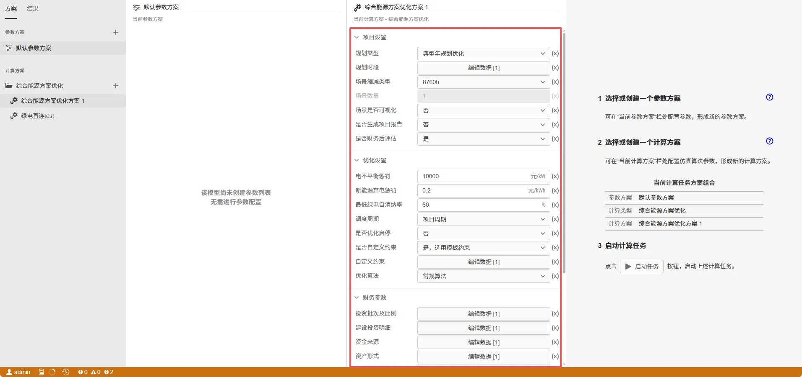

在拓扑编辑模块中完成系统拓扑结构搭建后，需要进行元件设备参数绑定，设定设备容量配置范围等约束条件、确定设备运行方式是否优化等，方可进行后续规划设计和运行优化。

## 流程总览

拓扑建模分两步，顺序不可颠倒——**先有结构，再有参数**：

```
① 搭建拓扑                    ② 设置参数
   放置元件、建立连接       →     绑定数据、设定规划与运行方式
   （结构：谁和谁相连）           （参数：装多大、怎么跑、什么价）
   [10-搭建拓扑]                 [20-参数设置]
```

| 步骤 | 子文档 | 做什么 |
| :--- | :--- | :--- |
| ① | [搭建拓扑](./10-building-topology/index.md) | 从元件库拖放设备与负荷到画布，按能源载体连接成网；平台自动识别交直流母线与节点-支路关系 |
| ② | [设置参数](./20-setting-params/index.md) | 绑定设备型号/负荷/电价/燃料数据，设定规划方式（待选型/定型定容）与运行方式，配置上网与购电参数 |

## ② 设置参数：四件事

进入 [设置参数](./20-setting-params/index.md) 后，请按以下顺序逐项完成。缺一层都会导致计算异常或结果失真：

1. **规划设置**——这个设备是"交给平台选型"还是"我已定好型号"？（决定它是不是优化变量；含候选型号池与**容量配置范围**）
2. **运行设置**——运行方式是"平台优化"还是"我给定策略"？（选"否"时必须提供全年仿真策略曲线）
3. **数据绑定**——设备型号、负荷、电价、燃料是否绑定到位？（决定模型有没有数据）
4. **上网/购电参数**——外部电源是否允许上网、上网电价是否绑定、最大供电功率与峰谷差率是否合理？（最易漏、最易致错，详见 [设置参数·上网电价绑定专题](./20-setting-params/index.md#5-上网电价绑定专题)）

> **参数含义与合理取值**：各参数的物理含义、合理取值范围、典型配置与排错流程，已在 [设置参数](./20-setting-params/index.md) 中详述。其中"上网率/自消纳率/峰谷差率/SOC 上下限"等**比率类参数为百分数**，而设备效率为 **0~1 小数**——两者单位不同，是最常踩的单位坑。

## 为什么要"自动识别"而非手动声明

平台在您手动搭建的拓扑基础上，**自动识别**交直流母线、电压等级与节点-支路-设备的连接关系，并据此推导能量平衡方程。这意味着：

- 您**无需**手动声明"哪个设备给哪个负荷供能"——连线即表达供能关系；
- 拓扑改动后平衡关系自动重算，不必手工维护方程；
- 但也带来一条要求：**连线必须完整且正确**。漏连、错连会直接导致能量平衡异常（缺电或弃电），而且不会报错。

> **建议**：拓扑搭完后，先做一次小规模试算（如月度平均场景），确认能量平衡图正常，再进入精细配置。把问题暴露在小规模算例上，排查成本远低于全年 8760h 算例。

## 常见陷阱速查

| 陷阱 | 症状 | 处理 |
| :--- | :--- | :--- |
| **未绑定上网电价** | 大量弃电、同时充放电告警、甚至无解 | 在[数据管理](../../40-data-module/index.md#最易遗漏-上网电价绑定)绑定上网电价，并在拓扑中绑定给外部电源 |
| **`MaxFeedinRatio` 误填 0.2** | 上网通道几乎关闭，富余电无处可去 | 该参数为**百分数**，填 **20** 表示 20% |
| **`MaxiumPowerSupply` 留默认** | 与峰谷差率联用时强制大量购电，制造不平衡 | 按实际最大需量填写（如 1.2 倍最大负荷） |
| **效率填成百分数** | 设备出力放大 100 倍 | 数据模块的设备效率为 **0~1 小数** |
| **比率参数填成小数** | 约束形同虚设或过紧 | 上网率/自消纳率/SOC 等为 **0~100 百分数** |
| **运行优化设为"否"却未填策略** | 该设备按零出力或异常曲线运行 | 选择"否"时必须同时提供**运行策略曲线** |

完整的参数说明、合理取值范围、自检清单与无法求解的排查流程，见[设置参数](./20-setting-params/index.md)。

## 下一步：进入《优化计算》模块

参数设置只是"把数据喂给模型"。真正的优化求解、场景缩减、约束配置与结果判定在 [《优化计算》](../../60-optimization-module/index.md) 模块完成：

- **[计算方案配置](../../60-optimization-module/20-job-config/index.md)**：设置时间范围、求解器、全局系统约束（含自定义 DSL）、软约束松弛机制等——这是参数设置之后、点击"开始计算"之前的最后一步。

  

- **[优化计算原理](../../60-optimization-module/10-fundamentals/index.md)**：理解目标 / 变量 / 约束 / 惩罚项，才能明白"为什么这些参数会影响结果"。
- **[结果查看与调试](../../60-optimization-module/30-results-tab/index.md)**：求解后在此查看能量平衡图、判定结果正确性、逐类排查缺电 / 弃电 / 约束松弛。

> **衔接提示**：拓扑层"参数设对" + 优化层"方案配好" + 结果层"判定通过"，三者缺一不可。参数设错的典型表现（缺电、弃电、约束被买通）在 [结果查看·优化调试技巧](../../60-optimization-module/30-results-tab/index.md#优化调试技巧) 有逐类对照。

import DocCardList from '@theme/DocCardList';

<DocCardList />
