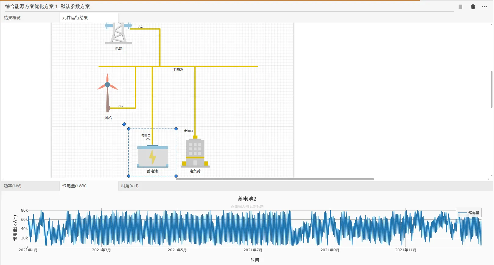
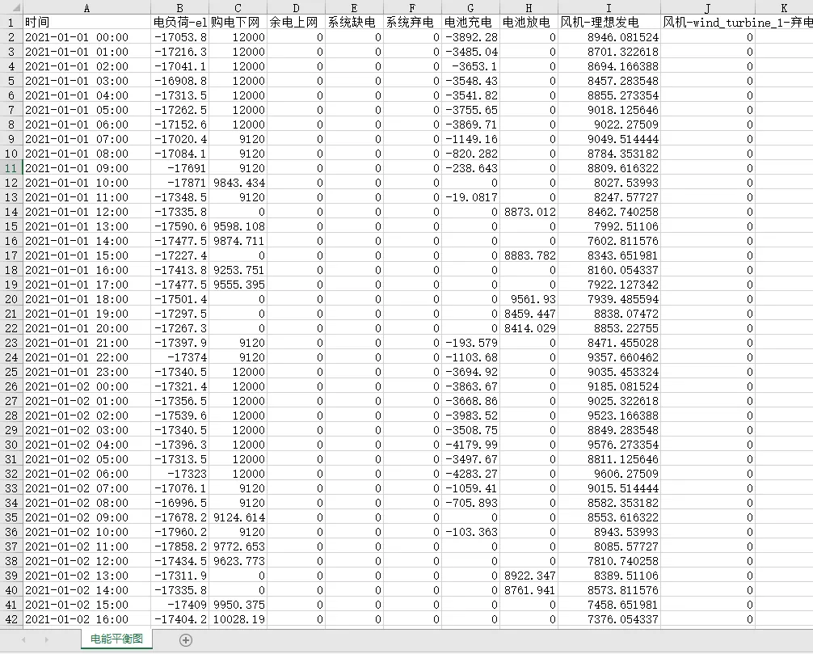

本节主要介绍 IESLab 规划优化平台启动优化计算和查看优化结果的方法，包括统计性指标表格、曲线、能量平衡图、能量平衡表、项目报告、元件时序运行结果等，并汇集了典型工程场景（绿电直连、AIDC、风光储）的配置指南与常见问题的调试建议。

> **文档导航**：
>
> - **优化原理**（目标函数、约束、求解、典型场景、财务基础理论）见 [基本原理](../10-fundamentals/index.md)；
> - **计算方案配置**（系统约束 DSL 与参数详解）见 [计算方案配置](../20-job-config/index.md)；
> - **本篇（结果页面）**：优化结果的查看与图表详解、常见问题调试。

## 功能定义

展示 IESLab 规划优化的优化结果。优化完成后，结果页面分为**结果概览**与**元件运行结果**两个标签页，并提供能量平衡图、能量平衡表、Word 项目报告与财务报表等输出。

## 功能说明

### 启动计算

通过点击**启动任务**按钮能执行当前计算方案下的规划优化。计算过程中页面会实时推送过程状态与已获得的优选方案。方案参数的计算方案配置界面见[计算方案配置](../20-job-config/index.md)。

### 结果概览

在计算完成后，结果页面的**结果概览**选项卡下会显示以下内容（如下图所示）。


#### 1. 运行日志

展示运行过程中的日志信息。

#### 2. 方案信息汇总

展示方案最重要的**投资成本**、**主要指标**和**负荷统计指标**，并绘制**方案初步财务现金流图**（历年收入与支出对比柱状图）。

方案信息汇总表的主要指标（示例）：

| 指标                                 | 含义                                       |
| :----------------------------------- | :----------------------------------------- |
| 年综合成本 / 设备总投资 / 设备年投资 | 建设与运行的经济性指标                     |
| 年运维 / 年收入 / 年支出             | 年度运维成本与经营收支                     |
| 储能年收益                           | 储能套利带来的净收益                       |
| 绿电量 / 年供电量 / 年电负荷         | 能源产出与消耗统计                         |
| 弃电率 / 上网率 / 消纳率             | 新能源利用情况                             |
| 绿电占用电比                         | 绿电直连合规指标（自用绿电 ÷ 总用电负荷） |

#### 3. 元件详细统计结果

按设备逐一统计其**基本配置**（台数、总容量、总价）与**运行指标**（最大/最小功率、年用电/发电量、峰谷差率、循环次数等）。不同设备类型的统计项不同：

| 设备类型           | 典型统计项                                     |
| :----------------- | :--------------------------------------------- |
| 负荷类             | 最大/平均负荷、年总负荷、年售电收入            |
| 电源类（外部电源） | 最大下网功率、年下网电量、年购电支出、峰谷差率 |
| 储能类             | 台数、总容量、总价、年循环次数、日循环次数     |
| 新能源发电类       | 台数、总容量、年发电小时数、弃风/弃光率        |

#### 4. 能量平衡图

优化完成后自动生成电/热/冷/氢等载体的**能量平衡图**。

**正负堆叠图的读法**：图中**正值（零线上方）向上**为供应侧（发电/供热/产氢、购电下网），**负值（零线下方）向下**为消耗侧（负荷/用热/用氢、电池充电、弃电），可直观看出各时段供需缺口与设备利用情况；图例区分"理想发电 vs 弃电"、"购电 vs 上网"、"充电 vs 放电"等方向，便于定位消纳瓶颈（如弃电量面积过大即表示新能源消纳不足）。


#### 5. 典型日结果（可选）

当选择典型场景可视化时，平台将展示典型场景结果曲线。


**典型日曲线图解读**（如上图）：横轴为一天 24 小时，纵轴为对应的物理量（辐射强度 W/m² 或负荷 kW），每条曲线代表一个典型日（聚类结果）。通过对比各典型日曲线的形态差异，可直观检查聚类效果——形态差异合理、权重分布均衡即聚类正常。

#### 6. 财务后评估报表（可选）

开启"优化结果后评估"后，平台自动计算并输出 **11 张标准财务报表**，报表原理与财务参数见[计算方案配置 · 报表计算原理](../20-job-config/index.md#三-报表计算原理)：

| 序号 | 报表                               | 主要内容                                        |
| :--- | :--------------------------------- | :---------------------------------------------- |
| 1    | 营业收入、税金、附加和增值税估算表 | 各类能源销售收入、增值税销项/进项、城建税及附加 |
| 2    | 资产折旧与摊销估算表               | 固定资产/无形资产原值、折旧、摊销与净值         |
| 3    | 流动资金估算表                     | 应收账款、存货、现金、应付账款与流动资金        |
| 4    | 投资使用计划与资金筹措表           | 项目总投资、资本金与债务资金筹措                |
| 5    | 借款还本付息计划表                 | 长期/流动资金/短期借款的还本付息与余额          |
| 6    | 总成本费用估算表                   | 生产成本、财务费用、固定/可变成本、经营成本     |
| 7    | 利润与利润分配表                   | 利润总额、所得税、净利润、公积金与未分配利润    |
| 8    | 项目总投资现金流量表               | 融资前口径现金流，所得税前/后净现金流量         |
| 9    | 项目资本金现金流量表               | 融资后口径现金流，投资者实际收支                |
| 10   | 财务计划现金流量表                 | 经营/投资/筹资活动现金流与累计盈余资金          |
| 11   | 资产负债表                         | 资产、负债、所有者权益及平衡校验                |

**概览表**（经济性指标汇总）：工程动态投资、总投资收益率、资本金利润率、年销售收入、平均总成本费用、资本金内部收益率、项目投资内部收益率（税前/税后）、财务净现值（税前/税后）、投资回报期（税前/税后）。

### 元件运行结果

**元件运行结果**标签页展示每个元件的全年时序运行曲线。上方为系统拓扑图（点击元件切换查看对象），下方为该元件的多种维度曲线：

| 视图                    | 内容                                  | 示例                        |
| :---------------------- | :------------------------------------ | :-------------------------- |
| **功率曲线**      | 设备逐时出力/充放电功率（kW）         | 蓄电池充电/放电功率         |
| **储电量曲线**    | 储能设备全年 8760h 储电量（kWh，SOC） | 蓄电池"储电量(kWh)"全年曲线 |
| **相角/电压曲线** | 电气量时序（交流/直流接口）           | 相角(rad)、电压(kV)         |



### 能量平衡表

将能量平衡图的逐时数据以表格形式导出（Excel），每个能量流分项一列、每小时一行，供二次加工与存档。列组成为：

| 列类别   | 内容                         | 说明                     |
| :------- | :--------------------------- | :----------------------- |
| 时间     | 年月日 时                    | 逐时数据行               |
| 负荷侧   | 电负荷等                     | 系统需求（负值）         |
| 电网交互 | 购电下网 / 余电上网          | 与外部电网的电力交换     |
| 可靠性   | 系统缺电 / 系统弃电          | 缺供与弃能量（正常为 0） |
| 储能     | 电池充电 / 电池放电          | 储能充放电功率           |
| 新能源   | 风机-理想发电 / 风机-弃电 等 | 各设备理想发电与实际弃电 |

> 表中各列数值满足能量守恒：供应项之和 = 消耗项之和。若"系统缺电""系统弃电"列非零，说明存在源荷不平衡，需结合结果告警排查。



### Word 项目报告一键生成

开启"是否生成项目报告"后，优化结束自动生成结构完整、图文并茂、带数据分析的 Word 报告，报告结构如下：

```
1. 项目基本能源情况
   1.1 负荷分析（含各载体负荷特征分析）
   1.2 电网分析
   1.3 峰谷差率分析（典型日 + 全年曲线）
   1.4 可再生能源分析
2. 项目优化信息
   2.1 优化目标
   2.2 约束条件（基础约束 / 全局约束 / 组件特有约束）
3. 优化结果展示
   3.1 方案汇总信息
   3.2 设备配置结果（含关键指标分析）
   3.3 电力电量平衡分析（全年 / 月度 / 月度典型日 / 典型运行工况）
   3.4 氢能平衡分析（及其他载体）
4. 综合评估信息
   4.1 经济性指标
```

月度分析结果显示供应/需求/弃电量与弃电率等指标，并自动配图；所有分析文字均由结果数据实时计算生成——过去一两天手工整理的报告，现在优化结束即自动生成。


## 优化调试技巧

当计算结果异常、求解停滞或无可行解时，可按以下思路在结果页与日志面板中定位问题。

#### 快速定位表

| 现象                                  | 最可能的根因                           | 首查项                                                |
| :------------------------------------ | :------------------------------------- | :---------------------------------------------------- |
| 求解失败 / 提示无可行解               | 约束互相矛盾，或富余电无任何去向       | [第 2 节](#2-无可行解与约束冲突)                       |
| 结果里"系统缺电"非零                  | 购电通道被堵死，或容量不足             | [第 3 节](#3-缺电)                                     |
| 结果里"系统弃电"非零 / 同时充放电告警 | 上网通道未打通或上网电价未绑定         | [第 4 节](#4-弃电与同时充放电)                         |
| 指标看着对，但合规值不达标            | 约束被"买通"（软约束松弛）             | [第 5 节](#5-约束被松弛买通)                           |
| 参数明明填了却毫无作用                | 引擎判定约束"退化"并跳过构建           | [第 6 节](#6-参数设了却不生效)                         |
| 两阶段结果中配置台数/投资统计为空     | 第一阶段配置结果的键名口径与回填不一致 | [基本原理 · 9.8 四层追问](../10-fundamentals/index.md#98-典型异常五-静默失效-约束设置了不等于算正确了) |
| 求解几小时不出结果                    | 模型规模过大或整数变量过多             | [第 1 节](#1-计算停滞或长时间无新方案)                 |

### 0. 先建立三条判据

排障之前，先明确什么叫"结果不可信"。求解器返回结果**只保证**"在您给定的模型与数据下找到了成本最低的可行方案"；如果模型或数据本身有问题，它照样会返回一个"最优的错答案"。因此：

> **判据一**：系统缺电应为 0；
> **判据二**：系统弃电应处于工程可接受水平并已说明原因；
> **判据三**：无约束松弛告警，且各项合规指标的**实际值**达标。

三项只要有一项不满足，就**不要**直接采用该方案。原理详见[基本原理 · 结果正确性判定](../10-fundamentals/index.md#9-结果正确性判定)。

**为什么"有问题却不报错"**：平台把缺电、弃电与约束违反都设计成**带惩罚的软约束**——违反要交罚款，但不禁止。这样模型永远有解（不会因参数互相矛盾直接失败），代价是问题被隐藏进了目标函数。所以"求解成功"和"结果正确"是两件事。

### 1. 计算停滞或长时间无新方案

- 切换至 **显示日志** 面板查看实时输出，确认是否卡在求解器阶段；
- 检查求解时间限制（默认 **1200 s**）与并行线程数（默认 **8**）配置；超时会返回当前已找到的最优解（仍可使用，但注意其最优性间隙可能未收敛）；
- 大规模问题优先做 **场景缩减**（聚类典型日），或改用 **两阶段并行**（先定容、再并行优化运行）；
- 若长期无进展且内存占用高，通常是模型规模过大。按此顺序瘦身：**降低聚类数目 → 收紧设备容量范围 → 减少候选型号数量 → 关闭启停（UC）优化**；
- 整数变量（选型、台数、启停、模式）是耗时的主因。柔性负荷改用**无极模式**可退化为纯 LP，求解效率提升显著。

### 2. 无可行解与约束冲突

无可行解意味着**约束之间互相矛盾，不存在任何方案能同时满足**。平台会给出冲突约束集合（IIS），但更实用的思路是先理解"矛盾通常从哪来"。

**最常见的矛盾来源——富余电没有去处。** 新能源发出的电只有三个出口：

```
富余电力去向： 上网反送、储能吸收、弃电（弃风弃光）
```

三者同时被堵死时，能量平衡约束在数学上无解：

| 出口    | 被堵死的条件                                                                                  |
| :------ | :-------------------------------------------------------------------------------------------- |
| ① 上网 | **是否允许发电上网** = 不允许，或**最大上网功率** = 0，或**最大上网率** = 0 |
| ② 储能 | 未配置储能，或储能容量/功率上限为 0，或 SOC 已顶到上限                                        |
| ③ 弃电 | 弃电惩罚被设得极高，且`curtailment_ratio` 上限被守恒挤压到 0                                |

**排查顺序**：

1. 优先查看 **全局约束** 是否过紧：绿电直连的**绿电占用电比** / **最大上网率**、储能 `PowerGuarantee` 保供、弃电与上网比例等；
2. 检查 **守恒是否被挤爆**：`上网率 + 自消纳率 + 弃电率 = 1`。若上网率 20%、自消纳下限 85%，弃电空间只剩 -5%，直接矛盾；
3. 检查 **设备运行约束**：容量上下限、最小技术出力、爬坡率、储能始末容量一致等设置过严也会触发不可行；
4. **先放开求到解，再逐步收紧**：这是最有效的通用策略——把可疑约束逐一放宽（或暂时删除），确认模型可解后，再逐个加回，加到哪一个失败，那一个就是矛盾源。

### 3. 缺电

**现象**：能量平衡表"系统缺电"列非零；储能长期贴着下限；购电功率顶到上限；日志出现缺电相关告警。

**机理**：某时刻"负荷需求" > "本地发电 + 储能放电 + 外部购电"，缺口记为 `P_powun_p` 并按电不平衡惩罚（默认 10000 元/kW）计罚。

**按命中率从高到低排查**：

| 顺序 | 检查项                           | 说明                                                            |
| :--- | :------------------------------- | :-------------------------------------------------------------- |
| 1    | **最大下网功率**是否被填小 | **最常见根因**。购电通道被堵死，本地又发不够，必然缺电    |
| 2    | 设备容量范围上限是否过低         | 如光伏上限 500 kW，而负荷 2000 kW                               |
| 3    | 负荷曲线单位是否错误             | kW 填成 W 会放大 1000 倍；kWh 填成 kW 会造成时段错位            |
| 4    | 气象数据是否缺失                 | 辐照/风速为空时，光伏/风机等同"没装"                            |
| 5    | 储能是否被锁死无法放电           | **最小蓄电SOC** 过高、`PowerGuarantee` 过大都会锁住容量 |
| 6    | 是否启用了**峰谷差率**     | 见下方陷阱                                                      |

> **峰谷差率陷阱**：峰谷差率按 `P_min / P_max ≥ 1 − 峰谷差率/100` 约束，且式中 `P_max` 取的是**最大下网功率**。若**最大下网功率**远大于实际最大购电功率（其默认值很大），而**峰谷差率**填了 60，则等价于强制每时段至少按**最大下网功率** × 40% 购电，反而制造大量不平衡。
> **规避**：**最大下网功率**按实际最大需量填写（如 1.2 倍最大负荷），不要留默认值；不需要该约束时填 **100**（填 0 属退化值，引擎判定为不生效，同样不推荐）。

### 4. 弃电与同时充放电

**现象**：能量平衡表"系统弃电"列非零；或日志出现"第 N 个典型场景的 H 时存在同时充放现象，不可行"。

**先说结论**：同时充放电**不是**求解器算错。模型的充电功率与放电功率是两个**独立的非负连续变量**，平台**不施加"二选一"的整数互斥约束**（这样可保持纯线性、求解更快）。正常情况下，由于充放电效率损耗，同时充放会白白浪费能量、抬高成本，最优解不会这么做。

**它为什么会发生**：当"弃电惩罚（默认 0.2 元/kWh）"高于"储能充放电的运维损耗成本"时，模型会发现——**用储能边充边放把富余电耗散掉，比交弃电罚款更便宜**。于是同时充放成了"最省钱"的选择。

> 所以，同时充放是一条**诊断线索**，指向的真实病症是：**富余电力没有正当去处**。

**处置（按此顺序）**：

1. **查上网通道是否真的打通**——需同时满足，缺一不可：
   - **是否允许发电上网** = 允许上网；
   - **最大上网功率**（kW）> 0；
   - **最大上网率** > 0（**百分数口径，填 20 表示 20%；误填 0.2 表示 0.2%**）。
2. **在[数据模块](../../40-data-module/index.md)绑定上网电价**。若上网电价为 0，上网毫无收益，模型宁可弃电——这是"未绑定上网电价导致结果异常"的直接原因。
3. **查弃电率上限是否被守恒挤占**：弃电上限由 `1 − 上网率 − 自消纳率下限` 推导。三者关系见[计算方案配置 · 比率守恒](../20-job-config/index.md)。
4. **最后才调惩罚参数**：若确认富余电物理上确实无处可去（如孤岛系统），可适当降低弃电惩罚或提高储能可变运维成本，消除无意义的充放——但这属于**治标**，请先排除第 1、2 项。

### 5. 约束被松弛买通

**现象**：求解成功、结果看起来合理，但某项合规指标（自消纳率、上网率、绿电占用电比）实际未达标；或结果页出现松弛告警。

**机理**：系统级约束默认以软约束实现——引入非负松弛变量 `slack`，允许越限，按 `PenaltySoft`（默认 10）向目标函数追加罚款。于是存在"买通"关系：

> **若"违反约束交的罚款" < "为满足约束多花的投资"，优化就会选择交罚款。**

**判定**：不要只看报告里"写了这条约束"，要直接核对结果指标的**实际值**。

**处置**：

1. 若存在越限，说明惩罚单价相对投资成本偏低 → **调高 `PenaltySoft`**，直到优化认为守规矩更划算；
2. 核查输入数据是否合理（理论出力、负荷曲线是否量级正确）；
3. 确认约束真的生成了——见下一节。

> **保供约束是例外**：保供默认不松弛，惩罚用的是**电不平衡惩罚价**（默认 10000 元/kW），远大于普通软约束的 10——保供违约代价极高，不允许被轻易买通。**若保供出现松弛，说明问题相当严重**，务必排查储能容量配置与极端工况设置。

### 6. 参数设了却不生效

最隐蔽的一类问题：**界面上填了参数，引擎判定该约束"退化"并直接跳过构建，全程无任何报错**。

| 约束类型                               | 不生效的条件                                                     | 正确做法                                                                                      |
| :------------------------------------- | :--------------------------------------------------------------- | :-------------------------------------------------------------------------------------------- |
| 下限类（自消纳率、占用电比）           | 下限 ≤ 0                                                        | 需要生效就填大于 0 的值                                                                       |
| 上限类（弃电率、上网率）               | 上限 ≥ 100%（视为"不限"）**或** 上限 ≤ 0（视为"不允许"） | 需要生效就填 0~100 之间的值                                                                   |
| 上网率约束                             | **最大上网率** = 0，或不允许上网                           | 允许上网并填 0~100 之间的百分数                                                               |
| 保供约束                               | 保供时长 0h                                                     | 需要保供就填大于 0 的小时数                                                                   |
| **自定义表达式约束**             | 求解模式为两阶段                                                 | 模板预设**支持**分阶段；**自定义表达式**与分阶段互斥，请改用统一模型              |
| **最低自消纳率**（计算方案设置） | 填 0 或留空                                                      | 需要生效就填 >0 的百分数（如 65）；若同时配置了"新能源自消纳率"预设模板，**以模板为准** |
| **自定义约束**                   | 自定义约束类型为不支持——此时整张列表被忽略                     | 需要预设/自定义约束生效，请将**约束类型**置为预设或自定义表达式                         |

> **通用工作原则**：**要对结果指标和项目设置做交叉验证**。如项目设置了自消纳率约束≥ 65%，但实际消纳率却为 60%，请务必仔细对照审查。

### 7. 结果图表异常

- **能量平衡图/表出现明显缺供或弃电面积**：查看"系统缺电""系统弃电"列是否非零，按[第 3、4 节](#3-缺电)定位；
- **典型日曲线形态异常**：检查原始气象/负荷数据是否有缺失或单位错误（kW vs kWh）；开启"场景可视化"核查聚类效果；
- **8760 曲线越限或跳变**：检查设备容量上下限、爬坡率与储能始末容量一致约束是否合理；
- **储能 SOC 长期顶在上/下限或日末不归位**：检查**初始蓄电比例** / **最大蓄电SOC** / **最小蓄电SOC** 是否为百分数口径（0~100%），以及充放电效率是否填成百分数（应为 0~1 小数）。

### 8. 求解器与列式

- 平台支持 HiGHS / SCIP / CBC，默认 **HiGHS**；含整数变量（选型、容量、启停 UC、模式）时为 MILP，纯运行优化为 LP；
- 潮流默认 **交直流线性**（AC `ac_linear` + DC `dc`）；
- 最优性间隙默认 1%，时间限制默认 1200 s，线程数默认 8（可在计算方案中调整）。

### 9. 排障方法论 先复现 再修改

最后给一条比任何具体技巧都重要的方法论。面对异常结果，常见的错误做法是"看着像哪里有问题就直接改哪里"——这往往把症状当病因，改完问题换个地方再冒出来，还可能引入新缺陷。

推荐的做法是**先证明、再修改**：

1. **锁定最小复现**：把算例缩到最小（月度平均场景、设备配置范围固定、去掉自定义约束），确认问题是否仍然出现。若消失，说明问题在被去掉的部分里；
2. **二分定位**：逐步加回被去掉的元素，每加一次求解一次，加到哪一步问题复现，那一步就是嫌疑源；
3. **用数据验证假设**：想确认"是不是购电通道被堵死"，就把**最大下网功率**放大 10 倍重算，看缺电是否消失——**让数据说话，而不是靠推测**；
4. **改完立即回归**：修改后重跑同一算例，核对关键指标（成本、配置、缺电/弃电、合规比率）的变化是否符合预期，并把该算例保留为回归基线。

> **调试优先级建议**：**看日志 → 查三个必须为零的量（缺电/弃电/松弛）→ 核对守恒与参数生效性 → 放宽约束定位矛盾源 → 缩减场景/调求解器 → 检查结果图表数据 → 改完回归验证**。
