## 元件定义

氨合成厂（Ammonia Plant）是电-氢-氨耦合系统中的关键化工转换设备，通过哈伯法将氢气与氮气催化合成氨：

$$
\mathrm{N_2 + 3H_2 \;\xrightarrow\; 2NH_3}
$$

合成过程消耗电能并伴随反应热。在综合能源系统规划中，氨厂为波动性新能源提供了**长周期、大容量的储能载体**（氢→氨），并可向下游氨能负荷、氨罐与船用燃料等供能。

## 元件说明

### 属性

CloudPSS 元件包含统一的**属性**选项，其配置方法详见 [参数卡](docs/documents/software/10-xstudio/20-simstudio/40-workbench/20-function-zone/30-design-tab/30-param-panel/index.md) 页面。

### 参数

#### 设备参数

| 参数名 | 键值 (key) | 单位 | 类型 | 描述 |
| :--- | :--- | :--- | :--: | :--- |
| 是否余热回收 | `IsHeatRecovery` |  | 选择 | 开启后回收反应热用于供热/供热网 |
| 生产厂商 | `manufacturer` |  | 文本 | 生产厂商 |
| 设备型号 | `equipType` |  | 文本 | 设备型号 |
| 采购成本 | `PurchaseCost` | 万元/台 | 实数 | 设备采购成本 |
| 固定运维成本 | `FixedOMCost` | 万元/年 | 实数 | 设备固定运维成本 |
| 可变运维成本 | `VariableOMCost` | 元/kWh | 实数 | 设备可变运维成本 |

#### 规划参数

| 参数名 | 键值 (key) | 单位 | 类型 | 描述 |
| :--- | :--- | :--- | :--: | :--- |
| 待选设备类型 | `DeviceSelection` |  | 选择 | 绑定数据管理模块录入的设备型号 |
| 最小合成氨容量配置 | `MiniAmmoniaCapacity` | kW | 实数 | 最小合成氨产能配置 |
| 最大合成氨容量配置 | `MaxAmmoniaCapacity` | kW | 实数 | 最大合成氨产能配置 |

### 引脚

元件包含**氢接口**、**氮接口**（原料输入）与**氨接口**（产物输出），支持线连接与信号名连接。

## 常见问题

氨厂的余热回收有什么作用？
: 开启 `IsHeatRecovery` 后，合成反应释放的热量可并入热网或用于其它供热需求，提升系统能量综合利用效率。

氨厂在优化中的角色是什么？
: 氨厂将多余的氢转化为易储存、易运输的氨，是氢储能的"升级形态"，缓解氢储容量与消纳压力，适合与风光大基地协同的"氢-氨"一体化规划。
