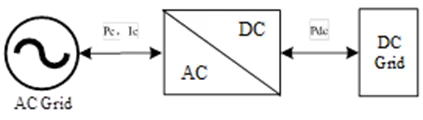

## 元件定义

模块化多电平变流器（Modular Multilevel Converter,MMC）由于具有电压、容量等级易于拓展、谐波含量低、开关频率和运行损耗小等优点，成为目前高压大容量柔性直流输电（Voltage Sourced Converter based High Voltage Direct Current, VSC-HVDC）换流站的主流选择。

模块化多电平变流器，实现交直流转换，其原理示意图如下：

$$
P_{c} = P_{dc} + P_{loss}
$$
$$
P_{loss} = a_{c}I_{c}^{2} + b_{c}I_{p} + c_{c}
$$
式中：$P_c$为MMC功率，$P_{dc}$为MMC直流侧有功功率，$P_{loss}$为MMC转换损失功率。$I_c$为MMC电流，$a_c,b_c,c_c$为MMC系数，可以通过实际工况参数曲线拟合得到。

## 元件说明

### 属性

CloudPSS 元件包含统一的**属性**选项，其配置方法详见 [参数卡](docs/documents/software/10-xstudio/20-simstudio/40-workbench/20-function-zone/30-design-tab/30-param-panel/index.md) 页面。

### 引脚
交流接口和直流接口，可以在引脚处填写相同的字符使得两个元件相连。

### 参数

#### 设备参数

| 参数名 | 键值 (key) | 单位 | 备注 | 类型 | 描述 |
| :--- | :--- | :--- | :--: | :--- | :--- |
| 生产厂商 | `manufacturer` |  | 生产厂商 | 文本 | 生产厂商 |
| 设备型号 | `equipType` |  | 设备型号 | 文本 | 设备型号 |
| 额定电压 | `BaseVoltage` | $\mathrm{kV}$ | 额定电压 | 实数 | 额定电压 |
| 采购成本 | `PurchaseCost` | 万元/台 | 采购成本 | 实数 | 设备采购成本 |
| 固定运维成本 | `FixedOMCost` | 万元/年 | 固定运维成本 | 实数 | 设备固定运维成本 |

#### 基础参数

| 参数名 | 键值 (key) | 单位 | 备注 | 类型 | 描述 |
| :--- | :--- | :--- | :--: | :--- | :--- |
| 元件名称 | `CompName` |  | 元件名称 | 文本 | 元件名称 |
| 待选设备类型 | `DeviceSelection` |  | 从设备库中选择设备类型 | 选择 | **选择数据管理模块录入的设备型号**，将自动绑定对应设备的厂家、产品型号和额定运行参数 | 
| 控制方式 | `ControlStyle` |  | 控制方式 | 选择 | 模块化多电平变流器MMC运行模式主要有 2 种，控制交流侧P（从站）、控制直流侧V（交流侧Q=0，主站模式） |

### 引脚

元件有**电接口**引脚，用于与其他电设备连接，支持**线连接**和**信号名**的连接方式。

引脚的**名称、键值、维度、定义描述**的详细说明如下表所示。

| 引脚名 | 键值 (key)  | 维度 | 描述 |
| :--- | :--: | :--- | :--- |
| 交流接口 | `AC` | 1×1 | 可以在引脚处输入相同的字符使得元件与其他电元件相连|
| 直流接口 | `DC` | 1×1 | 可以在引脚处输入相同的字符使得元件与其他电元件相连|

## 常见问题

是否支持修改 MMC 的控制策略？
:   不支持，无控制引脚，不能添加控制逻辑，无法实现电压和电流控制等逻辑。

如何选择 MMC 的控制方式？
:   常见的运行模式有两种：**控制交流侧P**和**控制直流侧V**。定交流侧PQ时，整个直流侧用PQ节点代替，为从换流站模式；定直流侧V交流侧Q时，先计算直流侧的P，再作为PQ节点，为主换流站模式。
:   控制交流测P，Q=0，P一般为交流电网的功率指令，工程常见的从换流站模式。计算时，MMC等效为PQ节点:MMC交流侧作为PQ节点(有功定值)，直流侧作为PQ节点(功率由交流侧推导)
:   控制直流侧V，Q=0，主换流站模式:“一主多从”控制架构下只能有一个换流站采用直流电压控制，一般主站容量大，接入强交流电网。计算时，先根据直流侧V计算直流侧的P，再反推交流侧