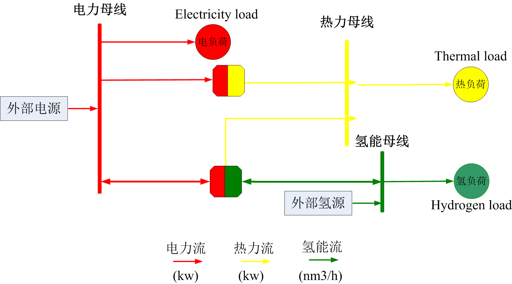
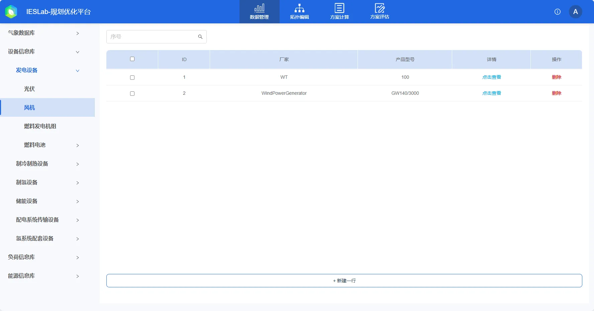
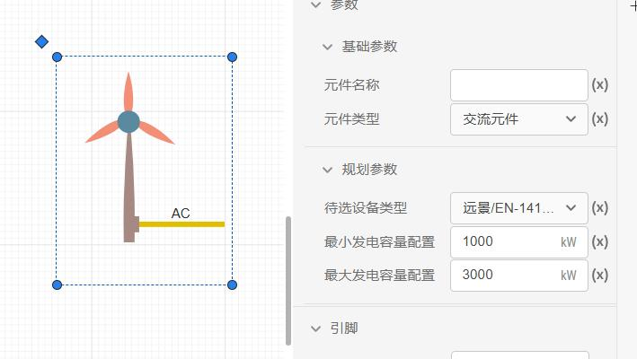

本节主要介绍 IESLab 平台综合能源系统规划优化的基本原理，包括优化模型的构成和优化算法的数学原理。

## 功能定义

IESLab 规划优化平台的方案计算功能，主要面向处于规划设计阶段的园区级至区域级的冷、热、电、氢综合能源耦合系统（亦包含单一能源的供能系统），在典型运行场景下，基于特定的优化目标（经济性或环保性）对综合能源系统中的设备进行选型与定容，并对其在典型日下的运行方式进行优化。

## 功能说明

### 典型场景生成

不管是综合能源系统的**规划投资**还是**仿真模拟**分析，都需要海量场景的支撑，都需要首先确定**综合能源场景**，包括主要的气象条件（太阳辐照强度、风速、温度等）、电冷热负荷参数等。在准确的综合能源场景下的规划设计结果更具备可行性，若综合能源场景包含8760h所有的数据，不仅会使得规划优化问题异常复杂，还对计算资源要求很高，计算时间很长，带来**“维数灾难”**，需要进行**场景缩减生成**。传统做法是通过把气象条件和电冷热负荷加权后生成场景，如年典型日、季节典型（夏天、冬天和过渡季节）和月度典型日，以降低计算复杂度。但这类典型日的数量少，规划设计精度较低。

因此有必要综合能源系统**场景生成**技术展开深入研究，生成的典型场景能够兼容海量场景的丰富性和少量场景的代表性，兼顾**计算准确和效率**。

虽然利用海量能源数据进行综合能源系统的仿真模拟和规划更加准确，但需要高性能的超级计算机，消耗大量计算时间和资源，且计算资源较难获得。典型的季节性情景或月度场景能够显著降低计算资源要求和计算时间，但其并不能展现更多的场景特点，导致规划和仿真精度不够，其规划方案不能用于实际生产设计，难以实际落地；使得仿真模拟的场景不具备代表性，未考虑极端场景发生的概率不明确，可能造成投资过多而浪费。

利用**聚类算法**来生成的典型场景，能够代表实际场景的多维特点。相似场景聚类后，相似场景只需计算一次，避免“维数灾难”，为规划和计算需求提供具有合理精度的基本完整数据集，兼顾**计算时间和精度**。生成典型场景的聚类算法主要有 k-means、k-medoids、层次聚类、基于密度的聚类。主要为“硬分类”，即将某时刻场景硬性划分到某一个类别中，一般需要指定类别的数量和距离。而**高斯混合模型 GMM**聚类则属于“软分类”，计算某时刻场景划分到某一个类别的概率，结合了概率统计方法，可以更好地指导综合能源系统的投资规划和仿真模拟分析。

### IES模型构成

上图为综合能源系统规划与优化模型构成图，其中包括电力、热力和氢能等的生产、转换、储存、分配各个环节。电力流（红色）：表示电力的流动方向和分配情况。热力流（黄色）：表示热力的流动方向和分配情况。氢能流（绿色）：表示氢能的流动方向和分配情况。

### 优化目标

IESLab 规划优化平台基于单目标优化模型，优化目标为经济性目标：

   
经济性优化目标将系统综合成本最小作为目标函数，所谓综合成本，是指考虑了一次性投资成本和年运行支出成本以及项目生命周期影响的等效年度成本。其计算公式可以表示为如下的数学模型：

$$
C_{TC}=C_{inv}+C_{op,f}+C_{op,v}+C_{fuel}+C_{pur}-C_{sel}
$$

式中，$C_{TC}$为综合能源系统全生命周期成本，是由系统投资建设成本$C_{inv}$、固定运维成本$C_{op,f}$、可变运维成本$C_{op,v}$、燃料消耗成本$C_{fuel}$，购能成本$C_{pur}$、售能收益$C_{sel}$等多部分共同组成。  
在项目实际操作中，系统投资建设成本与运维成本、购售能成本等均可能存在“多期”的现金流价值。系统全生命周期规划算法的思路就是在考虑贴现率$r$和项目生命周期期限$T$的条件下，计算系统投资建设成本的等效年金，充分体现每单位货币的时间价值。其中$C_{inv}$可以表达为如下的关系式：

$$
{C_{inv}} = \sum\limits_{i = 1}^M {\frac{{r{{\left( {1 + r} \right)}^{{T_i}}}}}{{r{{\left( {1 + r} \right)}^{{T_i}}} - 1}}{\phi _i}} 
$$

式中$r$是贴现率，$T_i$是系统生命周期年限，$M$代表系统内待规划的设备种类数，$\phi _i$代表第$i$种设备的投资费用。

### 约束条件

IESLab 规划优化平台优化模型中的约束条件主要分为能量模型约束条件、设备运行约束条件两大类：

1. 能量模型约束
   
   能量模型约束主要是指设备的能量转换关系模型（比如制冷机组的电冷转换功率的能效比模型）和节点的能量平衡模型（直连的各设备需要满足供用能量的平衡关系，包括电热冷氢气能量平衡约束）。

2. 设备运行约束条件
   
   设备运行约束条件主要包括设备的容量优化范围、不同类型设备的一些固有运行约束（比如蓄电池的始末容量差、燃料电池的极限功率、外部电源的最大购电量及上网电量等等），具体的约束条件可查看相关元件的文档资料。

### 决策变量

IESLab 规划优化平台优化模型中的决策变量主要包括设备选型变量、设备容量变量及运行方式变量三大类：

1. 设备选型变量
   
   设备选型变通常量是一个离散型的整数变量，其取值范围取决于该设备对应在**数据管理模块**中的待选设备型号池，如下图所示代表了所有**风机**设备的待选型号池，该案例中包含两种待选型号。

   

2. 设备容量变量
   
   设备容量变量通常也是离散型的整数变量，当设备选型确定时，设备容量变量的取值范围即为在用户指定的容量约束范围内，该设备可以配置的台数范围。以下图为例，用户指定的风机容量范围为**1000~3000kW**，对应上面两种型号的风机（远景的额定功率为**1200kW**，金风的额定功率为**2500kW**），则可配置的台数范围分别是**1~2台**和**1台**。

   

3. 运行方式变量
   
   运行方式变量是指设备在型号和容量确定的情况下，在各典型日上的运行调度方式，比如蓄电池在一天内的充放电策略、冷热机组在一天内的出力曲线等等。
4. 其它变量
   
   其它决策变量包括设备运行模式变量（如双工况制冷制冰模式），最大购电功率变量（由于考虑了两部制电价计费方式，需要对最大购电功率进行优化）等。

### 模型求解

IESLab规划优化平台采用线性规划、混合整数规划、非线性规划等高效、精确优化算法进行优化模型求解，可以与各种主流的商业优化软件工具，比如：COPT、Gurobi、CPLEX等无缝对接，关于求解器的详细资料可以参见了解求解器官方文档。

## 常见问题

IESLab 规划优化平台的元件模型与 IESLab 建模仿真平台的元件模型是否存在差异？
: IESLab 规划优化平台主要面向综合能源系统的规划设计场景使用，在这一阶段通常对模型的准确性和精细度要求不高，因此规划优化平台的元件模型主要基于能量平衡关系，不会关注诸如电压、相角、流量、压力等状态参数。而 IESLab 建模仿真平台则面向更加复杂且精细的应用场景，其元件模型的构建需要考虑不同状态参数的耦合关系。

IESLab 规划优化平台可以自动生成系统内各设备及负荷的连接关系（供能方式）吗？
: 针对系统拓扑进行优化是非常复杂的，目前 IESLab 规划优化平台还不具备这一功能，需要用户先手动搭建起拓扑模型后才能进行优化。