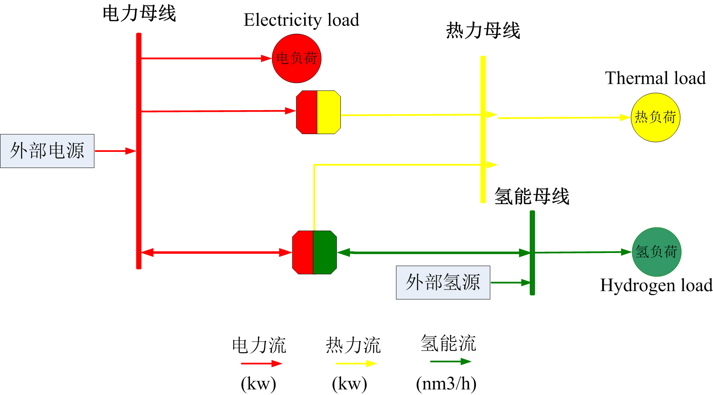

本节全面介绍 IESLab 规划优化平台方案计算的基本原理与使用方法，涵盖优化功能总览、优化数学模型、数学优化原理基础、求解计算方式、典型场景生成（GMM 聚类）、系统约束与自定义语法 DSL、参数配置详解，以及绿电直连等典型工程场景的设置方法。文档能源规划从业者，用通俗语言解释每个功能与参数的作用，帮助您快速理解平台并上手完成能源规划优化业务。

---

## 目录

- [1. 功能定位与使用流程](#1-功能定位与使用流程)
- [2. 优化功能总览](#2-优化功能总览)
- [3. 优化数学模型](#3-优化数学模型)
- [4. 数学优化原理基础](#4-数学优化原理基础)
- [5. 求解计算](#5-求解计算)
- [6. 典型场景生成与 GMM 聚类算法](#6-典型场景生成与-gmm-聚类算法)
- [7. 系统约束与自定义 DSL](#7-系统约束与自定义-dsl)
- [8. 参数配置详解](#8-参数配置详解)
- [9. 典型应用场景配置指南](#9-典型应用场景配置指南)
- [10. 常见问题与优化调试建议](#10-常见问题与优化调试建议)

---

## 1. 功能定位与使用流程

### 1.1 初学者导读：什么是"优化"

在阅读本节之前，先建立一个直观认识：**能源系统规划优化，就是让在所有可行的方案中，自动找出成本最低的那一个**。

以一个园区能源规划为例，您可能面临这样的问题：

> 园区有电、热两种负荷。我可以装光伏、装风机、装蓄电池、装燃气锅炉，也可以直接从电网买电。每种设备有多种型号、投资不同、效率不同；电价白天贵、晚上便宜。**每种设备各装多少台、每天怎么运行，全年花的钱最少？**

这个问题可能的组合方案成千上万种——手动试算根本算不过来。规划优化平台把这个问题写成**数学模型**，交给**求解器**（一种高效的数学计算软件）自动搜索，几分钟到几十分钟内给出全局最优（或接近最优）的答案：

| 您在平台上做的事 | 平台自动做的事 |
|:---|:---|
| 画出系统拓扑（哪些设备、怎么连接） | 识别拓扑，生成能量平衡关系 |
| 录入数据（负荷曲线、气象、电价、设备型号库） | 将数据填入模型 |
| 配置方案参数（本章 [第 8 章](#8-参数配置详解)） | 组装数学优化模型 |
| 点击"开始计算" | 调用求解器搜索最优方案 |
| —— | 输出设备配置、运行策略、成本与财务报表 |

理解本节内容，您不需要任何优化专业背景；[第 4 章](#4-数学优化原理基础)会用通俗方式介绍线性规划等数学原理，感兴趣可以深入阅读，不感兴趣也**不影响正常使用**——您只需知道：平台会自动找到"最省钱且满足所有物理约束"的方案。

### 1.2 功能定义

IESLab 规划优化平台的**方案计算**功能，面向处于**规划设计阶段**的园区级至区域级的冷、热、电、氢等多能源耦合系统（亦包含单一能源的供能系统），在典型运行场景下，基于优化目标（经济性或环保性）对系统中的设备进行**选型与定容**，并优化其在典型日下的**运行方式**。

简单来说，平台回答三个问题：

| 问题 | 输出 | 举例 |
|:---|:---|:---|
| **装什么、装多少？** | 各设备的候选型号选择与配置台数/容量 | 风机选"远景 1200kW"2 台 + 光伏 5000 kW |
| **怎么运行？** | 典型日 24h 逐时出力、充放电、启停策略 | 蓄电池夜里充电、白天高峰放电 |
| **划算吗？** | 全生命周期成本、投资回收期、财务报表 | 静态回收期 6.8 年，全投资 IRR 9.2% |

### 1.3 核心能力

| 能力维度 | 支持内容 |
|:---|:---|
| **能源载体** | 电（交流/直流）、热、冷、氢、气等 8 类载能体 |
| **设备模型** | 47 类组件（光伏、风机、蓄电池、电解槽、燃料电池、制冷机、热泵、锅炉、储氢罐等） |
| **规划维度** | 设备选型（多候选型号池）+ 定容（容量范围约束下的台数优化） |
| **运行维度** | 8760h 全年或典型日逐时运行策略优化 |
| **潮流内核** | 交直流线性潮流——节点-支路拓扑上的功率平衡与潮流分布，功率流向可见 |
| **系统约束** | 绿电占比、上网比例、弃电率等合规约束，支持自定义 DSL 语法 |
| **求解规模** | 50+ 设备、全年 8760h 优化，两阶段解耦可将求解时间由数小时压缩至数十分钟 |
| **结果输出** | 设备配置表、运行曲线、能量平衡图、11 张财务报表、一键 Word 项目报告 |

### 1.4 适用与不适用场景

| ✅ 适合用 IESLab 规划优化 | ❌ 不适合（请选用其他工具） |
|:---|:---|
| 园区/区域综合能源系统规划设计 | 秒级以下电磁暂态动态仿真（→ EMTLab） |
| 风光储容量配比与投资估算 | 短路电流、保护整定校核（→ DSLab） |
| 绿电直连项目合规性校核 | 输配电网拓扑优化、OTS等 |
| AIDC 算力中心源网荷储协同规划 | 电力市场现货竞价策略优化 |
| 多方案比选与敏感性分析 | 在线实时调度控制 |

### 1.5 典型使用流程

一次完整的规划优化通常按以下五步进行：

```
① 数据准备 → ② 拓扑搭建 → ③ 方案配置 → ④ 启动计算 → ⑤ 结果查看
```

| 步骤 | 操作内容 | 参考文档 |
|:---|:---|:---|
| **① 数据准备** | 在数据管理模块录入气象数据（辐照、风速、温度）、电/冷/热/氢负荷曲线、分时电价、待选设备型号库 | 数据管理模块文档 |
| **② 拓扑搭建** | 在拓扑编辑器中放置元件、建立连接；平台在您手动搭建的拓扑基础上**自动识别**交直流母线与节点-支路-设备连接关系，无需手动声明供能方式 | 拓扑编辑文档 |
| **③ 方案配置** | 创建计算方案，设置规划类型、场景缩减方式、惩罚参数、系统约束（预设模板或自定义 DSL）、财务参数 | 本文档 [第 8 章](#8-参数配置详解) |
| **④ 启动计算** | 选择优化目标，点击**开始计算**；可随时停止或停止并删除 | [结果查看](../20-results-tab/index.md) |
| **⑤ 结果查看** | 方案列表比选、设备配置详情、典型日运行曲线、能量平衡图、财务报表、Word 报告导出 | [结果查看](../20-results-tab/index.md) |

> 同一项目可创建**多个计算方案**，各自独立配置设备选型、容量与运行策略，所有方案本地保留，关键指标可并排比选。

### 1.6 数据准备要点

优化结果的可靠性直接取决于输入数据的质量。启动计算前请核对以下数据：

| 数据类别 | 内容 | 注意事项 |
|:---|:---|:---|
| **气象数据** | 太阳辐照强度、风速、温度等（逐时） | 决定光伏/风机理论出力；缺失值平台自动插补，但建议保证主体完整 |
| **负荷曲线** | 电/冷/热/氢负荷逐时曲线 | 注意单位（kW 为功率值）；曲线覆盖时段应与规划时段一致 |
| **电价数据** | 分时电价 / 阶梯电价 / 分时阶梯电价 / 两部制电价 | 影响购电成本与储能策略；两部制电价含需量电费 |
| **气价/燃料价格** | 天然气、氢气等价格 | 影响燃料设备的经济性 |
| **设备候选库** | 每类设备的候选型号（额定功率、投资单价、效率、寿命、运维成本） | 型号池越丰富，选型空间越大；容量范围约束在此配置 |
| **并网点参数** | 购电功率上限、上网比例限制（`MaxFeedinRatio`） | 决定与外部电网的交换能力 |

> **单位自查清单**：负荷与出力用 **kW**、电量用 **kWh**、价格注意 **元/kWh 与元/MW 的区分**（如电不平衡惩罚单位为元/MW）。单位错误是导致"结果偏大/偏小一个数量级"的最常见原因。

---

## 2. 优化功能总览

平台围绕"规划 + 运行"两条主线，提供以下优化功能：

### 2.1 设备选型与定容

- 每类设备可配置**多个候选型号**（如风机可选"远景 EN-120/1400"与"金风 GW2500-140"两种型号），平台从中自动挑选最划算的组合；
- 在用户指定的**容量范围**（如 1000~3000 kW）内自动优化配置台数；
- 选型与定容同时优化，兼顾型号间的效率、投资、运维差异。

**示例**：用户指定的风机容量范围为 1000~3000 kW，候选型号池中有两种风机——远景（额定 1200 kW）与金风（额定 2500 kW）。则远景可配 1~2 台、金风可配 1 台，平台会在这些组合中自动择优。


### 2.2 运行策略优化

- 典型日 24h 逐时出力曲线：发电设备出力、储能充放电、转换设备能量分配；
- 储能充放电策略：在电价峰谷间套利、消纳富余新能源；
- 最大购电功率优化：两部制电价下优化需量电费。

### 2.3 储能保供

滑动窗口法自动识别全年极端工况，生成保供曲线并转化为储能**时变 SOC 下限**——平时用足容量，极端工况自动留足应急余量。通过 `PowerGuarantee` 参数（保供小时数）启用。

**直观理解**：假设保供小时数为 4，平台会检查全年每一个连续 4 小时的高负荷窗口，确保储能在这些窗口内有足够电量顶上，避免电网停电或新能源出力骤降时负荷失电。

### 2.4 机组组合（UC）启停优化

面向电解槽、燃料电池、燃机等**启停敏感设备**，可启用逐时启停排班优化：运行台数、启停跟踪、最小技术出力、最小启停时间。规划阶段即可知道"买几台、何时开、何时关"。

**典型例子**：碱性电解槽（ALK）启动耗时长、频繁启停损耗大。开启 UC 后，平台会为其排定"连续开 8 小时、停 4 小时"这类符合物理规程的启停计划，而不是让它逐小时随意开关。

### 2.5 柔性负荷调度

柔性电负荷（FlexEleLoad）支持**四种调节模式**：

| 模式 | 说明 | 适用设备 | 计算方式 |
|:---|:---|:---|:---|
| 挡位功率 | 按固定功率挡位增减载 | 空调、水泵等离散档位设备 | 混合整数（MILP） |
| 挡位比例 | 按额定功率的固定比例挡位增减载 | 有百分比挡位的设备 | 混合整数（MILP） |
| 无极功率 | 连续功率调节 | 可连续调节的负荷（推荐） | 线性规划（LP） |
| 无极比例 | 连续比例调节 | 可连续调节的负荷（推荐） | 线性规划（LP） |

新能源大发时段**增载消纳**、低谷时段**减载降本**，调节成本计入目标函数。大规模优化推荐使用**无极模式**（纯 LP，求解效率更高）。

### 2.6 全生命周期设备替换

按设备寿命与项目运营期自动计算替换次数，替换投资纳入全生命周期成本优化（通过"替身评估"参数启用）。

**直观理解**：项目周期 25 年，蓄电池寿命 10 年——期间需要更换 2 次。开启替身评估后，这两笔更换投资会自动计入总成本，避免"只算首次投资、低估真实成本"。

### 2.7 财务后评估

优化完成后可执行财务后评估，输出 11 张标准财务报表与投资收益率、投资回收期、度电成本等指标（详见[结果查看](../20-results-tab/index.md)）。

---

## 3. 优化数学模型

### 3.1 读懂优化模型：目标、变量、约束

任何优化问题都由三要素构成，以"家庭装修选家具"作类比：

| 三要素 | 数学名称 | 家装类比 | 本平台对应 |
|:---|:---|:---|:---|
| **想决定什么** | 决策变量 | 买几张床、几张桌 | 设备台数、逐时出力 |
| **想要什么最好** | 目标函数 | 花钱最少、利用率最高 | 全生命周期成本最小 |
| **必须满足什么** | 约束条件 | 房间面积有限、预算上限 | 能量平衡、设备物理限制、合规指标 |

**优化求解器做的事**：在所有满足约束的变量取值组合（可行方案）中，找到让目标函数最小（最优）的那一组。

平台已将能源规划的这三要素**预置为模板**：您录入拓扑与数据后，平台自动生成目标函数和绝大多数约束；您在方案中配置的参数（[第 8 章](#8-参数配置详解)）只是对少数关键项做调整。理解三要素，就能明白每个参数"到底在改模型的哪一部分"。

### 3.2 优化目标

平台基于单目标优化模型，优化目标为**经济性**——系统全生命周期综合成本最小：

$$
\min \; C_{TC} = C_{inv} + C_{op,f} + C_{op,v} + C_{fuel} + C_{pur} - C_{sel} + C_{penalty}
$$

各项含义与通俗解释：

| 分项 | 含义 | 通俗解释 |
|:---|:---|:---|
| $C_{inv}$ | 投资等效年金 | 一次性投资折算成"每年摊多少钱"。买 100 万设备用 10 年，不是每年算 100 万，而是按年金公式摊到每年约 13~16 万（取决于贴现率） |
| $C_{op,f}$ | 固定运维成本 | 只要设备在，每年就得花的钱（检修、人工），与容量成正比 |
| $C_{op,v}$ | 可变运维成本 | 每发一度电（每供一焦热）多花的钱，与出力成正比 |
| $C_{fuel}$ | 燃料消耗成本 | 燃气锅炉、燃机的燃料费 |
| $C_{pur}$ | 购能成本 | 从电网买电的钱，分时电价下白天贵、晚上便宜 |
| $C_{sel}$ | 售能收益 | 新能源发电上网卖钱的收入（前面带负号，从总成本中扣除） |
| $C_{penalty}$ | 惩罚项 | 缺供电、弃风弃光、约束越限的"罚款"（见 [3.5 节](#35-惩罚项)） |

其中投资等效年金的计算公式为：

$$
C_{inv} = \sum\limits_{i=1}^{M} \frac{r(1+r)^{T_i}}{r(1+r)^{T_i} - 1}\,\phi_i
$$

| 符号 | 含义 | 说明 |
|:---|:---|:---|
| $r$ | 贴现率 | 资金的时间价值，默认 7%；在财务参数中配置 |
| $T_i$ | 第 $i$ 类设备的寿命年限 | 光伏约 25 年、蓄电池约 10 年 |
| $M$ | 待规划的设备种类数 | — |
| $\phi_i$ | 第 $i$ 类设备的投资费用 | 型号单价 × 台数 |

> **贴现率的直观作用**：贴现率越高，未来支出的"现值"越低，优化越倾向于"少花钱建设、多花钱运行"；贴现率越低，越倾向于"一次性多投资、换取低运行成本"。工程中贴现率一般取 5%~8%。

### 3.3 决策变量

优化模型求解时，以下变量由算法自动确定（您只需在平台上配置范围，不必逐个指定取值）：

| 变量类别 | 类型 | 含义 | 示例 |
|:---|:---|:---|:---|
| **设备选型** | 整数 | 每种候选型号的配置台数 | 选"远景"还是"金风"风机、各几台 |
| **运行方式** | 连续 | 各典型日各时段的出力/充放电/能量流 | 蓄电池一天内的充放电策略、制冷机出力曲线 |
| **启停状态** | 0-1 | 启停敏感设备各时段的开/停 | 电解槽逐时启停排班（启用 UC 时） |
| **柔性调节量** | 连续 | 柔性负荷各时段的增/减载量 | 算力负荷高峰时段减载多少 |
| **潮流分布** | 连续 | 各支路各时段的功率流向与大小 | 每条线路、每个节点的功率分布 |
| **最大购电功率** | 连续 | 计费周期内的最大需量 | 两部制电价需量电费优化 |
| **松弛变量** | 连续≥0 | 软约束的违反量 | 合规约束轻微越限时付出惩罚代价 |

**设备选型与容量范围的关系**：选型变量的取值范围取决于**数据管理模块中的待选设备型号池**；容量变量取值范围是用户指定容量约束内该型号可配的台数范围。示例见 [2.1 节](#21-设备选型与定容)。

### 3.4 约束条件

#### 3.4.1 能量模型约束

指系统的能量转换与平衡关系，是模型的"物理骨架"，由平台根据拓扑**自动生成**：

- **设备能量转换关系**：每类设备的输入-输出关系，如制冷机的"电→冷"按能效比（COP）转换、锅炉的"气→热"按效率转换；
- **节点能量平衡**：每个节点每个时段，流入功率 = 流出功率，电/热/冷/氢/气各载体分别平衡——"供多少、用多少、存多少，账要平"。

平台采用**交直流线性潮流内核**在节点-支路拓扑上建模：

- **交流母线**：线性化有功潮流，支持支路容量双向约束与传输损耗；
- **直流母线**：建模换流器效率；
- **MMC 换流器**：桥接交直流网络，支持主从控制；
- **热/冷/氢/气网**：线性能流（节点压力/温度势 + 管道流量）。

线性化潮流**避开非线性求解的不稳定**，同时保留功率方向与容量信息——过去只能看到"系统发了多少电、用了多少电"，现在能看到**每一台设备、每一条线路、每一个节点**在每一时刻的功率流向。

拓扑连接由用户在拓扑编辑器中手动搭建，平台在其基础上**自动识别**交直流母线与电压等级、自动推导平衡关系，用户无需手动声明供能方式。



上图为综合能源系统规划与优化模型构成：**电力流（红色）、热力流（黄色）、氢能流（绿色）**在生产、转换、储存、分配各环节的流动与平衡。

#### 3.4.2 设备运行约束

每类设备依据其物理特性施加运行约束：

| 约束类型 | 说明 | 通俗解释 | 适用设备 |
|:---|:---|:---|:---|
| 出力上下限 | 出力不超过已配置容量，不低于最小技术出力 | "这台机器最多干这么多活" | 所有设备 |
| 能效转换关系 | 输出 = 输入 × 能效比（COP/效率） | "吃 3 度电产 10 度冷" | 热泵、制冷机、锅炉、换热器等 |
| 储能 SOC 限制 | 荷电状态在允许范围内，始末容量一致 | "电池不能充爆、不能放空，一天下来存放电量打平" | 蓄电池、储热/冷/氢罐 |
| 充放电互斥 | 同一时刻不同时充放电 | "不能边充边放" | 蓄电池 |
| 爬坡约束 | 相邻时段出力变化率受限 | "机器加速不能太猛" | 燃机、锅炉等 |
| 启停逻辑 | 最小开机/停机时间、启停次数限制（UC） | "关机后至少歇 2 小时才能再开" | 电解槽、燃料电池等 |
| 特性曲线 | 六条特性曲线分段线性化 | "部分负荷下效率会变，按曲线算" | 单/双工况制冷机 |
| 冷热双模式 | 同一设备冷热模式切换 | "同一台设备，这个时段制冷、那个时段制热" | 热泵、吸收式设备 |

#### 3.4.3 系统级约束（合规约束）

跨设备的系统级指标约束，如绿电直连合规指标、新能源消纳比例、储能保供等。平台提供**预设约束模板**（直接选类型给限值）与**自定义 DSL**（用接近数学表达式的语法描述），详见[第 7 章](#7-系统约束与自定义-dsl)。

#### 3.4.4 外部条件约束

| 约束 | 说明 | 通俗解释 |
|:---|:---|:---|
| 外部电源最大购电量 | 电网接口的购电功率上限 | "供电局只允许你这么大功率用电" |
| 最大上网电量 | 新能源上网比例限制（外部电源属性 `MaxFeedinRatio`） | "反送回电网的电不能超过这个比例" |
| 燃料供应极限 | 气源/氢源的最大供应能力 | "气站每天最多供这么多气" |
| 上级变压器容量 | 并网点的容量限制 | "变压器就这个容量" |

### 3.5 惩罚项

优化模型中，能量不平衡（缺供、弃能）与软约束违反通过**惩罚成本**计入目标函数，而非硬性禁止。这样既保证模型有解，又引导优化结果尽量满足供需平衡与合规要求：

| 惩罚项 | 参数 | 默认值 | 触发场景 |
|:---|:---|:---|:---|
| 电不平衡惩罚 | 电不平衡惩罚单价 | 10000 元/MW | 负荷缺供、切负荷 |
| 新能源弃电惩罚 | 新能源弃电惩罚 | 0.2 元/kWh | 弃风弃光 |
| 约束松弛惩罚 | PenaltySoft | 10 | 系统级约束轻微越限 |

**直观理解**：惩罚项相当于在优化"心里"给每度缺供电、每度弃电标了个价格。如果"配 1 台储能"比"交罚款"便宜，优化就配储能；反之宁可受罚。所以：

- 惩罚设**太低** → 结果大量缺供/弃电（"罚得起就随便犯"）；
- 惩罚设**太高** → 结果过度配置设备来避免任何微小不平衡（"过度防御"）。

> **设置建议**：电不平衡惩罚应显著高于购电单价（缺供是严重事件）；弃电惩罚介于 0 与电价之间。具体见[第 8 章](#8-参数配置详解)。

---

## 4. 数学优化原理基础

本章面向初学者，用通俗语言介绍平台背后的数学优化原理。读完您将理解：为什么规划问题是"混合整数线性规划"、求解器在做什么、"最优性间隙 1%"是什么意思。**跳过本章不影响使用平台**。

### 4.1 线性规划（LP）

#### 什么是线性规划

**线性规划（Linear Programming, LP）**是运筹学中最基础、应用最广的优化方法：目标函数和所有约束都是变量的**一次函数**（没有平方、没有乘积）。

一个直观的例子：

> 某工厂生产 A、B 两种产品：A 每件赚 3 元、耗电 2 度；B 每件赚 4 元、耗电 4 度。每天最多供电 80 度，且 B 的日产量不能超过 15 件。各生产多少件利润最大？

写成数学形式：

$$
\max \; 3x_A + 4x_B \qquad \text{（利润最大 = 目标函数）}
$$
$$
\text{s.t.} \quad 2x_A + 4x_B \leq 80 \qquad \text{（电量约束）}
$$
$$
\quad\;\; x_B \leq 15 \qquad\qquad\;\;\; \text{（销量约束）}
$$
$$
\quad\;\; x_A, x_B \geq 0 \qquad\qquad\;\; \text{（非负约束）}
$$

其中 `s.t.`（subject to）表示"受约束于"。$x_A, x_B$ 就是**决策变量**， planner（您）决定它们的取值。

#### 线性规划的几何直觉

把每个可行方案看成坐标系里的一个点，所有满足约束的点构成一个**可行域**——它是一个**凸多面体**（二维时是多边形）。一个经典结论是：

> **线性规划的最优解一定出现在可行域的某个"顶点"上。**

这就像在一个多边形的围墙里找"最低点"，只需沿着围墙（顶点）走，不必考察围墙内的无穷多个点。正因如此，LP 可以在多项式时间内被**精确求解**——这使 LP 成为运筹学中"最好解"的一类问题。

#### 平台中的 LP

平台的**运行优化**（设备出力、储能充放电、能量流分配）就是大规模 LP：几十万条约束、上百万个变量，求解器仍然能在秒到分钟级精确求解。

### 4.2 整数规划与混合整数规划（MILP）

#### 为什么需要整数变量

设备**不能买半台**——选型"1 台或 2 台"是离散决策；设备**某一时刻要么开、要么停**——启停是"是/否"决策。这些量必须用**整数变量**（或 0-1 变量）表达。

- **整数规划（IP）**：所有变量都是整数；
- **混合整数规划（MILP）**：部分变量整数（选型台数、启停状态）、部分变量连续（出力功率）——**本平台规划问题的类型**。

#### 整数带来的质变

整数变量让模型能表达"逻辑"：

| 需求 | 数学实现 | 平台中的应用 |
|:---|:---|:---|
| 要么买 A 型、要么买 B 型，不能都买 | 两个 0-1 变量之和 ≤ 1 | 多型号互斥选型 |
| 开机才能出力，关机必然零出力 | $P \leq P_{max} \cdot z$（$z$ 为 0-1 启停变量） | UC 启停、大 M 法 |
| 储能不能同时充放电 | 充放电两个状态变量互斥 | 蓄电池充放电互斥 |
| 双工况机组只能处于一种模式 | 模式 0-1 变量之和 = 1 | 制冷/制冰模式切换 |

#### MILP 比 LP 难在哪

LP 只需考察可行域顶点；而整数变量的存在把可行域"切碎"成离散点集，求解器通常需要**分支定界（Branch and Bound）**：先放宽整数要求按 LP 求解，再逐层"分支"尝试将变量固定为整数，用"边界"（bound）剪掉不可能更优的分支。问题规模越大、整数变量越多，搜索树越庞大——这就是大规模 MILP 求解耗时长的根本原因，也是平台提供**两阶段解耦**（[第 5 章](#5-求解计算)）的原因。

### 4.3 求解器如何寻找最优解（直觉）

您不需要了解算法细节，但了解以下直觉有助于解读求解日志：

| 阶段 | 求解器在做什么 | 日志中的表现 |
|:---|:---|:---|
| **预处理（Presolve）** | 消去冗余约束与平凡变量，缩小问题 | "Presolve: removed xxx rows" |
| **求下界（LP 松弛）** | 放宽整数约束求 LP，得到"理论最好能好到什么程度" | "Best bound" 持续上升 |
| **分支搜索** | 逐个固定整数变量、分支剪枝，不断找到更好的可行方案 | "Best integer" 持续下降（最小化问题） |
| **收敛判定** | 当"最好可行解"与"理论下界"的相对差距 ≤ 最优性间隙，停止 | "Gap: 0.8% < 1%, optimal" |

#### 最优性间隙（MIP Gap）

MILP 通常**不追求严格数学最优**，而是允许一个相对偏差容忍度：

$$
\text{Gap} = \frac{\text{当前可行解成本} - \text{理论下界}}{\text{当前可行解成本}}
$$

默认 **Gap = 0.1%**：即找到的方案成本保证不超过理论最优的 0.1%。对工程规划而言 0.1% 的偏差远小于负荷预测等数据本身的误差，完全可接受。**调小 Gap 换精度、调大 Gap 换速度**。

### 4.4 常用术语速查

| 术语 | 英文 | 通俗解释 |
|:---|:---|:---|
| 目标函数 | Objective Function | 要最小化/最大化的量（这里是总成本） |
| 决策变量 | Decision Variable | 由优化决定的量（台数、出力、启停） |
| 约束条件 | Constraint | 变量取值必须满足的限制 |
| 可行解 / 可行域 | Feasible Solution / Region | 满足全部约束的方案 / 所有可行方案的集合 |
| 最优解 | Optimal Solution | 可行域中目标函数最好的方案 |
| 无可行解 | Infeasible (IIS) | 约束互相矛盾，无任何方案能满足 |
| 线性规划 | LP | 目标与约束全为线性的优化问题 |
| 混合整数规划 | MILP | 部分变量取整数的优化问题 |
| 松弛变量 | Slack Variable | 软约束的"违反量"，付出惩罚换取可行 |
| 最优性间隙 | MIP Gap | 当前解与理论最优的相对偏差 |
| 求解器 | Solver | 专业数学优化计算软件（HiGHS、Gurobi 等） |
| 凸优化 | Convex Optimization | 一类性质良好、可高效求解的优化问题，LP 是其特例 |

---

## 5. 求解计算

### 5.1 求解模式

平台提供三种求解模式，按**模型规模与精度需求**选择：

| 模式 | 技术路线 | 适用场景 | 特点 |
|:---|:---|:---|:---|
| **统一模型** | 全部场景构建为一个混合整数规划模型，一次求解 | 中小规模、需要全局精确最优解 | 精度最高，求解时间随时段数增长较快 |
| **两阶段串行** | **先配置、再运行**：第一阶段在极端场景下确定设备配置；第二阶段固定配置，逐场景优化运行 | 大规模、含启停（UC）逻辑 | 兼顾精度与效率 |
| **两阶段并行** | 同上，第二阶段各场景**分区并行**求解 | 大规模全年 8760h 优化 | 速度最快，50+ 设备全年优化可由数小时压缩至数十分钟 |

### 5.2 两阶段解耦技术路线

两阶段解耦的核心思路是**"先配置、再运行"**：

```
第一阶段（配置定容）
  识别全年极端工况 → 在极端场景下优化设备选型与容量
        │
        │  设备配置固定
        ▼
第二阶段（运行优化）
  按典型场景逐时段优化运行策略（各场景可并行求解）
        │
        ▼
  合并各场景运行结果 → 全年 8760h 运行曲线 → 统计与财务评估
```

- **为什么可行**：极端场景是负荷最重、条件最苛刻的场景，按极端场景配置的容量必然满足其他场景；
- **效率来源**：第二阶段配置已固定，各场景模型规模小且相互独立，可并行求解；
- **松弛保障**：约束以软约束 + 松弛变量实现，不会因单点不可行而中断求解。

> **模式选择建议**：初期规划估算用统一模型或月度典型日即可；方案深化与 AIDC/全年精细优化建议两阶段并行。

### 5.3 求解器

平台与主流优化求解器对接，支持 HiGHS / SCIP / COPT / CBC / CPLEX 等。含整数变量（选型、容量、启停）时为混合整数规划（MILP），纯运行为线性规划（LP）。求解器选项（时间限制、最优间隙、并行线程数）由平台统一配置，一般无需修改；高级用户可在方案中调整。

| 选项 | 默认值 | 说明 |
|:---|:---|:---|
| 求解时间限制 | 3600 s | 超时返回当前最优解（仍可用） |
| 最优性间隙 | 0.1% | 解与理论最优的相对偏差容忍度（见 [4.3 节](#43-求解器如何寻找最优解直觉)） |
| 并行线程数 | 8 | 求解器内部并行度 |

### 5.4 计算时长参考

| 场景规模 | 推荐模式 | 参考时长 |
|:---|:---|:---|
| ~20 台设备、月度典型日 | 统一模型 | 秒级~分钟级 |
| 50+ 设备、聚类典型日 | 两阶段串行 | 分钟级 |
| 50+ 设备、全年 8760h | 两阶段并行 | 数十分钟 |

> 计算过程中页面会动态推送已获得的优选方案；计算停滞时可切换**显示日志**面板排查（见[优化调试建议](#102-优化调试建议)）。

---

## 6. 典型场景生成与 GMM 聚类算法

### 6.1 为什么需要场景缩减

不管是综合能源系统的**规划投资**还是**仿真模拟**分析，都需要海量场景的支撑，都需要首先确定**综合能源场景**，包括主要的气象条件（太阳辐照强度、风速、温度等）、电冷热负荷参数等。在准确的综合能源场景下的规划设计结果更具备可行性。

若综合能源场景包含 8760h 所有的数据，不仅会使得规划优化问题异常复杂，还对计算资源要求很高，计算时间很长，带来**"维数灾难"**，需要进行**场景缩减生成**。传统做法是通过把气象条件和电冷热负荷加权后生成场景，如年典型日、季节典型（夏天、冬天和过渡季节）和月度典型日，以降低计算复杂度。但这类典型日的**数量少，规划设计精度较低**，其规划方案不能用于实际生产设计，难以实际落地；也未考虑极端场景，极端工况发生概率不明确，可能造成投资过多而浪费。

因此需要通过**场景生成技术**，让典型场景兼容海量场景的**丰富性**和少量场景的**代表性**，兼顾**计算准确和效率**：相似场景聚类后只需计算一次，避免"维数灾难"，为规划提供具有合理精度的基本完整数据集。

### 6.2 聚类算法：硬分类与软分类

生成典型场景的主流方法是**聚类算法**，可分为两类：

| 类别 | 代表算法 | 特点 | 局限 |
|:---|:---|:---|:---|
| **硬分类** | k-means、k-medoids、层次聚类、基于密度的聚类（DBSCAN） | 每个时刻**硬性划分**到某一个类别；需指定类别数量与距离度量 | 丢失场景间过渡信息；边界时刻归属武断 |
| **软分类** | **高斯混合模型（GMM）** | 计算某时刻**属于各典型日的概率**，结合概率统计方法 | 计算量略大（平台已优化） |

**直观对比**：凌晨 3 点到早晨 7 点，负荷从"夜间形态"逐渐过渡到"日间形态"。硬分类会在某个整点把它"一刀切"进某一类；GMM 则认为 5 点"60% 像夜间形态 + 40% 像日间形态"，典型日形态由概率加权融合——**过渡更平滑、形态更贴近真实**，可以更好地指导综合能源系统的投资规划。

> IESLab 默认采用 **GMM 软聚类** 生成典型场景：典型日用于运行优化，8760h 全量曲线由典型日按权重映射重组得到。

### 6.3 五种场景生成方式

| 方式 | 方法 | 输出 | 计算量 | 精度 | 适用阶段 |
|:---|:---|:---|:---|:---|:---|
| **月度平均** | 每月各小时取均值 | 12 个典型日 | 极小 | 低 | 项目初期快速估算 |
| **月度聚类** | 每月独立 GMM 聚类 | 每月若干典型日 | 小 | 中 | 月度精细分析 |
| **每日法** | 每日作为一个典型日 | 365 个 | 大 | 高 | 接近全年精度 |
| **全周期聚类** | 全年统一 GMM 聚类 | ≤20 个典型日 | 中 | 较高 | **默认推荐**，兼顾效率与精度 |
| **8760h 全年** | 不缩减，全量建模 | 全年逐时 | 最大 | 最高 | 运行阶段精细化优化 |

**选择指引**：

- **月度平均**：综合能源项目初期规划阶段，计算量小，可以快速找到合适的设备型号及容量配置方案；
- **聚类**（月度/全周期）：能够兼顾计算效率和精度，满足大多数场景需求——**一般项目的推荐选择**；
- **8760h 全年**：适合运行阶段的设备出力优化，对优化结果要求较高的场景，如风光储项目中对储能的精细化调控。

> **典型日权重**：每个典型日带有"持续时长"权重（代表全年多少小时），优化目标按权重加权，使典型日优化结果**等效于全年优化**。例如"1月典型日 2"权重 120 小时，则它的一天运行成本在年度总成本中按 5 天计。

### 6.4 GMM 聚类算法原理

#### 6.4.1 数学模型

GMM 假设观测数据（各时刻的多维特征：负荷 + 气象）由 $K$ 个高斯分布混合生成：

$$
p(x) = \sum_{k=1}^{K} \pi_k \cdot \mathcal{N}(x \mid \mu_k, \Sigma_k)
$$

| 符号 | 含义 | 通俗解释 |
|:---|:---|:---|
| $\pi_k$ | 第 $k$ 个成分的权重（$\sum_k \pi_k = 1$） | 这类形态的时段占全年多大比例 |
| $\mu_k$ | 第 $k$ 个成分的中心 | 这类"典型日"的形态长什么样 |
| $\Sigma_k$ | 第 $k$ 个成分的离散程度 | 这类形态内部的差异有多大 |

#### 6.4.2 算法流程

```
① 数据预处理
   曲线补全为整天逐时数据，缺失值时间插值，MinMax 归一化消除量纲影响
        │
        ▼
② PCA 降维
   提取主要特征成分，降低高维聚类的计算复杂度
        │
        ▼
③ EM 迭代求解
   E 步：计算每个时刻属于各成分的概率（软分配）
   M 步：按概率加权更新各成分的中心与离散度
   反复迭代直至收敛
        │
        ▼
④ BIC 准则确定聚类数目
   BIC(K) = -2·ln(似然) + 参数数·ln(样本数)，取最小值对应的 K
        │
        ▼
⑤ 生成典型日
   每个成分 → 一个典型日；权重 = 该成分覆盖的小时数
   典型日曲线 = 成员时刻的加权平均
```

**EM 迭代的直觉**：E 步先"猜"每个时刻属于哪类（按概率），M 步再根据猜测重新估计每类的"长相"；如此反复，分类与类形态互相改进，直至不再明显变化——类似"先按印象分组、再按分组修正印象"的迭代过程。

#### 6.4.3 BIC 准则自动确定聚类数目

聚类数目 $K$ 越大，对数据的拟合越精细，但模型越复杂、后续优化计算量越大。**BIC（贝叶斯信息准则）**在两者间自动权衡：

$$
BIC(K) = -2\ln(\hat{L}) + p\ln(n)
$$

- $\hat{L}$：模型对数据的拟合优度（似然值）；
- $p$：模型参数个数（随 $K$ 增长）；
- $n$：样本量。

BIC 取**最小值**对应的 $K$——即"拟合精度提升不足以抵偿复杂度增加"的临界点。

| 方式 | 说明 | 建议 |
|:---|:---|:---|
| **自动确定**（默认） | 按 BIC 准则寻优 | 一般场景推荐 |
| **指定数目** | 用户手动指定（月度聚类每月上限 6，全周期聚类上限 20） | 对比敏感性、控制计算量时使用 |

> **经验参考**：全周期聚类 8~15 个典型日通常已能较好覆盖全年特征；若关注极端工况，请配合两阶段模式的极端场景识别（其独立于聚类自动运行）。

### 6.5 聚类结果的构成

每个典型日包含：

| 字段 | 含义 |
|:---|:---|
| 典型日编号 / 名称 | 如"1月典型日 1"、"年度典型日 3" |
| 所属月份 | 典型日归属月份 |
| 持续时长（权重） | 该典型日代表全年多少小时 |
| 覆盖时段 | 具体代表哪些小时 |
| 各类负荷最大/平均值 | 电/冷/热/氢负荷统计 |
| 24h 逐时曲线 | 气象与各负荷/出力曲线 |

可在方案中开启"场景是否可视化"，在结果中直观检查聚类效果（每类形态是否合理、权重分布是否均衡）。

---

## 7. 系统约束与自定义 DSL

系统约束是**跨设备**的系统级指标约束（区别于单设备物理约束），如"新能源发电量的 60% 必须自用"、"储能总装机不超过 10 MW"。平台提供两种配置方式：**预设约束模板**（简单）与**自定义 DSL 语法**（灵活）。

### 7.1 预设约束模板

常用合规与规模约束已固化为模板，**选择模板类型 + 填写上下限**即可，无需编写表达式：

| 模板类型 | 名称 | 方向 | 建议取值示例 | 说明 |
|:---|:---|:---|:---|:---|
| `selfuse_ratio` | 新能源占用电比 | 下限 | 30（%） | 新能源被本系统用电负荷消纳的比例，**分母为总用电负荷**；绿电直连"绿电占比"指标 |
| `generationselfuse_ratio` | 新能源自消纳率 | 下限 | 90（%） | 新能源发电中被自用消纳的比例，**分母为新能源总发电量** |
| `curtailment_ratio` | 新能源弃电率 | 上限 | 5（%） | 新能源弃电量占理论发电量的比例上限 |
| `total_battery` | 储能总装机 | 上限 | 10000（kW） | 全部储能设备装机之和的上限（硬约束） |
| `total_renewable` | 新能源总装机 | 下限 | 50000（kW） | 光伏+风机装机之和的下限（硬约束） |

**占用电比 vs 自消纳率的区别**（容易混淆，务必区分）：

| 指标 | 计算公式 | 含义 |
|:---|:---|:---|
| 占用电比 `selfuse_ratio` | 自用新能源电量 ÷ **总用电负荷** | "我的用电里有多大比例来自绿电"——绿电占比口径 |
| 自消纳率 `generationselfuse_ratio` | 自用新能源电量 ÷ **新能源总发电量** | "发出来的绿电有多大比例被自己用掉"——消纳口径 |

另有 **2 项算法内置约束**（无需配置，自动生效）：

| 内置约束 | 来源 | 说明 |
|:---|:---|:---|
| 新能源最大上网率 | 外部电源属性 `MaxFeedinRatio` | 上网比例上限，在**外部电源组件**中设置 |
| 储能保供 | 方案参数 `PowerGuarantee` | 保供小时数 > 0 时自动启用 |

> **启用判定**：下限 ≤ 0 视为未配置、上限 ≥ 100% 视为不限——不生效的约束自动跳过，不会报错。

### 7.2 自定义 DSL 语法

当预设模板无法覆盖工程约束时，可用自定义 DSL（领域专用语言）直接书写约束表达式。您只需写"约束的数学式 + 上下限"，内核自动编译为优化模型约束参与求解。

#### 7.2.1 快速示例

```
光伏总装机不超过 20 MW：
    sum(capacity * unit) @ 光伏    上限: 20000

风电弃电量不超过 1000 kWh（单时段）：
    sum(electric_curtailment) @ 风电    上限: 1000
```

写法要点：**约束体表达式 + 上限/下限 + 是否软约束**。

#### 7.2.2 语法元素

| 元素 | 写法 | 说明 | 示例 |
|:---|:---|:---|:---|
| 数值 | `100` / `0.1` | 常量 | `0.15` |
| 物理量（role） | 标识符 | 跨设备聚合的物理量，见 [7.3](#73-物理量词汇表role) | `electric_output` |
| 求和 | `sum(expr)` | 对匹配设备求和 | `sum(capacity * unit)` |
| 相除 | `div(a, b)` | 比率表达式，分母含变量时**自动线性化** | `div(Σcurtailment, Σoutput)` |
| 作用域 | `expr @ 范围` | 限定物理量归属的设备类别 | `capacity @ 光伏` |
| 算术运算 | `+ - * / ( )` | 四则运算 | `(a + b) * c` |
| 隐式乘法 | 相邻标识符 | `capacity unit` 等价 `capacity * unit` | — |

**优先级**：`* / @` 高于 `+ -`，同级左结合。`@` 作用于其左侧整个表达式：`capacity * unit @ 光伏` 即 `(capacity * unit) @ 光伏`。

#### 7.2.3 作用域（@ 范围）

| 写法类型 | 示例 | 说明 |
|:---|:---|:---|
| **语义别名**（推荐） | `@ renewable` / `@ storage` / `@ grid` | 新能源（光伏+风机）/ 储能类 / 外部电源 |
| 英文类型键 | `@ photovoltaic`、`@ wind_turbine` | 与元件库注册键一致 |
| 中文类型名 | `@ 光伏`、`@ 风电` | 与界面元件名一致 |

> 每个物理量都应携带自己的作用域；不带作用域的裸物理量在自定义约束中会被拦截报错。

#### 7.2.4 常用约束示例速查

| 工程需求 | DSL 表达式 | 界限 |
|:---|:---|:---|
| 光伏总装机不超过 20 MW | `sum(capacity * unit) @ 光伏` | ≤ 20000 |
| 风电弃电量受控 | `sum(electric_curtailment) @ 风电` | ≤ 限值 |
| 新能源台数不少于 5 台 | `sum(unit) @ renewable` | ≥ 5 |
| 储能总装机上限 | `sum(capacity * unit) @ storage` | ≤ 限值 |
| 购电量受合同约束 | `sum(electric_input) @ grid` | ≤ 限值 |
| 自消纳率（占发电量比） | `div(Σ(output - input @ grid), Σ(output + curtailment)) @ renewable` | ≥ 限值 |
| 占用电比（占总负荷比） | `div(Σ(output - input @ grid) @ renewable, Σ(electric_input) @ 负荷)` | ≥ 限值 |
| 弃电率 | `div(Σ(electric_curtailment), Σ(electric_output + electric_curtailment)) @ renewable` | ≤ 限值 |

> 比率类表达式（`div`）已由预设模板覆盖（见 [7.1](#71-预设约束模板)），一般无需手写；自定义 DSL 更多用于装机规模、购电量等**模板未覆盖**的约束。

### 7.3 物理量词汇表（role）

自定义约束中可引用的物理量共 **26 个**：

#### 非流量物理量（规划类）

| role | 含义 | 典型用法 |
|:---|:---|:---|
| `unit` | 设备台数 | `sum(unit) @ renewable` 新能源总台数 |
| `capacity` | 单机容量 | `sum(capacity * unit) @ storage` 储能总装机 |

#### 流量物理量（8 类载体 × 3 种方向 = 24 个）

命名规则：`载体_方向`。方向：`input`（输入/购入/下网）、`output`（输出/出力/上网）、`curtailment`（弃能）。

| 载体前缀 | input | output | curtailment |
|:---|:---|:---|:---|
| `electric_`（电） | 购电量/下网量 | 出力/上网量 | 弃电量 |
| `heat_`（热） | 热输入 | 热输出 | 弃热 |
| `cool_`（冷） | 冷输入 | 冷输出 | 弃冷 |
| `hydrogen_`（氢） | 氢输入 | 氢输出 | 弃氢 |
| `gas_`（气） | 气输入 | 气输出 | 弃气 |
| 其余载体 | 同规则 | 同规则 | 同规则 |

#### 引擎内置物理量（不可在自定义约束中引用）

`state_of_charge`（储能荷电状态）、`guarantee_supply` / `guarantee_demand`（保供出力/需求）——仅由储能保供等内置约束使用，用户引用会被拦截并提示。

### 7.4 软约束与松弛机制

系统级约束默认以**软约束**实现，避免个别约束过紧导致整个模型无解：

- 每条约束可独立选择是否软约束（`slack` 开关）；
- 软约束允许被轻微违反，违反量（松弛变量）按 `PenaltySoft` 计入目标函数惩罚——**付出代价但保证有解**；
- 求解结束后，若某约束存在松弛，平台会在结果中**告警提示**，说明该约束实际未满足，需要放宽限值或核查输入数据。

**直观理解**：软约束像"带罚则的承诺"——优化尽量做到，实在做不到就"交罚款"并如实记录。硬约束则是"一票否决"，做不到整个求解直接失败。工程上先用软约束探明系统"能做到什么程度"，再决定是否收紧。

> **使用建议**：合规类约束（绿电占比、上网比例）保持软约束开启，先求解看结果再决定是否收紧为硬约束；装机规模类约束（储能/新能源总装机）一般为硬约束。

### 7.5 使用限制

| 限制 | 说明 |
|:---|:---|
| 与求解模式互斥 | 启用自定义约束（预设模板或 DSL）时，求解模式须为**统一模型**；两阶段模式不支持 |
| 比率约束的分母 | 分母含运行变量时自动线性化处理，无需用户操心 |
| 物理量词表 | 只能引用词表内的物理量，未定义的标识符会报语法错误 |

---

## 8. 参数配置详解

计算方案参数分为**项目设置**、**优化设置**、**财务参数**三组。下表逐一说明每个参数的作用、默认值与设置建议，并说明"不改会怎样"。

> 

### 8.1 项目设置参数

| 参数 | 默认值 | 作用说明 | 不改/设错的后果 | 设置建议 |
|:---|:---|:---|:---|:---|
| **规划类型** | 典型年规划优化 | 选择规划优化问题的类型 | 类型不匹配时合规语义不生效 | 一般项目保持默认；绿电直连项目选择对应类型 |
| **规划时段** | 编辑数据 | 参与优化的时间范围 | 时段不足会漏掉季节性差异 | 一般取全年；与"场景缩减类型"共同决定求解规模 |
| **场景缩减类型** | 8760h | 典型场景生成方式（见[第 6 章](#6-典型场景生成与-gmm-聚类算法)） | 选 8760h 计算最慢、精度最高；选月度平均最快但粗糙 | 初期规划用月度平均；方案深化用全周期聚类；精细化运行优化用 8760h |
| **场景数据** | — | 聚类输入的曲线数据来源 | — | 一般自动取项目数据，无需修改 |
| **场景是否可视化** | 否 | 是否在结果中展示典型日聚类可视化 | — | 需要检查聚类效果时开启 |
| **是否生成项目报告** | 否 | 优化完成后自动生成 Word 项目报告 | — | 对外交付时开启；调试阶段建议关闭以加速 |
| **替换评估** | 是 | 全生命周期设备替换评估 | 关闭后低估长寿命周期项目的替换投资 | 长周期项目（光伏 25 年、蓄电池 10 年）建议开启 |
| **优化结果后评估** | 是 | 优化完成后执行财务后评估 | 关闭后无财务报表与指标 | 需要投资决策依据时开启 |

### 8.2 优化设置参数

| 参数 | 默认值 | 作用说明 | 不改/设错的后果 | 设置建议 |
|:---|:---|:---|:---|:---|
| **电不平衡惩罚** | 10000 元/MW | 电力不平衡（负荷缺供）时的惩罚成本，引导优化优先保障供电 | 过低 → 结果大量缺供；过高 → 过度配置电源 | 应显著高于购电电价；缺供代价越高的项目（如 AIDC）设置越高 |
| **新能源弃电惩罚** | 0.2 元/kWh | 弃风弃光时的惩罚成本 | 过低 → 大量弃电；过高 → 过度配置消纳设备（储能量级偏大） | 可设为略低于当地燃煤基准价 |
| **最低绿电自消纳率** | 60 % | 新能源自消纳率下限（相当于预置 `generationselfuse_ratio` 约束） | 不设置则优化可能大量上网弃管消纳责任 | 绿电直连项目按合规要求设置（如 90%） |
| **调度周期** | 项目周期 | 运行优化的调度时间口径 | — | 一般保持"项目周期" |
| **是否优化启停** | 否 | 启用机组组合（UC）启停优化 | 含启停敏感设备时不开启则运行策略偏理想化 | 含电解槽/燃料电池且关注运行细节时开启；会显著增加求解时间 |
| **启停自定义约束** | 选用模板约束 | UC 设备的附加启停规则（最小启停时间等），支持模板或自定义 | — | 有特殊启停规程的设备按实际填写 |
| **自定义约束** | 编辑数据 | 系统级自定义约束列表：预设模板或 DSL 表达式（见[第 7 章](#7-系统约束与自定义-dsl)） | 绿电合规指标未配置则结果不保证合规 | 绿电直连合规指标在此配置 |
| **优化算法** | 常规算法 | 求解模式与求解器算法选择 | 大规模问题用统一模型会算得很慢 | 一般保持默认；大规模全年优化可选两阶段并行 |

**惩罚参数协同理解**：电不平衡惩罚、弃电惩罚、软约束惩罚共同构成优化的"价格信号体系"——它们之间的**相对大小**决定了优化在面对"缺供 / 弃电 / 越限 / 多买设备"时的取舍。调整其中一个时，请同步审视其他两个，保持量级关系合理：**电不平衡惩罚 > 软约束惩罚 > 弃电惩罚（相对购电价）**。

### 8.3 财务参数

| 参数 | 作用说明 | 不改/设错的后果 | 设置建议 |
|:---|:---|:---|:---|
| **投资资金比例** | 自有资金与贷款的比例，影响建设期利息与财务指标 | 财务指标（IRR/回收期）失真 | 按项目融资方案填写 |
| **建设投资明细** | 各年度建设资金投入计划，影响建设期利息计算 | 建设期利息不准 | 按建设进度计划填写 |
| **资金来源** | 融资渠道与贷款条款（利率、期限） | 还款计划与利息不准 | 与财务评估口径一致 |
| **融资形式** | 资产折旧与融资形式，影响折旧与税金计算 | 折旧与税金不准 | 按企业财务制度选择 |

> 财务参数主要影响**财务后评估**结果（报表与收益率指标），不影响优化选型结果本身；但"投资等效年金"中的贴现率等参数会通过目标函数影响设备配置。

---

## 9. 典型应用场景配置指南

### 9.1 绿电直连项目（688 号文合规）

#### 政策背景

根据国家发展改革委、国家能源局关于**绿电直连**的相关政策文件（发改能源〔2025〕650 号等，业界亦称"688 号文"口径），绿电直连项目的核心合规指标：

| 合规指标 | 政策要求 | 平台对应配置 |
|:---|:---|:---|
| **绿电占比（占用电比）** | ≥ 30% | 预设约束 `selfuse_ratio` 下限 30% |
| **上网比例** | ≤ 20% | 外部电源属性 `MaxFeedinRatio` = 0.2 |
| **新能源消纳** | 就地消纳优先 | 预设约束 `generationselfuse_ratio` 下限（如 90%） |

#### 配置步骤

**Step 1：项目设置**

| 参数 | 设置值 | 说明 |
|:---|:---|:---|
| 规划类型 | 绿电直连（或典型年 + 合规约束） | 激活绿电直连语义 |
| 求解模式 | 统一模型 | 自定义约束仅支持统一模型求解 |
| 场景缩减类型 | 全周期聚类 | 兼顾精度与效率 |

**Step 2：设置合规约束（自定义约束 → 选用模板）**

| 约束名称 | 模板类型 | 下限 | 上限 | 软约束 |
|:---|:---|:---|:---|:---|
| 绿电占用电比不低于 30% | `selfuse_ratio` | **30** | — | 是 |
| 新能源自消纳率不低于 90% | `generationselfuse_ratio` | **90** | — | 是 |
| 弃电率不超过 5% | `curtailment_ratio` | — | **5** | 是 |

**Step 3：外部电源上网限制**

在外部电源组件属性中设置 `MaxFeedinRatio` = **0.2**（上网比例上限 20%），平台自动生成上网率约束。

**Step 4（可选）：储能保供**

设置 `PowerGuarantee` = **4**（4 小时保供），滑动窗口法自动生成极端工况保供曲线，保障连续供电。

**Step 5：求解与合规校验**

求解完成后，在结果中检查：

1. 年度/月度**自发自用比例、上网比例、新能源消纳比例**统计是否达标；
2. 是否存在**松弛告警**——有告警说明约束未满足，需放宽限值或调整容量；
3. 财务后评估的投资回收期与度电成本是否可接受。

> 平台支持一键生成**绿电直连可行性分析报告**，自动输出合规统计与越限标注——过去"先建后算、事后补数"，现在"以荷定源、源荷匹配"的合规性在规划阶段即被保证。

#### 完整配置示例

```json
{
    "ProjectType": "1",
    "SolveAlgorithm": "0",
    "UserDefineConstraint": "1",
    "SystemConstraints": [
        {
            "constraintName": "绿电占比不低于30%",
            "presetType": "selfuse_ratio",
            "lowerbound": 30, "upperbound": 0, "slack": "1"
        },
        {
            "constraintName": "自消纳率不低于90%",
            "presetType": "generationselfuse_ratio",
            "lowerbound": 90, "upperbound": 0, "slack": "1"
        },
        {
            "constraintName": "弃电率不超过5%",
            "presetType": "curtailment_ratio",
            "lowerbound": 0, "upperbound": 5, "slack": "1"
        }
    ]
}
```

### 9.2 AIDC 算力中心（算电协同）

AIDC（人工智能数据中心）是**高载能、强波动、可调节**的综合能源负荷。平台将 GPU 集群、风光、储能、柴发、冷却系统与外部电网纳入统一规划：

| 配置项 | 推荐设置 | 原因 |
|:---|:---|:---|
| 求解模式 | 两阶段并行 | 全年 8760h 大规模优化 |
| 场景缩减类型 | 全周期聚类 | 算力负荷脉冲性强，需精细聚类 |
| 柔性负荷 | 启用 FlexEleLoad，**无极模式** | 可延迟任务跨时段迁移，纯 LP 求解高效 |
| 储能保供 | `PowerGuarantee` = 4~8 小时 | GPU 集群不能断电 |
| 储能装机 | 配置 `total_battery` 上限并适当放宽 | 平抑 GPU 启停功率冲击 |
| 备用电源 | 配置柴发/燃料电池 | 孤岛与并网切换保障 |
| 电不平衡惩罚 | 调高（如 20000+） | 缺供代价极高 |

**算电协同要点**：

- IT 算力负荷、冷却负荷、辅助负荷**分别建模**，支持脉冲式、锯齿波等真实负荷形态，使 PUE 从事后校核指标变成优化变量；
- 可延迟的训练/批量推理任务作为柔性负荷跨时段迁移，回答"削减多少、何时削减、代价几何"，同时守住高优先级任务的算力底线；
- 冷却系统借助蓄冷与热惯性平移负荷；
- "绿电制氢—储氢—燃料电池备电"零碳备用路线可用 PEM 电解槽 + 储氢罐 + 燃料电池组合建模。

规划得到的容量配置与运行策略，可进一步接入 **DSLab** 做短路潮流与供电可靠性校核、接入 **EMTLab** 做电磁暂态验证，形成"规划—接入—运行"闭环。

### 9.3 风光储项目

| 配置项 | 推荐设置 | 说明 |
|:---|:---|:---|
| 场景缩减类型 | 8760h 全年 或 全周期聚类 | 储能调控策略对场景精度敏感 |
| 弃电惩罚 | 按弃电实际经济损失设置 | 平衡"配储能"与"弃电"的经济性 |
| 约束模板 | `curtailment_ratio`（弃电率上限）+ `total_battery`（储能装机上限） | 控制弃电与投资规模 |

---

## 10. 常见问题与优化调试建议

### 10.1 常见问题

**Q1：规划优化平台的元件模型与建模仿真平台是否有差异？**

A：存在差异。规划优化面向规划设计场景，此阶段对模型精细度要求相对不高，元件模型主要基于**能量平衡关系**与交直流线性潮流，聚焦容量/运行优化，计算效率高、可解性强；建模仿真平台面向更复杂精细的应用场景，元件模型需要考虑电压、相角、流量、压力等状态参数的耦合关系。

**Q2：平台可以自动生成系统内各设备及负荷的连接关系（供能方式）吗？**

A：需要用户先在拓扑编辑器中**手动搭建拓扑模型**（放置元件、建立连接）；搭建完成后，平台在其基础上**自动识别**节点-支路-设备连接关系、交直流母线与电压等级，自动推导平衡项——用户无需手动声明供能方式或平衡关系。针对系统拓扑本身的优化（如线路投切规划）暂不开放。

**Q3：三种求解模式如何选择？**

A：中小规模、需要精确全局最优 → **统一模型**；大规模含启停逻辑 → **两阶段串行**；大规模全年优化追求速度 → **两阶段并行**。启用自定义约束时必须使用统一模型。

**Q4：启用自定义约束后提示与求解模式冲突？**

A：自定义约束（预设模板或 DSL）是全年统计类指标，仅在**统一模型**求解模式下有效。请将优化算法切换为统一模型，或暂时关闭自定义约束。

**Q5：什么是软约束？为什么默认软约束？**

A：软约束允许被轻微违反，违反量按惩罚成本计入目标函数。这保证模型不会因单条约束过紧而无解。求解后若约束被违反，平台会**告警提示**——此时应检查限值是否过严或数据是否合理，而不是盲目收紧约束。详见 [7.4 节](#74-软约束与松弛机制)。

**Q6：GMM 聚类与 k-means 的区别？为什么选 GMM？**

A：k-means 是**硬分类**，每个时刻唯一归属一类；GMM 是**软分类**，计算每个时刻属于各典型日的概率，保留场景过渡信息，典型日形态更贴近真实分布，规划结果更可靠。平台默认 GMM，聚类数目可由 BIC 准则自动确定。详见[第 6 章](#6-典型场景生成与-gmm-聚类算法)。

**Q7：绿电直连项目如何确保满足合规要求？**

A："三位一体"配置：① 规划类型选择绿电直连；② 外部电源 `MaxFeedinRatio` 限制上网比例；③ 自定义约束模板设置绿电占比与自消纳率下限。求解后核查年度/月度合规统计与松弛告警即可验证，详见 [9.1 节](#91-绿电直连项目688-号文合规)。

**Q8：优化结果显示某约束存在松弛（告警），怎么处理？**

A：说明该约束在优化中被轻微违反。处理顺序：① 查看松弛量大小——若远小于限值量级可接受；② 检查约束限值是否过严（如自消纳率 95% 以上通常很难达成）；③ 核查输入数据（理论出力、负荷曲线）是否合理；④ 必要时增加储能/柔性负荷等消纳手段后重新求解。

**Q9：如何做多个方案的比选？**

A：在同一项目中创建**多个计算方案**（如绿电占比 60% / 80% 各一版），分别配置与求解后，在方案列表中并排比较投资、回收期、消纳率等关键指标；也可导出方案配置 Excel 存档。

**Q10：计算结果"看起来不划算"（比如配置了很多设备），是算错了吗？**

A：优化是**在您给定的条件下**找最优。结果不达预期通常是条件与直觉不符：① 电价曲线是否正确（峰谷时段/价格）；② 惩罚参数是否放错量级；③ 是否忽略了某条合规约束或保供要求（它们会"强制"配置设备）；④ 容量范围是否放得过宽。建议先用简化场景（月度平均 + 统一模型）快速验证，再逐步增加细节。

### 10.2 优化调试建议

当计算结果异常、求解停滞或提示无可行解时，按以下思路定位问题：

#### ① 计算停滞 / 长时间无新方案

- 切换**显示日志**面板查看实时输出，确认是否卡在求解阶段；
- 降低场景规模：改用**月度平均**或减少聚类数目；
- 切换求解模式为**两阶段并行**（先定容、再并行运行）；
- 检查是否误启用 **8760h 全年**场景 + **统一模型** + **启停优化**的组合（三者叠加规模最大）。

#### ② 提示无可行解 / 约束冲突

- 优先检查**系统级约束**是否过紧：绿电占比、上网比例、保供小时数、弃电率限值；
- 查看**松弛告警**——软约束本应保证有解，若仍无解，说明存在硬约束冲突（如装机上下限、容量范围、始末容量一致）；
- 放宽**设备容量范围**试算，确认基准场景可行后再逐步收紧；
- 检查负荷曲线是否超出全部设备容量与购电能力之和（既限购电又限容量时会无解）。

#### ③ 结果不符合预期

- **配置异常偏大/偏小**：核对电价、惩罚参数是否放错量级（如电不平衡惩罚过小会导致"宁可罚也不建"）；
- **储能不动作/频繁动作**：调整**储能设备运维成本**；检查分时电价曲线是否正确；
- **弃电异常偏高**：弃电惩罚过低，或消纳约束（自消纳率）未启用；增加储能、柔性负荷后观察变化；
- **典型日曲线异常**：检查原始数据缺失与单位（kW vs kWh）；开启"场景可视化"核查聚类效果。

#### ④ 精度与效率的平衡

| 调整项 | 提精度 | 提效率 |
|:---|:---|:---|
| 场景缩减 | 8760h 全年 / 更多聚类数 | 月度平均 / 更少聚类数 |
| 求解模式 | 统一模型 | 两阶段并行 |
| 启停优化 | 开启 UC | 关闭 UC |
| 最优性间隙 | 调小（如 0.1%） | 调大（如 3%） |

> **调试优先级建议**：检查数据，检查算例设置 → 分析可行性 → 看日志 → 分析求解器日志，IIS分析 → 查松弛告警 → 放宽约束 → 缩减场景 → 调求解模式。更多基于结果页面的排查方法见[结果查看 · 优化调试技巧](../20-results-tab/index.md)。
