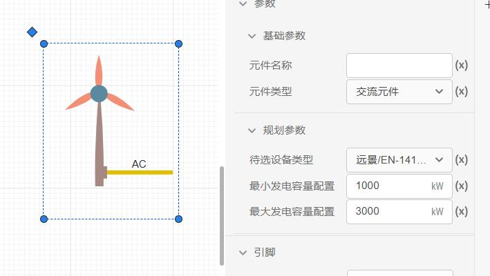

本节全面介绍 IESLab 规划优化平台方案计算的基本原理与使用方法，涵盖优化功能总览、优化数学模型、数学优化原理基础、求解计算方式、典型场景生成（GMM 聚类），以及财务评估的基础理论。文档面向能源规划从业者，帮助您快速理解平台并上手完成能源规划优化业务。

> **相关文档**：
> - **本文档（原理篇）**：本文档为规划优化相关技术与原理；
> - **计算方案配置**：系统级约束（预设模板 + 自定义 DSL）、各类计算参数的逐项说明及各类工程场景的配置指，见 [计算方案配置](../20-job-config/index.md)；
> - **结果与报告**：优化结果的查看方法、图表详解及调试技巧，见 [结果页面](../30-results-tab/index.md)。

---

## 目录

- [1. 功能定位与使用流程](#1-功能定位与使用流程)
- [2. 优化功能总览](#2-优化功能总览)
- [3. 优化数学模型](#3-优化数学模型)
- [4. 数学优化原理基础](#4-数学优化原理基础)
- [5. 求解计算](#5-求解计算)
- [6. 典型场景生成与 GMM 聚类算法](#6-典型场景生成与-gmm-聚类算法)
- [7. 财务评估基础理论](#7-财务评估基础理论)

---

## 1. 功能定位与使用流程

### 1.1 初学者导读：什么是"优化"

在阅读本节之前，先建立一个直观认识：**能源系统规划优化，就是让在所有可行的方案中，自动找出成本最低的那一个**。

以一个园区能源规划为例，您可能面临这样的问题：

> 园区有电、热两种负荷。我可以装光伏、装风机、装蓄电池、装燃气锅炉，也可以直接从电网买电。每种设备有多种型号、投资不同、效率不同；电价白天贵、晚上便宜。**每种设备各装多少台、每天怎么运行，全年花的钱最少？**

这个问题可能的组合方案成千上万种——手动试算根本算不过来。规划优化平台把这个问题写成**数学模型**，交给**求解器**（一种高效的数学计算软件）自动搜索，几分钟到几十分钟内给出全局最优（或接近最优）的答案：

| 您在平台上做的事 | 平台自动做的事 |
|:---|:---|
| 画出系统拓扑（哪些设备、怎么连接） | 识别拓扑，生成能量平衡关系 |
| 录入数据（负荷曲线、气象、电价、设备型号库） | 将数据填入模型 |
| 配置方案参数（见[计算方案配置](../20-job-config/index.md)） | 组装数学优化模型 |
| 点击"开始计算" | 调用求解器搜索最优方案 |
| 结果查看 | 输出设备配置、运行策略、成本与财务报表 |

理解本节内容，您不需要任何优化专业背景；[第 4 章](#4-数学优化原理基础)会简单介绍线性规划等数学原理，感兴趣可以深入阅读，不感兴趣也**不影响正常使用**——您只需知道：平台会自动找到"最省钱且满足所有物理约束"的方案。

### 1.2 功能定义

IESLab 规划优化平台的**方案计算**功能，面向处于**规划设计阶段**的园区级至区域级的冷、热、电、氢等多能源耦合系统（亦包含单一能源的供能系统），在典型运行场景下，基于优化目标（经济性或环保性）对系统中的设备进行**选型与定容**，并优化其在典型日下的**运行方式**。

简单来说，平台回答三个问题：

| 问题 | 输出 | 举例 |
|:---|:---|:---|
| **选什么、配多少？** | 各设备的候选型号选择与配置台数/容量 | 风机选"远景 1200kW"2 台 + 光伏 5000 kW |
| **怎么运行？** | 典型日 24h 逐时出力、充放电、启停策略 | 蓄电池夜里充电、白天高峰放电 |
| **投资划算吗？** | 全生命周期成本、投资回收期、财务报表 | 静态回收期 6.8 年，全投资 IRR 9.2% |

### 1.3 核心能力

| 能力维度 | 支持内容 |
|:---|:---|
| **能源载体** | 电（交流/直流）、热、冷、氢、气等 8 类载能体 |
| **设备模型** | 47 类组件（光伏、风机、蓄电池、电解槽、燃料电池、制冷机、热泵、锅炉、储氢罐等） |
| **规划维度** | 设备选型（多候选型号池）+ 定容（容量范围约束下的台数优化） |
| **运行维度** | 8760h 全年或典型日逐时运行策略优化 |
| **潮流内核** | 交直流线性潮流——节点-支路拓扑上的功率平衡与潮流分布，功率流向可见 |
| **系统约束** | 绿电占比、上网比例、弃电率等合规约束，支持自定义 DSL 语法 |
| **求解规模** | 50+ 设备、全年 8760h 优化，两阶段解耦可将求解时间由数小时压缩至数十分钟 |
| **结果输出** | 设备配置表、运行曲线、能量平衡图、11 张财务报表、一键 Word 项目报告 |

### 1.4 适用与不适用场景

| ✅ 适合用 IESLab 规划优化 | ❌ 不适合（请选用其他工具） |
|:---|:---|
| 园区/区域综合能源系统规划设计 | 秒级以下电磁暂态动态仿真（→ EMTLab） |
| 风光储容量配比与投资估算 | 短路电流、保护整定校核（→ DSLab） |
| 绿电直连项目合规性校核 | 输配电网拓扑优化、OTS等 |
| AIDC 算力中心源网荷储协同规划 | 电力市场现货竞价策略优化 |
| 多方案比选与敏感性分析 | 在线实时调度控制 |

### 1.5 典型使用流程

一次完整的规划优化通常按以下五步进行：

```
数据准备 → 拓扑搭建 → 方案配置 → 启动计算 → 结果查看
```

| 步骤 | 操作内容 | 参考文档 |
|:---|:---|:---|
| **数据准备** | 在数据管理模块录入气象数据（辐照、风速、温度）、电/冷/热/氢负荷曲线、分时电价、待选设备型号库 | 数据管理模块文档 |
| **拓扑搭建** | 在拓扑编辑器中放置元件、建立连接，设置元件约束；平台在您手动搭建的拓扑基础上**自动识别**交直流母线与节点-支路-设备连接关系，无需手动声明供能方式 | 拓扑编辑文档 |
| **方案配置** | 创建计算方案，设置规划类型、场景缩减方式、惩罚参数、系统约束（预设模板或自定义 DSL）、财务参数 | [计算方案配置](../20-job-config/index.md) |
| **启动计算** | 选择优化目标，点击**开始计算**；可随时停止或停止并删除 | [结果查看](../20-results-tab/index.md) |
| **结果查看** | 方案列表比选、设备配置详情、典型日运行曲线、能量平衡图、财务报表、Word 报告导出 | [结果查看](../20-results-tab/index.md) |

> 同一项目可创建**多个计算方案**，各自独立配置设备选型、容量与运行策略，所有方案本地保留，关键指标可并排比选。

### 1.6 数据准备要点

优化结果的可靠性直接取决于输入数据的质量。启动计算前请核对以下数据：

| 数据类别 | 内容 | 注意事项 |
|:---|:---|:---|
| **气象数据** | 太阳辐照强度、风速、温度等（逐时） | 决定光伏/风机理论出力；缺失值平台自动插补，但建议保证主体完整 |
| **负荷曲线** | 电/冷/热/氢负荷逐时曲线 | 注意单位（kW 为功率值）；曲线覆盖时段应与规划时段一致 |
| **电价数据** | 分时电价 / 阶梯电价 / 分时阶梯电价 / 两部制电价 | 影响购电成本与储能策略；两部制电价含需量电费 |
| **燃料价格** | 天然气、氢气等价格 | 影响燃料设备的经济性 |
| **设备候选库** | 每类设备的候选型号（额定功率、投资单价、效率、寿命、运维成本） | 型号池越丰富，选型空间越大；容量范围约束在此配置 |
| **电网参数** | 购电功率上限、上网比例限制（`MaxFeedinRatio`） | 决定与外部电网的交换能力 |

> **单位自查清单**：负荷与出力用 **kW**、电量用 **kWh**，数据管理模块的设备效率，如储能设备的效率为0-1，而拓扑变基模块和计算方案的部分参数为百分制，如上网率，自消纳率等。单位错误是导致"结果偏大/偏小一个数量级"的最常见原因。

---

## 2. 优化功能总览

平台围绕"规划 + 运行"两条主线，提供以下优化功能：

### 2.1 设备选型与定容

- 每类设备可配置**多个候选型号**（如风机可选"远景 EN-120/1400"与"金风 GW2500-140"两种型号），平台从中自动挑选最划算的组合；
- 在用户指定的**容量范围**（如 1000~3000 kW）内自动优化配置台数；
- 选型与定容同时优化，兼顾型号间的效率、投资、运维差异。

**示例**：用户指定的风机容量范围为 1000~3000 kW，候选型号池中有两种风机——远景（额定 1200 kW）与金风（额定 2500 kW）。则远景可配 1~2 台、金风可配 1 台，平台会在这些组合中自动择优。



### 2.2 运行策略优化

- 典型日 24h 逐时出力曲线：发电设备出力、储能充放电、转换设备能量分配；
- 储能充放电策略：在电价峰谷间套利、消纳富余新能源；
- 最大购电功率优化：两部制电价下优化需量电费。

### 2.3 储能保供

滑动窗口法自动识别全年极端工况，生成保供曲线并转化为储能**时变 SOC 下限**——平时用足容量，极端工况自动留足应急余量。通过 `PowerGuarantee` 参数（保供小时数）启用。

**直观理解**：假设保供小时数为 4，平台会检查全年每一个连续 4 小时的高负荷窗口，确保储能在这些窗口内有足够电量顶上，避免电网停电或新能源出力骤降时负荷失电。

### 2.4 机组组合（UC）启停优化

面向电解槽等**启停敏感设备**，可启用逐时启停排班优化：运行台数、启停跟踪、最小运行负载率等。规划阶段即可知道"买几台、何时开、何时关"。

**典型案例**：碱性电解槽（ALK）启动耗时长、频繁启停损耗大。开启 UC 后，平台会为其排定"连续开 8 小时、停 4 小时"这类符合物理规程的启停计划，而不是让它逐小时随意开关。

### 2.5 柔性负荷调度

柔性电负荷（FlexEleLoad）支持**四种调节模式**：

| 模式 | 说明 | 适用设备 | 计算方式 |
|:---|:---|:---|:---|
| 挡位功率 | 按固定功率挡位增减载 | 空调、水泵等离散档位设备 | 混合整数（MILP） |
| 挡位比例 | 按额定功率的固定比例挡位增减载 | 有百分比挡位的设备 | 混合整数（MILP） |
| 无极功率 | 连续功率调节 | 可连续调节的负荷（推荐） | 线性规划（LP） |
| 无极比例 | 连续比例调节 | 可连续调节的负荷（推荐） | 线性规划（LP） |

新能源大发时段**增载消纳**、低谷时段**减载降本**，调节成本计入目标函数。大规模优化推荐使用**无极模式**（纯 LP，求解效率更高）。

### 2.6 全生命周期设备替换

按设备寿命与项目运营期自动计算替换次数，替换投资纳入全生命周期成本优化。

**直观理解**：项目周期 25 年，蓄电池寿命 10 年——期间需要更换 2 次。这两笔更换投资会自动计入总成本，避免"只算首次投资、低估真实成本"。

### 2.7 财务后评估

优化完成后可执行财务后评估，输出 11 张标准财务报表与投资收益率、投资回收期、度电成本等指标（详见[结果查看](../20-results-tab/index.md)）。

---

## 3. 优化数学模型

### 3.1 读懂优化模型：目标、变量、约束

任何优化问题都由三要素构成，以"家庭装修选家具"作类比：

| 三要素 | 数学名称 | 家装类比 | 本平台对应 |
|:---|:---|:---|:---|
| **想决定什么** | 决策变量 | 买几张床、几张桌 | 设备台数、逐时出力 |
| **想要什么最好** | 目标函数 | 花钱最少、利用率最高 | 全生命周期成本最小 |
| **必须满足什么** | 约束条件 | 房间面积有限、预算上限 | 能量平衡、设备物理限制、合规指标 |

**优化求解器做的事**：在所有满足约束的变量取值组合（可行方案）中，找到让目标函数最小（最优）的那一组。

平台已将能源规划的这三要素**预置为模板**：您录入拓扑与数据后，平台自动生成目标函数和绝大多数约束；您在方案中配置的参数（见[计算方案配置](../20-job-config/index.md)）只是对少数关键项做调整。理解三要素，就能明白每个参数"到底在改模型的哪一部分"。

### 3.2 优化目标

平台基于单目标优化模型，优化目标为**经济性**——系统全生命周期综合成本最小：

$$
\min \; C_{TC} = C_{inv} + C_{op,f} + C_{op,v} + C_{fuel} + C_{pur} - C_{sel} + C_{penalty}
$$

各项含义与通俗解释：

| 分项 | 含义 | 通俗解释 |
|:---|:---|:---|
| $C_{inv}$ | 投资等效年金 | 一次性投资折算成"每年摊多少钱"。买 100 万设备用 10 年，不是每年算 100 万，而是按年金公式摊到每年约 13~16 万（取决于贴现率） |
| $C_{op,f}$ | 固定运维成本 | 只要设备在，每年就得花的钱（检修、人工），与容量成正比 |
| $C_{op,v}$ | 可变运维成本 | 每发一度电（每供一焦热）多花的钱，与出力成正比 |
| $C_{fuel}$ | 燃料消耗成本 | 燃气锅炉、燃机的燃料费 |
| $C_{pur}$ | 购能成本 | 从电网买电的钱，分时电价下白天贵、晚上便宜 |
| $C_{sel}$ | 售能收益 | 新能源发电上网卖钱的收入（前面带负号，从总成本中扣除） |
| $C_{penalty}$ | 惩罚项 | 缺供电、弃风弃光、约束越限的"罚款"（见 [3.5 节](#35-惩罚项)） |

其中投资等效年金的计算公式为：

$$
C_{inv} = \sum\limits_{i=1}^{M} \frac{r(1+r)^{T_i}}{r(1+r)^{T_i} - 1}\,\phi_i
$$

| 符号 | 含义 | 说明 |
|:---|:---|:---|
| $r$ | 贴现率 | 资金的时间价值，默认 7%；在财务参数中配置 |
| $T_i$ | 第 $i$ 类设备的寿命年限 | 光伏约 25 年、蓄电池约 10 年 |
| $M$ | 待规划的设备种类数 | — |
| $\phi_i$ | 第 $i$ 类设备的投资费用 | 型号单价 × 台数 |

> **贴现率的直观作用**：贴现率越高，未来支出的"现值"越低，优化越倾向于"少花钱建设、多花钱运行"；贴现率越低，越倾向于"一次性多投资、换取低运行成本"。工程中贴现率一般取 5%~8%。

### 3.3 决策变量

优化模型求解时，以下变量由算法自动确定（您只需在平台上配置范围，不必逐个指定取值）：

| 变量类别 | 类型 | 含义 | 示例 |
|:---|:---|:---|:---|
| **设备选型** | 整数 | 每种候选型号的配置台数 | 选"远景"还是"金风"风机、各几台 |
| **运行方式** | 连续 | 各典型日各时段的出力/充放电/能量流 | 蓄电池一天内的充放电策略、制冷机出力曲线 |
| **启停状态** | 0-1 | 启停敏感设备各时段的开/停 | 电解槽逐时启停排班（启用 UC 时） |
| **柔性调节量** | 连续 | 柔性负荷各时段的增/减载量 | 算力负荷高峰时段减载多少 |
| **潮流分布** | 连续 | 各支路各时段的功率流向与大小 | 每条线路、每个节点的功率分布 |
| **最大购电功率** | 连续 | 计费周期内的最大需量 | 两部制电价需量电费优化 |
| **松弛变量** | 连续≥0 | 软约束的违反量 | 合规约束轻微越限时付出惩罚代价 |

**设备选型与容量范围的关系**：选型变量的取值范围取决于**数据管理模块中的待选设备型号池**；容量变量取值范围是用户指定容量约束内该型号可配的台数范围。示例见 [2.1 节](#21-设备选型与定容)。

### 3.4 约束条件

#### 3.4.1 能量模型约束

指系统的能量转换与平衡关系，是模型的"物理骨架"，由平台根据拓扑**自动生成**：

- **设备能量转换关系**：每类设备的输入-输出关系，如制冷机的"电→冷"按能效比（COP）转换、锅炉的"气→热"按效率转换；
- **节点能量平衡**：每个节点每个时段，流入功率 = 流出功率，电/热/冷/氢/气各载体分别平衡——"供多少、用多少、存多少，账要平"。

平台采用**交直流线性潮流内核**在节点-支路拓扑上建模：

- **交流母线**：线性化有功潮流，支持支路容量双向约束与传输损耗；
- **直流母线**：建模换流器效率；
- **MMC 换流器**：桥接交直流网络，支持主从控制；
- **热/冷/氢/气网**：线性能流（节点压力/温度势 + 管道流量）。

线性化潮流**避开非线性求解的不稳定**，同时保留功率方向与容量信息——过去只能看到"系统发了多少电、用了多少电"，现在能看到**每一台设备、每一条线路、每一个节点**在每一时刻的功率流向。

拓扑连接由用户在拓扑编辑器中手动搭建，平台在其基础上**自动识别**交直流母线与电压等级、自动推导平衡关系，用户无需手动声明供能方式。


#### 3.4.2 设备运行约束

每类设备依据其物理特性施加运行约束：

| 约束类型 | 说明 | 通俗解释 | 适用设备 |
|:---|:---|:---|:---|
| 出力上下限 | 出力不超过已配置容量，不低于最小技术出力 | "这台机器最多干这么多活" | 所有设备 |
| 能效转换关系 | 输出 = 输入 × 能效比（COP/效率） | "吃 3 度电产 10 度冷" | 热泵、制冷机、锅炉、换热器等 |
| 储能 SOC 限制 | 荷电状态在允许范围内，始末容量一致 | "电池不能充爆、不能放空，一天下来存放电量打平" | 蓄电池、储热/冷/氢罐 |
| 充放电互斥 | 同一时刻不同时充放电 | "不能边充边放" | 蓄电池 |
| 启停逻辑 | 最小开机/停机时间、启停次数限制（UC） | "关机后至少歇 2 小时才能再开" | 电解槽、燃料电池等 |
| 特性曲线 | 特性曲线分段线性化 | "部分负荷下效率会变，按曲线算" | 单/双工况制冷机 |
| 冷热双模式 | 同一设备冷热模式切换 | "同一台设备，这个时段制冷、那个时段制热" | 热泵、吸收式设备 |

#### 3.4.3 系统级约束（合规约束）

跨设备的系统级指标约束，如绿电直连合规指标、新能源消纳比例、储能保供等。平台提供**预设约束模板**（直接选类型给限值）与**自定义 DSL**（用接近数学表达式的语法描述），详见[计算方案配置 · 系统约束](../20-job-config/index.md#系统约束与自定义-dsl)。

#### 3.4.4 外部条件约束

| 约束 | 说明 | 通俗解释 |
|:---|:---|:---|
| 外部电源最大购电量 | 电网接口的购电功率上限 | "供电局只允许你这么大功率用电" |
| 最大上网电量 | 新能源上网比例限制（外部电源属性 `MaxFeedinRatio`） | "反送回电网的电不能超过这个比例" |
| 燃料供应极限 | 气源/氢源的最大供应能力 | "气站每天最多供这么多气" |
| 上级变压器容量 | 并网点的容量限制 | "变压器就这个容量" |

### 3.5 惩罚项

优化模型中，能量不平衡（缺供、弃能）与软约束违反通过**惩罚成本**计入目标函数，而非硬性禁止。这样既保证模型有解，又引导优化结果尽量满足供需平衡与合规要求：

| 惩罚项 | 参数 | 默认值 | 触发场景 |
|:---|:---|:---|:---|
| 电不平衡惩罚 | 电不平衡惩罚单价 | 10000 元/MW | 负荷缺供、切负荷 |
| 新能源弃电惩罚 | 新能源弃电惩罚 | 0.2 元/kWh | 弃风弃光 |
| 约束松弛惩罚 | PenaltySoft | 10 | 系统级约束轻微越限 |

**直观理解**：惩罚项相当于在优化"心里"给每度缺供电、每度弃电标了个价格。如果"配 1 台储能"比"交罚款"便宜，优化就配储能；反之宁可受罚。所以：

- 惩罚设**太低** → 结果大量缺供/弃电（"罚得起就随便犯"）；
- 惩罚设**太高** → 结果过度配置设备来避免任何微小不平衡（"过度防御"）。

> **设置建议**：电不平衡惩罚应显著高于购电单价（缺供是严重事件）；弃电惩罚介于 0 与电价之间。具体见[计算方案配置 · 优化设置参数](../20-job-config/index.md)。

---

## 4. 数学优化原理基础

本章面向初学者，用通俗语言介绍平台背后的数学优化原理。读完您将理解：为什么规划问题是"混合整数线性规划"、求解器在做什么、"最优性间隙 1%"是什么意思。**跳过本章不影响使用平台**。

### 4.1 线性规划（LP）

#### 什么是线性规划

**线性规划（Linear Programming, LP）**是运筹学中最基础、应用最广的优化方法：目标函数和所有约束都是变量的**一次函数**（没有平方、没有乘积）。

一个直观的例子：

> 某工厂生产 A、B 两种产品：A 每件赚 3 元、耗电 2 度；B 每件赚 4 元、耗电 4 度。每天最多供电 80 度，且 B 的日产量不能超过 15 件。各生产多少件利润最大？

写成数学形式：

$$
\max \; 3x_A + 4x_B \qquad \text{（利润最大 = 目标函数）}
$$
$$
\text{s.t.} \quad 2x_A + 4x_B \leq 80 \qquad \text{（电量约束）}
$$
$$
\quad\;\; x_B \leq 15 \qquad\qquad\;\;\; \text{（销量约束）}
$$
$$
\quad\;\; x_A, x_B \geq 0 \qquad\qquad\;\; \text{（非负约束）}
$$

其中 `s.t.`（subject to）表示"受约束于"。$x_A, x_B$ 就是**决策变量**， 而您将优化决定它们的取值。

#### 线性规划的几何直觉

把每个可行方案看成坐标系里的一个点，所有满足约束的点构成一个**可行域**——它是一个**凸多面体**（二维时是多边形）。一个经典结论是：

> **线性规划的最优解一定出现在可行域的某个"顶点"上。**

这就像在一个多边形的围墙里找"最低点"，只需沿着围墙（顶点）走，不必考察围墙内的无穷多个点。正因如此，LP 可以在多项式时间内被**精确求解**——这使 LP 成为运筹学中"最好解"的一类问题。

#### 平台中的 LP

平台的**运行优化**（设备出力、储能充放电、能量流分配）就是大规模 LP：几十万条约束、上百万个变量，求解器仍然能在秒到分钟级精确求解。

### 4.2 整数规划与混合整数规划（MILP）

#### 为什么需要整数变量

设备**不能买半台**——选型"1 台或 2 台"是离散决策；设备**某一时刻要么开、要么停**——启停是"是/否"决策。这些量必须用**整数变量**（或 0-1 变量）表达。

- **整数规划（IP）**：所有变量都是整数；
- **混合整数规划（MILP）**：部分变量整数（选型台数、启停状态）、部分变量连续（出力功率）——**本平台规划问题的类型**。

#### 整数带来的质变

整数变量让模型能表达"逻辑"：

| 需求 | 数学实现 | 平台中的应用 |
|:---|:---|:---|
| 要么买 A 型、要么买 B 型，不能都买 | 两个 0-1 变量之和 ≤ 1 | 多型号互斥选型 |
| 开机才能出力，关机必然零出力 | $P \leq P_{max} \cdot z$（$z$ 为 0-1 启停变量） | UC 启停、大 M 法 |
| 储能不能同时充放电 | 充放电两个状态变量互斥 | 蓄电池充放电互斥 |
| 双工况机组只能处于一种模式 | 模式 0-1 变量之和 = 1 | 制冷/制冰模式切换 |

#### MILP 比 LP 难在哪

LP 只需考察可行域顶点；而整数变量的存在把可行域"切碎"成离散点集，求解器通常需要**分支定界（Branch and Bound）**：先放宽整数要求按 LP 求解，再逐层"分支"尝试将变量固定为整数，用"边界"（bound）剪掉不可能更优的分支。问题规模越大、整数变量越多，搜索树越庞大——这就是大规模 MILP 求解耗时长的根本原因，也是平台提供**两阶段解耦**（[第 5 章](#5-求解计算)）的原因。

### 4.3 求解器如何寻找最优解

您不需要了解算法细节，但了解以下直觉有助于解读求解日志：

| 阶段 | 求解器在做什么 | 日志中的表现 |
|:---|:---|:---|
| **预处理（Presolve）** | 消去冗余约束与平凡变量，缩小问题 | "Presolve: removed xxx rows" |
| **求下界（LP 松弛）** | 放宽整数约束求 LP，得到"理论最好能好到什么程度" | "Best bound" 持续上升 |
| **分支搜索** | 逐个固定整数变量、分支剪枝，不断找到更好的可行方案 | "Best integer" 持续下降（最小化问题） |
| **收敛判定** | 当"最好可行解"与"理论下界"的相对差距 ≤ 最优性间隙，停止 | "Gap: 0.8% < 1%, optimal" |

#### 最优性间隙（MIP Gap）

MILP 通常**不追求严格数学最优**，而是允许一个相对偏差容忍度：

$$
\text{Gap} = \frac{\text{当前可行解成本} - \text{理论下界}}{\text{当前可行解成本}}
$$

默认 **Gap = 0.1%**：即找到的方案成本保证不超过理论最优的 0.1%。对工程规划而言 0.1% 的偏差远小于负荷预测等数据本身的误差，完全可接受。**调小 Gap 换精度、调大 Gap 换速度**。

### 4.4 常用术语速查

| 术语 | 英文 | 通俗解释 |
|:---|:---|:---|
| 目标函数 | Objective Function | 要最小化/最大化的量（这里是总成本） |
| 决策变量 | Decision Variable | 由优化决定的量（台数、出力、启停） |
| 约束条件 | Constraint | 变量取值必须满足的限制 |
| 可行解 / 可行域 | Feasible Solution / Region | 满足全部约束的方案 / 所有可行方案的集合 |
| 最优解 | Optimal Solution | 可行域中目标函数最好的方案 |
| 无可行解 | Infeasible (IIS) | 约束互相矛盾，无任何方案能满足 |
| 线性规划 | LP | 目标与约束全为线性的优化问题 |
| 混合整数规划 | MILP | 部分变量取整数的优化问题 |
| 松弛变量 | Slack Variable | 软约束的"违反量"，付出惩罚换取可行 |
| 最优性间隙 | MIP Gap | 当前解与理论最优的相对偏差 |
| 求解器 | Solver | 专业数学优化计算软件（HiGHS、Gurobi 等） |
| 凸优化 | Convex Optimization | 一类性质良好、可高效求解的优化问题，LP 是其特例 |

---

## 5. 求解计算

### 5.1 求解模式

平台提供三种求解模式，按**模型规模与精度需求**选择：

| 模式 | 技术路线 | 适用场景 | 特点 |
|:---|:---|:---|:---|
| **统一模型** | 全部场景构建为一个混合整数规划模型，一次求解 | 中小规模、需要全局精确最优解 | 精度最高，求解时间随时段数增长较快 |
| **两阶段串行** | **先配置、再运行**：第一阶段在极端场景下确定设备配置；第二阶段固定配置，逐场景优化运行 | 大规模、含启停（UC）逻辑 | 兼顾精度与效率 |
| **两阶段并行** | 同上，第二阶段各场景**分区并行**求解 | 大规模全年 8760h 优化 | 速度最快，50+ 设备全年优化可由数小时压缩至数十分钟 |

### 5.2 两阶段解耦技术路线

两阶段解耦的核心思路是**"先配置、再运行"**：

```
第一阶段（配置定容）
  识别全年工况 → 在典型场景下优化设备选型与容量
        │
        │  设备配置固定
        ▼
第二阶段（运行优化）
  按典型场景逐时段优化运行策略（各场景可并行求解）
        │
        ▼
  合并各场景运行结果 → 全年 8760h 运行曲线 → 统计与财务评估
```


> **模式选择建议**：初期规划估算用统一模型或月度典型日即可；方案深化与 AIDC/全年精细优化建议两阶段并行。

### 5.3 求解器

平台支持与主流优化求解器对接，如 HiGHS / SCIP / COPT / CBC 等。含整数变量（选型、容量、启停）时为混合整数规划（MILP），纯运行为线性规划（LP）。求解器选项（时间限制、最优间隙、并行线程数）由平台统一配置，一般无需修改；高级用户可在方案中调整。

| 选项 | 默认值 | 说明 |
|:---|:---|:---|
| 求解时间限制 | 3600 s | 超时返回当前最优解（仍可用） |
| 最优性间隙 | 0.1% | 解与理论最优的相对偏差容忍度（见 [4.3 节](#43-求解器如何寻找最优解直觉)） |
| 并行线程数 | 8 | 求解器内部并行度 |

### 5.4 计算时长参考

| 场景规模 | 推荐模式 | 参考时长 |
|:---|:---|:---|
| ~20 台设备、月度典型日 | 统一模型 | 秒级~分钟级 |
| 50+ 设备、聚类典型日 | 两阶段串行 | 分钟级 |
| 50+ 设备、全年 8760h | 两阶段串行 | 数十分钟 |

> 计算过程中页面会动态推送已获得的优选方案；计算停滞时可切换**显示日志**面板排查（见[优化调试建议](#102-优化调试建议)）。

---

## 6. 典型场景生成与 GMM 聚类算法

### 6.1 为什么需要场景缩减

不管是综合能源系统的**规划投资**还是**仿真模拟**分析，都需要海量场景的支撑，都需要首先确定**综合能源场景**，包括主要的气象条件（太阳辐照强度、风速、温度等）、电冷热负荷参数等。在准确的综合能源场景下的规划设计结果更具备可行性。

若综合能源场景包含 8760h 所有的数据，不仅会使得规划优化问题异常复杂，还对计算资源要求很高，计算时间很长，带来**"维数灾难"**，需要进行**场景缩减生成**。传统做法是通过把气象条件和电冷热负荷加权后生成场景，如年典型日、季节典型（夏天、冬天和过渡季节）和月度典型日，以降低计算复杂度。但这类典型日的**数量少，规划设计精度较低**，其规划方案不能用于实际生产设计，难以实际落地；也未考虑极端场景，极端工况发生概率不明确，可能造成投资过多而浪费。

因此需要通过**场景生成技术**，让典型场景兼容海量场景的**丰富性**和少量场景的**代表性**，兼顾**计算准确和效率**：相似场景聚类后只需计算一次，避免"维数灾难"，为规划提供具有合理精度的基本完整数据集。

### 6.2 聚类算法：硬分类与软分类

生成典型场景的主流方法是**聚类算法**，可分为两类：

| 类别 | 代表算法 | 特点 | 局限 |
|:---|:---|:---|:---|
| **硬分类** | k-means、k-medoids、层次聚类、基于密度的聚类（DBSCAN） | 每个时刻**硬性划分**到某一个类别；需指定类别数量与距离度量 | 丢失场景间过渡信息；边界时刻归属武断 |
| **软分类** | **高斯混合模型（GMM）** | 计算某时刻**属于各典型日的概率**，结合概率统计方法 | 计算量略大（平台已优化） |

**直观对比**：凌晨 3 点到早晨 7 点，负荷从"夜间形态"逐渐过渡到"日间形态"。硬分类会在某个整点把它"一刀切"进某一类；GMM 则认为 5 点"60% 像夜间形态 + 40% 像日间形态"，典型日形态由概率加权融合——**过渡更平滑、形态更贴近真实**，可以更好地指导综合能源系统的投资规划。

> IESLab 默认采用 **GMM 软聚类** 生成典型场景：典型日用于运行优化，8760h 全量曲线由典型日按权重映射重组得到。

### 6.3 五种场景生成方式

| 方式 | 方法 | 输出 | 计算量 | 精度 | 适用阶段 |
|:---|:---|:---|:---|:---|:---|
| **月度平均** | 每月取均值 | 12 个典型日 | 极小 | 低 | 项目初期快速估算 |
| **月度聚类** | 每月独立 GMM 聚类 | 每月若干典型日 | 小 | 中 | 月度精细分析 |
| **全周期聚类** | 全时间周期按天进行 GMM 聚类 | ≤20 个典型日 | 中 | 较高 | 兼顾效率与精度 |
| **8760h 全年** | 不缩减，全量建模 | 全年逐时 | 最大 | 最高 | 运行阶段精细化优化 |

**选择指引**：

- **月度平均**：综合能源项目初期规划阶段，计算量小，可以快速找到合适的设备型号及容量配置方案；
- **聚类**（月度/全周期）：能够兼顾计算效率和精度，满足大多数场景需求——**一般项目的推荐选择**；
- **8760h 全年**：适合运行阶段的设备出力优化，对优化结果要求较高的场景，如风光储项目中对储能的精细化调控。


### 6.4 GMM 聚类算法原理

#### 6.4.1 数学模型

GMM 假设观测数据（各时刻的多维特征：负荷 + 气象）由 $K$ 个高斯分布混合生成：

$$
p(x) = \sum_{k=1}^{K} \pi_k \cdot \mathcal{N}(x \mid \mu_k, \Sigma_k)
$$

| 符号 | 含义 | 通俗解释 |
|:---|:---|:---|
| $\pi_k$ | 第 $k$ 个成分的权重（$\sum_k \pi_k = 1$） | 这类形态的时段占全年多大比例 |
| $\mu_k$ | 第 $k$ 个成分的中心 | 这类"典型日"的形态长什么样 |
| $\Sigma_k$ | 第 $k$ 个成分的离散程度 | 这类形态内部的差异有多大 |

#### 6.4.2 算法流程

```
数据预处理
   曲线补全为整天逐时数据，缺失值时间插值，MinMax 归一化消除量纲影响
        │
        ▼
PCA 降维
   提取主要特征成分，降低高维聚类的计算复杂度
        │
        ▼
EM 迭代求解
   E 步：计算每个时刻属于各成分的概率（软分配）
   M 步：按概率加权更新各成分的中心与离散度
   反复迭代直至收敛
        │
        ▼
BIC 准则确定聚类数目
   BIC(K) = -2·ln(似然) + 参数数·ln(样本数)，取最小值对应的 K
        │
        ▼
生成典型日
   每个成分 → 一个典型日；权重 = 该成分覆盖的小时数
   典型日曲线 = 成员时刻的加权平均
```

**EM 迭代的直觉**：E 步先"猜"每个时刻属于哪类（按概率），M 步再根据猜测重新估计每类的"长相"；如此反复，分类与类形态互相改进，直至不再明显变化——类似"先按印象分组、再按分组修正印象"的迭代过程。

#### 6.4.3 BIC 准则自动确定聚类数目

聚类数目 $K$ 越大，对数据的拟合越精细，但模型越复杂、后续优化计算量越大。**BIC（贝叶斯信息准则）**在两者间自动权衡：

$$
BIC(K) = -2\ln(\hat{L}) + p\ln(n)
$$

- $\hat{L}$：模型对数据的拟合优度（似然值）；
- $p$：模型参数个数（随 $K$ 增长）；
- $n$：样本量。

BIC 取**最小值**对应的 $K$——即"拟合精度提升不足以抵偿复杂度增加"的临界点。

| 方式 | 说明 | 建议 |
|:---|:---|:---|
| **自动确定**（默认） | 按 BIC 准则寻优 | 一般场景推荐 |
| **指定数目** | 用户手动指定（月度聚类每月上限 6，全周期聚类上限 20） | 对比敏感性、控制计算量时使用 |

> **经验参考**：全周期聚类 8~15 个典型日通常已能较好覆盖全年特征；若关注极端工况，请配合两阶段模式的极端场景识别（其独立于聚类自动运行）。

### 6.5 聚类结果的构成

每个典型日包含：

| 字段 | 含义 |
|:---|:---|
| 典型日编号 / 名称 | 如"1月典型日 1"、"年度典型日 3" |
| 所属月份 | 典型日归属月份 |
| 持续时长（权重） | 该典型日代表全年多少小时 |
| 各类负荷最大/平均值 | 电/冷/热/氢负荷统计 |
| 24h 逐时曲线 | 气象与各负荷/出力曲线 |

可在方案中开启"场景是否可视化"，在结果中直观检查聚类效果（每类形态是否合理、权重分布是否均衡）。

---

## 7. 财务评估基础理论

优化完成后，平台支持对方案进行全生命周期的财务评价，输出投资收益率、回报期等经济性指标以及十余张财务报表。本节介绍读懂报表和处理财务评估结果所必需的基础财务知识，理解本节有助于在**计算方案配置**（[财务参数](../20-job-config/index.md)）中正确填写各项财务参数。如果已经熟悉项目财务评价，可以跳过本节直接阅读报表原理。

> **名词澄清**：本节是"评估与报表的数学原理"。平台中与财务相关的三块内容——评估原理（本节）、方案中的财务参数（见[计算方案配置](../20-job-config/index.md)）、结果报表明细（见[结果页面](../30-results-tab/index.md)）——三者分别属于原理、配置与结果，阅读时可对照参考。

### 7.1 资金时间价值与折现

**资金时间价值**是指资金在不同时间点上具有不同价值：今天的一元钱比一年后的一元钱更值钱，因为可以投资生息。财务评估必须把不同年份的现金流量放在同一个时间基准上比较，这就是**折现（贴现）**。

折现的数学形式为：

```
某年现金流的现值 = 该年现金流 / (1 + 折现率)^年数
```

其中折现率即机会成本或基准收益率。基于折现可以定义两个最重要的指标：

- **财务净现值（NPV）**：把项目全周期的净现金流量按基准折现率折算到起点后的总和。NPV > 0 表示项目收益超过基准收益水平，可行；NPV < 0 表示项目达不到基准收益水平。
- **财务内部收益率（IRR）**：使项目净现金流量现值总和恰好等于 0 的那个折现率，即"项目自身的投资回报率"。IRR 越高，项目盈利能力越强。由于 IRR 的方程无法直接求解，本平台采用**牛顿迭代法**求解（从初始值 8% 出发迭代，相邻两次解的差小于千分之一时收敛）。

平台概览指标中的**财务净现值**和**内部收益率**均按上述原理计算。

### 7.2 项目财务评价的两套口径

财务评估先把"项目整体"和"投资者角度"分开考察，对应两套现金流量表：

- **融资前分析（项目投资现金流量表）**：站在项目整体角度，不考虑钱是借来的还是自己的，现金流出只包括建设投资、流动资金、经营成本、税金，不含借款及其还本付息。它衡量**项目自身**的盈利能力，计算"项目投资内部收益率"。
- **融资后分析（项目资本金现金流量表）**：站在投资者的角度，只考察**自有资金（资本金）**的投入与回报，现金流出包含资本金投入、还本付息、所得税等。它衡量**投资者**的回报水平，计算"资本金内部收益率（即财务内部收益率，FIRR）"。

两者的关系是：融资前分析看"项目值不值得做"，融资后分析看"项目对股东划不划算"。

### 7.3 盈利能力评价指标族

平台经济性指标分为**静态指标**（不考虑资金时间价值）与**动态指标**（考虑资金时间价值）两类：

| 类型 | 指标 | 含义 | 计算公式（平台实现） |
| --- | --- | --- | --- |
| 动态 | 资本金内部收益率 | 资本金口径现金流 IRR | 使资本金净现金流量现值=0 的折现率（牛顿迭代） |
| 动态 | 项目投资内部收益率 | 项目整体口径现金流 IRR | 使总投资净现金流量现值=0 的折现率，分所得税前/后 |
| 动态 | 财务净现值 | 按基准折现率折算的净现值 | Σ 各年净现金流量×(1+基准折现率)^(-年数)，分所得税前/后 |
| 动态 | 投资回报期 | 收回全部投资所需年数 | 累计净现金流量首次转正的年份 + 插值修正 |
| 静态 | 总投资收益率（ROI） | 项目整体盈利能力 | 平均年息税前利润 / 项目动态总投资 × 100% |
| 静态 | 资本金利润率 | 资本金盈利能力 | 平均年净利润 / 项目资本金总额 × 100% |
| 静态 | 年销售收入 | 项目投产后年收入水平 | 运营期首年产品销售收入 |
| 静态 | 平均年总成本费用 | 运营期年均成本 | 运营期总成本费用之和 / 运营期年数 |
| 静态 | 项目动态总投资 | 含建设期利息的总投资 | 建设投资 + 建设期利息 + 流动资金 |

**投资回报期的插值计算**：观察累计净现金流量序列，找到首次由负转正的那一年 N，则回收期 = (N-1) + |第 N-1 年累计净现金流量| / 第 N 年净现金流量，即用线性插值精确到小数。

**为什么要同时看所得税前和所得税后**：所得税前指标反映项目"不含税负调节"的真实盈利能力，便于横向比较；所得税后指标反映投资者实际可获得的回报，更贴近现实判断。

### 7.4 全生命周期财务模型的总框架

财务评估把项目生命周期分为**建设期**与**运营期**。整个模型按以下顺序逐层推算：

```
投资估算（建设投资、流动资金）
   ↓
融资方案（资本金 + 债务资金、建设期利息资本化）
   ↓
折旧与摊销 → 总成本费用（含财务费用）
   ↓
营业收入与税金 → 利润与利润分配（所得税、公积金、股息）
   ↓
现金流量表（融资前/融资后/财务计划）→ 概览经济性指标
   ↓
资产负债表（资产 = 负债 + 所有者权益，校验全模型平衡）
```

每一层的输出都作为下一层的输入，层层递进、互相勾稽，最终由**资产负债表**验证整个模型年度平衡。

> **下一步**：财务报表之间的勾稽关系、11 张报表的逐一计算原理，以及各财务参数的填写说明，见[计算方案配置](../20-job-config/index.md)；生成报表的查看位置与方法见[结果页面](../30-results-tab/index.md)。
