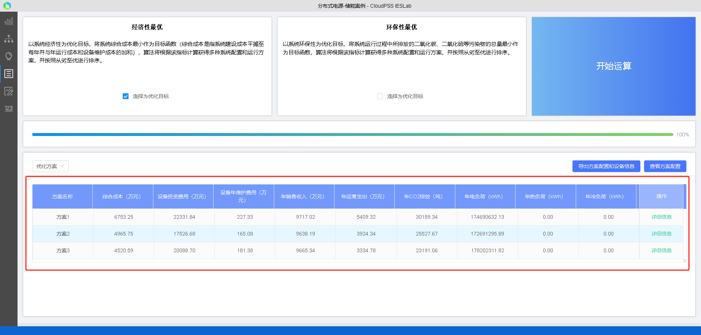
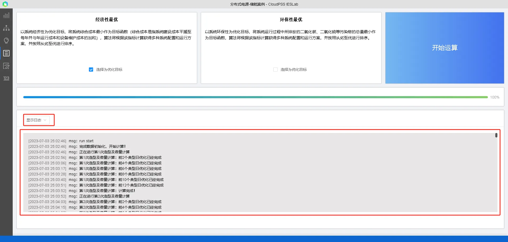
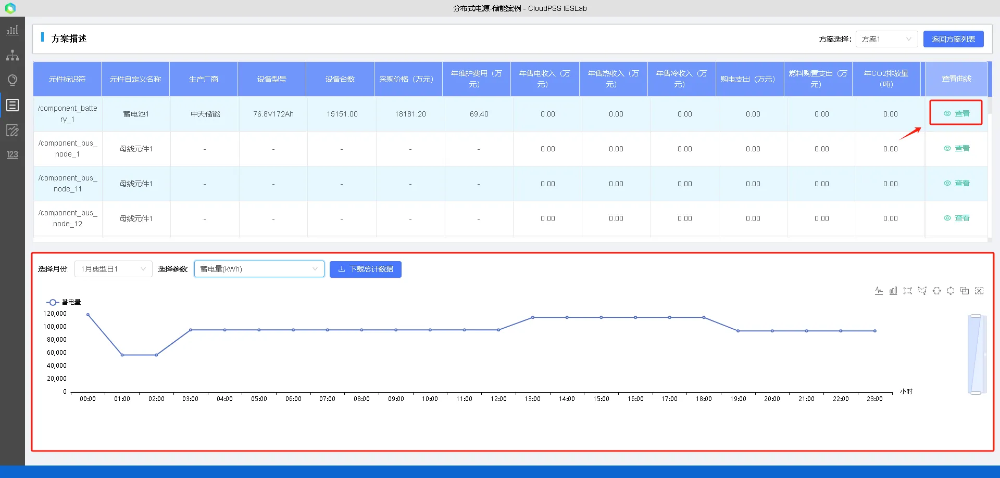

本节主要介绍 IESLab 规划设计平台启动优化计算和查看优化结果的方法，包括方案列表查看、日志信息查看、设备选型配置信息查看、典型运行方式查看等。

## 功能定义

基于用户给定的优化目标进行优化计算，获取系统中各设备选型定容结果及其在典型日下的优化运行方式。

## 功能说明

### 启动计算

用户根据自身优化需求，通过勾选**经济性**或者**环保性**优化目标，然后点击**开始计算**按钮即可开始进行优化。

在计算过程中，原本**开始计算**按钮所在位置会变成**停止计算**和**停止并删除当前计算**两个按钮：点击**停止计算**则会停止当前计算，但不会删除已经获得的优化方案和日志信息；点击**停止并删除当前计算**会在停止当前计算的同时删除已经获得的优化方案和日志信息，并回退到上一次优化计算的结果。

### 方案列表查看

在计算执行过程中，会动态地推送当前获得的优选方案，并显示在页面的下方，如下图所示。

方案列表中会给出当前优选方案的经济性和环保性相关的数据，同时用户可以通过点击右上方的**查看方案配置**按钮，可以比对不同方案的设备配置结果，能够一目了然地了解不同方案间的差异。

此外，用户可以点击**导出方案配置和设备信息**按钮实现方案配置信息的导出，导出的数据将以**Excel**文件的形式存储。

### 运行日志查看

默认情况下，方案列表左上方的选项处于**优化方案**，用户可以切换至**显示日志**选项，此时将展示运行过程中的日志信息，如下图所示。当用户发现计算停滞时，可切换到日志面板查看报错信息。

### 设备选型配置信息查看

针对特定的优选方案，可以在方案列表页面通过点击最后一列的**详细信息**按钮查看该方案详细的选型配置信息，如下图所示。

在此页面如果想切换查看其它优选方案的配置结果，也可以通过点击右上方的下拉选项进行切换。

特别地，在配置表的最后一行展示了该方案对不同参数项的总计数据。

### 运行方式查看

上图中的下半部分则显示了一些有关运行的数据，默认是显示系统在不同典型日下的一些统计数据，用户可以通过点击上方表格最后一列的**查看曲线**按钮可以获得对应设备（元件）在不同典型日下的运行曲线。

默认会显示目标元件在第一个典型日下第一个参数组（运行结果通常会按照量纲进行分组）的运行曲线，如果需要查看其它参数组，可以通过点击下拉**选择参数**按钮进行切换，如果需要查看其它典型日下的运行曲线，可以通过点击下拉**选择月份**按钮进行切换。

## 常见问题

为什么有的情况下会计算出多个优化配置方案？
:  IESLab 规划设计平台在进行优化时，会考虑输出求解器迭代的中间过程生成的部分结果，这些结果往往代表一些局部最优点，以供用户进行二次比选。

