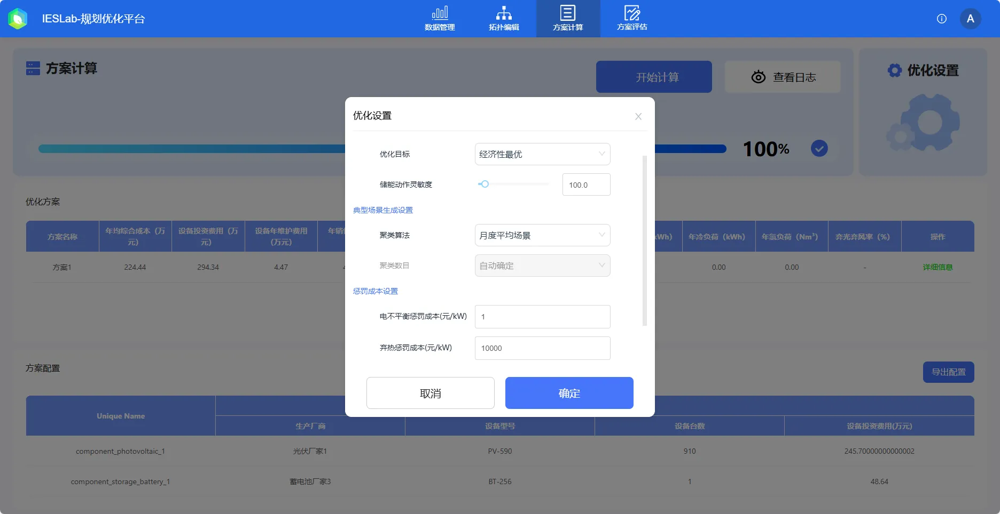
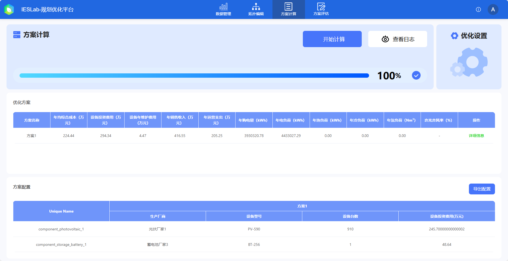
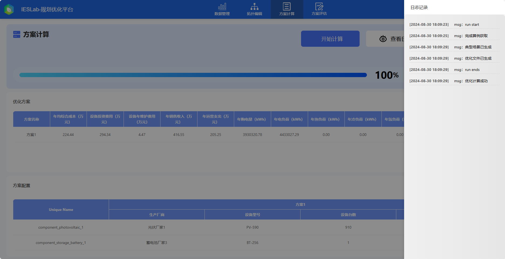
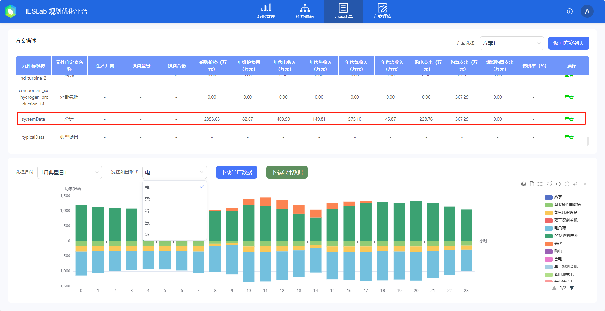
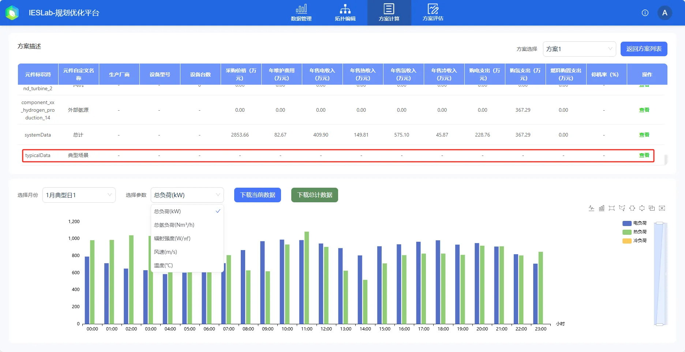

本节主要介绍 IESLab 规划优化平台启动优化计算和查看优化结果的方法，包括方案列表查看、日志信息查看、设备选型配置信息查看、典型运行方式查看等。

## 功能定义

基于用户给定的优化目标进行优化计算，获取系统中各设备选型定容结果及其在典型日下的优化运行方式。

## 功能说明

### 计算参数设置

计算前需要设置优化参数，主要包括：

1. 全局参数
   
   优化目标选择：可选**经济性**优化目标。

   储能动作灵敏度：该参数是为了避免储能设备过于频繁地动作而设计的，算法会考虑是否对于一个非常微小的“价格”收益就进行动作，避免无谓地增加储能“充放电里程”，降低储能设备寿命，一般可设置为 100

3. 典型场景生成设置参数
   
   聚类算法：计算方案**聚类算法**提供了**月度平均**典型日、**聚类**典型场景和 **8760h 全年**场景三种场景生成方法。其中，聚类典型场景是利用降维和聚类等算法生成。

   **月度平均**典型日计算量较小，适合综合能源项目初期规划阶段，计算量较小，可以快速找到合适的设备型号及容量配置方案； **8760h 全年**场景则适合运行阶段的设备出力优化，对优化结果要求较高的场景，如风光储项目中对储能的优化调控；而**聚类**典型场景则能够兼顾计算效率和精度，满足多种场景需求。

   聚类数目：当选择**聚类典型场景**时，可**指定**聚类数目；或由系统**自动确定**聚类类别数量，此时聚类类别的数量根据贝叶斯信息准则（Bayesian information criterion，BIC）寻优确定。

3. 惩罚成本设置参数
   
   电不平衡惩罚成本(元/kW)：设置电力系统中电不平衡时（负荷缺失和弃风弃光等弃电）的惩罚成本。

   弃热惩罚成本(元/kW)：设置热力系统中弃热时的惩罚成本。

### 启动计算

用户根据自身优化需求，通过勾选**经济性**或者**环保性**优化目标，然后点击**开始计算**按钮即可开始进行优化。

在计算过程中，原本**开始计算**按钮所在位置会变成**停止计算**和**停止并删除当前计算**两个按钮：点击**停止计算**则会停止当前计算，但不会删除已经获得的优化方案和日志信息；点击**停止并删除当前计算**会在停止当前计算的同时删除已经获得的优化方案和日志信息，并回退到上一次优化计算的结果。

### 方案列表查看

在计算执行过程中，会动态地推送当前获得的优选方案，并显示在页面的下方。

方案列表中会给出当前优选方案的经济性和环保性相关的数据，同时用户可以通过点击右上方的**查看方案配置**按钮，可以比对不同方案的设备配置结果，能够一目了然地了解不同方案间的差异。

此外，用户可以点击**导出方案配置和设备信息**按钮实现方案配置信息的导出，导出的数据将以 **Excel** 文件的形式存储。

### 运行日志查看

默认情况下，方案列表左上方的选项处于**优化方案**，用户可以切换至**显示日志**选项，此时将展示运行过程中的日志信息，如下图所示。当用户发现计算停滞时，可切换到日志面板查看报错信息。

### 设备选型配置信息查看

针对特定的优选方案，可以在方案列表页面通过点击最后一列的**详细信息**按钮查看该方案详细的选型配置信息。

在此页面如果想切换查看其它优选方案的配置结果，也可以通过点击右上方的下拉选项进行切换。

特别地，在配置表的最后一行展示了该方案对不同参数项的总计数据。

### 运行方式查看

上图中的下半部分则显示了一些有关运行的数据，默认是显示系统在不同典型日下的一些统计数据，用户可以通过点击上方表格最后一列的**查看曲线**按钮可以获得对应设备（元件）在不同典型日下的运行曲线。

默认会显示目标元件在第一个典型日下第一个参数组（运行结果通常会按照量纲进行分组）的运行曲线，如果需要查看其它参数组，可以通过点击下拉**选择参数**按钮进行切换，如果需要查看其它典型日下的运行曲线，可以通过点击下拉**选择月份**按钮进行切换。

平台结果默认展示系统能量平衡图：

特别的，平台支持查看综合能源系统典型运行场景数据：

## 输出结果与报告

### 优化结果构成

一次成功的优化计算输出以下内容：

| 输出项 | 内容 | 查看位置 |
|:---|:---|:---|
| **设备选型配置** | 各设备选定的型号、台数与容量 | 方案列表 → 详细信息 |
| **运行策略** | 各典型日 24h 逐时出力/充放电/启停曲线 | 详细信息 → 查看曲线 |
| **全年 8760h 曲线** | 由典型日按权重重组的全年运行曲线 | 运行结果统计 |
| **能量平衡图** | 各载体供用能平衡（三种粒度） | 结果页默认展示 |
| **方案经济性指标** | 总投资、年运行成本、回收期等 | 方案列表 |
| **财务报表** | 11 张标准财务报表 | 财务后评估（需开启） |
| **Word 项目报告** | 图文并茂的可交付项目报告 | 一键生成（需开启） |

### 能量平衡图

优化完成后自动生成电/热/冷/氢等载体的**能量平衡图**，支持三种粒度：

| 粒度 | 说明 | 用途 |
|:---|:---|:---|
| 全年 8760h | 每小时供用能平衡 | 年度趋势分析 |
| 逐月汇总 | 每月供用能平衡 | 季节性分析、合规统计 |
| 典型日 24h | 每小时供用能平衡 | 日运行策略分析 |

图中**正值向上**为供应侧（发电/供热/产氢），**负值向下**为消耗侧（负荷/用热/用氢），可直观看出各时段供需缺口与设备利用情况。

### 财务后评估报表

开启"优化结果后评估"后，平台自动计算并输出 **11 张标准财务报表**：

| 序号 | 报表 | 主要内容 |
|:---|:---|:---|
| 1 | 项目投资概算 | 总投资、分项投资、建设期利息 |
| 2 | 资金筹措计划 | 自有资金、贷款、还款计划 |
| 3 | 折旧与摊销 | 各设备折旧明细 |
| 4 | 成本费用估算 | 经营成本、固定/可变成本分解 |
| 5 | 利润测算 | 收入、成本、利润、税金 |
| 6 | 现金流量表 | 全生命周期现金流 |
| 7 | 敏感性分析 | 关键参数变动对 NPV/IRR 的影响 |
| 8 | 资产负债表 | 资产负债结构 |
| 9 | 财务指标汇总 | 投资收益率、回收期、NPV、IRR |
| 10 | 盈亏平衡分析 | 盈亏平衡点 |
| 11 | 临界分析 | 电价/投资等临界值 |

### Word 项目报告一键生成

开启"是否生成项目报告"后，优化结束自动生成结构完整、图文并茂、带数据分析的 Word 报告，覆盖：

- **项目源荷分析**：气象资源、负荷特性统计；
- **优化信息**：方案参数、约束配置、设备候选库；
- **结果展示**：设备配置表、运行曲线、典型工况与极端日筛选、能量平衡图（正值向上为供应侧、负值向下为消耗侧）；
- **综合评估**：经济性指标、合规统计（绿电直连项目含自发自用比例/上网比例/消纳比例的年度与月度统计）、结论建议。

分析文字全部由结果数据实时计算生成——过去一两天手工整理的报告，现在优化结束即自动生成。

> 

## 优化调试技巧

当计算结果异常、求解停滞或无可行解时，可按以下思路在结果页与日志面板中定位问题（SimStudio 工作台的 **结果** 页对应 `result.png`、日志面板对应 `log.png`）。

### 1. 计算停滞 / 长时间无新方案

- 切换至 **显示日志** 面板（`log.png`）查看实时输出，确认是否卡在求解器阶段；
- 检查 `TIME_LIMIT`（默认 300s）与 `NUM_THREADS` 配置；大规模问题建议先做 **场景缩减**（聚类典型日）或采用 **两阶段并行优化**（先定容再并行运行）；
- 若长期无进展且占用内存高，通常是模型规模过大，优先降低聚类数目或收紧容量范围。

### 2. 提示无可行解（IIS / 约束冲突）

- 优先查看 **全局约束** 是否过紧：绿电直连的 `MinSelfUse` / `MaxFeedinRatio`、储能 `PowerGuarantee` 保供、弃电/上网比例等；
- 这些约束默认以 **软约束 + 松弛变量 + 惩罚项** 实现，会向目标函数追加 `PenaltySoft × Σ(slack)`。若松弛变量值偏大，说明约束实际未被满足——需要放宽参数或核查输入数据（理论出力、负荷曲线）；
- 设备容量上下限、爬坡率、始末容量一致等 **设备运行约束** 过严也会触发不可行，可先放宽容量范围试算。

### 3. 结果不符合预期

- 核对 **典型场景生成**：`月度平均` 计算快但精度低，`聚类` 兼顾效率与精度（默认 GMM 软聚类，类别数可由 BIC 自动确定），`8760h 全年` 精度最高但最慢；
- 检查典型日 **权重（kydt）** 是否正确映射全年；运行曲线与能量平衡图（`result.png`）应覆盖典型日与极端日；
- 经济性偏差常源于 **惩罚成本** 设置（电/热不平衡惩罚）与 **储能动作灵敏度**（避免无谓充放电里程）。

### 4. 求解器与列式

- 平台支持 HiGHS / SCIP / COPT / CBC / CPLEX；含整数（选型、容量、启停 UC）时为 MILP，纯运行为 LP；
- 潮流默认 **交直流线性**（AC `ac_linear` + DC `dc`），由 `FlowFormulation` 策略模式按载能体自动选择，无需手动指定；如需更精细的 OPF 列式（含电压/相角/Q 平衡）可在内核切换 `ac_full`，但会增加非线性求解难度。

> 调试优先级建议：**看日志 → 查松弛变量 → 放宽全局/设备约束 → 缩减场景/调求解器**。

