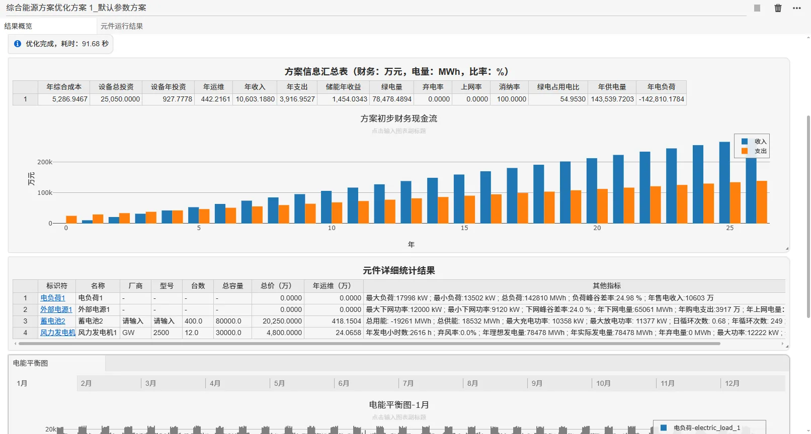
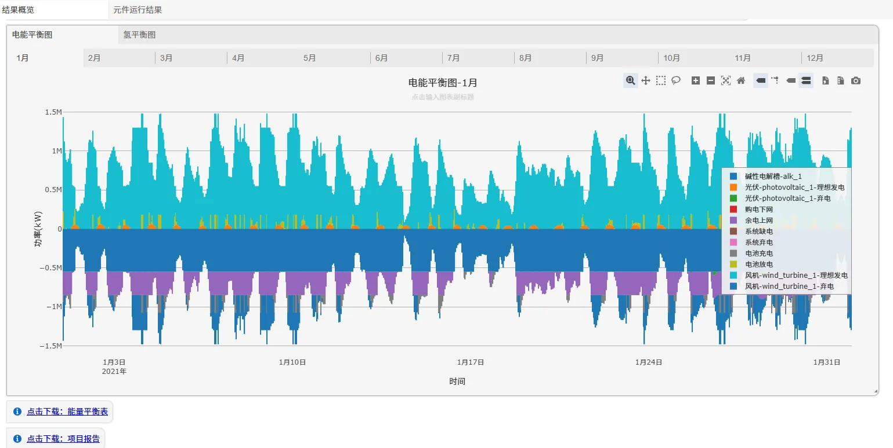
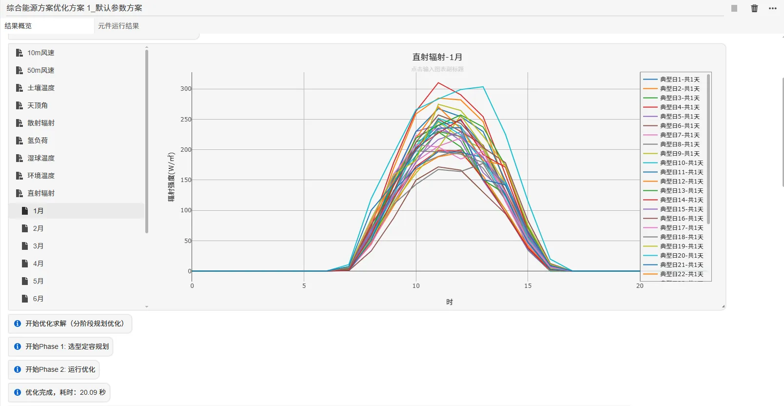
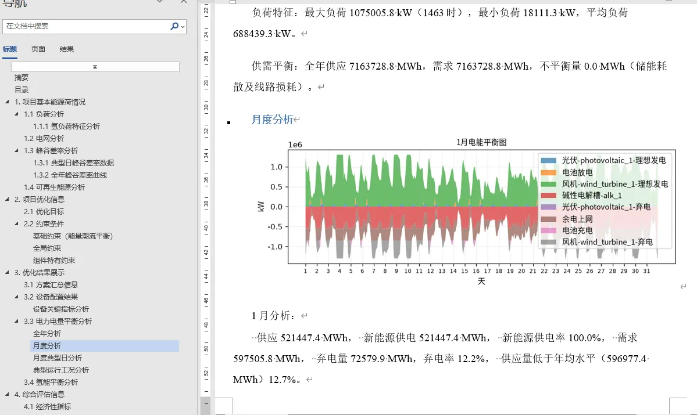

本节主要介绍 IESLab 规划优化平台启动优化计算和查看优化结果的方法，包括统计性指标表格、曲线、能量平衡图、能量平衡表、项目报告、元件时序运行结果等，并汇集了典型工程场景（绿电直连、AIDC、风光储）的配置指南与常见问题的调试建议。

> **文档导航**：
> - **优化原理**（目标函数、约束、求解、典型场景、财务基础理论）见 [基本原理](../10-fundamentals/index.md)；
> - **计算方案配置**（系统约束 DSL 与参数详解）见 [计算方案配置](../20-job-config/index.md)；
> - **本篇（结果页面）**：优化结果的查看与图表详解、常见问题调试。

## 功能定义

展示 IESLab 规划优化的优化结果。优化完成后，结果页面分为**结果概览**与**元件运行结果**两个标签页，并提供能量平衡图、能量平衡表、Word 项目报告与财务报表等输出。

## 功能说明

### 启动计算

通过点击**启动任务**按钮能执行当前计算方案下的规划优化。计算过程中页面会实时推送过程状态与已获得的优选方案。方案参数的计算方案配置界面见[计算方案配置](../20-job-config/index.md)。

### 结果概览

在计算完成后，结果页面的**结果概览**选项卡下会显示以下内容（如下图所示）。



#### 1. 运行日志

展示运行过程中的日志信息。

#### 2. 方案信息汇总

展示方案最重要的**投资成本**、**主要指标**和**负荷统计指标**，并绘制**方案初步财务现金流图**（历年收入与支出对比柱状图）。

方案信息汇总表的主要指标（示例）：

| 指标 | 含义 |
|:---|:---|
| 年综合成本 / 设备总投资 / 设备年投资 | 建设与运行的经济性指标 |
| 年运维 / 年收入 / 年支出 | 年度运维成本与经营收支 |
| 储能年收益 | 储能套利带来的净收益 |
| 绿电量 / 年供电量 / 年电负荷 | 能源产出与消耗统计 |
| 弃电率 / 上网率 / 消纳率 | 新能源利用情况 |
| 绿电占用电比 | 绿电直连合规指标（自用绿电 ÷ 总用电负荷） |

#### 3. 元件详细统计结果

按设备逐一统计其**基本配置**（台数、总容量、总价）与**运行指标**（最大/最小功率、年用电/发电量、峰谷差率、循环次数等）。不同设备类型的统计项不同：

| 设备类型 | 典型统计项 |
|:---|:---|
| 负荷类 | 最大/平均负荷、年总负荷、年售电收入 |
| 电源类（外部电源） | 最大下网功率、年下网电量、年购电支出、峰谷差率 |
| 储能类 | 台数、总容量、总价、年循环次数、日循环次数 |
| 新能源发电类 | 台数、总容量、年发电小时数、弃风/弃光率 |


#### 4. 能量平衡图

优化完成后自动生成电/热/冷/氢等载体的**能量平衡图**。

**正负堆叠图的读法**：图中**正值（零线上方）向上**为供应侧（发电/供热/产氢、购电下网），**负值（零线下方）向下**为消耗侧（负荷/用热/用氢、电池充电、弃电），可直观看出各时段供需缺口与设备利用情况；图例区分"理想发电 vs 弃电"、"购电 vs 上网"、"充电 vs 放电"等方向，便于定位消纳瓶颈（如弃电量面积过大即表示新能源消纳不足）。



#### 5. 典型日结果（可选）

当选择典型场景可视化时，平台将展示典型场景结果曲线。



**典型日曲线图解读**（如上图）：横轴为一天 24 小时，纵轴为对应的物理量（辐射强度 W/m² 或负荷 kW），每条曲线代表一个典型日（聚类结果）。通过对比各典型日曲线的形态差异，可直观检查聚类效果——形态差异合理、权重分布均衡即聚类正常。


#### 5. 财务后评估报表（可选）

开启"优化结果后评估"后，平台自动计算并输出 **11 张标准财务报表**，报表原理与财务参数见[计算方案配置 · 报表计算原理](../20-job-config/index.md#三报表计算原理)：

| 序号 | 报表 | 主要内容 |
|:---|:---|:---|
| 1 | 营业收入、税金、附加和增值税估算表 | 各类能源销售收入、增值税销项/进项、城建税及附加 |
| 2 | 资产折旧与摊销估算表 | 固定资产/无形资产原值、折旧、摊销与净值 |
| 3 | 流动资金估算表 | 应收账款、存货、现金、应付账款与流动资金 |
| 4 | 投资使用计划与资金筹措表 | 项目总投资、资本金与债务资金筹措 |
| 5 | 借款还本付息计划表 | 长期/流动资金/短期借款的还本付息与余额 |
| 6 | 总成本费用估算表 | 生产成本、财务费用、固定/可变成本、经营成本 |
| 7 | 利润与利润分配表 | 利润总额、所得税、净利润、公积金与未分配利润 |
| 8 | 项目总投资现金流量表 | 融资前口径现金流，所得税前/后净现金流量 |
| 9 | 项目资本金现金流量表 | 融资后口径现金流，投资者实际收支 |
| 10 | 财务计划现金流量表 | 经营/投资/筹资活动现金流与累计盈余资金 |
| 11 | 资产负债表 | 资产、负债、所有者权益及平衡校验 |

**概览表**（经济性指标汇总）：工程动态投资、总投资收益率、资本金利润率、年销售收入、平均总成本费用、资本金内部收益率、项目投资内部收益率（税前/税后）、财务净现值（税前/税后）、投资回报期（税前/税后）。


### 元件运行结果

**元件运行结果**标签页展示每个元件的全年时序运行曲线。上方为系统拓扑图（点击元件切换查看对象），下方为该元件的多种维度曲线：

| 视图 | 内容 | 示例 |
|:---|:---|:---|
| **功率曲线** | 设备逐时出力/充放电功率（kW） | 蓄电池充电/放电功率 |
| **储电量曲线** | 储能设备全年 8760h 储电量（kWh，SOC） | 蓄电池"储电量(kWh)"全年曲线 |
| **相角/电压曲线** | 电气量时序（交流/直流接口） | 相角(rad)、电压(kV) |


### 能量平衡表

将能量平衡图的逐时数据以表格形式导出（Excel），每个能量流分项一列、每小时一行，供二次加工与存档。列组成为：

| 列类别 | 内容 | 说明 |
|:---|:---|:---|
| 时间 | 年月日 时 | 逐时数据行 |
| 负荷侧 | 电负荷等 | 系统需求（负值） |
| 电网交互 | 购电下网 / 余电上网 | 与外部电网的电力交换 |
| 可靠性 | 系统缺电 / 系统弃电 | 缺供与弃能量（正常为 0） |
| 储能 | 电池充电 / 电池放电 | 储能充放电功率 |
| 新能源 | 风机-理想发电 / 风机-弃电 等 | 各设备理想发电与实际弃电 |

> 表中各列数值满足能量守恒：供应项之和 = 消耗项之和。若"系统缺电""系统弃电"列非零，说明存在源荷不平衡，需结合结果告警排查。


### Word 项目报告一键生成

开启"是否生成项目报告"后，优化结束自动生成结构完整、图文并茂、带数据分析的 Word 报告，报告结构如下：

```
1. 项目基本能源情况
   1.1 负荷分析（含各载体负荷特征分析）
   1.2 电网分析
   1.3 峰谷差率分析（典型日 + 全年曲线）
   1.4 可再生能源分析
2. 项目优化信息
   2.1 优化目标
   2.2 约束条件（基础约束 / 全局约束 / 组件特有约束）
3. 优化结果展示
   3.1 方案汇总信息
   3.2 设备配置结果（含关键指标分析）
   3.3 电力电量平衡分析（全年 / 月度 / 月度典型日 / 典型运行工况）
   3.4 氢能平衡分析（及其他载体）
4. 综合评估信息
   4.1 经济性指标
```

月度分析结果显示供应/需求/弃电量与弃电率等指标，并自动配图；所有分析文字均由结果数据实时计算生成——过去一两天手工整理的报告，现在优化结束即自动生成。




## 优化调试技巧

当计算结果异常、求解停滞或无可行解时，可按以下思路在结果页与日志面板中定位问题。

### 1. 计算停滞 / 长时间无新方案

- 切换至 **显示日志** 面板查看实时输出，确认是否卡在求解器阶段；
- 检查 `TIME_LIMIT`（默认 300s）与 `NUM_THREADS` 配置；大规模问题建议先做 **场景缩减**（聚类典型日）或采用 **两阶段并行优化**（先定容再并行运行）；
- 若长期无进展且占用内存高，通常是模型规模过大，优先降低聚类数目或收紧容量范围。

### 2. 提示无可行解（IIS / 约束冲突）

- 优先查看 **全局约束** 是否过紧：绿电直连的 `MinSelfUse` / `MaxFeedinRatio`、储能 `PowerGuarantee` 保供、弃电/上网比例等；
- 这些约束默认以 **软约束 + 松弛变量 + 惩罚项** 实现，会向目标函数追加 `PenaltySoft × Σ(slack)`。若松弛变量值偏大，说明约束实际未被满足——需要放宽参数或核查输入数据（理论出力、负荷曲线）；
- 设备容量上下限、爬坡率、始末容量一致等 **设备运行约束** 过严也会触发不可行，可先放宽容量范围试算。

### 3. 结果不符合预期

- 核对 **典型场景生成**：`月度平均` 计算快但精度低，`聚类` 兼顾效率与精度（默认 GMM 软聚类，类别数可由 BIC 自动确定），`8760h 全年` 精度最高但最慢；
- 检查典型日 **权重（kydt）** 是否正确映射全年；运行曲线与能量平衡图应覆盖典型日与极端日；
- 经济性偏差常源于 **惩罚成本** 设置（电/热不平衡惩罚）与 **储能动作灵敏度**（避免无谓充放电里程）。

### 4. 求解器与列式

- 平台支持 HiGHS / SCIP / COPT / CBC ；含整数（选型、容量、启停 UC）时为 MILP，纯运行为 LP；
- 潮流默认 **交直流线性**（AC `ac_linear` + DC `dc`）。

### 5. 结果图表异常

- **能量平衡图/表异常（出现明显缺供或弃电面积）**：查看"系统缺电""系统弃电"列是否非零，结合松弛告警定位是约束过紧还是源荷数据不合理；
- **典型日曲线形态异常**：检查原始气象/负荷数据是否有缺失或单位错误（kW vs kWh）；开启"场景可视化"核查聚类效果；
- **8760 曲线越限或跳变**：检查设备容量上下限、爬坡率与储能始末容量一致约束是否设置合理。

> 调试优先级建议：**看日志 → 查松弛变量 → 放宽全局/设备约束 → 缩减场景/调求解器 → 检查结果图表数据**。