## 元件定义

变压器（Transformer）是电力系统中的关键变电与配电设备，用于实现交流母线之间、或不同电压等级交流网络之间的**电压变换与功率传输**。在综合能源系统规划优化中，变压器连接电源、储能、负荷与交流配电网络，其传输功率受额定容量约束，并可限制向电网的倒送功率。

交流侧功率传输关系为：

$$
P_{out} = \eta_{T} \cdot P_{in}, \qquad |P_{in}| \le P_{rated}
$$

式中，$P_{in}$、$P_{out}$ 分别为原边与副边有功功率（kW），$\eta_T$ 为变压器效率，$P_{rated}$ 为额定传输功率。

## 元件说明

### 属性

CloudPSS 元件包含统一的**属性**选项，其配置方法详见 [参数卡](docs/documents/software/10-xstudio/20-simstudio/40-workbench/20-function-zone/30-design-tab/30-param-panel/index.md) 页面。

### 参数

#### 设备参数

| 参数名 | 键值 (key) | 单位 | 类型 | 描述 |
| :--- | :--- | :--- | :--: | :--- |
| 生产厂商 | `manufacturer` |  | 文本 | 生产厂商 |
| 设备型号 | `equipType` |  | 文本 | 设备型号 |
| 采购成本 | `PurchaseCost` | 万元/台 | 实数 | 设备采购成本 |
| 固定运维成本 | `FixedOMCost` | 万元/年 | 实数 | 设备固定运维成本 |
| 可变运维成本 | `VariableOMCost` | 元/kWh | 实数 | 设备可变运维成本 |

#### 规划参数

| 参数名 | 键值 (key) | 单位 | 类型 | 描述 |
| :--- | :--- | :--- | :--: | :--- |
| 待选设备类型 | `DeviceSelection` |  | 选择 | 绑定数据管理模块录入的设备型号 |
| 最大常规传输功率 | `MaxNormalPower` | kW | 实数 | 正常运行允许的最大传输功率 |
| 最大倒送功率 | `MaxBackFeeding` | kW | 实数 | 允许向源侧倒送的最大功率（限制反向潮流） |

### 引脚

元件包含**原边交流接口**与**副边交流接口**两个引脚，支持线连接与信号名连接。

## 常见问题

交流变压器与直流变压器（DCtransformer）/MMC 有何区别？
: 交流变压器连接交流母线之间；直流变压器（DCtransformer）用于直流母线间的电压变换；MMC 用于交直流换流（可控支路，不服从 KVL）。三者分别服务于不同的网络互联场景。

最大倒送功率有什么工程意义？
: `MaxBackFeeding` 用于约束向上级电网的反向送电，在配网或绿电直连场景下可避免变压器反向过载并满足并网约束。
