本文以**AI 数据中心（AIDC）绿电直连柴发项目**为例，完整走一遍 IESLab 规划优化平台的项目搭建与结果分析流程，并重点解析这个算例**为什么值得作为典型**：绿电直连的合规硬约束、算力负荷的启停功率冲击、柴发与储能的角色分工、柔性负荷的重要优先分级。

> **阅读指引**
>
> - **想学怎么操作平台** → 直接看 [三、搭建过程](#三搭建过程)，那里是一步一步的界面操作。
> - **想理解"为什么这样配、怎么读懂结果"** → 看 [一、项目描述](#一项目描述) 与 [四、结果分析](#四结果分析)、[六、结论与建议](#六结论与建议)。
> - 本文中标注 `⚠️ 待补` 的位置，是需要项目实际数据/截图补充的占位点，已在文末汇总为 [待补清单](#附录待补清单)。

---

## 项目文件导入导出

项目 zip 文件可以通过**云空间**的项目**导入与导出**功能进行上传与分发。

---

## 一、项目描述

### 1.1 项目背景

**绿电直连的政策定位**。绿电直连是指风电、太阳能发电、生物质发电等新能源**不直接接入公共电网**，而是通过**专用电力线路**向用户供给绿电、可实现供给电量清晰**物理溯源**的模式。国家发展改革委、国家能源局先后印发《关于有序推动绿电直连发展有关事项的通知》（发改能源〔2025〕650 号，面向**单一电力用户**）与《关于有序推动多用户绿电直连发展有关事项的通知》（发改能源〔2026〕688 号，面向**多个法人用户**），确立了"**以荷定源**、安全优先、源荷匹配"的建设原则。

**两条对本项目最直接的规定**：

1. **608 号文明确"优先支持算力设施、绿色氢氨醇等新兴产业和未来产业开展绿电直连"**——AI 数据中心（算力设施）属于政策**明确优先支持**的类别，这是本项目选址与立项的核心政策依据。
2. **自发自用比例是硬门槛**：项目整体新能源**年自发自用电量占总可用发电量的比例不低于 60%**，**占总用电量的比例不低于 30%，2030 年前不低于 35%**；同时**上网电量占总可用发电量的比例一般不超过 20%**（上限由省级能源主管部门确定）。要求不满足，项目不具备接入评估条件。

**AIDC 的用能特殊性与传统园区截然不同**。普通园区负荷以空调、照明、动力为主，曲线相对平缓；而 AI 数据中心的主要负荷是 **GPU 集群**，其训练任务启动/停止会造成**小时级的大幅功率阶跃**，对供电系统的冲击远大于常规负荷。同时 AIDC 对**供电可靠性**要求极高——市电故障或并网/孤岛切换期间必须无缝供电，这正是本项目配置**柴发自备**的原因。

**综上，本项目要同时回答以下问题**：

- **合规问题**：新能源自发自用比例、上网比例、下网规模能否同时满足政策门槛？
- **储能问题**：算力负荷的功率冲击储能如何平抑？功率容量够不够、能不能扛？

### 1.2 项目简介

本项目是一个典型的 **AIDC 绿电直连项目**，系统仅含电力一种能源形式，毕竟 AIDC 的核心用能就是电，制冷通常由电驱动，亦可搭建供冷系统，平台的规划优化能力在单一能源形式下同样完整可用。

**系统组成**（三类设备、一种负荷）：

| 角色               | 设备                 | 在本项目中的职责                                                      |
| ------------------ | -------------------- | --------------------------------------------------------------------- |
| **绿电电源** | 风力发电机           | 通过**绿电直连专线**向 AIDC 供电，提供可物理溯源的绿电          |
| **调节资源** | 蓄电池储能           | **平抑 GPU 集群启停的功率冲击**；兼顾新能源波动与峰谷调节       |
| **备用电源** | 燃料发电机组（柴发） | **市电故障与并网/孤岛切换期间保障供电**；作为孤岛运行的支撑电源 |
| **柔性负荷** | AIDC 算力负荷        | 可在**较小幅度**内调节，且必须**优先保障重要负荷**        |
| **并网通道** | 外部电源（公共电网） | 并网型项目的公共电网接口；余电上网                                    |

> **关键认知：储能在这里是"功率型"资源，不是"能量型"资源。**
> 常见园区项目用储能做**峰谷电价套利**（看的是"能量"：低价充、高价放，每天一个完整循环）。
> 而 AIDC 项目中储能的第一职责是**削峰填谷式的功率平抑**——GPU 集群启停带来的瞬时功率阶跃需要储能**快速吞吐功率。**

> **关键认知：柴发的定位是"备用"，不是"基荷"。**
> 柴发在**并网运行**时承担备用与调峰补充；在**孤岛运行/并网切换**时承担支撑供电。它与储能形成互补：柴发**爬坡慢、启动有延时**，储能**响应快、可瞬时吞吐**，因此切换瞬间靠储能顶住、稳态由柴发接续，是 AIDC 保供的典型配合方式。

### 1.3 系统构成与拓扑结构

本项目的电气边界是典型的**并网型绿电直连**结构：公共电网与柴发在 110 kV 侧接入主母线；风电与储能通过**绿电直连专线**接入（专线设有"进口/出口"两个电气节点），AIDC 负荷从主母线受电。

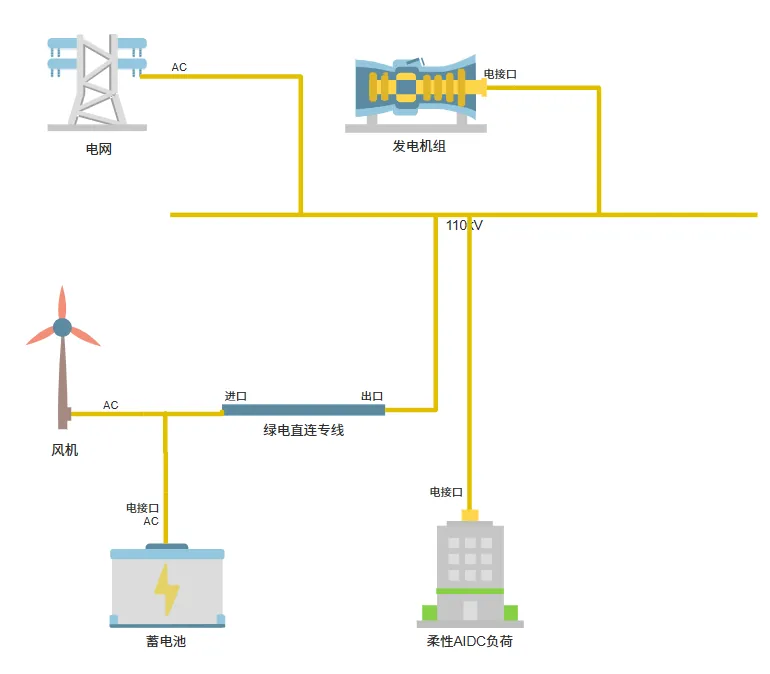

**拓扑中的三个要点**（对照政策要求解读）：

1. **绿电直连专线**是政策中"**直连线路**"的具体形态——电源与用户直接连接的**专用电力线路**，它使"供给电量清晰物理溯源"在电气上成立。这也是本项目区别于"绿电交易/绿证"模式的本质：**物理直连，而非账面绿电**。
2. **并网型项目的物理界面与责任界面**：项目整体接入公共电网，形成清晰的分界点（本项目为 110 kV 母线）。政策要求电源应接入"用户和公共电网产权分界点的**用户侧**"。
3. **电压等级合规**：政策规定绿电直连项目接入电压等级**不超过 220（330）kV**；本项目为 **110 kV**，在合规范围内。

---

## 二、边界条件

边界条件是"给优化模型的输入"，它决定了结果的上限——**绝大多数"结果不合理"，最后都能追溯到边界条件填错**。

### 2.1 气象数据

气象数据用于计算风机与光伏等新能源设备的**理论出力曲线**。在平台上通过**省市**或 **GPS 经纬度坐标**（或地图选点）确定项目地点，点击 **载入气象数据** 即可载入平台内置的近 10 年中国大陆 8760 h 逐时气象数据（详见 [数据管理模块](../../40-data-module/10-meteorological-database/index.md)）。

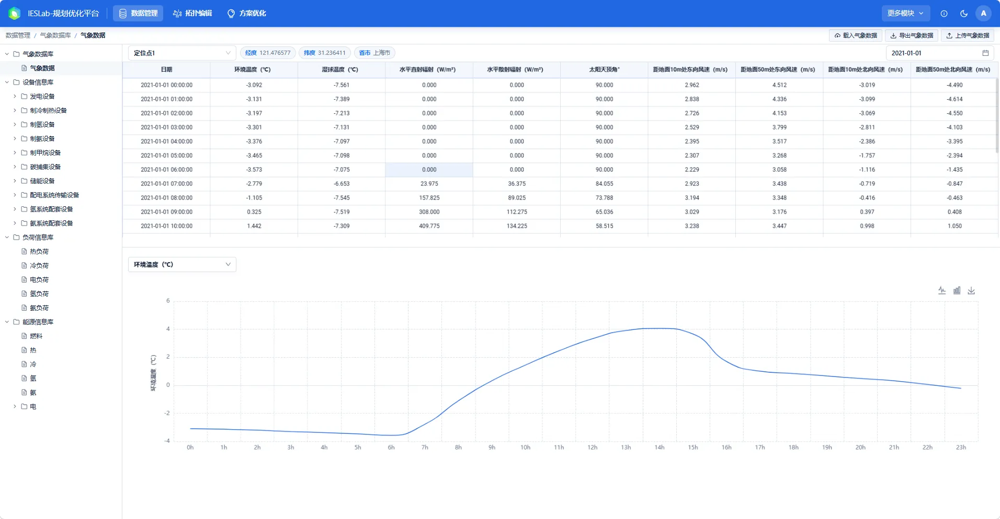

### 2.2 电负荷与功率冲击特征

本项目负荷是 **AIDC 算力负荷**，在平台中作为**柔性电负荷**建模——即"可通过主动参与运行控制、具有柔性特征的负荷"，其柔性调节能力是缓解供需侧矛盾的重要手段（详见 [负荷信息库](../../40-data-module/30-load-database/index.md)）。

**负荷的两个特征决定了本算例的分析重点**：

| 特征                         | 说明                                                                                           | 对配置的影响                                                         |
| ---------------------------- | ---------------------------------------------------------------------------------------------- | -------------------------------------------------------------------- |
| **功率冲击大**         | GPU 集群训练任务的启停造成小时级功率阶跃，波动远超常规园区负荷                                 | 需要**功率型**储能平抑；需要足够的系统转动惯量/快速响应资源    |
| **柔性幅度小、且分级** | 算力任务不能随意中断，可调节幅度有限；必须**优先保障重要负荷**（如核心业务、制冷、安防） | 柔性负荷只能作为**辅助调节**手段，不能替代储能承担主要平抑任务 |

> **这是与"普通园区柔性负荷"最大的区别**：普通园区的空调、照明等柔性负荷调节幅度可以很大（甚至全停）；而 AIDC 的算力负荷"**能调但只能小调，且重要部分不能动**"。平台通过柔性负荷的调节参数与成本设置来表达这种"分级 + 限额"的柔性能力。

### 2.3 能源价格

价格信息决定经济性优化的方向，包括**购电价格**（下网）与**上网价格**（余电上网）。

### 2.4 优化时段粒度

本项目采用 **8760 小时逐时**优化（本次导出的能量平衡表为 8760 行逐时数据），而非"典型日"或"月度典型场景"。

---

## 三、搭建过程

> 本章按"登录 → 建项目 → 录数据 → 搭拓扑 → 算方案 → 看结果"的真实操作顺序展开。整体是一条**单向流水线**：前一步的输出是后一步的输入，请**严格按顺序**操作，不要跳步。若某一步结果与预期不符，先回到上一步核对。

### 3.1 登录平台与新建项目

**第一步：登录**。登录 CloudPSS 平台后，在**个人中心**点击 **IESLab 规划设计** 图标，进入 **IESLab 规划优化平台**。

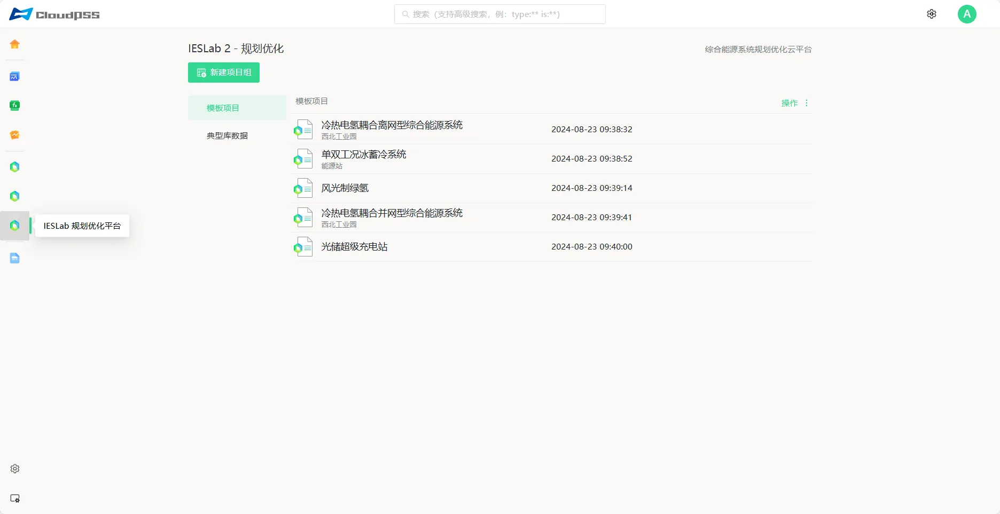

**第二步：新建项目组**。点击 **新建项目组**，输入名称与描述，**是否从已有项目组导入** 选择 **否**，创建一个空白项目组。

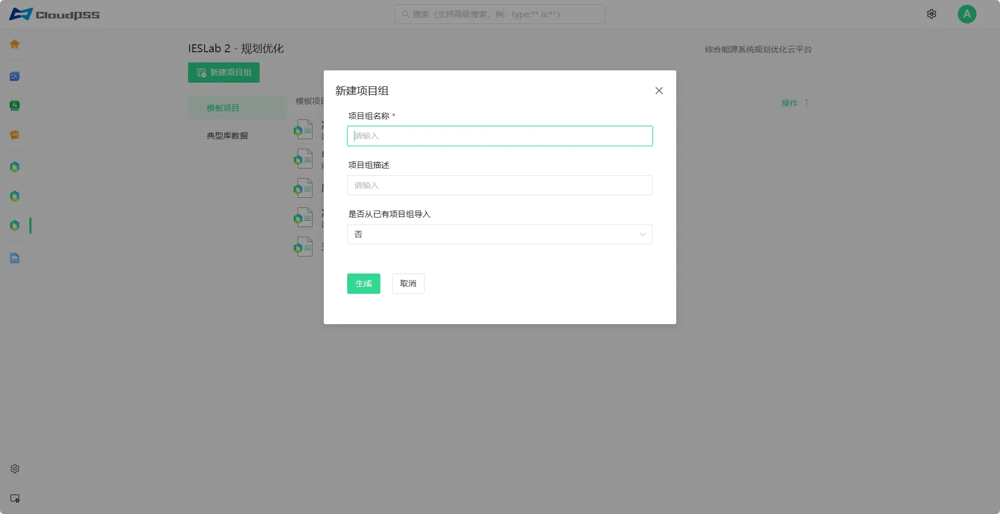

**第三步：新建项目**。在项目组右侧点击 **操作 → 新建项目**，输入项目名称与描述；**是否从模板创建新项目** 建议选择 **否**（本项目为自定义拓扑，从空白项目搭建更清晰）。

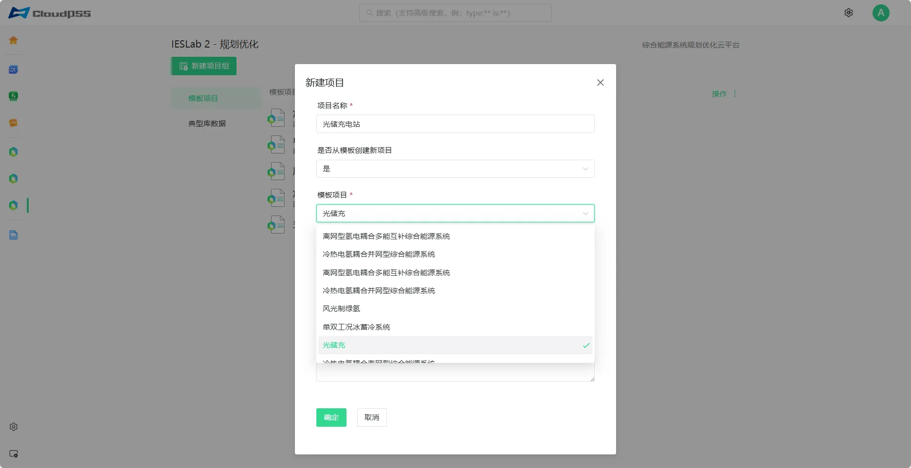

> **新手提示**：模板（如"光储充"）自带拓扑骨架与典型参数，适合快速上手；本项目涉及绿电直连专线、柴发备用等非标结构，**建议从空白项目搭建**，避免模板残留元件干扰。

**第四步：打开项目**。点击项目所在行打开，默认进入**数据管理模块**。

> **下一步前确认**：项目已成功打开，界面停留在"数据管理"页。

### 3.2 数据管理

数据管理包含四个子库：**气象数据库、设备信息库、负荷信息库、能源信息库**（详见 [数据管理模块](../../40-data-module/index.md)）。本项目需录入：

1. **气象数据**：定位项目地点后点击 **载入气象数据**（见 [2.1](#21-气象数据)）。
2. **设备参数**：柴发（额定容量、最小出力、启停与爬坡参数、燃料成本）、蓄电池（容量、充放电功率、效率、SOC 上下限、循环/日历寿命）、风机（单机容量、轮毂高度、功率曲线）。
3. **负荷数据**：AIDC 电负荷 8760 h 逐时曲线，并按柔性负荷要求设置调节参数与成本。
4. **能源价格**：购电价格与上网价格。

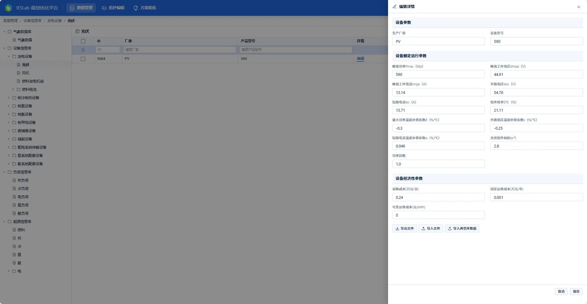

> **常见坑：两类"比例"的填写口径不同。**
> **组件/拓扑参数**按界面提示录入——效率类填 0 ~ 1 的小数（如 `0.95`），上网率等按百分数（如 `20` 表示 20%）；
> 而**系统约束的上下界一律填 0 ~ 1 比例**（如 `0.6` 表示 60%）。
> 把 0.95 填成 95 是"结果差两个数量级"的头号原因；把约束下限 0.6 填成 60 则会让约束形同虚设。

### 3.3 拓扑搭建

切换到 **拓扑编辑** 模块（SimStudio 工作台），从左侧**模型（元件库）**拖拽元件至工作区并连线。本项目的拓扑见 [1.3 系统构成与拓扑结构](#13-系统构成与拓扑结构)，关键连线关系为：

- 公共电网（外部电源）、柴发（通用发电机组）→ **110 kV 主母线**；
- 风机、蓄电池 → **绿电直连专线**（经专线的"进口/出口"节点）→ 110 kV 主母线；
- **AIDC 柔性电负荷** → 从 110 kV 主母线受电。

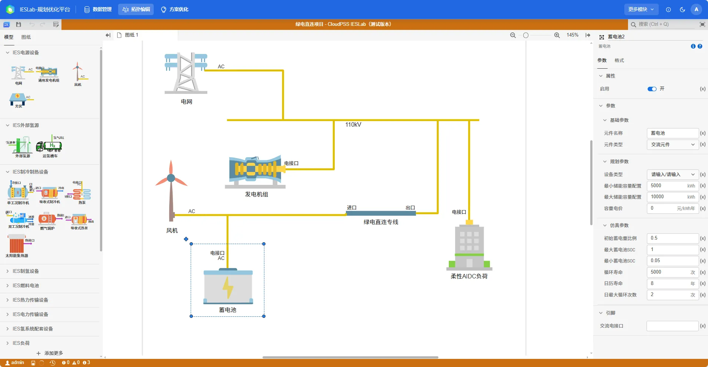

> **连线即能量流**：拓扑里的连线代表能量传递关系，连错或漏连会导致**能量平衡约束无法闭合**，进而无解。尤其注意绿电直连专线的"进口/出口"方向——它对应政策要求中"电源应接入用户侧"的物理界面。搭完先确认工作区左下角连接状态无异常，再进参数设置。

### 3.4 参数设置

参数分三块：**项目设置、优化设置、财务参数**（详见 [计算方案配置](../../60-optimization-module/20-job-config/index.md)）。本项目逐项设置如下。

#### 3.4.1 约束条件

约束是本项目**最需要讲清楚**的部分，因为绿电直连的合规门槛直接体现为约束的下界/上界。本项目涉及的约束分三类：

**（1）基础约束（能量潮流平衡）**——平台自动施加，无需手工填写。要求每个能源节点在任意时刻的**输入总量 = 输出总量**。本项目即"柴发 + 风电 + 储能放电 + 购电 = 负荷 + 储能充电 + 上网"的逐时闭合。

**（2）全局约束**——本项目设置的核心合规约束，约束类型选择模板约束，设置如下模板约束：

| 约束                       | 平台设置值                                                          | 政策依据与含义                                                                                                                     |
| -------------------------- | ------------------------------------------------------------------- | ---------------------------------------------------------------------------------------------------------------------------------- |
| **新能源自消纳率**   | ≥**60%**                                                     | 对应政策"年自发自用电量**占总可用发电量**的比例不低于 60%"                                                                   |
| **新能源上网率**     | ≤**20%**（本项目已按政策收紧）                               | 政策为"上网电量占总可用发电量比例**一般不超过 20%**，上限由省级确定" ⇒ **平台默认上限较宽，必须手工收紧**，见下方提示 |
| **绿电直连项目约束** | 自发自用/总用电量 ≥**35%**；下网量 ≤ 总负荷的 **65%** | 对应政策"自发自用电量**占总用电量**比例不低于 30%、**2030 年前不低于 35%**"                                            |
| **最大弃电率**       | 由守恒推导`c = 1 − g − s`（按 g=20%、s=60% 推得 ≤ 20%）        | 平台守恒体系`上网率 g + 自消纳率 s + 弃电率 c == 1`（优先级 上网 > 自消纳 > 弃电），手工填写会被引擎下调并告警                   |

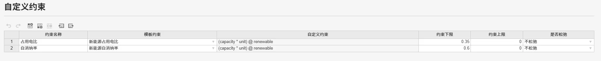

> **重要提示：平台默认值 ≠ 政策要求值。**
> 平台的"新能源上网率"默认上限较宽松（100%），而政策对绿电直连项目的一般上限是 **20%**。**若未修改，选择了宽松的默认值，算出来的上网率高达 29.8%——虽然"求解成功"，却已超政策红线，方案实际上不可接入**。本版已按典型省级要求把上网率收紧到 20%（重跑后实际上网率 0%，见 [4.5](#45-绿电直连合规指标)）。
> 教训：**做接入评估时，必须按项目所在省级能源主管部门的实际要求收紧该约束**，否则模型可能给出"合规性通过、但实际接入评估通不过"的方案——这是绿电直连类项目最容易踩的一个坑。

**（3）组件特有约束**——与设备物理特性一一对应：

- **柴发（通用发电机组）**：出力不超过额定容量上限。
- **外部电源（公共电网接口）**：允许余电上网，最大上网功率 **20000 kW**；购电功率不超过最大下网容量限制。
- **蓄电池（储能）**：SOC 运行范围 **5%~100%**，初始 SOC 为 **50%**；**日末储能水平需恢复至初始值附近（偏差 ≤ 1%）**；日历寿命 8 年、循环寿命 5000 次。
- **风机**：实际发电功率 = 理想发电功率 − 弃电功率，出力不超过理论发电曲线。

> **为什么要设"日末 SOC 恢复"**：这是为了避免优化器"透支"储能——如果不约束日末 SOC，模型可能把电池在年初充满、年末放空来"白拿"收益，得到的调度策略在工程上不可执行。该约束保证了**每日可循环**的运行形态。

#### 3.4.2 典型场景

在**项目设置**中选择优化时段：本项目选择 **全年 8760h** 逐时（选择理由见 [2.4 优化时段粒度](#24-优化时段粒度)）。

#### 3.4.3 优化目标

本项目采用**经济性单目标优化**，以系统**综合成本最小**为目标函数。综合成本在全生命周期口径下考虑贴现与等效年金，由多部分构成：

```
C_TC = C_inv + C_op,f + C_op,v + C_fuel + C_pur − C_sel
```

其中：`C_inv` 投资建设成本（按贴现率与项目生命周期折算等效年金）、`C_op,f` 固定运维成本、`C_op,v` 可变运维成本、`C_fuel` 燃料消耗成本、`C_pur` 购能成本、`C_sel` 售能收益。

> **本算例特别注意 `C_fuel`**：柴发的燃料成本必须**如实填写**。若燃料成本漏填或填 0，优化器会视柴发为"零成本电源"而长期满发，导致储能被挤占、失去调节空间——这是柴发类项目最常见的配置错误。

### 3.5 开始计算

点击 **开始计算**，计算过程中可通过日志查看过程信息。

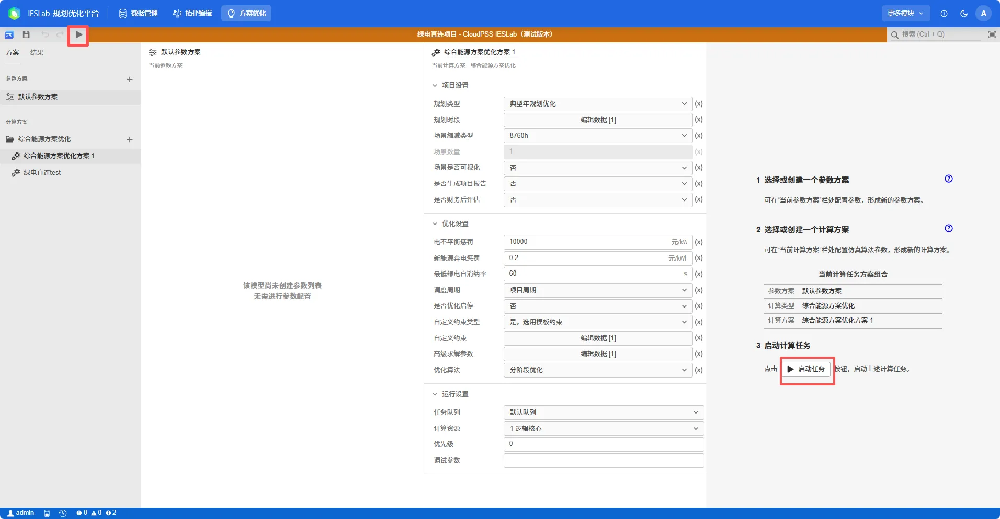

### 3.6 查看结果

计算完成后，平台展示寻找到的最优方案，包括**设备配置及指标参数**、**能量平衡图**等。

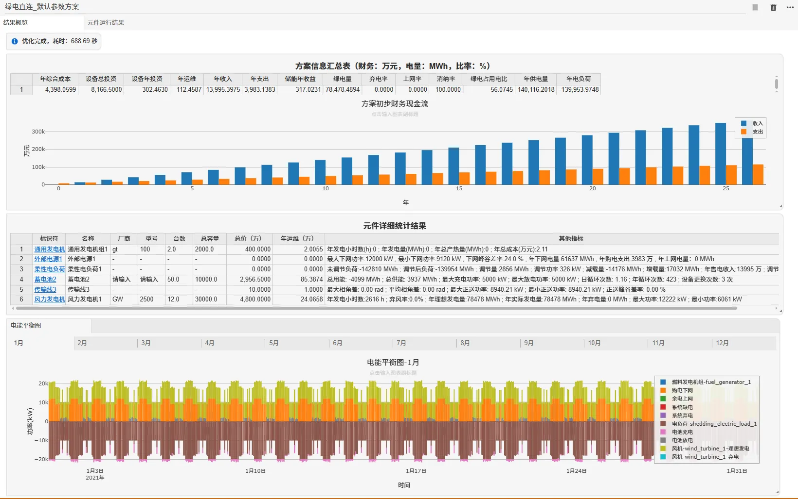

若在项目设置中选择了 **财务后评估**，设定基础参数后，平台会根据财务模型与工程经济学模型自动计算评价指标并显示，结果支持导出。

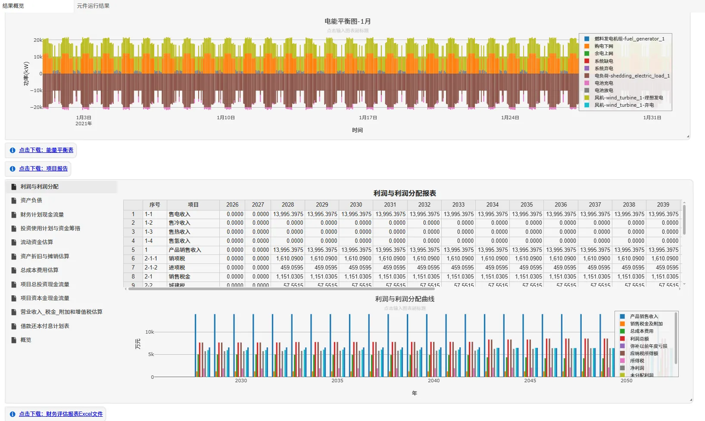

切换到**元件运行结果页面**，可查看各元件的 8760 h 运行结果曲线。

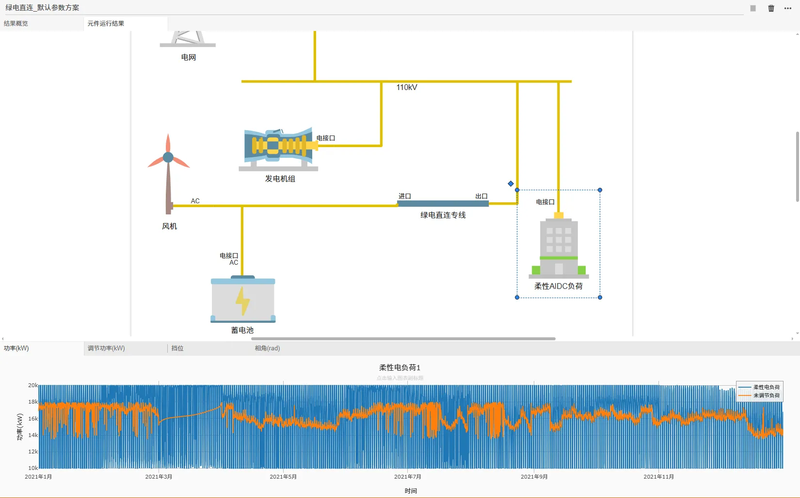

> **下一步**：结果出来了先看"对不对"再"好不好"。如何判断结果正确性、如何排查松弛与无解，见 [计算结果与调试](../../60-optimization-module/30-results-tab/index.md)。

---

## 四、结果分析

### 4.1 项目投资与设备配置

**设备配置结果**（2026-09-28 重跑，取自《项目报告》设备配置表）：

| 设备类型             | 配置数量 | 总容量    | 配置成本（万元）  | 占比  |
| -------------------- | -------- | --------- | ----------------- | ----- |
| 通用发电机组（柴发） | 2 台     | 2000 kW   | 400.00            | 4.9%  |
| 蓄电池（储能）       | 50 台    | 10000 kWh | 2956.50           | 36.2% |
| 风力发电机           | 12 台    | 30000 kW  | 4800.00           | 58.8% |
| **设备总投资** | —       | —        | **8166.50** | 100%  |

- **储能配比**：容量 10000 kWh（10 MWh），最大充/放电功率均为 **5000 kW**（5 MW），满充满放约 **2 小时**——"**功率型**"配比（功率足、能量适中），用于平抑波动与做时移，而非长时储能。
- **柴发配比**：2 台共 2000 kW，全年实际仅启动 1 小时（发电量 0.34 MWh），主要参与保供，**回归"备用"定位，并无经济效益**。

### 4.2 经济性评价

**财务评价指标**（取自《算例222_财务评估报表.xlsx》概览页，2026-09-28 重跑，项目计算期按 20 年计）：

| 指标                             | 数值              |
| -------------------------------- | ----------------- |
| **项目动态总投资**         | 9261.40 万元      |
| **年销售收入**             | 13995.40 万元     |
| **平均年总成本费用**       | 4675.44 万元      |
| 总投资收益率                     | 67.09%            |
| 资本金利润率                     | 131.33%           |
| **资本金内部收益率**       | 89.13%            |
| 所得税前投资内部收益率           | 66.98%            |
| 所得税前投资财务净现值           | 80586.51 万元     |
| 所得税前投资回报期               | 2.93 年           |
| **所得税后投资内部收益率** | **59.20%**  |
| 所得税后投资财务净现值           | 66576.40 万元     |
| **所得税后投资回报期**     | **3.10 年** |

**四点解读**：

1. **投资口径要分清**：**动态总投资 9261.40 万元**（含建设期利息、流动资金等）> **设备总投资 8166.50 万元**（仅设备购置），差额约 1095 万元来自线路/变电设施、建设期费用与流动资金。做投资决策看前者，做设备比选看后者。
2. **税前与税后都要看**：税后 IRR 59.20%、回收期 3.10 年，与税前口径（66.98% / 2.93 年）差距合理，说明税负影响可控。
3. **资本金 IRR（89.13%）显著高于总投资 IRR（66.98%）**：项目使用了杠杆，**资本金收益率被放大**——提高股东回报的同时也放大风险，需结合资金来源结构评估。
4. **⚠️ 收入口径务必警惕（本项目 IRR 偏高的主因）**：本算例是**以负荷为中心的自营供电项目**，《财务评估报表》沿用"发电侧售电"模板，把**供给负荷的全部电量按较高的电价计价**记为"年销售收入 13995.40 万元"（含风电自用电量与外购电量的计价），因而收入体量看似巨大、IRR 高至 59%~67%、回收期仅约 3 年。**这并非可对外销售的现金流**，正确读法是"项目全年供能的价值规模"；评估真实回报应回到**"相对全部电网购电的成本节省"**口径核对（绿电 78478 MWh 替代外购电的收益 + 储能峰谷套利收益约 317 万元）。**这正是 [第 1 章](../../60-optimization-module/10-fundamentals/index.md#1-优化设计哲学与愿景) 强调的"结果判定责任在使用者"——报表给了数，读数的人必须清楚这个数是什么口径。**

### 4.3 电力电量平衡分析

#### 4.3.1 全年平衡

全年电力电量平衡用于验证"**供应 = 需求**"这一物理恒等式，并给出各类电源的贡献占比。

| 指标                           | 数值（重跑实算）                             | 取数位置                                 |
| ------------------------------ | -------------------------------------------- | ---------------------------------------- |
| 新能源（风电）实际发电量       | **78478.49 MWh**（理想=实际，弃电 0）  | 能量平衡表`风机-*-理想发电` 求和       |
| 柴发年发电量                   | **0.34 MWh**（仅启动 1 小时，备用）    | 能量平衡表`燃料发电机组-*` 列求和      |
| 购电（下网）电量               | **61637.37 MWh**                       | 能量平衡表`购电下网` 列求和            |
| 余电上网电量                   | **0 MWh**                              | 能量平衡表`余电上网` 列求和            |
| 柔性负荷用电量（调节后）       | **139953.97 MWh**（未调节 142810 MWh） | 能量平衡表`电负荷-*` 列求和            |
| 储能充电 / 放电量              | **4099.12 / 3936.89 MWh**              | 能量平衡表`电池充电`/`电池放电` 列   |
| 系统缺电量 / 弃电量            | **0 / 0 MWh** ✅                       | 能量平衡表`系统缺电` / `系统弃电` 列 |
| 新能源供电占比（占供应总量）   | **54.5%**（=78478.49/144053.09）       | 结果页·全年数据分析                     |
| 绿电占用电比（占负荷用电）     | **56.07%**                             | 结果页·全年数据分析                     |
| 供应总量 / 需求总量 / 不平衡量 | **144053.09 / 144053.09 / 0 MWh** ✅   | 能量平衡表逐时守恒实算                   |

> **检查判据**：**不平衡量应为 0（或仅为储能耗散与线路损耗量级）**。若不平衡量显著非零，说明模型或数据存在问题，应先排查而非直接采信结果。

#### 4.3.2 月度平衡

| 月份  | 风电（MWh） | 柴发（MWh） | 购电（MWh） | 负荷（MWh） | 新能源供电占比  | 备注                         |
| ----- | ----------- | ----------- | ----------- | ----------- | --------------- | ---------------------------- |
| 1 月  | 6435.4      | 0.0         | 5382.0      | 11804.7     | 54.5%           | 冬季大风                     |
| 2 月  | 6841.4      | 0.0         | 4142.9      | 10972.8     | 62.3%           |                              |
| 3 月  | 8102.1      | 0.0         | 4032.8      | 12123.9     | **66.8%** | 全年风资源最优               |
| 4 月  | 6588.0      | 0.0         | 5002.2      | 11578.3     | 56.8%           |                              |
| 5 月  | 6361.6      | 0.0         | 5284.8      | 11631.4     | 54.6%           |                              |
| 6 月  | 7424.2      | 0.0         | 4295.9      | 11707.8     | 63.3%           |                              |
| 7 月  | 7509.7      | 0.0         | 4306.4      | 11803.8     | 63.6%           |                              |
| 8 月  | 5886.0      | 0.0         | 5844.9      | 11711.8     | 50.2%           | 风电偏弱                     |
| 9 月  | 6082.0      | 0.0         | 5468.9      | 11540.8     | 52.7%           |                              |
| 10 月 | 6581.3      | 0.3         | 5638.6      | 12207.8     | 53.9%           | 负荷峰值月                   |
| 11 月 | 5375.8      | 0.0         | 6072.3      | 11435.5     | **47.0%** | 风资源次差                   |
| 12 月 | 5291.0      | 0.0         | 6165.7      | 11435.5     | **46.2%** | **全年风资源最不利月** |

> **月度结论**：最不利月（12 月）绿电供能率 46.2%、**仍高于 35% 政策门槛**——说明本配置在风资源最差月份仍守得住合规与保供，不是只靠年均值达标。

> **月度平衡的用途**：识别**季节性风险窗口**。风电出力具有明显季节差异，需要确认**在最不利月份**（风资源最差）系统仍能满足合规约束与保供要求，而不是只看年均值达标。

#### 4.3.3 典型日平衡

平台按每月 16 日（2 月为 15 日）作为该月代表性运行日，覆盖冬、春、夏、秋四季。**全部典型日均无弃电、无上网、无缺电**；下表单位 kWh（取自《项目报告》月度典型日分析）：

| 典型日      | 风电理想发电 | 负荷日需求 | 购电下网 | 储能充电 | 储能放电 | 上网 |
| ----------- | ------------ | ---------- | -------- | -------- | -------- | ---- |
| 1 月（16）  | 204999.4     | 383273.1   | 178759.5 | 12728.0  | 12242.3  | 0    |
| 2 月（15）  | 245276.9     | 390085.1   | 145266.8 | 10139.5  | 9680.8   | 0    |
| 3 月（16）  | 261030.6     | 383382.9   | 123046.6 | 9194.2   | 8500.0   | 0    |
| 4 月（16）  | 218663.2     | 393932.8   | 175263.1 | 8614.9   | 8621.4   | 0    |
| 5 月（16）  | 207915.5     | 377314.0   | 168960.0 | 10268.2  | 10706.7  | 0    |
| 6 月（16）  | 246812.2     | 394737.2   | 147318.8 | 8703.8   | 9310.0   | 0    |
| 7 月（16）  | 245670.9     | 386629.8   | 141447.6 | 10328.9  | 9840.2   | 0    |
| 8 月（16）  | 189534.4     | 377968.6   | 188476.8 | 15946.3  | 15903.8  | 0    |
| 9 月（16）  | 204168.6     | 381615.1   | 178386.3 | 9303.0   | 8363.1   | 0    |
| 10 月（16） | 211332.8     | 389624.3   | 177680.5 | 8610.7   | 9221.8   | 0    |
| 11 月（16） | 181978.0     | 379217.5   | 197742.1 | 12690.2  | 12187.6  | 0    |
| 12 月（16） | 168681.8     | 364398.1   | 196320.0 | 15245.2  | 14641.5  | 0    |

> **读表线索**：风电与负荷在逐时尺度上大致同相（夜间风大、负荷谷），因而“风电直接供负荷、不足部分下网”；典型日内**风电始低于负荷**（无富余），所以储能**充电主要来自低价时段下网电**，性质上是“峰谷时移”（详见 [4.4](#44-储能削峰填谷分析)）。

> **注意报告口径**：能量平衡图中，**新能源以"理想发电量"（正值）展示，弃电量作为负荷（负值）展示**，实际发电量 = 理想发电量 − 弃电量。看图时勿把理想发电量当作实际出力。

### 4.4 储能削峰填谷分析

> **储能真正“转起来了”。** 储能反而高频循环、承担实质调节任务。这一升一降，是理解本算例的关键。

**储能运行指标**（2026-09-28 重跑）：

| 指标             | 数值                            | 取数位置                           | 对照/说明                                  |
| ---------------- | ------------------------------- | ---------------------------------- | ------------------------------------------ |
| 储能年充电量     | **4099.12 MWh**           | 能量平衡表`电池充电` 列求和      | 主要来自低价时段下网电（本算例风电无富余） |
| 储能年放电量     | **3936.89 MWh**           | 能量平衡表`电池放电` 列求和      | 充放差 162 MWh 为效率耗散                  |
| 最大充/放电功率  | **5000 / 5000 kW**        | 结果页·设备配置结果               | 功率型配比（与 10 MWh 容量对应约 2h）      |
| 日均等效循环次数 | **1.16 次/天**            | 结果页·设备配置结果（日循环次数） | 基本每日一充一放                           |
| 年循环次数       | **423 次**                | 结果页·设备配置结果               | ≤ 5000 次（循环寿命）✅                   |
| SOC 运行区间     | **5% ~ 100%**（初始 50%） | 元件运行结果·SOC 曲线             | 日末恢复偏差≤1%                           |
| 储能年收益       | **+317.02 万元**          | 结果页·方案汇总信息               | 正值：主要来自峰谷价差套利                 |
| 储能设备更换次数 | **3 次**                  | 结果页·设备配置结果               | 与日历寿命 8 年/循环寿命 5000 次匹配       |
| 同时充放小时数   | **0 小时** ✅             | 能量平衡表逐时实算                 | “边充边放”异常已消除                     |

**本节三个问题的回答**（重跑后）：

1. **功率够不够？** 储能充放功率上限 5000 kW（与负荷峰值 20000 kW 比约 1/4）。⚠️ **关键提醒**：本算例为 **8760h 逐时优化**，模型看到的是**小时平均功率**，**秒〜分级 GPU 启停冲击在优化模型里不可见**——储能“功率平抑”只能保证**小时级平滑**；真正的瞬时冲击需下沉到 DSLab（运行校核）/ EMTLab（暂态）在更细时间尺度验证。**“能在哪一层看到什么结论”本身就是建模边界的选择（见[第 1 章](../../60-optimization-module/10-fundamentals/index.md#1-优化设计哲学与愿景)）。**
2. **能量够不够？** 容量 10 MWh、日均循环 1.16 次、年循环 423 次，对**小时级峰谷时移**已足。
3. **收益是否合理？** 储能年收益 +317 万元为正值，主要来自“低价下网充电、高价放电供负荷”的峰谷时移；其**平抑与保供价值**体现在避免冲击损失与可靠性上，不应仅以套利收益评判。

> ⚠️ **待补图**：储能 SOC 全年曲线、储能充放电功率 8760h 曲线（需从结果页导出）。

### 4.5 绿电直连合规指标

这是本项目**能否立项的关键**——对标政策门槛逐项核验：

| 合规指标                      | 政策要求                                      | 本项目结果（重跑）               | 是否达标 |
| ----------------------------- | --------------------------------------------- | -------------------------------- | -------- |
| 年自发自用电量 / 总可用发电量 | ≥**60%**                               | **100%**（消纳率）         | ✅ 达标  |
| 年自发自用电量 / 总用电量     | ≥**30%**（2030 年前 ≥ **35%**） | **56.07%**（绿电占用电比） | ✅ 达标  |
| 上网电量 / 总可用发电量       | 一般 ≤**20%**（省级确定）              | **0%**                     | ✅ 达标  |
| 接入电压等级                  | ≤ 220（330）kV                               | **110 kV**                 | ✅ 达标  |

**新能源理论发电量（设计值）**：风电年理论发电量 **78478.49 MWh**，年发电小时数 **2616 h**，单机功率区间 6061~12222 kW。

> **核验提示**：绿电直连项目的合规性**必须同时满足**"自消纳率"与"自用占比"两个门槛，且上网比例受省级限制。这三项互相牵制——提高自用占比往往需要增大负荷或储能，而两者都影响投资。**平台的价值正在于把这三项做成约束、一次性求解出同时可行的配置**。

> **结论**：四项合规指标**全部达标**——消纳率 100%（远高于 60%）、绿电占用电比 56.07%（高于 35%）、上网率 0%（符合“不上网”的保守口径）。

### 4.6 柔性负荷调节分析

| 指标            | 数值（重跑实算）                | 取数位置                   |
| --------------- | ------------------------------- | -------------------------- |
| 未调节负荷总量  | **142810 MWh**（输入）    | 结果页·柔性电负荷特征分析 |
| 调节后负荷总量  | **139954 MWh**            | 同上                       |
| 年调节量        | **2856 MWh**（仅占 2.0%） | 同上                       |
| 最大调节功率    | **326 kW**                | 同上                       |
| 减载量 / 增载量 | **14176 / 17032 MWh**     | 同上                       |
| 调节成本        | **3121 万元**             | 同上                       |

> **读法**：全年调节量 2856 MWh（占负荷 2.0%）、最大调节功率 326 kW（不足负荷峰值 2%）——**“能调但只能小调”在数据上得到尊重**；增载略大于减载（17032 vs 14176），对应“新能源大发时多消纳”的以源定荷导向。

> **本节的价值在于验证"柔性分级"是否被尊重**：AIDC 的可调幅度本就有限，若优化结果显示**调节量占负荷比例很小**，这是**符合预期**的（算力任务不可随意中断）；若出现过大的减载量，则需核查"重要负荷"是否被错误地允许削减。**判断标准不是"调节越多越好"，而是"调节是否发生在该调的地方、重要负荷是否被保住了"**。

> ⚠️ **待补图**：柔性负荷调节前后曲线对比图。
> 建议文件名：`result-flexible-load-compare.png`

### 4.7 峰谷差率分析

峰谷差率是**接入评估的硬指标**，计算公式为：

```
峰谷差率 = (最大功率 − 最小功率) / 最大功率 × 100%
```

**为什么绿电直连项目要管这个指标**：不少省市要求绿电直连等项目"**下网峰谷差率 ≤ 负荷峰谷差率**"。其中下网功率为：

```
下网功率 = 用户负荷 − 自发自用新能源 − 储能放电（+ 储能充电）
```

若项目配置不当（储能容量不足、新能源与负荷匹配差），下网曲线可能比原始负荷波动**更剧烈**——例如新能源大发时段大量倒送、停发后集中下网，导致下网峰谷差率反而大于负荷峰谷差率，**相当于把自身波动转嫁给了公共电网**，加重电网调峰负担。

因此这条要求的本质是：**项目必须通过自身新能源与储能的协同调度，至少不恶化电网运行条件**。差率越小，说明项目自平衡能力越强，接入可行性越高。

| 指标                   | 数值（重跑实算）                    | 取数位置             |
| ---------------------- | ----------------------------------- | -------------------- |
| 负荷峰谷差率           | **50.0%**（20000/10000 kW）   | 结果页·峰谷差率分析 |
| 下网峰谷差率           | **24.0%**（12000/9120 kW）    | 结果页·峰谷差率分析 |
| 是否满足"下网 ≤ 负荷" | **✅ 满足（24.0% ≤ 50.0%）** | 对比上两行           |

> **结论**：下网曲线（峰谷差率 24.0%）比原始负荷曲线（50.0%）**平缓得多**——说明项目通过风电与储能的协同调度，有助于降低电网调峰负担，而非将波动转嫁给公共电网，**符合接入评估的硬指标要求**。

> ⚠️ **待补图**：全年峰谷差率曲线、典型日峰谷差率数据表。
> 建议文件名：`result-peak-valley-rate.png`

---

## 五、本算例用到的平台功能

本项目在平台上用到的核心功能与对应的分析目标对照如下，便于按需查阅相关文档：

| 分析目标                                                                  | 平台功能                                         | 位置           | 相关文档                                                                                     |
| ------------------------------------------------------------------------- | ------------------------------------------------ | -------------- | -------------------------------------------------------------------------------------------- |
| 录入气象 / 设备 / 负荷 / 价格                                             | 数据管理（四库）                                 | 数据管理模块   | [数据管理](../../40-data-module/index.md)                                                     |
| 搭建"电网+柴发+风机+储能+负荷"拓扑                                        | 拓扑编辑（元件库拖拽 + 连线）                    | 拓扑编辑模块   | [拓扑建模流程](../../50-topology-module/20-topology-modeling-workflow/index.md)               |
| **设置绿电直连合规约束**（自消纳率 / 上网率 / 自用占比 / 下网比例） | 优化设置 ·**全局约束**                    | 优化参数页     | [参数设置](../../50-topology-module/20-topology-modeling-workflow/20-setting-params/index.md) |
| **表达 AIDC 柔性负荷的"分级 + 限额"**                               | 柔性电负荷元件 + 调节参数                        | 元件库 · 负荷 | [柔性电负荷](../../70-component-library/70-load/40-flex-ele-load/index.md)                    |
| 选择全年 8760h 或典型场景                                                 | 项目设置 · 典型场景                             | 优化参数页     | [计算方案配置](../../60-optimization-module/20-job-config/index.md)                           |
| 设置经济性优化目标                                                        | 优化设置 · 优化目标                             | 优化参数页     | [优化基础](../../60-optimization-module/10-fundamentals/index.md)                             |
| **看 GPU 冲击与储能响应**                                           | 结果页 · 元件运行结果（8760h 曲线）             | 结果页         | [计算结果与调试](../../60-optimization-module/30-results-tab/index.md)                        |
| **看电力电量平衡**                                                  | 结果页 · 能量平衡图（全年/月度/典型日）         | 结果页         | 同上                                                                                         |
| **核验绿电直连合规指标**                                            | 结果页 · 方案汇总信息（上网率/消纳率/绿电占比） | 结果页         | 同上                                                                                         |
| **核验峰谷差率**                                                    | 结果页 · 峰谷差率分析                           | 结果页         | 同上                                                                                         |
| 查看投资回收期、IRR、NPV                                                  | 财务后评估 + 《财务评估报表》导出                | 结果页         | 同上                                                                                         |
| 导出能量平衡表、项目报告                                                  | 结果页导出（xlsx / docx）                        | 结果页         | 同上                                                                                         |

---

## 六、结论与建议

### 6.1 主要结论

1. **AIDC 绿电直连在政策上是被明确优先支持的形态**——发改能源〔2026〕688 号明确"优先支持算力设施……开展绿电直连"，本项目具备立项的政策正当性。
2. **合规门槛是设计的第一约束**：自消纳率 ≥60%、自用占比 ≥30%（2030 年前 ≥35%）、上网比例受省级限制（一般 ≤20%）。这三项互相牵制，必须由优化模型**同时满足**，靠手工估算难以兼顾。
3. **本项目的技术难点不在"发电"，而在"平抑"与"保供"**：GPU 集群的功率冲击需要**功率型储能**响应，市电故障与孤岛切换需要**柴发**支撑，二者形成"快慢互补"。
4. **建模质量决定投资效率**：算例搭建过程中，**因柴发燃料成本漏填，导致储能闲置、柴发满发、上网率超标，设备总投资高达 3.05 亿元；修正建模后储能 10 MWh、柴发 2 MW 正常运作，设备总投资降到 8166.50 万元，投资结构变为风机 58.8% + 储能 36.2% + 柴发 4.9%。**这印证了[第 1 章优化设计哲学](../../60-optimization-module/10-fundamentals/index.md#1-优化设计哲学与愿景)的核心命题：优化算法没有错，错在问题定义**。**
5. ****经济性（重跑口径，待人工复核）**：所得税后 IRR **59.20%**、税后投资回收期 **3.10 年**、税后财务净现值 **66576.40 万元**、总投资收益率 **67.09%**（详见 [4.2](#42-经济性评价)）。⚠️ 该 IRR 偏高源于报表将“供负荷全部电量”按电价计价收入（自营供电项目沿用发电侧售电模板），**必须按 [4.2 第 4 点](#42-经济性评价) 的“成本节省”口径审慎解读，不宜直接当作对外销售现金流**。**

### **6.2 本算例的七个技术看点**

| #  | 看点                                       | 为什么值得关注                                                                               | 详见                                                                  |
| -- | ------------------------------------------ | -------------------------------------------------------------------------------------------- | --------------------------------------------------------------------- |
| ① | **绿电直连的合规约束是硬边界**       | 自消纳率、自用占比、上网比例三项互相牵制，是"能不能立项"的前提；平台以全局约束形式一次性求解 | [1.1](#11-项目背景)、[3.4.1](#341-约束条件)、[4.5](#45-绿电直连合规指标) |
| ② | **下网峰谷差率 ≤ 负荷峰谷差率**     | 接入评估要求，本质是"项目不得把波动转嫁给电网"；这是绿电直连类项目最容易被忽视的指标         | [4.7](#47-峰谷差率分析)                                                |
| ③ | **储能“功率型”与“能量型”的取舍** | 目标是平抑波动与小时级时移，而非长时储能；                                                   | [1.2](#12-项目简介)、[4.4](#44-储能削峰填谷分析)                        |
| ④ | **柴发的双重角色与"快慢互补"**       | 并网时备用、孤岛/切换时支撑；柴发爬坡慢、储能响应快，切换瞬间靠储能顶住                      | [1.2](#12-项目简介)、[1.3](#13-系统构成与拓扑结构)                      |
| ⑤ | **柔性负荷的"重要优先"分级**         | 算力负荷"能调但只能小调、重要部分不能动"——与普通园区柔性负荷截然不同                       | [2.2](#22-电负荷与功率冲击特征)、[4.6](#46-柔性负荷调节分析)            |
| ⑥ | **绿电直连的电气边界**               | 专用线路 + 进口/出口节点，使"物理溯源"在电气上成立；110 kV 也在政策允许范围内                | [1.3](#13-系统构成与拓扑结构)                                          |
| ⑦ | **经济性需双口径阅读**               | 动态总投资 ≠ 设备投资；税前 ≠ 税后；资本金 IRR 高于总投资 IRR 说明含杠杆                   | [4.1](#41-项目投资与设备配置)、[4.2](#42-经济性评价)                    |

### **6.3 建议**

****针对本算例的配置建议**：**

1. ****优先核查柴发燃料成本**：若燃料成本偏低或为 0，柴发会被优化器当作"零成本电源"长期满发，**挤占储能的调节空间**，导致高额储能投资无法回收。这是柴发类项目首要排查项。**
2. ****按当地政策收紧上网率约束**：平台默认上限（100%）明显宽于政策一般要求（20%），接入评估前务必按省级要求修改。**
3. ****储能评价应以"功率平抑效果"为主指标**：而非"年套利收益"。AIDC 储能的价值很大一部分体现在**避免冲击损失、保障供电可靠性**上，不应仅以电费套利收益评判其经济性。**
4. ****关注 SOC 周期约束的松紧**：日末 SOC 恢复约束过松会导致"透支型"调度策略（工程不可执行），过紧则会限制储能调节能力，需结合运行习惯标定。**
5. ****典型月份单独核验**：风电出力季节差异明显，应确认**风资源最不利月份**仍满足合规与保供要求。**

****面向 AIDC 绿电直连项目的一般建议**：**

1. ****按"以荷定源"确定新能源规模**：先摸清算力负荷曲线（尤其是功率冲击的幅值与频次），再定风机与储能规模，而非反过来。**
2. ****把合规指标作为设计输入而非事后校验**：自消纳率、自用占比、上网比例应在优化模型中作为约束，避免"算完再改"的反复。**
3. ****为可靠性单独建账**：将柴发与储能中"服务于可靠性"的容量与"服务于经济性"的容量分开评估，才能看清项目的真实回报来源。**
4. ****预留负荷增长空间**：AIDC 算力规模增长快，规划时应在容量配置上留有余量，并复核电压等级与接入容量的可扩展性。**

**标签：**

- [IESLab](https://latest.kb.cloudpss.net/tags/ieslab/)
- [案例](https://latest.kb.cloudpss.net/tags/cases/)

**
