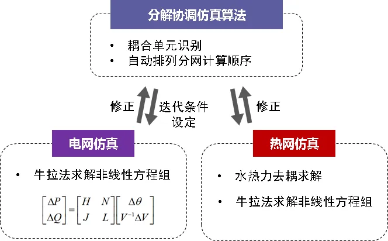

本节主要介绍 SimStudio IES 综合能源系统仿真计算的基本原理，包括稳态仿真的定义、基础状态参数的构成、基础仿真模型的构成以及仿真模型求解算法的执行流程。

## 功能定义

在 SimStudio IES 中，综合能源系统主要是指园区级至区域级的冷热电耦合供能系统，比如典型的燃气三联供系统，同样，针对单一能源系统 SimStudio IES 也支持建模计算，比如市政供热网络、风光储微电网系统等。针对综合能源系统建模仿真的目的主要是分析其在特定边界条件下的运行状态（系统中的电压、功率、温度、流量等参数分布），从而方便用户进行运行策略验证、状态预测等业务。

## 功能说明

### 稳态仿真

所谓稳态，是指在当前固定的边界条件下系统中所有状态参数都不会随时间发生变化的一种稳定状态， SimStudio IES 建模仿真平台基于稳态仿真内核，尽管平台可以支持针对一个时间周期内进行时序仿真，但是各时间断面之间的状态参数没有直接关联关系（除了储能 SOC 、建筑负荷室内温度）。

### 状态参数

在 SimStudio IES 中针对电力系统的状态参数主要包括**电压** $V$ 、**功率** $P$ 、**相角** $\theta$ ，而对于冷热系统的状态参数主要包括**流量** $m$ 、**压力** $p$ 、**温度** $T$。

### 模型构成

SimStudio IES 中所有模型可以大致分为三类，分别是能量枢纽模型、能量传输模型和网络模型:

1. 能量枢纽模型
   
   能量枢纽模型描述了能量的生产、转换以及消费环节，对应实际系统中的电源、冷热源以及电冷热负荷等，以热泵为例，其消耗的电能与制冷制热量之间的转换关系满足如下的表达式：
   
   $$
    P = COP \cdot \left[ {{m_{in}}h\left( {{p_{in}},{T_{in}}} \right) - {m_{out}}h\left( {{p_{out}},{T_{out}}} \right)} \right]
   $$  

   式中 $COP$ 代表热泵的能效比，在 SimStudio IES 中是一个随热泵制冷制热功率变化的系数， $h$ 代表比焓。

2. 能量传输模型

   能量传输模型描述了能量在系统中传输的损耗，对应实际系统中的变压器、传输线、管道等设备。

3. 网络模型
   
   网络模型描述了系统中各连接点处的变量关联关系，比如节点功率平衡方程、节点流量平衡方程等，下面给出了电力系统和冷热系统在连接点处的数学模型：

   3.1 电力系统

   $$
   \sum\limits_{i = 1}^n {{P_i}}  = 0
   $$
   $$
   {V_1} = {V_2} =  \cdots  = {V_n}
   $$
   $$
   {\theta _1} = {\theta _2} =  \cdots  = {\theta _n}
   $$

   3.2 冷热系统

   $$
   \sum\limits_{i = 1}^n {{m_i}}  = 0
   $$
   $$
   {p_1} = {p_2} =  \cdots  = {p_n}
   $$
   $$
   \sum\limits_{i = 1}^{{n_{in}}} {{m_i}h\left( {p,{T_i}} \right)}  + h\left( {p,{T_{out}}} \right)\sum\limits_{i = 1}^{{n_{out}}} {{m_{out}}}  = 0
   $$

   式中$n$代表连接点处关联的端口数量。

### 算法流程

针对上述构建的仿真模型， SimStudio IES 采用一种多能系统**分解协调算法**完成模型的求解，其中上层的协调器把耦合在一起的多能系统按照能量梯级利用的顺序由下至上进行解耦，得到若干能源子网络并自动排列它们的计算顺序，然后调用不同能源子系统的模型求解内核，协调器通过不断更新修正各子系统之间的耦合边界参数，从而完成整个系统仿真模型的计算。针对每个子系统的模型求解，均采用 Newton-Raphson 算法进行迭代计算，特殊地针对于冷热系统还应用了水热力解耦求解算法对模型进行了拆解。

## 常见问题

SimStudio IES 能自动对储能或者机组的运行策略进行优化吗？
:   不能，仿真的目的即是在设备运行策略已经确定的情况下，对系统内部未知的状态参数进行计算。如果需要进行储能、机组运行策略的优化，可以使用 IESLab 规划优化平台。

SimStudio IES 所使用的仿真模型算法和常见的能量平衡模型有什么区别？
:   能量平衡模型的基础状态变量通常只有功率，对拓扑连接关系的考虑也较为简单，通常能量平衡模型在系统前期的规划设计场景下使用更加常见。 SimStudio IES 所构建的模型复杂度和精细度更高，并且允许用户搭建复杂的拓扑连接关系，通常更适合需要更高计算精度的应用场景。