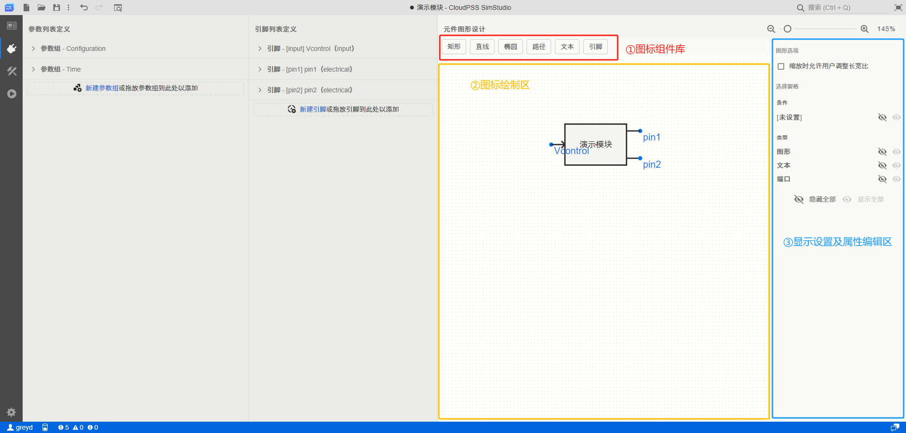
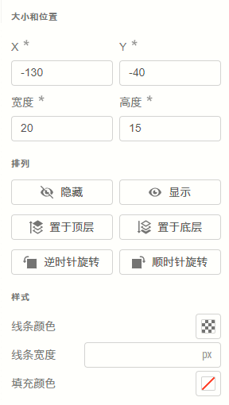
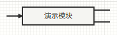
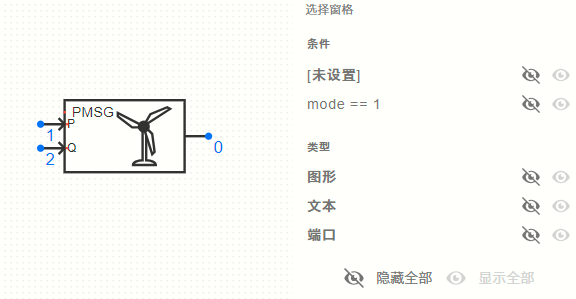
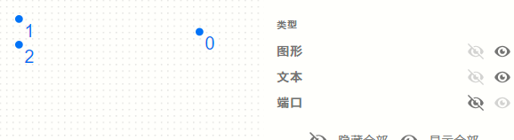

本文档介绍元件/模块的图标设计，主要步骤包括[元件图标绘制](#元件图标绘制)、[在图标中添加引脚并绑定](#在图标中添加引脚并绑定)两个部分，这两步为基础内容。

此外，介绍了一些[高级功能](#高级功能)的介绍，为进阶内容。

## 图标绘制工作区

在[元件/模块封装](../index.md)的过程中，打开[接口标签页](../../../workbench/function/interface/index.md)，右侧则为图标绘制工作区，包含```图标组件库```、```图标绘制区```、```显示设置与属性编辑区```，如下图所示。



用户可以从```图标组件库```中点击或拖拽需要添加的组件，添加到```图标绘制区```中。可供添加的组件包括[矩形](./drawing/index.md#矩形)、[直线](./drawing/index.md#直线)、[椭圆](./drawing/index.md#椭圆)、[路径](./drawing/index.md#路径)、[文本](./drawing/index.md#文本)、[引脚](./drawing/index.md#引脚)共六种，可在[子页面](./drawing/index.md)中查看各类型的图标组件用法。

当用户点击```图标绘制区```的空白处，右侧将显示```显示设置区```，用户可以调整当前视图设置，包括[图形选项](#图形选项)和[窗格](#窗格)设置；当用户选中```图标绘制区```中的某个图标组件，右侧将显示该组件的```属性编辑区```，详见[元件图标绘制](#元件图标绘制)中对应的内容。

## 元件图标绘制

本节详细介绍各个图标组件的基础属性，阅读本节后，将能自行绘制任意需要的元件/模块图标。

当添加图标组件至绘制区后，点击某个图标组件，在右侧可以看见该组件的属性设置，如下图所示。



各类型的组件通用的属性配置项如下表所示。

<table>
    <tr>
        <td>**属性模块**</td>
        <td>**属性配置项**</td>
        <td>**含义及说明**</td>
    </tr>
    <tr>
        <td rowspan="4">**大小和位置**</td>
        <td>X</td>
        <td>控制该组件左上角的定位点在绘图区中的横坐标，向**右**为正方向。一般填写5的倍数，详见[规范](./regulations/index.md)。</td>
    </tr>
    <tr>
        <td>Y</td>
        <td>控制该组件左上角的定位点在绘图区中的纵坐标，向**下**为正方向。一般填写5的倍数，详见[规范](./regulations/index.md)。</td>
    </tr>
    <tr>
        <td>宽度</td>
        <td>控制该组件的宽度。一般填写5的倍数，详见[规范](./regulations/index.md)。宽度的设置不影响```路径```和```引脚```类型组件的实际显示样式。当填写负数时，相当于水平翻转该组件。</td>
    </tr>
    <tr>
        <td>高度</td>
        <td>控制该组件的高度。一般填写5的倍数，详见[规范](./regulations/index.md)。高度的设置不影响```直线```、```路径```和```引脚```类型组件的实际显示样式。当填写负数时，相当于垂直翻转该组件。</td>
    </tr>
    <tr>
        <td rowspan="6">**排列**</td>
        <td>隐藏</td>
        <td>将隐藏该组件，仅影响当前绘图区的视角，不影响调用模块时该组件的实际显示。在组件隐藏后，可以在[窗格](#窗格)工作区点击**显示全部**重新显示隐藏的组件。</td>
    </tr>
    <tr>
        <td>显示</td>
        <td>显示该隐藏的组件，仅影响当前绘图区的视角，不影响调用模块时该组件的实际显示。</td>
    </tr>
    <tr>
        <td>置于顶层</td>
        <td>将该组件置于所有组件的最顶层，最顶层的绘图组件将基于透明度覆盖下层的组件，鼠标点击时也会优先选中。</td>
    </tr>
    <tr>
        <td>置于底层</td>
        <td>将该组件置于所有组件的最底层，最底层的绘图组件将被上层的组件覆盖，鼠标点击时不会被优先选中。</td>
    </tr>
    <tr>
        <td>逆时针旋转</td>
        <td>以组件中心点为旋转中心，逆时针旋转该组件。</td>
    </tr>
    <tr>
        <td>顺时针旋转</td>
        <td>以组件中心点为旋转中心，顺时针旋转该组件。</td>
    </tr>
    <tr>
        <td rowspan="3">**样式**</td>
        <td>线条颜色</td>
        <td>点击选色按钮可以弹出调色板，用于选择线条的颜色和透明度。对```引脚```类型的组件无效。</td>
    </tr>
    <tr>
        <td>线条宽度</td>
        <td>填写线条宽度值，以像素（px）为单位，默认为2px，对```引脚```类型的组件无效。</td>
    </tr>
    <tr>
        <td>填充颜色</td>
        <td>点击选色按钮可以弹出调色板，用于选择填充颜色和透明度。对于```矩形```、```直线```、```椭圆```，默认为白色；对于```路径```默认为透明；对```文本```默认为黑色；对```引脚```、```直线```无效。</td>
    </tr>
    <tr>
        <td>数据</td>
        <td>条件</td>
        <td>该组件将在什么条件下显示。可以引用[参数列表](../../parameter-list/index.md)中的参数，例如```mode==1```条件的组件只在参数```mode```值为1时显示。该配置项在```引脚```绘图组件的属性编辑区不显示。</td>
    </tr>
</table>

此外，在绘制区中选中一个组件后，也可以用拖动的方式改变组件的```X```、```Y```属性；可以拖拽组件四周的圆点改变组件的大小，即```宽度```和```高度```属性；

拖拽组件左上角的菱形图标可以自由旋转该组件，实现属性栏中的逆时针旋转、顺时针旋转功能。


针对不同组件的详细说明详见以下文档。

import DocCardList from '@theme/DocCardList';

<DocCardList />

## 在图标中添加引脚并绑定

本节介绍在图标中绑定[引脚列表](../pins-list/index.md)中的引脚。

在完成元件图标绘制操作后，用户可以从```图标组件库```中拖拽```引脚```组件到```图标绘制区```，将引脚组件自带的**蓝色圆点**对准需要摆放引脚的位置。

用户也可以在右侧的```属性编辑区```中，手动设置引脚的位置（```X```和```Y```参数）。注意，此时属性编辑区中引脚的**宽度**和**长度**参数均为无效参数，无需调整。引脚的属性编辑区如下图所示。


在引脚的属性编辑区最下方，存在一个名为```引脚```的单选栏，用户需要在这里选中该```引脚图标组件```需要绑定的[引脚列表](../pins-list/index.md)中的引脚。

对于每个引脚列表中,[“可见”配置项](../pins-list/index.md#引脚定义)设置为**开**的引脚，需要依次在图标绘制区中添加并绑定这些引脚的图标。

通过以上的教程，用户已经能完成基础的元件图标实现。

## 高级功能

本节介绍图标绘制的高级功能，包括[导入当前图形](#导入当前图形)、[图形选项](#图形选项)和[窗格](#窗格)三个方面。

### 导入当前图形

```导入当前图形```功能的主要应用场景是：
- 部分CloudPSS旧版本的元件图标和当前的新版本图标不兼容，利用这些元件另存得到的元件中，图标绘制工作区中出现```导入当前图形```的按钮。
- 对于原本为[```普通项目```或```简单项目```](../../../workbench/function/summary/index.md#模型类型)的模型，在[总览标签页](../../../workbench/function/summary/index.md)中修改为```元件```类型后，图标绘制工作区中出现```导入当前图形```的按钮。

```导入当前图形```按钮如下图所示：


**在```导入当前图形```按钮出现时，为了避免图标无法正常保存等问题，请先点击该按钮，生成默认的元件图标，再开始图形的绘制。**

生成默认的图标后，```导入当前图形```按钮将会消失，默认的图标可以按需求自行删除。

### 图形选项

点击```图标绘制区```的空白处，右侧```显示设置区```将会出现```图形选项```的配置栏。目前，Simstudio的该配置栏中仅有```缩放时允许用户调整长宽比```配置项。

当取消勾选该配置项时，用户调用模块时无法改变长宽比，如下图所示。

<center>

</center>

当勾选该配置项时，用户将能在调用模块时自由更改长宽比，如下图所示。

<center>

</center>

注意，如果勾选该配置项，允许用户自由更改长宽比，可能导致**连线无法对齐**等问题，详见[Simstudio元件图标设计规范](./regulations/index.md)相关内容。

### 窗格

点击```图标绘制区```的空白处，右侧```显示设置区```将会出现```选择窗格```的配置栏。该配置栏主要用于筛选当前图标绘制区内显示的组件，用以应对图标设计过于复杂、不方便点击选择的问题。

**窗格的配置不会影响该元件的实际呈现形式，只影响当前绘图区的预览样式。**

以直驱风机封装模块为例进行说明，窗格板块如下图所示：



窗格的配置包括```条件```和```类型```两个模块。**条件**模块主要根据各绘图组件设定的```条件```进行筛选；**类型**模块主要根据```图标```、```文本```、```端口```三种绘图组件的类型进行筛选。

默认地，所有元素和条件均已设为可见，即右边的**显示**图标为灰色。

- 条件模块

    在绘图区中，有组件的**条件**设置为```mode==1```，如下图所示。因此```窗格```的**条件**栏中存在```mode==1```的条目。

    

    当用户点击```窗格```中的```mode==1```条目右侧的**隐藏**按钮后，当前绘图窗口中将不会显示设置了```mode==1```条件的组件，如下图所示：

    

- 类型模块
    
    类型模块分为```图标```、```文本```、```端口```三种。用户可以任意选择需要显示或隐藏的绘图组件，例如只显示端口组件：

    

此外，用户可点击下方的```隐藏全部```和```显示全部```按钮，隐藏或显示全部组件。

## 如何绘制一个规范的元件图标？

根据以上内容，已经可以完成一个元件图标的绘制了。

但是，**为了确保最后的元件图标能正常、美观地显示，在设计图标时请务必参考[SimStudio元件图标设计规范](./regulations/index.md)。**

