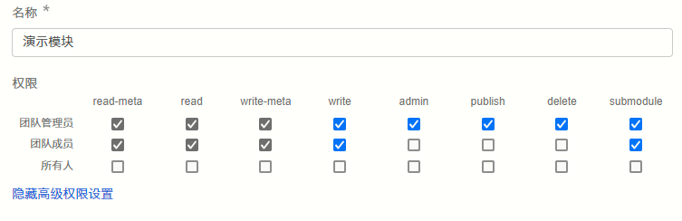

本文档介绍元件/模块的调用权限配置，用来管理其它用户对于本模块的使用权限。

一般来说只需要设置[简单权限配置](#简单权限配置)即可，如果简单权限配置无法满足需求，可进一步查看[高级权限配置](#高级权限配置)。

## 简单权限配置

来到[总览标签页](../../../workbench/function/summary/index.md)，可以在这里找到```权限```的配置项，如下图所示。


三种简单权限配置的说明如下表所示。

| **权限选项** | **含义与说明** |
| :--- | :--- |
| **私有** | 对团队外成员隐藏。如果是保存到协作空间的[协作项目](../../../center/index.md#项目管理)，仅该[协作组织](../../../../../account/settings/organization/index.md)的成员可以找到、读取、修改该元件；如果是保存到个人空间的[个人项目](../../../center/index.md#项目管理)，仅用户本身有访问到该模块的权限。 | 
| **作为子模块公开** | 与```私有```权限不同的是，作为子模块公开时，其它所有人均能以元件形式调用这个封装的模块。但仍只有团队成员或用户本人有权限打开、读取该模块的内部信息或修改模块。 | 
| **完全公开** | 其它所有人均能以元件形式调用这个封装的模块，也可以打开、读取该模块的内部信息。 | 

## 高级权限配置

点击权限设置右侧的**高级**按钮，可以展开为高级权限设置，如下图所示。



高级权限设置中的各配置项说明详见[应用权限介绍](../../../../../account/app/authority/index.md)。