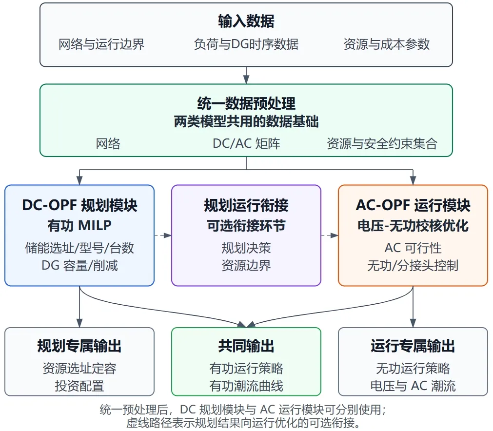

本节主要介绍 DSLab 平台储能规划的基本原理。

## 功能定义

DSLab 提供（储能、光伏、风机）选址定容与（储能、光伏、风机、柔性负荷、并联电容电抗器、变压器）运行优化功能。

## 功能说明

### 优化目标

选址定容目标函数由设备投资成本和时序运行成本组成：

$$
\min C^{DC}=C^{inv}_{ES}+C^{inv}_{DG}+C^{op}_{ES}+C^{cur}_{DG}+C^{op}_{FL}
$$

其中，$C^{inv}_{ES}$ 为储能投资成本，$C^{inv}_{DG}$ 为分布式电源投资或容量配置成本，$C^{op}_{ES}$ 为储能充放电运行成本，$C^{cur}_{DG}$ 为分布式电源削减成本，$C^{op}_{FL}$ 为柔性负荷调节成本。

运行优化目标函数延续 DC 规划环节中的运行成本项，但不计入设备投资成本：

$$
\min C^{AC}=C^{op}_{ES}+C^{cur}_{DG}+C^{op}_{FL}+C^{op}_{QC}+C^{op}_{tap}
$$

其中，$C^{op}_{QC}$ 和 $C^{op}_{tap}$ 分别表示无功补偿和变压器分接头调节相关成本。

### 决策变量

规划优化涉及选定定容或运行优化不同阶段决策变量。选址定容阶段基于直流最优潮流模型（DC-OPF），确定新增设备配置和有功运行方案；运行优化阶段在设备配置已知的基础上，采用 DC-OPF 或交流最优潮流(AC-OPF)优化时序运行策略，仅为已启用优化且位于有效计算区域内的可调资源建立对应变量。

| 阶段 | 类别 | 决策变量 | 说明 |
| :--- | :--- | :--- | :--- |
| DC 选址定容 | 网络状态 | 平衡节点有功注入、节点电压相角 | 节点注入和支路有功由电压相角及网络参数计算 |
| ^ | 储能配置 | 候选节点的型号选择、各型号安装台数 | 每个候选节点从可用储能型号（**数据管理**-**储能信息库**-**储能设备** 中所有储能型号）中选择，并以整数台数配置 |
| ^ | 储能运行 | 充电功率、放电功率、充放电状态、储能电量 | 按计算时段给出新增储能的有功运行方案和 SOC 曲线 |
| ^ | 分布式电源 | 候选节点配置容量、出力削减功率 | 配置容量使用整数变量表示，运行出力可在调节系数允许范围内削减 |
| ^ | 柔性负荷 | 有功上调量、有功下调量 | 在功率边界和计算周期总用能边界内调整负荷曲线 |
| DC 运行优化 | 网络状态 | 平衡节点有功注入、节点电压相角 | 对已知设备配置进行有功优化，不计算节点电压幅值和无功平衡 |
| ^ | 柔性资源 | 储能充放电及电量、分布式电源削减、柔性负荷上调和下调 | 设备位置、型号、台数或容量保持不变，仅优化运行策略 |
| AC 运行优化 | 网络状态 | 平衡节点有功/无功注入、节点电压幅值和相角 | 采用交流潮流方程计算节点注入、支路潮流和网络损耗 |
| ^ | 有功柔性资源 | 储能充放电及电量、分布式电源削减、柔性负荷上调和下调 | 延续 DC 模型中的时序有功调节变量 |
| ^ | 无功与电压调节 | 储能无功输入/输出、并联电容/电抗器无功输入/输出、变压器变比调节量 | 仅在相应元件启用优化时建立 |

支路有功、节点有功/无功注入和导纳矩阵等变量在模型中由上述网络状态和控制变量计算，用于表达潮流与安全约束，不属于用户直接配置的设备规划量。

### 约束条件

规划优化中的约束由所选计算模型、全局参数和元件参数共同确定。固定负荷以及未启用优化的设备按原始曲线或既有运行策略作为已知注入参与功率平衡。

| 约束类别 | 适用阶段 | 约束内容 |
| :--- | :--- | :--- |
| 有功功率平衡 | 全部阶段（DC 选址定容、DC/AC 运行优化） | 每个节点、每个时刻满足有功注入与负荷、储能充放电、分布式电源实际出力及柔性负荷调节之间的平衡 |
| 无功功率平衡 | AC 运行优化 | 每个节点、每个时刻满足无功注入与固定无功负荷、储能无功及并联电容/电抗器调节之间的平衡 |
| 平衡节点边界 | 全部阶段 | 平衡节点有功受送电上限和返送电下限约束；交流模型同时考虑无功边界，并固定参考相角 |
| 节点电压 | AC 运行优化 | 节点电压幅值满足全局上下限；平衡节点和 PV 节点按给定电压幅值运行 |
| 支路容量 | 全部阶段 | 对启用容量约束的传输线和变压器限制有功潮流；全网约束开启时按所选轻载、重载或过载阈值与额定容量计算边界，否则使用元件自身设置的容量系数 |
| 储能选型与总量 | DC 选址定容 | 每个候选节点至多选择一种储能型号，型号选择与整数台数保持一致，全网配置容量不超过设定上限 |
| 储能运行 | 全部阶段 | 储能电量满足 SOC 上下限和时序递推关系，计算周期首末电量一致；充电与放电互斥，功率不超过设备台数对应的最大充放电能力 |
| 分布式电源 | DC 选址定容、DC/AC 运行优化 | 全网新增容量不超过设定上限；实际出力位于原始出力与功率调节系数下限形成的范围内，削减量不得越界 |
| 柔性负荷 | 全部阶段 | 优化后功率满足 **功率下限** `p_min` 和 **功率上限** `p_max`，计算周期总用能量满足 **用能下限系数** `e_coeff_min` 和 **用能上限系数** `e_coeff_max` 给出的上下限 |
| 并联电容/电抗器 | AC 无功优化 | 各时刻吸收或发出的无功功率不超过设备能力，调节量计入节点无功平衡和运行成本 |
| 变压器分接头 | AC 无功优化 | 可调变比限制在 `tap_min` 与 `tap_max` 之间，挡位上调和下调形成优化后的时序变比 |
### 算法流程

该算法流程主要分为三层，包括基于输入数据的统一数据预处理、规划优化（DC-OPF 规划、规划运行衔接、AC-OPF 交流运行优化）以及结果处理。具体流程如下图所示：

具体步骤如下：

1. 数据预处理：读取配电网拓扑、支路参数、节点负荷、分布式电源出力、候选柔性资源、运行边界和成本参数，形成统一时序数据集和资源集合。

2. DC-OPF 规划：在有功潮流近似模型下建立混合整数线性规划模型，确定储能选址、储能型号、储能台数、分布式电源选址及容量或可控出力、柔性负荷有功调节和储能时序充放电策略。

3. DC-AC 规划运行衔接：将 DC 规划得到的设备安装结果、资源运行边界和时序有功方案传递至 AC-OPF 交流运行优化环节，并作为其初始解。

4. AC-OPF 交流运行优化：在非线性交流潮流约束下，优化储能有功/无功、分布式电源削减、柔性负荷调节、并联无功补偿和变压器分接头等运行策略，满足电压、无功、支路潮流和设备边界约束。

5. 结果输出：输出柔性资源规划配置、设备投资成本、运行成本、储能 SOC 曲线、柔性资源调节曲线、分布式电源利用与削减结果、配变和线路有功曲线、电压曲线、无功补偿曲线及越限消除情况。

上述流程既可用于规划优化，也可在设备配置已知时仅调用 AC-OPF/AC-OPF 运行模块进行运行优化。其核心在于 DC 规划模块和 AC 运行模块在目标结构、资源边界和柔性资源表示上保持一致，使两阶段结果能够连续衔接。