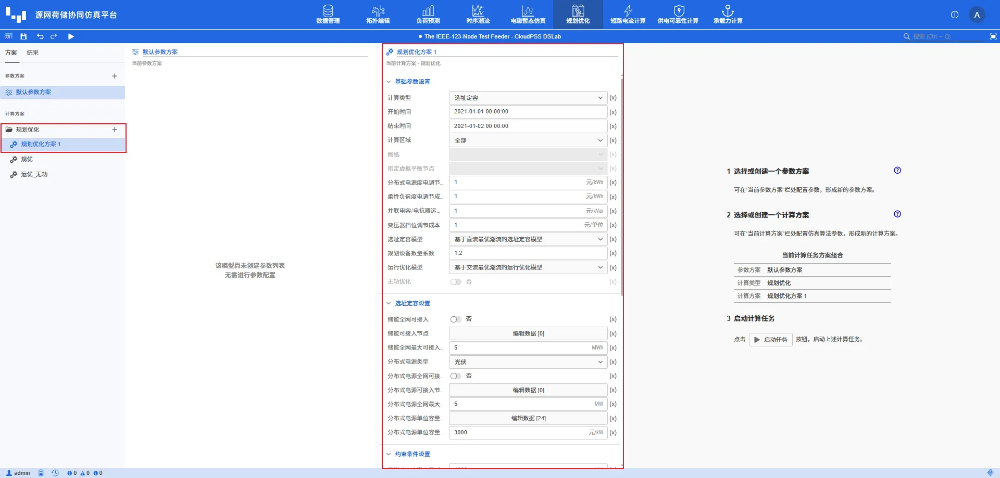
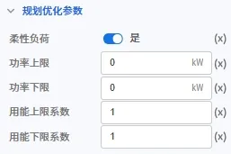
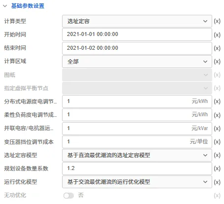
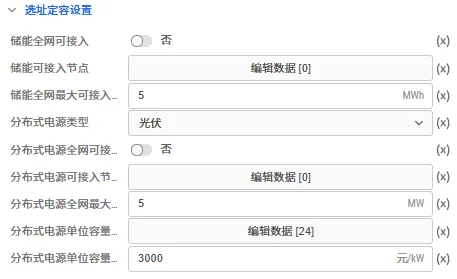
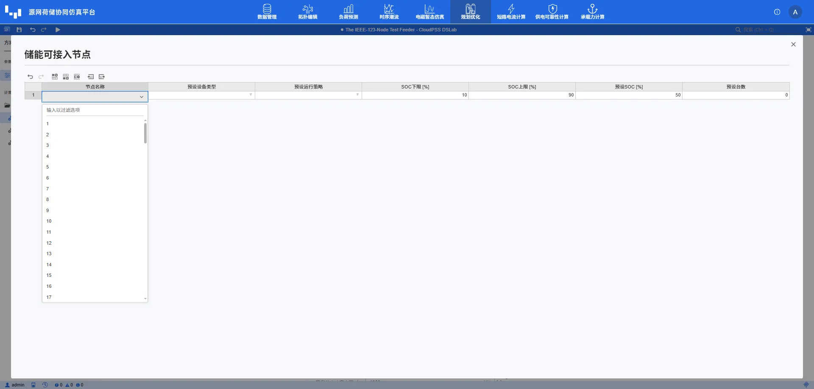
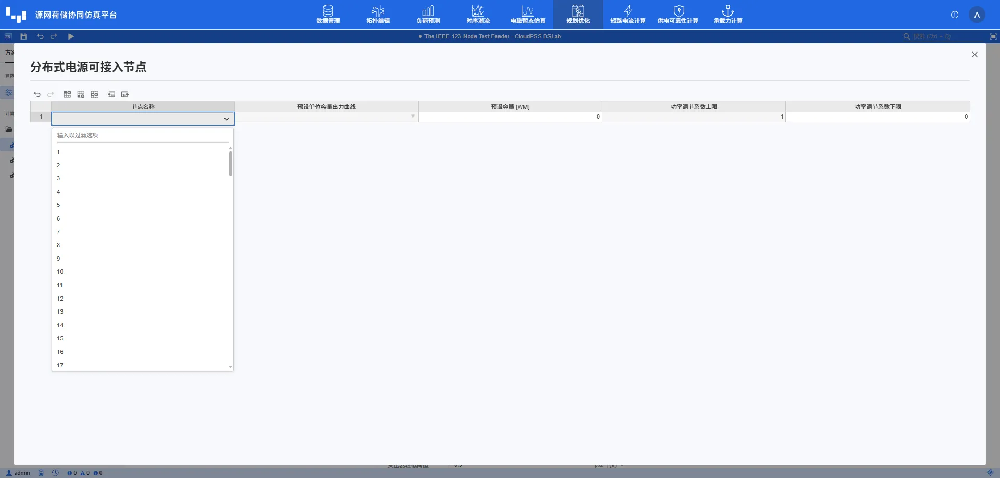
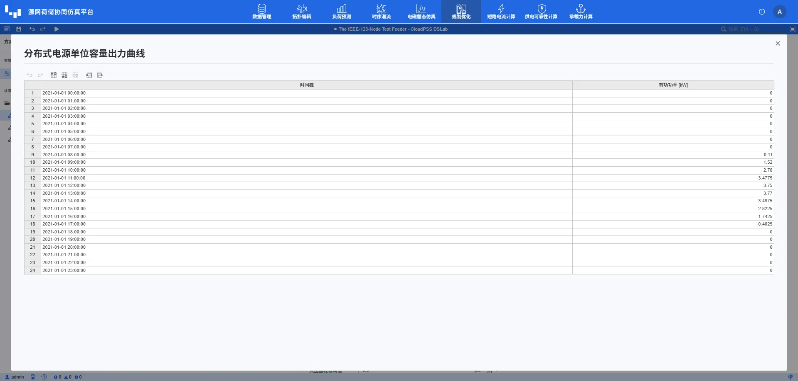
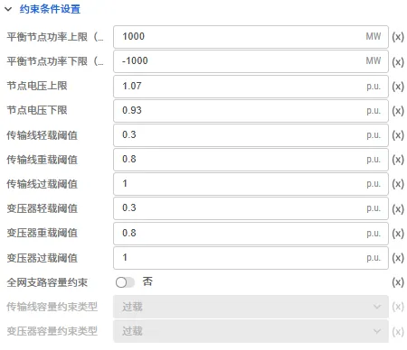

本节主要介绍 DSLab 源网荷储协同仿真平台规划优化计算方案的配置方法，包括拓扑元件的可优化参数，以及基础参数、选址定容参数和约束条件参数。

## 功能定义

规划优化模块支持储能、光伏和风机的选址定容，并可对储能、光伏、风机、柔性负荷、并联电容/电抗器和变压器的运行策略进行优化。对于选址定容计算前需要先配置可选的储能型号；对于运行优化计算前需要先在拓扑元件中启用相应的优化能力，再在计算方案中设置计算范围、模型、成本和约束。

## 功能说明

在 **运行标签页** 中创建或选中 **规划优化方案**，即可配置计算参数并启动任务。

## 元件规划优化参数

元件参数在 **拓扑编辑** 模块中配置，用于决定元件是否参与优化以及对应的运行边界。未启用优化的元件按照既有曲线或固定参数参与计算。

### 负荷

| 参数名 | 键名 | 类型 [单位] | 描述 |
| :--- | :--- | :--- | :--- |
| 柔性负荷 | `is_flex` | 布尔 | 是否将该负荷作为柔性负荷参与规划优化 |
| 功率上限 | `p_max` | 实数 [kW] | 柔性负荷优化后的有功功率上限 |
| 功率下限 | `p_min` | 实数 [kW] | 柔性负荷优化后的有功功率下限 |
| 用能上限系数 | `e_coeff_max` | 实数 | 规划优化计算时间范围内，总用能量相对原始用能量的上限系数 |
| 用能下限系数 | `e_coeff_min` | 实数 | 规划优化计算时间范围内，总用能量相对原始用能量的下限系数 |

### 光伏与风机

| 参数名 | 键名 | 类型 [单位] | 描述 |
| :--- | :--- | :--- | :--- |
| 是否优化 | `is_flex` | 布尔 | 是否对已有光伏或风机的运行出力进行优化 |
| 功率调节系数下限 | `p_coeff_min` | 实数 | 出力相对原始功率的下限系数，取值范围为 0～1；上限固定为 1 |

### 并联电容/电抗器与储能

| 元件 | 参数名 | 键名 | 类型 [单位] | 描述 |
| :--- | :--- | :--- | :--- | :--- |
| 并联电容/电抗器 | 是否优化 | `if_optimize` | 选择 | 是否在规划优化中优化其无功运行策略 |
| 储能 | 是否优化 | `if_optimize` | 布尔 | 是否对已有储能的充放电及无功运行策略进行优化 |

### 变压器

| 参数名 | 键名 | 类型 [单位] | 描述 |
| :--- | :--- | :--- | :--- |
| 变比可调 | `is_tap_flex` | 布尔 | 变压器分接挡位是否参与运行优化 |
| 变比下限 | `tap_min` | 实数 | 可调变比下限 |
| 变比上限 | `tap_max` | 实数 | 可调变比上限 |
| 容量约束 | `is_p_limit` | 布尔 | 是否对该变压器启用有功容量约束 |
| 容量下限系数 | `p_min_coeff` | 实数 | 基于额定容量计算有功下限的系数 |
| 容量上限系数 | `p_max_coeff` | 实数 | 基于额定容量计算有功上限的系数 |

### 传输线

| 参数名 | 键名 | 类型 [单位] | 描述 |
| :--- | :--- | :--- | :--- |
| 容量约束 | `is_p_limit` | 布尔 | 是否对该传输线启用有功容量约束 |
| 容量下限系数 | `p_min_coeff` | 实数 | 基于持续极限容量计算有功下限的系数 |
| 容量上限系数 | `p_max_coeff` | 实数 | 基于持续极限容量计算有功上限的系数 |

当 **全网支路容量约束** 开启时，程序按照计算方案中选择的阈值类型对全网传输线和变压器施加容量约束；关闭时，仅对元件参数中已启用 **容量约束** 的支路使用其容量上下限系数。

## 计算方案参数

### 基础参数设置

| 参数名 | 键名 | 类型 [单位] | 描述 |
| :--- | :--- | :--- | :--- |
| 计算类型 | `CalcType` | 选择 | `0`：选址定容；`1`：运行优化 |
| 开始时间 | `startTime` | 文本 | 规划优化所使用运行数据的开始时间，格式为 `yyyy-mm-dd hh:mm:ss` |
| 结束时间 | `endTime` | 文本 | 规划优化所使用运行数据的结束边界，格式为 `yyyy-mm-dd hh:mm:ss`；后端按左闭右开区间生成时序，结束时刻不参与计算 |
| 计算区域 | `calc_area` | 选择 | `0`：全部；`1`：指定图纸 |
| 图纸 | `canvas` | 多选 | 计算区域为 **指定图纸** 时，选择参与计算的一张或多张图纸 |
| 指定虚拟平衡节点 | `slack_bus` | 选择 | 计算区域为 **指定图纸** 时，选择一个母线作为虚拟平衡节点；指定范围内必须且只能存在一个平衡节点 |
| 分布式电源度电调节成本 | `e_adjust_cost_dg` | 实数 [元/kWh] | 光伏或风机出力削减对应的单位电量调节成本 |
| 柔性负荷度电调节成本 | `e_adjust_cost_fl` | 实数 [元/kWh] | 柔性负荷上调或下调对应的单位电量调节成本 |
| 并联电容/电抗器运行成本 | `qc_cost_q` | 实数 [元/kVar] | 并联电容/电抗器无功调节的运行成本 |
| 变压器挡位调节成本 | `qt_cost_q` | 实数 [元/单位] | 变压器分接挡位调节的单位成本 |
| 选址定容模型 | `plan_model` | 选择 | `0`：基于直流最优潮流的选址定容模型；`1`：基于交流最优潮流的选址定容模型（暂不支持） |
| 规划设备数量系数 | `dev_num_coeff` | 实数 | 对直流规划模型得到的储能台数和分布式电源配置容量向上修正，应对交流运行模型计及有功损耗等有功需求 |
| 运行优化模型 | `oper_model` | 选择 | `0`：基于直流最优潮流的运行优化模型；`1`：基于交流最优潮流的运行优化模型 |

计算类型为**选址定容**时，程序先执行选址定容，再根据配置的运行优化模型进行后续运行优化；计算类型为**运行优化**时，仅优化拓扑中已启用优化的现有设备。 

### 选址定容设置

| 参数名 | 键名 | 类型 [单位] | 描述 |
| :--- | :--- | :--- | :--- |
| 储能全网可接入 | `n_es_auto` | 布尔 | 是否将全网母线作为储能候选接入范围（暂不支持） |
| 储能可接入节点 | `n_es` | 表格 | 自定义储能候选节点，以及预设设备、运行策略、SOC 和台数（预设参数若不配置，自动使用默认值） |
| 储能全网最大可接入容量 | `es_capa_sum_max` | 实数 [MWh] | 全部候选节点可配置储能容量的总上限 |
| 分布式电源类型 | `dg_type` | 选择 | `0`：光伏；`1`：风机 |
| 分布式电源全网可接入 | `n_dg_auto` | 布尔 | 是否将全网母线作为分布式电源候选接入范围（暂不支持） |
| 分布式电源可接入节点 | `n_dg` | 表格 | 自定义分布式电源候选节点、预设容量及功率调节系数 |
| 分布式电源全网最大可接入容量 | `dg_capa_sum_max` | 实数 [MW] | 全部候选节点可配置分布式电源容量的总上限 |
| 分布式电源单位容量出力曲线 | `dg_curve` | 表格 | 与计算时段一一对应的单位容量有功出力曲线 |
| 分布式电源单位容量成本 | `dg_cost_dev` | 实数 [元/kW] | 分布式电源单位装机容量的投资成本 |

#### 储能可接入节点

点击 **储能可接入节点**，配置候选节点。表格字段如下。

| 字段 | 描述 |
| :--- | :--- |
| 节点名称 | 从计算区域内的母线中选择候选接入节点 |
| 预设设备类型 | 初始储能设备型号；未指定时默认使用 **数据管理**-**储能信息库**-**储能设备**  中第一个 |
| 预设运行策略 | 作为优化初始值的储能运行曲线 |
| SOC 下限 [%] | 储能荷电状态下限 |
| SOC 上限 [%] | 储能荷电状态上限 |
| 预设 SOC [%] | 储能初始荷电状态初始值 |
| 预设台数 | 设备台数初始值 |

#### 分布式电源可接入节点

点击 **分布式电源可接入节点** 配置候选节点。表格字段如下。

| 字段 | 描述 |
| :--- | :--- |
| 节点名称 | 从计算区域内的母线中选择候选接入节点 |
| 预设单位容量出力曲线 | 候选节点使用的初始出力曲线（暂不支持选择） |
| 预设容量 [kW] | 候选节点的预设装机容量 |
| 功率调节系数上限 | 出力相对原始功率的上限系数，当前模型使用 1（暂不支持修改） |
| 功率调节系数下限 | 出力相对原始功率的下限系数 |

:::tip
分布式电源单位容量出力曲线的时间点数必须与开始时间、结束时间形成的小时计算时段数一致。
:::

### 约束条件设置

| 参数名 | 键名 | 类型 [单位] | 描述 |
| :--- | :--- | :--- | :--- |
| 平衡节点功率上限（送电） | `ref_p_max` | 实数 [MW] | 平衡节点从上级电网向计算区域送电的有功功率上限 |
| 平衡节点功率下限（返送电） | `ref_p_min` | 实数 [MW] | 平衡节点向上级电网返送有功功率的下限，应填写负值 |
| 节点电压上限 | `n_v_mag_max` | 实数 [p.u.] | 交流运行优化中的节点电压幅值上限 |
| 节点电压下限 | `n_v_mag_min` | 实数 [p.u.] | 交流运行优化中的节点电压幅值下限 |
| 传输线轻载阈值 | `transline_light_threshold` | 实数 [p.u.] | 传输线轻载阈值及全网容量约束的可选系数 |
| 传输线重载阈值 | `transline_heavy_threshold` | 实数 [p.u.] | 传输线重载阈值及全网容量约束的可选系数 |
| 传输线过载阈值 | `transline_over_threshold` | 实数 [p.u.] | 传输线过载阈值及全网容量约束的可选系数 |
| 变压器轻载阈值 | `transformer_light_threshold` | 实数 [p.u.] | 变压器轻载阈值及全网容量约束的可选系数 |
| 变压器重载阈值 | `transformer_heavy_threshold` | 实数 [p.u.] | 变压器重载阈值及全网容量约束的可选系数 |
| 变压器过载阈值 | `transformer_over_threshold` | 实数 [p.u.] | 变压器过载阈值及全网容量约束的可选系数 |
| 全网支路容量约束 | `l_p_limit_all` | 布尔 | 是否对全网支路启用容量约束；传输线以持续极限容量、变压器以额定容量为基准 |
| 传输线容量约束类型 | `transline_limit_threshold` | 选择 | `0`：轻载阈值；`1`：重载阈值；`2`：过载阈值 |
| 变压器容量约束类型 | `transformer_limit_threshold` | 选择 | `0`：轻载阈值；`1`：重载阈值；`2`：过载阈值 |

