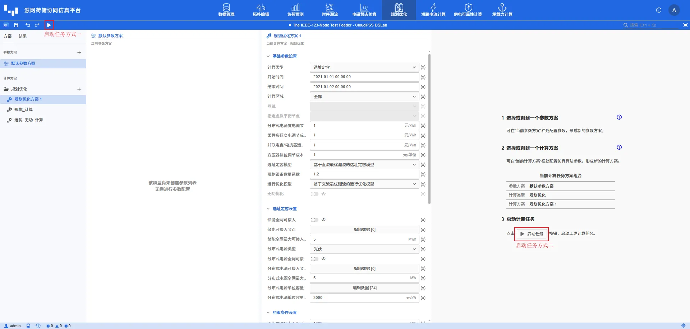
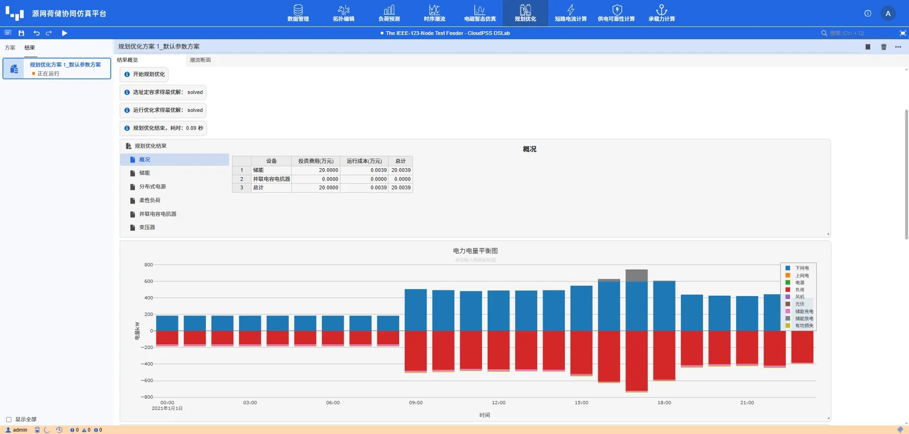
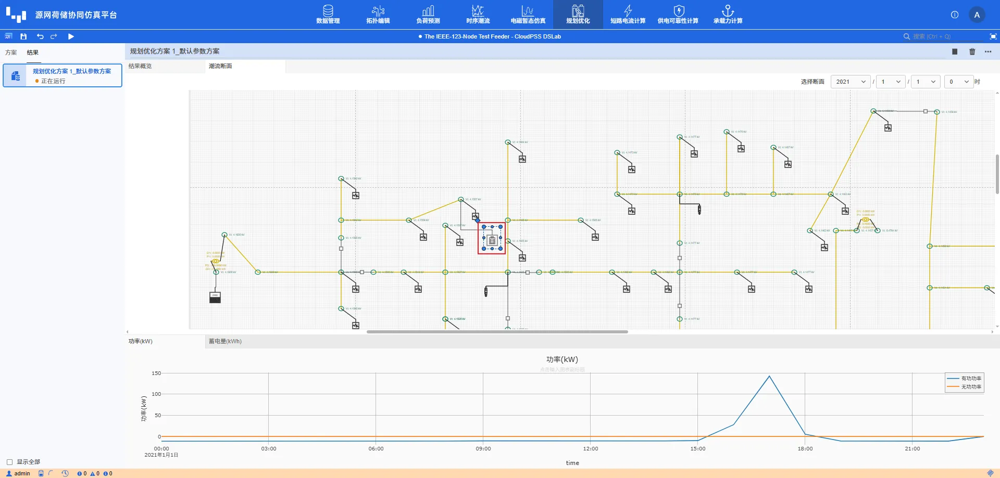

本节主要介绍 DSLab 源网荷储协同仿真平台规划优化任务的启动方法、结果内容和结果回写方式。结果页面同时支持选址定容和运行优化任务，并根据实际参与优化的资源动态展示结果。

## 功能定义

规划优化结果页面用于展示求解过程、设备投资与运行成本、规划配置、柔性资源运行策略、电力电量平衡以及潮流时序结果，并提供运行数据和拓扑配置的回写入口。

## 功能说明

### 启动任务

完成参数方案和计算方案配置后，点击页面上方的 **启动任务** 按钮。平台提交当前规划优化任务，并在任务启动后切换到 **结果** 标签页。任务状态显示为运行成功后，即可查看完整结果。

### 结果

结果主要包含规划结果表、电力电量平衡图以及时序统计表。

**规划优化结果** 包含以下分类：

- **概况**：汇总设备投资费用、运行成本和总成本。
- **储能**：展示储能的接入位置、型号、台数、SOC 边界及运行方式。
- **分布式电源**：展示光伏或风机的接入位置、配置容量及运行方式。
- **柔性负荷**：展示参与调节的负荷及其优化后运行方式。
- **并联电容电抗器**：展示参与无功优化的并联电容/电抗器及其运行方式。
- **变压器**：展示参与变比优化的变压器。

仅对实际参与优化且具有结果的资源生成结果表；无对应数据时页面显示 **暂无数据**。

平台输出**电力电量平衡图**，按时间展示上级电网送电与返送电、常规电源、负荷、光伏、风机、储能充放电和网损等分量。柱形图采用相对堆叠方式，便于检查每个时刻的功率平衡和计算周期内的电量构成。

结果同时复用 [时序潮流结果](../../80-powerflow-module/30-results-tab/index.md)，提供节点电压与相角、传输线和变压器有功/无功功率、电流及损耗等结果。点击资源表中的设备/运行方式或进入 **潮流断面** 页面，可以结合拓扑断面查看指定时刻或完整计算周期的运行曲线。

### 两种计算类型的结果差异

- **选址定容**：输出新增储能和分布式电源的接入母线、型号或容量及其运行策略，并在拓扑回写时创建对应设备。
- **运行优化**：不新增规划设备，只更新拓扑中已启用优化的储能、光伏、风机、柔性负荷、并联电容/电抗器和变压器运行策略。
- 两种计算类型都会根据所选运行模型输出潮流、电力电量平衡和成本结果。

## 结果回写

### 运行结果回写

点击 **运行结果回写** 区域中的 **确定** 按钮，可将规划优化生成的运行曲线写回数据管理模块，包括新增或已有储能的运行策略、分布式电源出力曲线、柔性负荷曲线、并联电容/电抗器无功策略和变压器变比策略。

### 拓扑结果回写

点击 **拓扑结果回写** 按钮，可将方案配置结果写回拓扑编辑模块：选址定容任务会创建新增的储能或分布式电源，运行优化任务会更新参与优化元件的参数和运行策略引用。

回写后若不点击页面左上方的**保存**按钮，修改只在当前页面临时生效，刷新页面后将恢复回写前状态。建议先利用时序结果和潮流断面校核方案，确认无误后再保存应用。

## 常见问题

提示无可行解？

:   1. 配置校核
        
        校核（可选）柔性资源、约束条件配合是否合理。

:   2. 渐进调试
        
        先放开所有约束，在跑通“无规划优化/潮流”状态的场景后，再从有功到无功逐步增加约束进行调试。

计算时间过长？

:   1. 精简决策变量与约束条件数量

        基于时序潮流结果，精简约束支路，缩减可选储能型号、可选接入节点等； 

:   2. 渐进调试
        
        当计算方案接近无可行解时，计算耗时会极具增加。因此，建议先选择一个典型日调通算例后再进行更长时间区间的规划优化。并先放开所有约束，在跑通“无规划优化/潮流”状态的场景后，再从有功到无功逐步增加约束进行调试。
