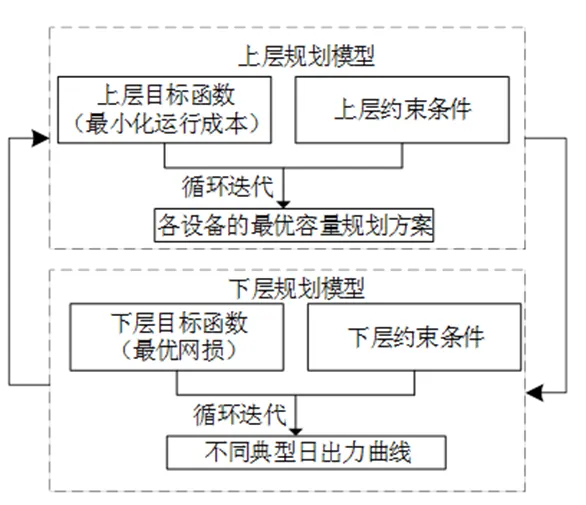
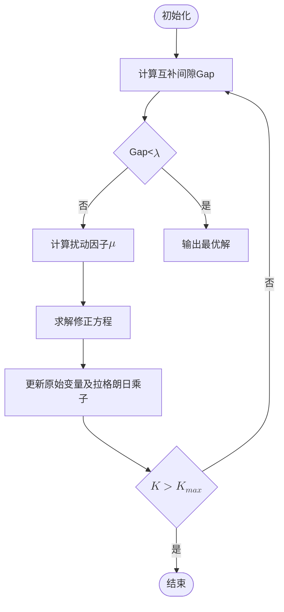

本节主要介绍 DSLab 平台储能规划的基本原理。

## 功能定义

DSLab 提供的储能规划功能。

## 功能说明

### 优化目标

配网侧储能规划的优化目标为经济性最优，主要考虑了储能设备的投资成本和运行成本，其中运行成本包括储能运行的可变运维成本、从上级电网的购电成本（若有）等。优化目标可以表示为以下公式：

$$
\min \left( \sum_{t=1}^{T} P_t \cdot G_{\text{mw}}[t] + \sum_{e=1}^{E} \sum_{tp=1}^{TP} E_{\text{ss}\text{typ}[e,tp]} \cdot \text{esscost}[tp] \right)
$$

式中：
- $G_{\text{mw}}[t]$ 为时刻 $t$ 外购电功率；
- $P_t$ 为 $t$ 时刻外购电价格；
- $\text{esscost}[tp]$ 为储能接入成本（包含投资成本和运行成本）。

### 约束条件和决策变量

优化模型中所考虑的约束条件和决策变量如下表所示，其中决策变量主要包括储能的接入位置、配置容量以及 8760h 的运行策略。与此同时，如果系统中存在柔性负荷，算法还会对柔性负荷曲线进行调节，以配合实现最经济的新能源消纳。

| 模型分类 | 参数类型 | 参数名称 | 参数说明 |
| :--- | :--- | :--- | :--- |
| 固定负荷 | 约束条件 | 8760h 曲线 | 储能规划时将始终保证负荷得到满足 |
| 柔性负荷 | 约束条件 | 负荷可削减上限 | 负荷每日电量的最大可削减量 |
| ^ | ^ | 负荷可调节时段 | 每日24h 允许进行负荷转移或者削减的时段 |
| ^ | 决策变量 | 柔性负荷的实际运行曲线 | 柔性负荷的实际运行曲线 |
| 分布式电源 | 约束条件 | 8760h 曲线 | 储能规划时电源的实际出力曲线 |
| 上级电网 | 约束条件 | 基准电压 | 平衡节点的基准电压 |
| ^ | ^ | 最大反送电功率 | 向上级电网反送电的最大功率，可设置成0，即代表100%的新能源消纳 |
| 储能设备 | 约束条件 | SOC上下限 | SOC上下限 |
| ^ | ^ | 单日最大循环充放电次数 | 循环充放电次数是指储能充放电累计的电量除以储能充放电深度 |
| ^ | ^ | 最大充放电功率 | 最大充放电功率 |
| ^ | ^ | 储能日内始末SOC一致 | 储能日内始末SOC一致 |
| ^ | 决策变量 | 储能的配置容量 | 储能的配置容量 |
| ^ | ^ | 储能的8760h充放电策略 | 储能的8760h充放电策略 |
| 全局参数 | 约束条件 | 节点电压的上下限 | 节点电压的上下限 |
| ^ | ^ | 全网可接入的储能最大容量 | 全网可接入的储能最大容量 |
| ^ | 决策变量 | 储能可接入的待选节点位置 | 包括所有 10kv 馈线上的母线节点，或者由用户指定的可接入母线节点 |
| 物理模型 | 约束条件 | 交流潮流约束 | 交流潮流约束 |

### 算法流程

**优化模型求解**：

上述优化模型如果直接求解，计算量非常大，计算效率也不可接受。针对这一问题，本算法将上述优化模型拆分为两个层次进行求解：上层优化模型用于规划储能的设备容量、并网位置；下层优化模型用于优化系统潮流分布、降低网损，保证节点电压水平。两层次的优化模型求解思路如下图所示：

**上层优化模型**：

上层采用混合整数规划算法进行优化模型求解。混合整数规划通常采用分支定界法（branch-and-bound，B&B），隐式枚举所有可能的组合方案，从理论上能够求得问题的最优解。随着运筹学理论的发展，割平面法（cutting planes）应运而生，其核心思想是在寻优过程中动态添加割平面约束，裁剪可行域中不包含整数可行解的区域，让凸包（convex hull）尽可能暴露在可行域的边界，加速寻优过程。分支定界法与割平面法的结合，形成了分支-割平面法（branch-and-cut，B&C），极大地提升了混合整数规划（MIP）的求解效率。

**下层优化模型**：

下层采用非线性内点法进行求解。内点法最初是作为一种线性规划算法提出的，旨在解决单纯形法计算量随变量规模急剧增加的问题。内点法从初始可行集合的内点出发，利用牛顿法沿着可行方向，求出使目标函数值下降的后继内点，再沿另一个可行方向求出使目标函数值继续下降的内点，重复以上步骤，从可行域内部向最优解迭代，得出一个由内点组成的序列，使得目标函数值严格单调下降。

内点法存在很多变种类型，其中对数障碍函数法（Barrier Method）的效果比较理想。它的迭代次数相对稳定，与系统规模大小弱相关。其主要步骤如下图所示：

