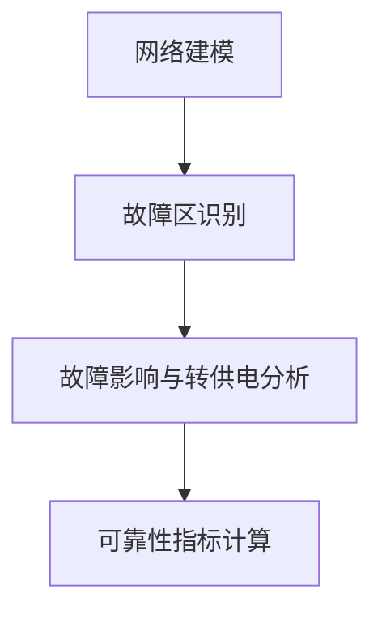
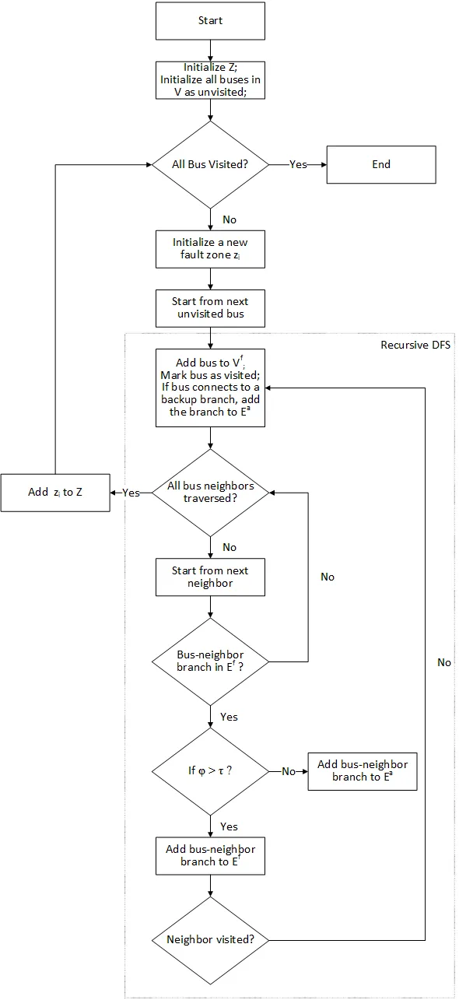
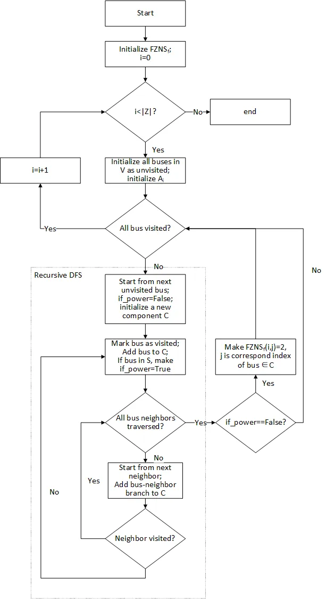

本节主要介绍 DSLab 平台供电可靠性计算的基本原理。

## 功能定义

DSLab 平台提供基于解析法的供电可靠性计算功能。

## 功能说明

基于解析法的可靠性指标计算的基本原理为建立故障影响范围及后果，确定各设备故障导致的负荷停电范围及时间，从而评估系统保持安全稳定供电的能力。

## 静态可靠性算法简介

对于复杂配电系统，需要结合系统拓扑、供电路径、连锁故障及转供电进行综合分析。平台采用一种改进的 Failure Mode and Effect Analysis (FMEA) 电网可靠性评估方法，可对含多电源、联络开关的含环复杂电网进行可靠性评估。

### 原理概述
该方法遵循四阶段工作流程，如下图所示。在网络建模中，电网被抽象为图，设备表示为顶点和边。然后，使用改进的 deep-first search (DFS)算法将整个网络划分为多个故障区。故障区内任何设备发生故障都会触发该区域内其他所有设备的故障，且故障被隔离不会向外扩散。在每个故障区场景下，顶点被分为三类：供电正常、可恢复和故障。最后，计算负荷和整个系统的可靠性指标。

### 网络建模
电网被表示为加权图 $G = (V, E, B)$，其中 $V$ 表示顶点/母线（如电源、负荷），$E$ 表示边/支路（如输电线路、变压器和保护装置），$B$ 表示备用支路/断开的联络开关。值得注意的是，与传统方法将保护装置视为支路的属性不同，该方法将保护装置明确建模为独立支路，以支持在拓扑搭建阶段灵活配置保护装置。

电网拓扑初始邻接链表 $A_{\text{initial}}$ 由下式生成。

$$
A_{initial}[u]=\{ (\boldsymbol{v},\varphi) \mid \exists e \in E\text{ connecting }u\text{ to }\boldsymbol{v} \}
$$

其中，$v$表示相邻顶点，边权重$\varphi$表示支路类型，分类如下：

$$
\varphi \in \begin{cases} 
1 & \text{断路器} \\
2 & \text{熔断器} \\
3 & \text{开关} \\
4 & \text{输电线路} \\
5 & \text{变压器} 
\end{cases}
$$

保护支路类型上限 $\tau$ 是断路器、熔断器和开关的最大值（此处 $\tau=3$）。此外，网络电源集 $S$、负荷集 $L$、输电线路集 $T$ 由下式定义。

$$
S = \left\{ v \in V \mid v \text{ 是电源} \right\}
$$

$$
L = \left\{ v \in V \mid v \text{ 是负荷} \right\}
$$

$$
T = \left\{ e \in E \mid e \text{ 是输电线路} \right\}
$$

### 故障区识别
故障区 $z_i$ 包含故障母线 $V_i^f$、故障支路$E_i^f$和受影响支路$E_i^a$，如下式所示。$E_i^a$包含受影响的备用支路和动作的保护支路，这些支路功能受损，无法参与故障后的供电恢复。

$$
z_i = \left( V_i^f, E_i^f, E_i^a \right)
$$

电网的故障区集$Z$通过改进的深度优先搜索算法（称为故障区识别（FZI）算法）得到，如下式所示。

$$
Z = \left\{ z_1, z_2, \dots, z_n \right\}
$$

FZI 将复杂电网划分为由保护边界界定的故障区（算法流程图如下图所示）。算法从任意未访问节点开始，遍历邻接链表$A$。其核心机制是区分保护支路（$\varphi \leq \tau$）和其他支路（$\varphi > \tau$）：当遇到保护支路时，故障传播立即终止，该支路被记录在受影响支路集中；而对于输电线路，遍历继续递归到相邻节点。

该方法的时间复杂度为 $O(|V| + |E|)$，能高效支持辐射形、环形和网状拓扑。

### 故障影响与节点状态分析
对于每个故障区$z_i$，首先将初始邻接链表$A_{\text{initial}}$更新为$A_i^f$，以反映故障后的网络拓扑。然后，在$A_i^f$上应用改进的DFS算法识别连通分量（子网络），同时跟踪每个分量中电源的存在情况，以评估节点的初始供电状态。对所有$z_i$重复此过程，得到故障区-节点状态矩阵（$FZNS_f$），其中元素$FZNS_f(i,j)$表示第$i$个故障场景下节点$j$的状态。

为考虑通过备用资源进行的恢复，通过整合备用支路$B$将$A_i^f$进一步更新为$A_i^b$。在$A_i^b$上重复上述分析，重新评估节点供电状态，生成备用增强状态矩阵$FZNS_b$。

基于$FZNS_f$和$FZNS_b$的交叉参考，节点可分为三个互斥类别：

- 供电正常（0）：故障隔离后仍与至少一个电源保持连接的节点。
- 可恢复（1）：初始与电源断开但可通过备用资源恢复的节点。
- 故障（2）：直接受故障影响、需要修复才能恢复的节点。

然后形成最终的故障区-节点状态矩阵$FZNS_{\text{final}}$，以反映所有故障场景下的节点状态。

#### 故障影响分析
故障影响分析通过识别连通分量及其中电源的存在情况，评估节点故障后的即时供电状态。该过程采用改进的DFS算法-节点状态评估（NSE）算法系统地遍历$A_i^f$。

$A_i^f$ 定义如下式所示，通过从$A_{\text{initial}}$中移除$E_i^f$得到。

$$
A_i^f = \left\{ (u, v) \in A_{\text{initial}} \mid (u, v) \notin E_i^f \right\}
$$

$FZNS_f$的初始维度为$|Z| \times |V|$，所有元素均设为0（故障发生前所有节点均供电正常）。

NSE 算法的流程图如下图所示。

#### 恢复分析
恢复分析侧重于评估故障隔离后，通过激活备用支路$B$，初始断开的节点恢复供电的可能性。该过程首先通过下式将$A_i^f$更新为$A_i^b$。

$$
A_i^b = A_i^f \cup \left\{ (u, v) \mid (u, v) \in B \right\}
$$

然后在$A_i^b$上重新执行NSE算法，评估恢复阶段的节点状态，得到$FZNS_b$。

#### 节点状态分析
节点状态分析综合故障影响分析和恢复分析的结果，将每个设备在每个故障场景下划分为三种互斥的运行状态之一。$FZNS_{\text{final}}$由下式求得，量化了系统故障后和恢复后的行为。

$$
FZNS_{\text{final}}(i,j) = \begin{cases} 
0 & \text{若 } FZNS_f(i,j) = 0 \\
1 & \text{若 } FZNS_f(i,j) = 2 \text{ 且 } FZNS_b(i,j) = 0 \\
2 & \text{若 } FZNS_f(i,j) = 2 \text{ 且 } FZNS_b(i,j) = 2 
\end{cases}
$$

### 可靠性指标计算

#### 负荷可靠性指标
负荷可靠性指标量化单个负荷经历供电中断的频率和持续时间。

1. 故障率（$\lambda$）

    设备故障率$\lambda_d$由下式求得。

    $$
    \lambda_d = \sum_{z_i \in Z} \lambda_{z_i} \cdot \delta_{ij}
    $$

    其中，$\delta_{ij}$是节点状态矩阵。$\delta_{ij}$表示设备$j$在故障场景$i$期间是否经历中断；$\lambda_{z_i}$是故障区$z_i$的故障率。$\lambda_{z_i}$等于区域内所有输电线路的故障率$\lambda_j$之和。

    $$
    \lambda_{z_i} = \sum_{\substack{j \in z_i \\ j \in T}} \lambda_j
    $$

    $$
    \delta_{ij} = \begin{cases} 
    1 & \text{若 } FZNS_{\text{final}}(i,j) \neq 0 \\
    0 & \text{否则} 
    \end{cases}
    $$

    负荷故障率$\lambda_l$可通过下式提取：

    $$
    \lambda_l = \left\{ \lambda_d(j) \mid j \in L \right\}
    $$

2. 年不可用率（$U$）

    设备的总年停运持续时间（小时/年）由下式求得。

    $$
    U_d = \sum_{i=1}^k \lambda_{z_i} \cdot T_{ij}
    $$

    其中，持续时间矩阵$T_{ij}$由设备状态决定，如下式所示。

    $$
    T_{ij} = \begin{cases} 
    t_{\text{repair}} & \text{若 } FZNS_{\text{final}}(i,j) = 2 \\
    t_{\text{switch}} & \text{否则} 
    \end{cases}
    $$

    其中，$t_{\text{switch}}$是切换时间（激活保护装置和备用联络开关以隔离故障和恢复供电的时间），$t_{\text{repair}}$是用户设定的相应设备的修复时间。

    负荷年不可用率$U_l$可通过下式提取：

    $$
    U_l = \left\{ U_d(j) \mid j \in L \right\}
    $$

3. 平均修复持续时间（$r$）

    负荷每次中断的平均停运持续时间（小时）由下式求得。

    $$
    r_l = \frac{U_l}{\lambda_l}
    $$

#### 系统可靠性指标
系统可靠性指标汇总负荷级性能指标，以评估电网的整体可靠性，反映其在故障场景下维持所有节点持续供电的能力。传统系统指标（AENS、ASAI、ASUI、CAIDI、ENS、SAIDI、SAIFI）的计算公式如下。

1. 用户年均缺电量（AENS）  
    定义：单位用户平均每年的缺电量（kWh/用户·年）。  
    公式：  
    $$
    \text{AENS} = \frac{\text{ENS}}{\sum N_l} = \frac{\sum \left( U_l \cdot P_l \right)}{\sum N_l}
    $$ 
    - 分母：系统总用户数；  
    - 物理意义：ENS的用户平均化指标。

1. 系统年均供电可用率（ASAI）  
    定义：系统全年实际供电时间与理论总时间的比值（无量纲）。  
    公式：  
    $$
    \text{ASAI} = \frac{\sum \left( T_{\text{total}} - U_l \right) \cdot N_l}{\sum T_{\text{total}} \cdot N_l}
    $$ 
    - $T_{\text{total}}$：全年总小时数（通常取8760小时）；  
    - $U_l$：第$l$个负荷的年不可用率（小时/年）；  
    - 分子：系统中所有用户实际获得的供电时间总和；  
    - 分母：系统中所有用户理论应获得的供电时间总和（$8760 \times$总用户数）。

1. 系统年均供电不可用率（ASUI）  
    定义：系统全年停电时间与理论总时间的比值（无量纲），与ASAI互补。  
    公式：  
    $$
    \text{ASUI} = 1 - \text{ASAI} = \frac{\sum U_l \cdot N_l}{\sum T_{\text{total}} \cdot N_l}
    $$  

1. 系统平均停电持续时间（CAIDI）  
    定义：每次停电事件的平均持续时间（小时/次）。  
    公式：  
    $$
    \text{CAIDI} = \frac{\text{SAIDI}}{\text{SAIFI}} = \frac{\sum U_l \cdot N_l}{\sum \lambda_l \cdot N_l}
    $$ 
    - 物理意义：总停电持续时间与总停电次数的比值，与论文中$r_l = \frac{U_l}{\lambda_l}$（单个负荷的平均修复持续时间）为同类逻辑的系统级扩展。

1. 系统年均期望缺电量（EENS）  
    定义：系统在评估周期内的总缺电量（kWh/年）。  
    公式：  
    $$
    \text{ENS} = \sum \left( U_l \cdot P_l \right)
    $$ 
    - $U_l$：第$l$个负荷的年不可用率（小时/年）；  
    - $P_l$：第$l$个负荷的额定功率（kW）；  
    - 物理意义：所有负荷因停电导致的电量损失总和。

1. 用户年均停电持续时间指标（SAIDI）  
    定义：用户平均每年经历的停电持续时间（小时/用户·年）。  
    公式：  
    $$
    \text{SAIDI} = \frac{\sum U_l \cdot N_l}{\sum N_l}
    $$ 
    - $U_l$：第$l$个负荷的年不可用率（小时/年，对应论文中$U_l$）；  
    - $N_l$：第$l$个负荷的用户数；  
    - 分子：系统中所有用户经历的总停电持续时间；  
    - 分母：系统总用户数。 

1. 用户年均停电频率指标（SAIFI）  
    
    定义：用户平均每年经历的停电次数（次/用户·年）。  
    公式：  
    $$
    \text{SAIFI} = \frac{\sum \lambda_l \cdot N_l}{\sum N_l}
    $$ 
    - $\lambda_l$：第$l$个负荷的故障率（次/年，对应论文中$\lambda_l$）；  
    - $N_l$：第$l$个负荷的用户数；  
    - 分子：系统中所有用户经历的总停电次数；  
    - 分母：系统总用户数。   

## 动态可靠性算法简介

动态可靠性算法会首先调用潮流内核计算用户制定断面各元件的负载率与电压幅值，并基于**数据管理**模块用户录入的（基准）故障率计算各元件实时故障率

  