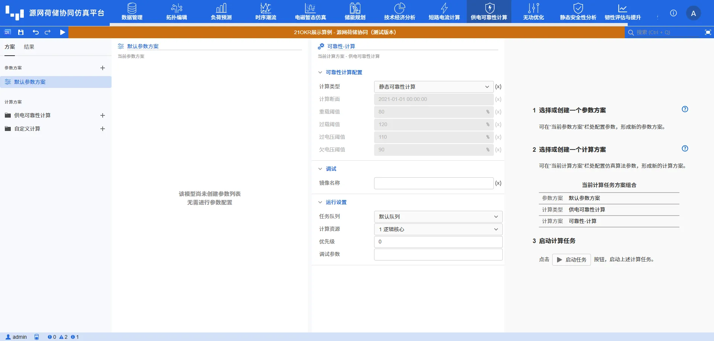
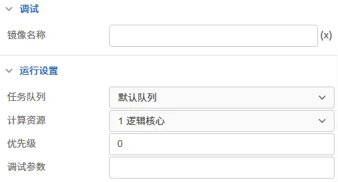

本节主要介绍 DSLab 源网荷储协同仿真平台进行供电可靠性计算时需要设置的计算全局参数，包括可靠性计算断面和相关运行参数设置等。

## 功能定义

设置 DSLab 静态与动态供电可靠性计算的参数。

## 功能说明

在运行标签页，选中计算方案中的**供电可靠性计算方案**，可对供电可靠性计算方案进行设置。目前供电可靠性计算参数组分为可靠性计算配置和运行设置，下面分别对其进行介绍。

### 可靠性计算配置

**计算类型**默认为静态可靠性计算。当用户选择动态可靠性计算时，可对计算断面、负载率与电压相关阈值进行配置，算法会首先调用潮流内核计算断面各元件负载率与电压幅值，并基于**数据管理**模块用户录入的（基准）故障率计算实时故障率，然后调用静态可靠性算法进行可靠性评估。可靠性计算配置参数具体如下所示：

| 参数名 | 含义 | 说明 |
| :--- | :--- | :--- | 
| 计算类型 | 计算类型 | 可选项为 **静态可靠性计算**（默认值）和**动态可靠性计算** |
| 计算断面 | （动态可靠性）计算断面 | 默认设置为 **2021-01-01 00:00:00** ，输入格式为 `yyyy-mm-dd hh:mm:ss` |
| 重载阈值 | （动态可靠性计算）重载阈值 | 默认设置为 **80%**  |
| 过载阈值 | （动态可靠性计算）过载阈值 | 默认设置为 **120%**  |
| 过电压阈值 | （动态可靠性计算）过电压阈值 | 默认设置为 **110%**  |
| 欠电压阈值 | （动态可靠性计算）欠电压阈值 | 默认设置为 **90%**  |

### 运行设置

供电可靠性计算运行设置的参数包括**调试**与**运行设置**类，如下图所示：

| 参数名 | 含义 | 说明 |
| :--- | :--- | :--- | 
| 镜像名称 | 调试使用的镜像名称 | 默认设置为**空** |
| 任务队列 | 任务运行使用的队列 | 默认设置为**默认队列** |
| 计算资源 | 任务运行使用的计算资源 | 默认设置为**1逻辑核心** |
| 优先级 | 任务运行的优先级 | 默认值为 0 |
| 调试参数 | 任务调试时使用的调试参数 | 默认为空 |

<!-- ## 常见问题 -->

