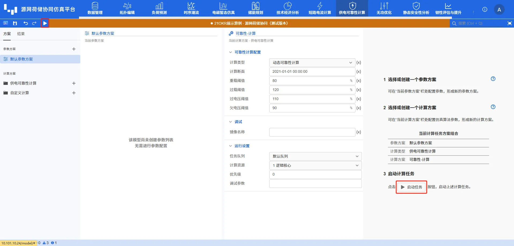

本节主要介绍 DSLab 源网荷储协同仿真平台进行供电可靠性计算计算时查看计算结果的方法。

## 功能定义

用于展示 DSLab 仿真计算的结果。

## 功能说明

### 启动仿真

通过点击**启动任务**按钮能执行当前计算方案下的供电可靠性计算。

### 结果概览

在计算完成后，结果页面的**结果概览**选项卡下会显示系统和负荷供电可靠性统计信息。用户在结果展示区左侧选择需要查看的供电可靠性指标，如下图所示。

此外，结果概览页面还用于展示一些日志信息，如上图中“计算任务已生成，耗时:0.042S”等信息。当用户设置的参数有误时，会在此页面出现一些警告或者报错日志。

## 常见问题

运行时间过长？
:   源网荷储系统规模、可靠性计算断面的选择都会影响计算耗时。用户可实时关注**结果**页面，查看程序进度，以及是否存在报错。

