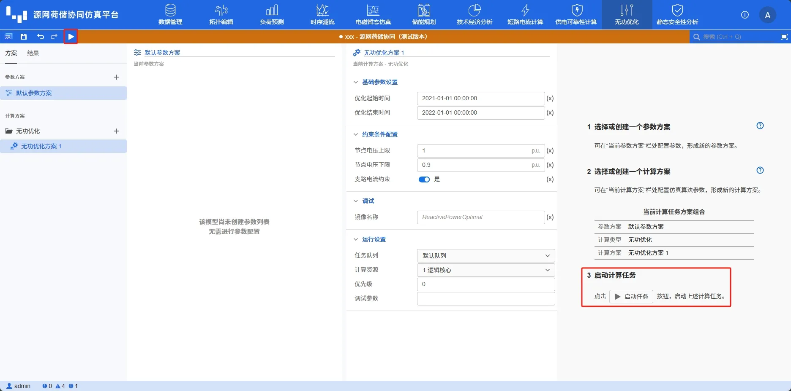

本节主要介绍 DSLab 源网荷储协同仿真平台进行无功优化计算时查看计算结果的方法，包括短路电流简表、元件时序运行结果等。

## 功能定义

用于展示 DSLab 仿真计算的结果。

## 功能说明

### 启动仿真

通过点击**启动任务**按钮能执行当前计算方案下的无功优化。

### 结果概览

在计算完成后，结果页面的**结果概览**选项卡下会显示**结果列表**和**节点电压统计表**，如下图所示。其中，**结果列表**展示各类无功调节装置列表与策略；节点电压统计表则展示各个断面节点电压的统计信息。

此外，结果概览页面还用于展示一些日志信息。当用户设置的参数有误时，也会在此页面出现一些警告或者报错日志。

### 时序结果
在计算过程中以及完成后，结果页面的时序结果选项卡下会显示当前系统拓扑，用户可以通过点击目标元件，在下方的图标栏中查看该元件不同运行参数的时序曲线。对于部分元件的计算结果，时序曲线会根据结果类型进行分组，用户可以通过切换选项卡查看不同分组下的数据曲线。

## 常见问题

