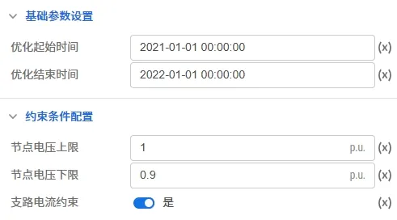

本节主要介绍 DSLab 源网荷储协同仿真平台进行无功优化时需要设置的计算全局参数，包括优化起止时间、节点电压上下限、是否约束支路电流以及相关运行参数设置等。

## 功能定义

设置 DSLab 无功优化的一些计算全局参数。

## 功能说明

在运行标签页，选中计算方案中的**无功优化方案**，可对无功优化方案进行设置。目前源网荷储的无功优化参数组可划分为计算参数和运行设置，下面分别对其进行介绍。

### 计算参数

无功优化的计算参数包括**短路计算设置**和**仿真时间设置**类，如下图所示：

| 参数名 | 含义 | 说明 |
| :--- | :--- | :--- | 
| 优化起始时间 | 无功优化起始时间 | 默认设置为 **2021-01-01 00:00:00** ，输入格式为 `yyyy-mm-dd hh:mm:ss` |
| 优化结束时间 | 无功优化结束时间 | 默认设置为 **2022-01-01 00:00:00** ，输入格式为 `yyyy-mm-dd hh:mm:ss` |
| 节点电压上限 | 节点电压上限 | 默认设置为 **1**，单位为**p.u.** |
| 节点电压下限 | 节点电压下限 | 默认设置为 **0.9**，单位为**p.u.** |
| 支路电流约束 | 是否约束支路电流 | 可选项**是**（默认选项）和**否**|

### 运行设置

无功优化运行设置的参数包括**调试**和**运行设置**类，如下图所示：

| 参数名 | 含义 | 说明 |
| :--- | :--- | :--- | 
| 镜像名称 | 调试使用的镜像名称 | 默认设置为空 |
| 任务队列 | 任务运行使用的队列 | 默认设置为**默认队列** |
| 计算资源 | 任务运行使用的计算资源 | 默认设置为**1逻辑核心** |
| 优先级 | 任务运行的优先级 | 默认值为 0 |
| 调试参数 | 任务调试时使用的调试参数 | 默认为空 |

<!-- ## 常见问题 -->
