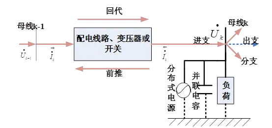
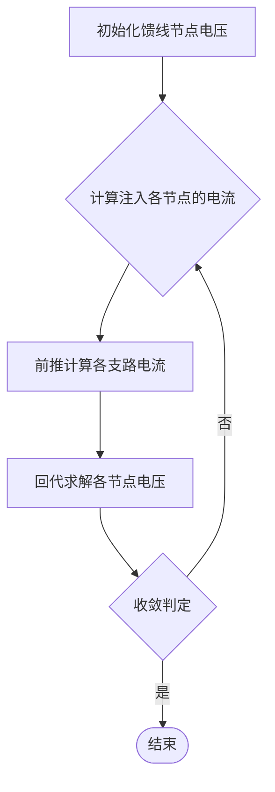

本节主要介绍 DSLab 平台综合能源系统静态安全分析的基本原理。

## 功能定义

在 DSLab 源网荷储协同仿真平台中，静态安全分析模块，对配电网发生预想事故后的稳态运行情况进行分析，包括预想事故仿真模拟和安全性评估指标计算。对将引发设备过载、电压越限、失负荷等威胁网络安全运行的预想事故进行仿真模拟，根据预想事故后系统的稳态运行情况计算安全性评估指标，找出系统运行的薄弱环节。

## 功能说明

### 基本概念

电力系统静态稳定是指系统在受到外部干扰后，仍能够保持稳定运行的能力，防止出现失稳的情况。该方法的计算的目的是根据电力系统的结构和运行条件，利用相应的算法和工具，确定系统的稳定性状况、判断发电机是否跳闸或负荷是否丢失等问题，并给出改进稳定性的措施和建议。同时还可以检验输电线的输送功率极限，以保证电力系统在给定的负荷和运行方式下具有足够的稳定储备，防止发生电力系统失稳事故。

N-1 校验是静态安全分析的一种常用方法，通过断开电力系统中一个元件后，分析系统在这种情况下的安全性和稳定性。

### N-1 校验

为了保证 N-1 静态安全分析的时效性，DSLab 平台提供了前推回代法进行每一次的N-1潮流计算及校验。

对于复杂配电系统，需要结合系统拓扑、供电路径及矩阵运算进行综合分析。前推回代法潮流计算算法主要包括以下三个步骤：
- 步骤1：回代过程求电压向量

   由母线 $k$ 的三相电压向量 $\dot{U}_k$ 和进支电流的三相电流向量 $\dot{I}_k'$，求母线 $k-1$ 的三相电压向量 $\dot{U}_{k-1}$ 和出支电流的三相电流向量 $\dot{I}_k$。

- 步骤2：前推过程求电流向量

   根据母线 $k-1$ 的三相电压向量 和出支电流的三相电流向量 $\dot{I}_k$，求母线 $k$ 的三相电压向量 $\dot{U}_k$ 和进支电流的三相电流向量 $\dot{I}_k'$。

- 步骤3：判定

   重复步骤1和2，当各条母线的三相电压的幅值和相角与上一次迭代的数值偏差小于设定的容许值时，迭代停止。

具体求解过程如下：

1. 计算各节点的注入电流

   由母线 的三相电压向量计算接在该母线上的负荷、并联电容和分布式电源等的注入电流。

   $$
   \begin{bmatrix}
   \dot{I}_{ja} \\
   \dot{I}_{jb} \\
   \dot{I}_{jc}
   \end{bmatrix}
   =
   \begin{bmatrix}
   \left(\frac{\tilde{S}_{ja}}{\dot{U}_{ja}^{k-1}}\right)^{*} \\
   \left(\frac{\tilde{S}_{jb}}{\dot{U}_{jb}^{k-1}}\right)^{*} \\
   \left(\frac{\tilde{S}_{jb}}{\dot{U}_{jc}^{k-1}}\right)^{*} \\
   \left(\frac{\tilde{S}_{jc}}{\dot{U}_{jc}^{k-1}}\right)^{*}
   \end{bmatrix}
   +
   \begin{bmatrix}
   Y_{ja} \\
   & Y_{jb} \\
   & & Y_{jc}
   \end{bmatrix}
   \begin{bmatrix}
   \dot{U}_{ja} \\
   \dot{U}_{jb} \\
   \dot{U}_{jc}
   \end{bmatrix}^{k-1}
   $$

   式中，$k$ 是迭代次数；$\dot{I}_{ja}, \dot{I}_{jb}, \dot{I}_{jc}$ 是节点 $j$ 上的注入电流，$\tilde{S}_{ja}, \tilde{S}_{jb}, \tilde{S}_{jc}$ 是节点 $j$ 的已知的注入功率；$\dot{U}_{ja}, \dot{U}_{jb}, \dot{U}_{jc}$ 是节点 $j$ 的电压向量；$Y_{ja}, Y_{jb}, Y_{jc}$ 为与节点 $j$ 并联的元件的导纳。

2. 前推计算各支路电流

   从系统末节点开始，逐次向根节点进行推进，求得各支路电流。

   $$
   \begin{bmatrix}
   \dot{I}_{la} \\
   \dot{I}_{lb} \\
   \dot{I}_{lc}
   \end{bmatrix}
   =
   \begin{bmatrix}
   \dot{I}_{ja} \\
   \dot{I}_{jb} \\
   \dot{I}_{jc}
   \end{bmatrix}^k
   +
   \Sigma_{l^{\prime}\in M}
   \begin{bmatrix}
   \dot{I}_{l'a} \\
   \dot{I}_{l'b} \\
   \dot{I}_{l'c}
   \end{bmatrix}^k
   $$

   式中 $\dot{I}_{la}, \dot{I}_{lb}, \dot{I}_{lc}$ 是支路 $l$ 的电流；$M$ 是所有跟节点 $j$ 相连的下层支路的集合。

   当遇到含变压器（$\Delta-Y$）的支路时，可以根据下式求出变压器高压侧的三相电流：

   $$
   [I_{ABC}] = [C_t][VLG_{abc}] + [d_t][I_{abc}]
   $$

   其中 $[I_{ABC}]$ 是高压侧三相电流，$[C_t], [d_t]$ 是不同类型的变压器参数，$[VLG_{abc}]$ 是变压器低压侧的三相相电压，$[I_{abc}]$ 是变压器低压侧三相相电流。

3. 回代求解各节点电压

   从系统根节点出发，逐节点向末节点推进求解。节点 $n$ 的电压为：

   $$
   \begin{bmatrix}
   \dot{U}_{na} \\
   \dot{U}_{nb} \\
   \dot{U}_{nc}
   \end{bmatrix}
   =
   \begin{bmatrix}
   \dot{U}_{ma} \\
   \dot{U}_{mb} \\
   \dot{U}_{mc}
   \end{bmatrix}^k
   -
   \begin{bmatrix}
   z_{aa} & z_{ab} & z_{ac} \\
   z_{ba} & z_{bb} & z_{bc} \\
   z_{ca} & z_{cb} & z_{cc}
   \end{bmatrix}
   \begin{bmatrix}
   \dot{I}_{la} \\
   \dot{I}_{lb} \\
   \dot{I}_{lc}
   \end{bmatrix}^k
   \quad \text{6-7.}
   $$

   在回代求解节点电压的时候遇到含变压器的支路，利用式 $6-8$ 求出变压器低压侧三相电压。

   $$
   [VLG_{ABC}] = [A_t][VLN_{abc}] + [B_t][I_{abc}]
   $$

   式中 $[VLG_{ABC}]$ 是变压器低压侧三相相电压，$[VLN_{abc}]$ 变压器高压侧三相相电压，$[A_t], [B_t]$ 是变压器固有参数。

4. 收敛判定

   计算各个节点上 ABC 三相相电压不平衡量，并以此作为潮流计算是否收敛的判据：

   $$
   \Delta U_{ja}^{(k)} = |U_{ja}^{(k)} - U_{ja}^{(k-1)}|
   $$

   $$
   \Delta U_{jb}^{(k)} = |U_{jb}^{(k)} - U_{jb}^{(k-1)}|
   $$

   $$
   \Delta U_{jc}^{(k)} = |U_{jc}^{(k)} - U_{jc}^{(k-1)}|
   $$

   如果各节点电压的偏差都满足收敛判据的要求，则迭代结束，否则继续迭代下去直至达到收敛要求。

辐射状配电网前推回代算法的流程图如下图所示：

