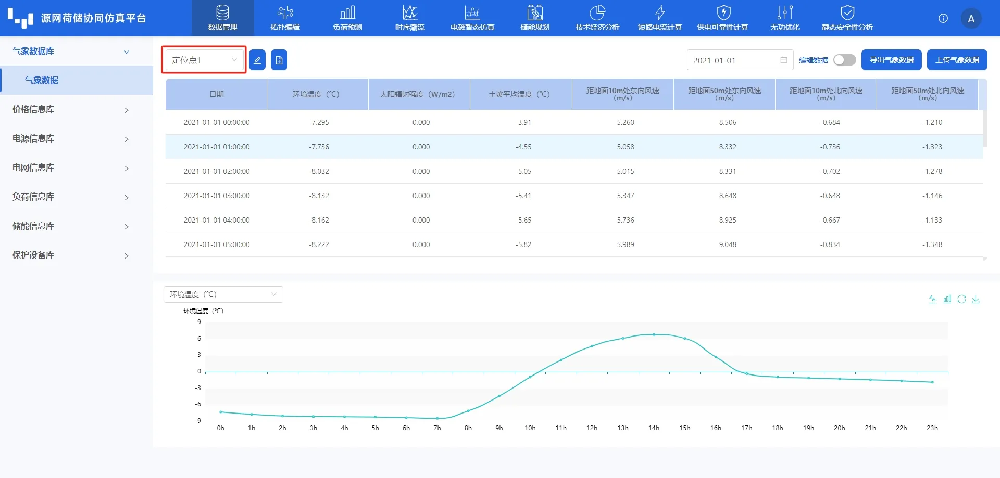
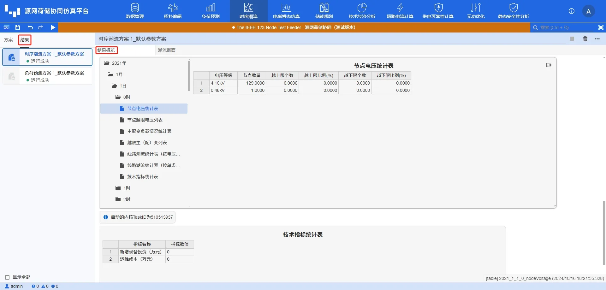
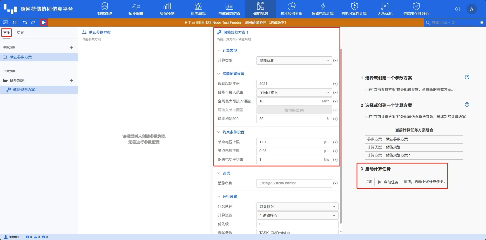
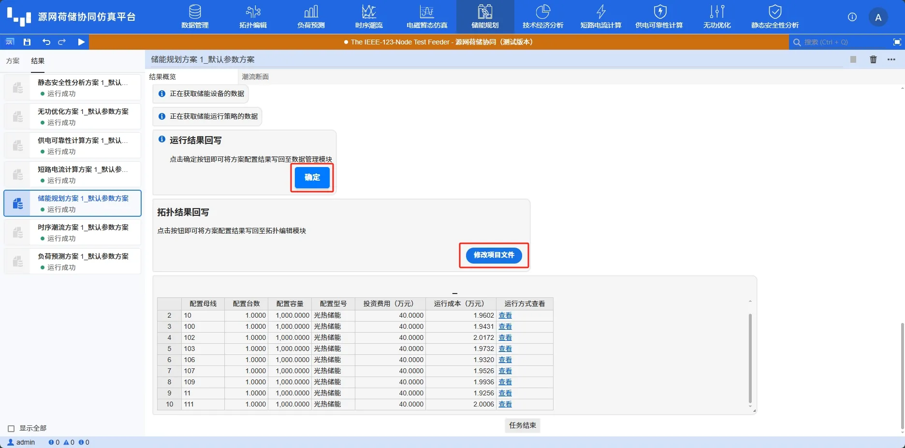
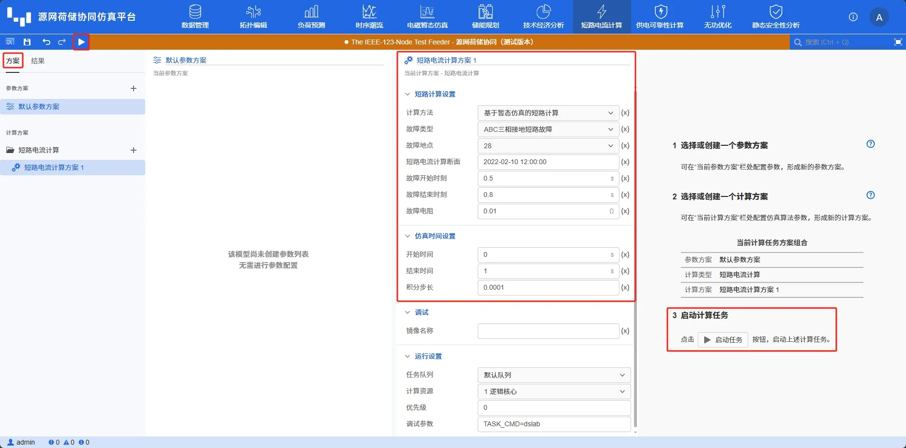
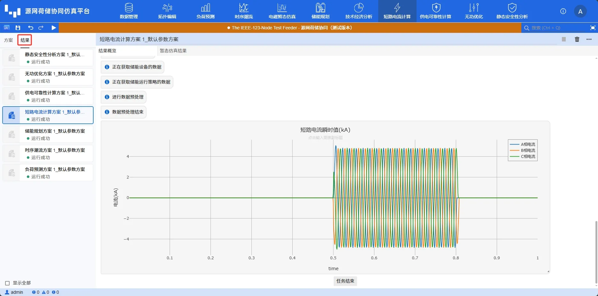
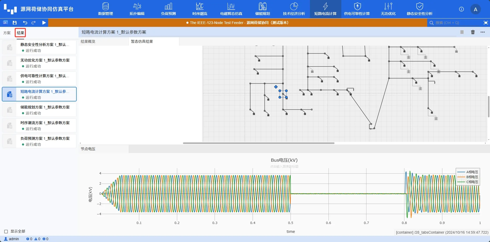
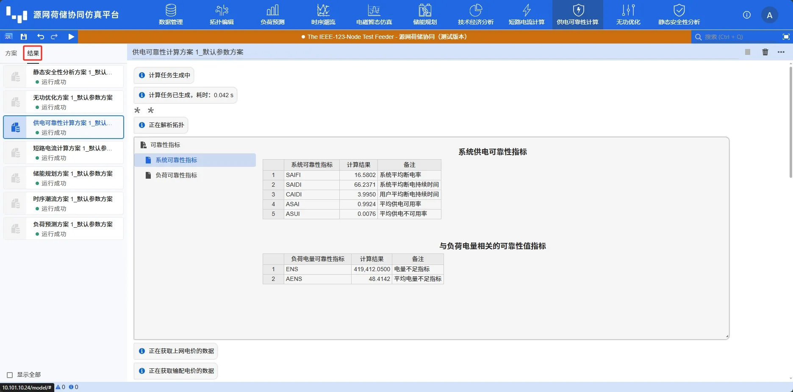

本节以**IEEE 123节点系统**为例，介绍 DSLab 源网荷储协同仿真平台的主要使用流程。

## 平台使用步骤

建议您按照以下步骤使用 CloudPSS DSLab 源网荷储协同仿真平台：

 1.	注册并登录 CloudPSS 平台，进入 DSLab 源网荷储协同仿真平台
 2.	建立项目并打开
 3.	数据管理模块：在气象数据库、价格信息库、电源信息库、电网信息库、负荷信息库、储能信息库和保护设备库录入项目基础信息
 4.	拓扑编辑模块：将元件拖拽并连接，搭建源网荷储系统拓扑，并设置仿真参数等边界条件
 5.	负荷预测模块：配置预测开始和结束时间，选择预测模式与算法，运行预测任务，查看预测结果
 6.	时序潮流模块：配置计算方案，运行时序潮流计算，查看仿真周期内元件时序曲线结果、系统每个潮流断面的结果以及各时序断面统计数据
 7. 储能规划模块：配置规划方案，运行储能规划，查看储能接入位置、设备选型等规划结果
 8. 短路计算模块：配置短路计算方案，运行计算任务，计算不同故障场景下短路点电流及节点电压、故障前后整个时间断面系统运行状态和系统最大冲击电流
 9. 供电可靠性计算模块：设置可靠性计算断面，计算系统供电可靠性指标、与负荷电量相关可靠性指标和负荷点可靠性指标
 10. 无功优化模块：设置电压电流约束条件，对系统无功进行优化，查看无功补偿调节、电源机端电压调节、变压器变比调节等优化结果以及相关统计数据

## 新建与打开

### 新建项目组

点击**新建项目组**，输入项目组名称及描述，**是否从已有项目组导入**选择**否**，创建一个空白项目组。

### 创建新项目

点击项目组右侧的**操作**，选择**新建项目**。

在弹出的**新建项目**对话框中，输入项目名称、描述和项目起始年限等。

### 打开项目

通过点击项目所在行打开项目，此外也可以通过点击文件夹按钮或点击**更多**打开项目

## 数据管理模块

打开项目后，首先进入数据管理模块，可在该模块输入项目资料和相关参数信息。

### 气象数据

模板算例已经预置项目地点及该地点的历史气象数据，如果需要修改可以通过选择项目地、输入GPS 经纬度坐标，点击**确认**获取历史气象数据。亦或通过**在线地图服务**（第三方地图组件）进行城市搜索、地图选点定位等方式选择项目地点，然后点击**载入气象数据**按钮获取历史气象数据。关于历史气象数据的查看和二次编辑可以参考 [气象数据库](../50-data-module/10-meteorological-database/index.md)。

**新增并加载气象数据**-**在线地图服务**-**新增定位点**， 开启**定位**，通过地图选点后，点击**保存**后，再点击**载入气象数据**

### 价格信息库

价格信息库可配置上网电价、输配电价和销售电价的信息，用户可以根据需要自行添加价格参数。关于能源信息库的编辑方法可以参考 [价格信息库](../50-data-module/20-price-info-database/index.md)。

### 电源信息库

模板算例已经预置了光伏设备及参数信息，用户也可以根据需要自行添加新的电源设备。关于电源信息库的编辑方法可以参考 [电源信息库](../50-data-module/30-powersource-database/index.md)。

### 电网信息库

模板算例已经预置了传输线、变压器、开关、无功补偿设备和参数信息，以及无功补偿设备的无功运行策略。用户也可以根据需要自行添加新的电网设备。关于电网信息库的编辑方法可以参考 [电网信息库](../50-data-module/40-grid-database/index.md)。

### 负荷信息库

模板算例已经预置了电负荷信息，用户也可以根据需要自行添加新的电负荷。关于负荷信息库的编辑方法可以参考 [负荷信息库](../50-data-module/50-load-database/index.md)。

## 拓扑编辑模块

在顶部导航栏中，切换到**拓扑编辑**模块，本模板算例已经在工作区中搭建了系统拓扑模型并设置好了相关元件参数。用户可以根据需要对拓扑模型或者参数进行修改，相关编辑方法可以参考 [拓扑搭建](../60-topology-module/20-topology-modeling-workflow/10-building-topology/index.md) 与 [参数设置](../60-topology-module/20-topology-modeling-workflow/20-setting-params/index.md)。

## 负荷预测模块

在完成拓扑构建和参数编辑后，切换到**负荷预测**模块，在**方案**页面设定负荷预测方案的参数，并点击**启动任务**启动计算。

计算开始后，平台自动跳转到**结果**栏页面，可查看计算过程及预测结果。在结果展示处左侧选择不同级别，可查看变电站级、馈线级、用户级各负荷预测结果。

## 时序潮流模块

切换到**时序潮流**模块，在**方案**页面设定计算方案的参数，并点击**启动任务**启动计算。

计算开始后，平台自动跳转到**结果**栏页面，可在**结果概览**页面查看计算过程及相关统计指标

在**时序结果**页面，选择断面与设备，检查分析计算结果。

## 储能规划模块

切换到**储能规划**模块，在**方案**页面设定计算方案的参数，并点击**启动任务**启动计算。

计算开始后，平台自动跳转到**结果**栏页面，可在**结果概览**页面查看计算过程及规划结果。用户可选择是否将方案配置结果写回至数据管理模块或拓扑编辑模块。

若需在**潮流断面**页面查看分析规划结果，则需先在**结果概览**页面点击**修改项目文件**，将规划结果暂存到拓扑中。若不想保存应用的规划结果，只是临时查看，查看完后刷新浏览器页面；若要规划结果会写回拓扑编辑模块，则点击保存按钮。

## 短路电流计算模块

切换到**短路电流计算**模块，在**方案**页面设定计算方案的参数，并点击**启动任务**启动计算。

计算开始后，平台自动跳转到**结果**栏页面，可在**结果概览**页面查看计算过程及相关统计指标

在**暂态仿真结果**页面，选择设备，检查分析计算结果。

## 供电可靠性计算模块

切换到**供电可靠性计算**模块，在**方案**页面设定负荷预测方案的参数，并点击**启动任务**启动计算。

计算开始后，平台自动跳转到**结果**栏页面，可查看计算过程及计算结果。

## 无功优化模块

切换到**无功优化**模块，在**方案**页面设定计算方案的参数，并点击**启动任务**启动计算。

计算开始后，平台自动跳转到**结果**栏页面，可在**结果概览**页面查看计算过程及优化结果。

在**时序结果**页面，选择断面和设备，检查分析计算结果。

## 静态安全性分析模块

切换到**静态安全性分析**模块，在**方案**页面设定计算方案的参数，并点击**启动任务**启动计算。

计算开始后，平台自动跳转到**结果**栏页面，可在**结果概览**页面查看计算过程及分析结果。

在**潮流断面**页面，查看静态安全分析各作业详细结果。

## 项目文件下载

点击下载项目 zip 文件：[IEEE 123节点系统.](../30-quick-start/IEEE123.zip)  

项目 zip 文件可以通过**云空间**的项目**导入与导出**功能进行上传，可参考 [云空间 - 导入与导出](../40-cloud-space/index.md#导入与导出)