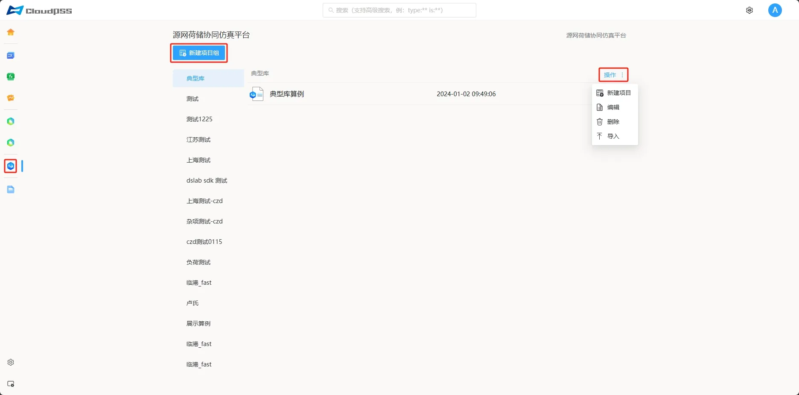
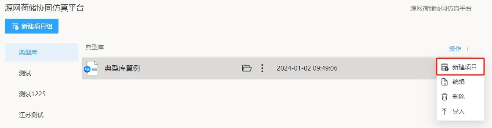
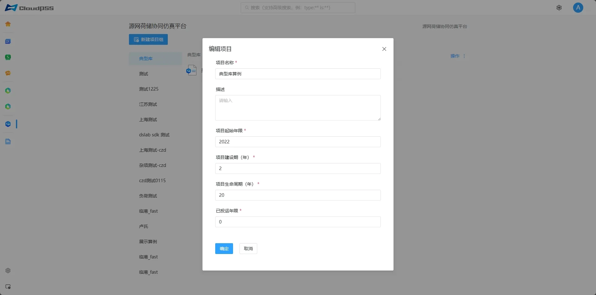
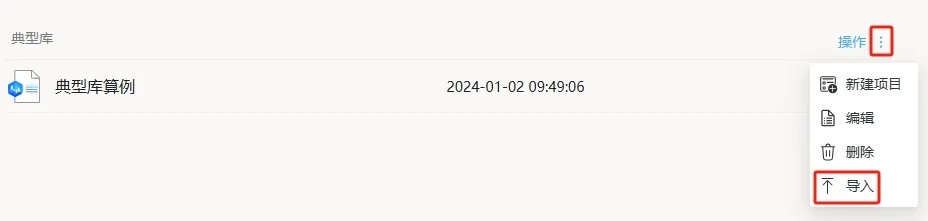
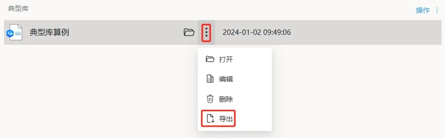

本节主要介绍 DSLab 源网荷储协同仿真平台云空间的**项目组织方式**，**新建和打开项目**的方法。

## 功能定义

在 DSLab 源网荷储协同仿真平台云空间可以新建、管理**项目组与项目**，并打开项目。  
DSLab 平台采用**项目组与项目**的组织方式，类似文件夹与文件，项目为一个源网荷储系统案例，包含该项目的数据信息、拓扑架构和运行方式。  

## 功能说明

用户成功登录后，在 CloudPSS 云空间点击 **DSLab 源网荷储协同** 的图标后，页面跳转至 
 **DSLab 源网荷储协同仿真平台**，该界面包含新建项目（组）和项目管理等。

### 新建项目组

点击**新建项目组**，输入项目组名称及描述，**是否从已有项目组导入**选择**否**，创建一个空白项目组。

### 项目组管理

点击项目组右侧的**操作**，可以进行**新建项目**、**编辑**项目组、**删除**项目组、**导入**项目项目压缩包 zip 文件 等操作。

### 创建新项目

点击项目组右侧的**操作**，选择**新建项目**。

在弹出的**新建项目**对话框中，输入项目名称及描述，**是否从模板创建新项目**选择**是**，选择一个模板并确定；选择**否**，将创建一个空白项目。

### 项目管理

点击项目所在行的**竖点号**，可以对项目进行管理，如**打开**、**编辑**项目、**导出**为本地压缩包 zip 文件、**删除**项目。

点击**编辑**，可对项目信息进行编辑。

### 打开项目

点击项目所在行，或点击文件夹按钮打开；或点击**更多**打开项目

### 导入与导出

为方便项目的**跨平台移植拷贝**，平台支持将项目**导出到本地**和从**本地文件导入**功能：点击项目项目的点号可以将项目导出为本地文件，点击项目组右侧的“操作”或点号可以将本地文件导入到平台。

由于项目压缩 zip 文件包含近 5 年的气象数据，文件较大，因此导入和导出时加载较慢，请您耐心等待。

## 常见问题

无法新建、编辑和保存怎么办？  
:   当您遇到无法新建、编辑和保存时，可以尝试：刷新页面；退出账号重新登录；检查网络连接情况。

导出的项目文件需要解压吗？  
:   导出的项目文件不需要解压，直接导入 zip 文件即可。

导入为什么失败？  
:   导入失败的原因有很多，以下是一些原因和解决办法： 1. 项目文件已损坏；2. 因平台更新迭代，可能存在项目与平台版本不一致等不兼容现象，您可以联系 CloudPSS 官方技术人员寻求支持。