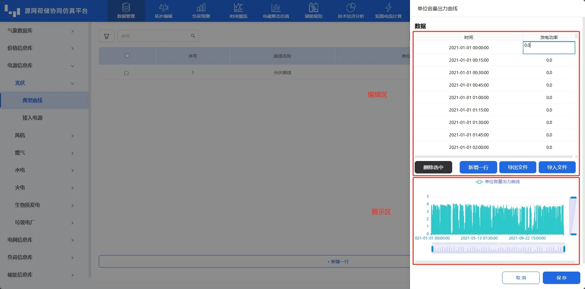
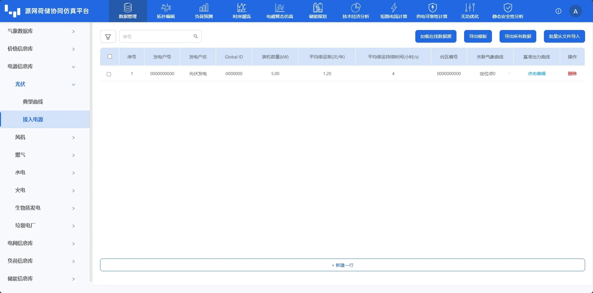

本节主要介绍电源信息库的设备参数录入、编辑、导入及导出等功能使用方法，并对使用过程中遇到的常见问题进行解答。

## 功能定义

电源信息库主要用于录入目标源网荷储系统中所使用的不同型号设备的额定参数（比如装机容量、停运信息、出力曲线等，运行边界条件不包括在内），并进行分类管理。这些参数将用于后续拓扑建模时与元件的**设备待选类型**参数进行绑定，同一型号的设备参数可以绑定至多个元件的对应参数上，从而实现设备额定参数数据的复用，简化用户输入。

## 功能说明

电源信息库包含光伏、风机、燃气、水电、火电、生物质发电、垃圾电厂七类电源设备。每类电源主要由**典型曲线**与**接入电源**两个子模块组成。典型曲线用于用户构建设备（单位容量）的出力曲线，可在**接入电源**-**基准出力曲线**中，**出力曲线生成方式**选择**典型曲线**，进行关联使用，以方便用户快速构建多个设备模型，如下图所示。

此模块的界面布局与基本功能与 [价格信息库](../20-price-info-database/index.md) 类似，此处不再赘述。主要区别在于此模块的**加载在线数据源**按钮可从不同数据系统加载相关数据。接下来，以光伏为例，对**典型曲线**和**接入电源**子模块的信息录入进行介绍。

### 典型曲线

在典型曲线子模块，点击下方**新建一行**新增默认典型曲线。

在**单位容量出力曲线**列，点击**点击编辑**在弹窗的编辑区和展示区编辑和查看单位容量出力曲线。弹窗默认展示步长为15min的一年出力曲线。

用户可通过导入模板和直接编辑两种方式更新数据。导入模板通过先**导出文件**（导出模板）再**导入文件**方式更新数据。直接编辑可通过**删除选中**和**新增一行**增减数据；采用类似编辑 excel 表格的形式编辑目标数据，编辑后平台回自动校验用户编辑的**数据合法性**，数据格式不对时会提示**验证错误，请检查格式!**。用户在编辑完数据后，单击空白区域，平台会自动保存编辑数据。

用户将鼠标悬浮在展示区曲线图中，可查看曲线单点数据。通过鼠标滚轮或拉动右侧和下方的缩放条，可对展示曲线进行缩放，以查看特定时间特定值区间的曲线细节。

### 接入电源

在接入电源子模块。点击下方**新建一行**新增默认电源模型。用户可采用类似编辑 excel 表格的形式编辑目标数据。其中，**Global ID** 和**台区编号**主要同 [电网信息库-地理接线图上传](../40-grid-database/index.md) 一起实现自动建模功能。此外，**关联气象曲线**允许用户对每个设备分别关联气象数据库中建立的定位点气象数据。

在**基础出力曲线**列，点击**点击编辑**，可选择典型曲线（见[功能定义](#功能定义)）和自定义两种方式。基础出力曲线的编辑与 [典型曲线](#典型曲线)中的单位容量出力曲线编辑方式类似。

## 案例

import Tabs from '@theme/Tabs';
import TabItem from '@theme/TabItem';

<Tabs>
<TabItem value="js" label="光伏">

以使用典型曲线建立**光伏**为例，说明电源信息库的用法。

1. 在**典型曲线**子模块，点击下方**新建一行**新增默认典型曲线。

2. 在接入电源子模块。点击下方**新建一行**新增默认电源模型。在**基础出力曲线**列，点击**点击编辑**，可并在弹窗的**出力曲线生成方式**选择**典型曲线**，在**典型曲线选择**右侧下拉框选择建立名为光伏曲线项。确认参数并保存。

</TabItem>

<TabItem value="c" label="风机">

以自定义出力曲线方式建立**风机**为例，说明电源信息库的用法。

在接入电源子模块中

1. 点击“新建一行”，创建新的风机。

2. 在**基础出力曲线**列，点击**点击编辑**，可并在弹窗的**出力曲线生成方式**选择**自定义**。

3. 确认参数并保存

</TabItem>
</Tabs>

## 项目文件下载

点击下载项目 zip 文件：[光伏-接入电源文件](./PV.xlsx)、[风机-接入电源文件](./WindTurbine.xlsx)

## 常见问题
  
能否修改设备典型库？  
:   CloudPSS DSLab 官网的典型库不支持修改，对于服务器版本，管理员账户可以修改典型库，修改后该服务器下所有用户即可导入。