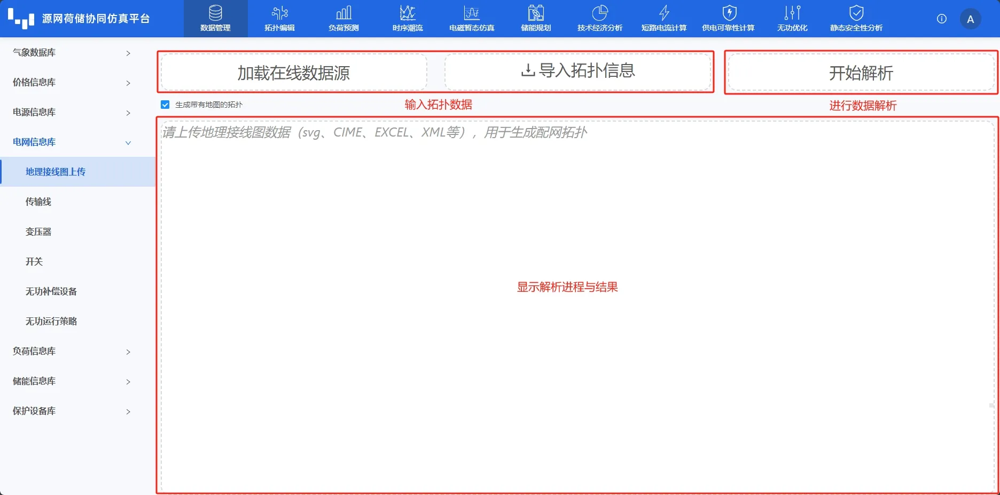
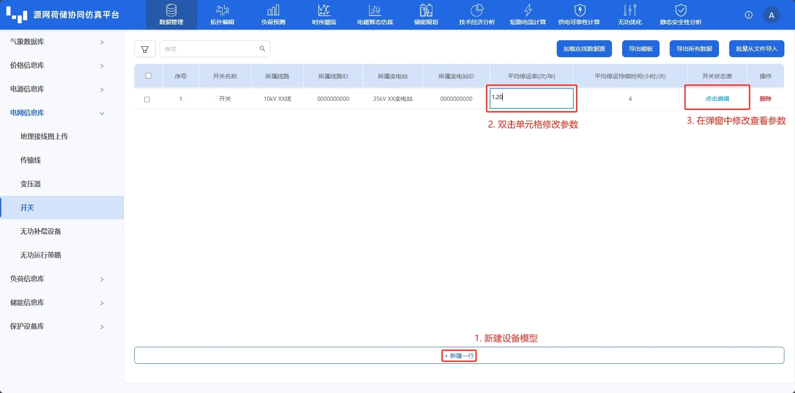

本节主要介绍电网信息库的拓扑、设备以及运行策略的参数录入、编辑、导入及导出等功能使用方法，并对使用过程中遇到的常见问题进行解答。

## 功能定义
电网信息库子模块按功能可分为两类。一类是辅助工具-**地理接线图上传**子模块用于自动生成配网拓扑；另一类是电网类设备及运行策略构建。其中，电网类设备包括**传输线**、**变压器**、**开关**和**无功补偿设备**，并涉及到**无功运行策略**的录入。此模块构建的设备以及设备运行策略将用于后续拓扑建模时与元件的设备待选类型参数进行绑定，同一型号的设备参数可以绑定至多个元件的对应参数上，从而实现设备额定参数数据的复用，简化用户输入。

## 功能说明

本节将按照以上功能分类分别介绍地理接线图上传子功能模块和电网类设备及运行策略构建。

### 地理接线图上传

地理接线图模块主要功能是通过**加载在线数据源**或**导入拓扑信息**传入拓扑数据，点击**开始解析**生成配网拓扑，并在下方展示区显示解析进程与结果。

### 电网类设备设备构建

电网类设备设备构建所涉及到的界面的布局与基本功能与 [价格信息库](../20-price-info-database/index.md) 类似，此处不再赘述。接下来，以开关设备为例，介绍电网相关设备构建流程。

在**开关**页面下方，点击**新建一行**新建一个设备。

在新建行，用户可以采用类似编辑 excel 表格的形式编辑目标数据，编辑后平台回自动校验用户编辑的数据合法性，数据格式不对时会提示“验证错误，请检查格式!”。用户在编辑完数据后，单击空白区域，平台会自动保存编辑数据，如下图所示。

用户可通过点击**开关状态表**列目标行的**点击编辑**，在弹窗中对开关状态进行编辑。相似地，用户可以采用类似 excel 表格的形式编辑目标数据，或在含下拉箭头单元格通过选择下拉选项配置参数，如下图所示。用户将鼠标悬浮在展示区曲线图中，可查看单点数据。通过鼠标滚轮或拉动右侧和下方的缩放条，可对展示曲线进行缩放，以查看特定时间特定值区间的散点详情。确认无误后，用户点击**保存**或者**取消**退出弹窗，完成开关设备建立与参数配置。

## 常见问题

设备参数从哪里可以找到呢？  
:    DSLab 平台元件采用主流的稳态简化设备，其设备参数可以从设备厂家官网查找，若设备实际参数过多较为复杂，可进行适当简化以匹配平台设备参数。
    
能否修改设备典型库？  
:   CloudPSS DSLab 官网的典型库不支持修改，对于服务器版本，管理员账户可以修改典型库，修改后该服务器下所有用户即可导入。